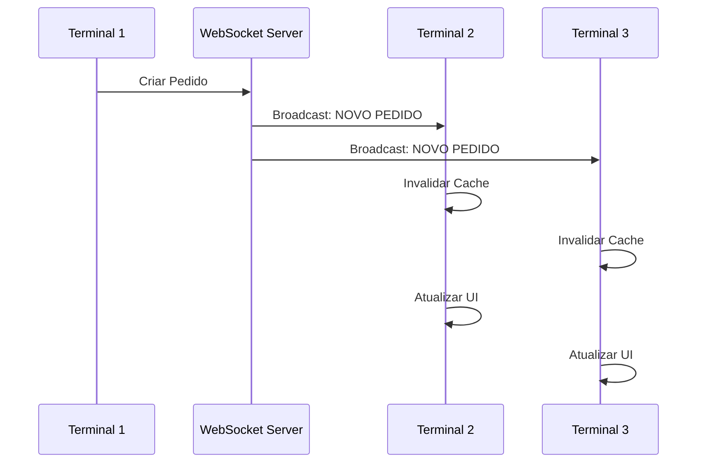

# Arquitetura de Sincronização Multi-Terminal

## Visão Geral

O sistema POS agora suporta **múltiplos terminais operando simultaneamente** com sincronização em tempo real via WebSocket.

## Componentes Principais

### 1. Frontend - RealtimeSyncService
- **Localização**: `frontend/apps/pos/src/services/RealtimeSyncService.ts`
- **Responsabilidades**:
  - Conexão WebSocket persistente com auto-reconexão
  - Broadcasting de mudanças para outros terminais
  - Invalidação de cache distribuída
  - Fila de mensagens offline

### 2. Backend - WebSocket Sync
- **Localização**: `src/realtime/websocket_sync.py`
- **Endpoint**: `ws://localhost:8001/ws/sync`
- **Responsabilidades**:
  - Gerenciar conexões de múltiplos terminais
  - Propagar mudanças entre terminais
  - Rastrear usuários por terminal
  - Fila para terminais offline

### 3. Cache Otimizado
- **RequestCache**: Deduplicação local (0.5s-30s TTL)
- **Backend Cache**: Cache persistente compartilhado
- **Limite de memória**: 10MB, 50 entradas máx

## Fluxo de Sincronização



## Eventos Sincronizados

### Pedidos (Orders)
- `order:created` - Novo pedido criado
- `order:updated` - Pedido atualizado
- `order:cancelled` - Pedido cancelado

### Mesas (Tables)
- `table:status:changed` - Status da mesa alterado
- `table:assigned` - Mesa atribuída a garçom

### Caixa (Cashier)
- `cashier:opened` - Caixa aberto
- `cashier:closed` - Caixa fechado
- `payment:completed` - Pagamento concluído

### Inventário
- `inventory:updated` - Estoque atualizado

## Estratégias de Resolução de Conflitos

### LAST_WRITE_WINS (Padrão)
- Usado para: Pedidos, Mesas
- Última escrita vence

### MERGE
- Usado para: Inventário
- Mescla mudanças não conflitantes

### MANUAL
- Usado para: Caixa
- Requer intervenção do usuário

## Modo Offline

Quando offline:
1. Operações armazenadas em fila local
2. Sincronização automática ao reconectar
3. Conflitos resolvidos por timestamp

## Performance

### Otimizações Implementadas:
- **Cache mínimo**: 0.5s-30s (apenas deduplicação)
- **Limpeza automática**: A cada 10 segundos
- **Limite de memória**: 10MB máximo
- **WebSocket único**: Compartilhado entre componentes

### Métricas:
- Latência local: <50ms
- Sincronização: <100ms entre terminais
- Memória: <10MB por terminal

## Configuração

### Frontend
```typescript
// Auto-conecta ao inicializar
import realtimeSync from './services/RealtimeSyncService';

// Notificar mudanças
realtimeSync.notifyCreate('order', orderData);
realtimeSync.notifyUpdate('order', orderId, orderData);
realtimeSync.notifyDelete('order', orderId);

// Invalidar cache
realtimeSync.invalidateCache('products');
```

### Backend
```python
from src.realtime.websocket_sync import notify_data_change

# Notificar mudança
await notify_data_change(
    entity="order",
    entity_id=order_id,
    action="update",
    data=order_data,
    user_id=current_user.id
)
```

## Segurança

- Terminal ID único por dispositivo
- User ID rastreado por sessão
- Mensagens assinadas com timestamp
- Reconexão automática com autenticação

## Troubleshooting

### Terminal não sincroniza
1. Verificar WebSocket conectado: `realtimeSync.connected`
2. Ver logs: Console > Network > WS
3. Verificar porta 8001 aberta

### Cache pesado
- Estatísticas: `requestCache.getStats()`
- Limpar manualmente: `requestCache.clear()`
- Ajustar TTLs em `RequestCache.ts`

### Conflitos frequentes
- Revisar estratégia de conflito
- Implementar locks otimistas
- Considerar CRDT para dados específicos

## Próximos Passos

1. ✅ WebSocket básico implementado
2. ✅ Sincronização de pedidos
3. ⏳ Sincronização de mesas
4. ⏳ Sincronização de pagamentos
5. ⏳ Métricas de sincronização
6. ⏳ Dashboard de status dos terminais