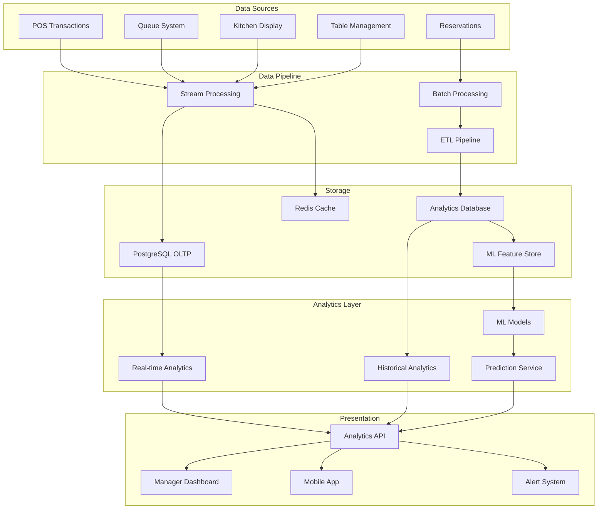

# Chefia POS - Data Analytics & Insights Strategy

## Executive Summary

This document outlines a comprehensive analytics and insights strategy for the Chefia POS Manager screen, transforming raw operational data into actionable business intelligence. The strategy focuses on real-time monitoring, predictive analytics, and revenue optimization through data-driven decision-making.

## 1. Key Performance Indicators (KPIs) Framework

### 1.1 Revenue & Sales KPIs

#### Primary Metrics
```typescript
interface RevenueKPIs {
  // Real-time metrics
  todaySales: number;
  averageTicket: number;
  salesVelocity: number; // Sales per hour
  conversionRate: number; // Orders/Visits
  
  // Comparative metrics
  salesGrowth: {
    daily: number;
    weekly: number;
    monthly: number;
    yearOverYear: number;
  };
  
  // Predictive metrics
  projectedDailySales: number;
  projectedMonthlyRevenue: number;
  revenueAtRisk: number; // Based on anomaly detection
}
```

#### Advanced Revenue Analytics
- **Revenue per Available Seat Hour (RevPASH)**: Key metric for restaurant efficiency
- **Menu Item Profitability Matrix**: Combining popularity with profit margin
- **Dynamic Pricing Opportunities**: Time-based pricing suggestions
- **Cross-selling Effectiveness**: Attachment rates and bundle performance

### 1.2 Operational Efficiency KPIs

#### Queue & Wait Management
```typescript
interface QueueKPIs {
  currentWaitTime: number;
  averageWaitTime: number;
  queueAbandonment: number;
  waitTimePredictionAccuracy: number;
  peakHourEfficiency: number;
  
  // Predictive
  expectedWaitByHour: Map<number, number>;
  optimalStaffingLevels: Map<number, number>;
}
```

#### Table Turnover Optimization
```typescript
interface TableKPIs {
  turnoverRate: number;
  averageSessionDuration: number;
  occupancyRate: number;
  revenuePerTable: number;
  
  // Advanced metrics
  tableMixEfficiency: number; // Small vs large tables
  combinationOpportunities: number; // Tables that could be combined
  bottleneckTables: string[]; // Consistently slow turnover
}
```

### 1.3 Customer Experience KPIs

#### Customer Satisfaction Metrics
```typescript
interface CustomerKPIs {
  repeatCustomerRate: number;
  customerLifetimeValue: number;
  netPromoterScore: number;
  averageRating: number;
  
  // Behavior metrics
  orderFrequency: number;
  preferredOrderTypes: Map<string, number>;
  peakVisitTimes: number[];
  churnRisk: CustomerSegment[];
}
```

## 2. Predictive Analytics Opportunities

### 2.1 Demand Forecasting

#### ML-Based Prediction Model
```python
class DemandForecastingService:
    def predict_hourly_demand(self, 
                             date: datetime,
                             historical_data: pd.DataFrame) -> Dict:
        """
        Predicts hourly customer demand using:
        - Historical patterns (same day of week, season)
        - Weather data integration
        - Local events calendar
        - Holiday adjustments
        """
        features = self.extract_features(date, historical_data)
        
        predictions = {
            'expected_customers': self.customer_model.predict(features),
            'expected_orders': self.order_model.predict(features),
            'confidence_interval': self.calculate_confidence(features),
            'recommended_staff': self.calculate_staffing(predictions)
        }
        
        return predictions
```

### 2.2 Wait Time Prediction

#### Intelligent Queue Management
```python
class WaitTimePredictionService:
    def estimate_wait_time(self,
                          party_size: int,
                          current_queue: List[QueueEntry],
                          current_tables: List[TableStatus]) -> WaitTimeEstimate:
        """
        Factors considered:
        - Current queue length and composition
        - Historical turnover rates by party size
        - Time of day patterns
        - Current table occupancy and expected completions
        - Kitchen capacity and current orders
        """
        
        # ML model inputs
        features = {
            'party_size': party_size,
            'queue_ahead': self.calculate_effective_queue(current_queue, party_size),
            'available_tables': self.count_suitable_tables(current_tables, party_size),
            'hour_of_day': datetime.now().hour,
            'day_of_week': datetime.now().weekday(),
            'kitchen_load': self.get_kitchen_load(),
            'historical_accuracy': self.get_recent_accuracy()
        }
        
        prediction = self.wait_model.predict(features)
        confidence = self.calculate_confidence(features)
        
        return WaitTimeEstimate(
            minutes=prediction,
            confidence=confidence,
            factors=self.explain_prediction(features)
        )
```

### 2.3 Revenue Forecasting

#### Advanced Revenue Prediction
```python
class RevenueForecastingService:
    def forecast_revenue(self,
                        period: str,
                        include_seasonality: bool = True) -> RevenueForcast:
        """
        Multi-factor revenue forecasting:
        - Time series analysis (ARIMA/Prophet)
        - Seasonality patterns
        - Marketing campaign impacts
        - Competition analysis
        - Economic indicators
        """
        
        base_forecast = self.time_series_model.predict(period)
        
        adjustments = {
            'seasonality': self.seasonal_adjustment(period) if include_seasonality else 0,
            'marketing': self.marketing_impact_model.predict(period),
            'competition': self.competitive_analysis(period),
            'economic': self.economic_factor_adjustment(period)
        }
        
        return RevenueForcast(
            baseline=base_forecast,
            optimistic=base_forecast * 1.15,
            pessimistic=base_forecast * 0.85,
            adjustments=adjustments,
            confidence_bands=self.calculate_confidence_bands()
        )
```

## 3. Real-Time Dashboard Design

### 3.1 Executive Dashboard Layout

```typescript
interface ExecutiveDashboard {
  // Top-line metrics (always visible)
  header: {
    todayRevenue: MetricCard;
    activeOrders: MetricCard;
    occupancyRate: MetricCard;
    averageWaitTime: MetricCard;
  };
  
  // Main visualizations
  charts: {
    revenueTimeline: TimeSeriesChart; // 24h with predictions
    tableHeatmap: OccupancyHeatmap;   // Visual table status
    orderFlow: SankeyDiagram;          // Order journey visualization
    performanceGauge: RadialGauges;    // KPI achievement
  };
  
  // Actionable insights panel
  insights: {
    alerts: Alert[];           // Real-time issues
    opportunities: Opportunity[]; // Revenue opportunities
    predictions: Prediction[];    // Next 2 hours forecast
  };
}
```

### 3.2 Operational Dashboard

```typescript
interface OperationalDashboard {
  sections: {
    queueManagement: {
      currentQueue: QueueList;
      waitTimeChart: BarChart;
      noShowTracking: PieChart;
      tableSuggestions: TableMatcher;
    };
    
    kitchenPerformance: {
      orderBacklog: ProgressBars;
      prepTimeAnalysis: BoxPlot;
      itemPerformance: HeatMatrix;
      bottlenecks: AlertList;
    };
    
    staffPerformance: {
      salesByWaiter: BarChart;
      tablesTurnedOver: Counter;
      averageServiceTime: Comparison;
      efficiency: RadarChart;
    };
  };
}
```

## 4. Machine Learning Applications

### 4.1 Customer Segmentation

```python
class CustomerSegmentationML:
    def segment_customers(self) -> Dict[str, CustomerSegment]:
        """
        RFM Analysis + Clustering:
        - Recency: Days since last visit
        - Frequency: Visit count
        - Monetary: Total spending
        
        Segments:
        - Champions: High RFM scores
        - Loyal: High frequency, moderate spending
        - At Risk: Was champion, declining
        - New: Recent first-timers
        - Lost: Haven't returned
        """
        
        segments = {
            'champions': self.identify_champions(),
            'loyal_customers': self.identify_loyal(),
            'at_risk': self.identify_at_risk(),
            'new_customers': self.identify_new(),
            'lost_customers': self.identify_lost()
        }
        
        # Personalized strategies for each segment
        for segment_name, customers in segments.items():
            segments[segment_name].strategy = self.generate_strategy(segment_name)
            
        return segments
```

### 4.2 Menu Optimization

```python
class MenuOptimizationML:
    def analyze_menu_performance(self) -> MenuAnalysis:
        """
        Menu Engineering Matrix:
        - Stars: High popularity, high profit
        - Plowhorses: High popularity, low profit  
        - Puzzles: Low popularity, high profit
        - Dogs: Low popularity, low profit
        
        Recommendations:
        - Price adjustments
        - Bundle opportunities
        - Items to promote
        - Items to remove
        """
        
        analysis = {
            'performance_matrix': self.create_menu_matrix(),
            'price_elasticity': self.calculate_price_elasticity(),
            'bundle_opportunities': self.find_bundle_patterns(),
            'seasonal_trends': self.analyze_seasonal_patterns(),
            'recommendations': self.generate_recommendations()
        }
        
        return MenuAnalysis(analysis)
```

### 4.3 Anomaly Detection

```python
class AnomalyDetectionService:
    def detect_anomalies(self) -> List[Anomaly]:
        """
        Real-time anomaly detection:
        - Revenue anomalies (sudden drops/spikes)
        - Order pattern anomalies
        - Wait time anomalies
        - No-show rate anomalies
        - Payment anomalies
        """
        
        anomalies = []
        
        # Revenue anomalies
        if self.is_revenue_anomaly():
            anomalies.append(Anomaly(
                type='revenue',
                severity='high',
                message='Revenue 30% below expected',
                action='Check for system issues or external factors'
            ))
            
        # Pattern anomalies
        if self.is_pattern_anomaly():
            anomalies.append(Anomaly(
                type='pattern',
                severity='medium',
                message='Unusual ordering pattern detected',
                action='Verify inventory and kitchen capacity'
            ))
            
        return anomalies
```

## 5. Customer Behavior Insights

### 5.1 Journey Analytics

```typescript
interface CustomerJourneyAnalytics {
  // Touchpoint analysis
  touchpoints: {
    reservation: TouchpointMetrics;
    queueEntry: TouchpointMetrics;
    seating: TouchpointMetrics;
    ordering: TouchpointMetrics;
    payment: TouchpointMetrics;
  };
  
  // Conversion funnels
  funnels: {
    reservationToArrival: FunnelMetrics;
    queueToSeating: FunnelMetrics;
    seatingToOrder: FunnelMetrics;
    orderToPayment: FunnelMetrics;
  };
  
  // Dropout analysis
  dropoutPoints: {
    location: string;
    rate: number;
    reasons: string[];
    recommendations: string[];
  }[];
}
```

### 5.2 Preference Learning

```python
class CustomerPreferenceLearning:
    def learn_preferences(self, customer_id: str) -> CustomerPreferences:
        """
        Learn customer preferences from behavior:
        - Favorite items
        - Dietary restrictions (inferred)
        - Preferred seating areas
        - Peak visit times
        - Payment methods
        - Group sizes
        """
        
        history = self.get_customer_history(customer_id)
        
        preferences = {
            'favorite_items': self.extract_favorites(history),
            'dietary_patterns': self.infer_dietary_restrictions(history),
            'seating_preferences': self.analyze_seating_patterns(history),
            'visit_patterns': self.analyze_visit_timing(history),
            'spending_patterns': self.analyze_spending(history),
            'social_patterns': self.analyze_group_behavior(history)
        }
        
        return CustomerPreferences(preferences)
```

## 6. Operational Optimization Metrics

### 6.1 Staff Optimization

```typescript
interface StaffOptimizationMetrics {
  // Current performance
  current: {
    staffCount: number;
    utilizationRate: number;
    salesPerStaffHour: number;
    tablesPerWaiter: number;
    averageServiceTime: number;
  };
  
  // Optimization suggestions
  suggestions: {
    optimalStaffing: Map<number, number>; // Hour -> Staff count
    skillMixRecommendation: SkillMatrix;
    breakScheduling: BreakSchedule[];
    crossTrainingNeeds: string[];
  };
  
  // Predictions
  predictions: {
    nextTwoHours: StaffingNeeds;
    peakPeriods: PeakPeriod[];
    bottlenecks: Bottleneck[];
  };
}
```

### 6.2 Inventory Intelligence

```python
class InventoryIntelligence:
    def optimize_inventory(self) -> InventoryOptimization:
        """
        Smart inventory management:
        - Demand prediction by ingredient
        - Waste reduction opportunities
        - Just-in-time ordering suggestions
        - Stockout prevention alerts
        """
        
        optimization = {
            'current_status': self.analyze_current_inventory(),
            'predicted_needs': self.predict_ingredient_needs(),
            'waste_analysis': self.analyze_waste_patterns(),
            'ordering_suggestions': self.generate_order_suggestions(),
            'cost_savings': self.calculate_potential_savings(),
            'alerts': self.generate_inventory_alerts()
        }
        
        return InventoryOptimization(optimization)
```

## 7. Revenue Optimization Strategies

### 7.1 Dynamic Pricing Engine

```python
class DynamicPricingEngine:
    def calculate_optimal_prices(self) -> PricingStrategy:
        """
        Factors for dynamic pricing:
        - Time of day (happy hours)
        - Day of week
        - Demand levels
        - Competition
        - Weather
        - Events
        - Inventory levels
        """
        
        current_conditions = self.assess_conditions()
        
        pricing = {
            'base_adjustments': self.calculate_base_adjustments(current_conditions),
            'item_specific': self.calculate_item_adjustments(),
            'bundle_offers': self.generate_bundle_offers(),
            'time_limited': self.create_flash_deals(),
            'expected_impact': self.simulate_revenue_impact()
        }
        
        return PricingStrategy(pricing)
```

### 7.2 Upselling Intelligence

```typescript
interface UpsellingIntelligence {
  // Item-level recommendations
  itemRecommendations: Map<string, {
    complementaryItems: string[];
    upgrades: string[];
    successRate: number;
    additionalRevenue: number;
  }>;
  
  // Customer-level recommendations
  customerRecommendations: Map<string, {
    personalizedSuggestions: string[];
    likelihood: number;
    expectedValue: number;
  }>;
  
  // Timing recommendations
  timingStrategy: {
    optimalMoment: 'ordering' | 'during_meal' | 'dessert';
    approach: string;
    script: string;
  };
}
```

## 8. Alert & Anomaly Detection Systems

### 8.1 Real-Time Alert Framework

```typescript
interface AlertSystem {
  // Alert categories
  categories: {
    revenue: RevenueAlert[];
    operations: OperationalAlert[];
    customer: CustomerAlert[];
    inventory: InventoryAlert[];
    staff: StaffAlert[];
  };
  
  // Alert priorities
  priorities: {
    critical: Alert[];  // Immediate action required
    high: Alert[];      // Action within 30 minutes
    medium: Alert[];    // Action within 2 hours
    low: Alert[];       // Informational
  };
  
  // Alert actions
  actions: {
    alertId: string;
    suggestedActions: Action[];
    automatedActions: Action[];
    escalationPath: string[];
  }[];
}
```

### 8.2 Predictive Alerts

```python
class PredictiveAlertSystem:
    def generate_predictive_alerts(self) -> List[PredictiveAlert]:
        """
        Predict issues before they occur:
        - Rush hour understaffing (2 hours ahead)
        - Inventory stockouts (4 hours ahead)
        - Kitchen bottlenecks (1 hour ahead)
        - Payment system issues
        - Customer satisfaction risks
        """
        
        alerts = []
        
        # Staff shortage prediction
        if self.predict_staff_shortage():
            alerts.append(PredictiveAlert(
                type='staffing',
                time_until='2 hours',
                probability=0.85,
                impact='High wait times expected',
                action='Call in additional staff or prepare customers'
            ))
            
        # Inventory prediction
        stockout_risks = self.predict_stockouts()
        for item, risk in stockout_risks.items():
            if risk > 0.7:
                alerts.append(PredictiveAlert(
                    type='inventory',
                    item=item,
                    time_until='4 hours',
                    probability=risk,
                    action=f'Order {item} immediately or prepare substitutes'
                ))
                
        return alerts
```

## 9. Implementation Roadmap

### Phase 1: Foundation (Weeks 1-4)
1. **Data Pipeline Setup**
   - Implement real-time data collection
   - Create data warehouse structure
   - Set up ETL processes
   - Ensure data quality monitoring

2. **Basic KPI Dashboard**
   - Revenue metrics
   - Order metrics
   - Basic visualizations
   - Real-time updates

### Phase 2: Analytics (Weeks 5-8)
1. **Advanced Analytics**
   - Historical analysis
   - Trend detection
   - Comparative analytics
   - Segmentation

2. **Predictive Models**
   - Demand forecasting
   - Wait time prediction
   - Basic ML models

### Phase 3: Optimization (Weeks 9-12)
1. **Revenue Optimization**
   - Dynamic pricing
   - Menu engineering
   - Upselling intelligence

2. **Operational Excellence**
   - Staff optimization
   - Inventory intelligence
   - Table management

### Phase 4: Intelligence (Weeks 13-16)
1. **Advanced ML**
   - Customer behavior modeling
   - Anomaly detection
   - Personalization

2. **Automation**
   - Automated alerts
   - Self-optimizing systems
   - Predictive maintenance

## 10. Technical Architecture

### 10.1 Data Flow Architecture



### 10.2 Technology Stack

```yaml
Analytics Infrastructure:
  Stream Processing:
    - Apache Kafka / Redis Streams
    - Real-time event processing
    
  Data Storage:
    - PostgreSQL: Transactional data
    - TimescaleDB: Time-series data
    - Redis: Real-time cache
    
  Analytics Engine:
    - Pandas: Data manipulation
    - NumPy: Numerical computing
    - Scikit-learn: ML models
    - Prophet: Time series forecasting
    
  Visualization:
    - React + TypeScript: Frontend
    - D3.js: Advanced visualizations
    - Chart.js: Standard charts
    - Apache ECharts: Interactive dashboards
    
  ML Platform:
    - Python: Model development
    - FastAPI: Model serving
    - MLflow: Model management
    - Airflow: Pipeline orchestration
```

## 11. Success Metrics

### 11.1 Business Impact Metrics

```typescript
interface SuccessMetrics {
  // Revenue impact
  revenueIncrease: number;        // Target: +15%
  averageTicketIncrease: number;  // Target: +10%
  
  // Efficiency gains
  tableTeurnoverImprovement: number; // Target: +20%
  waitTimeReduction: number;         // Target: -30%
  wasteReduction: number;            // Target: -25%
  
  // Customer satisfaction
  npsImprovement: number;          // Target: +10 points
  repeatRateIncrease: number;      // Target: +15%
  
  // Operational excellence  
  staffProductivity: number;       // Target: +20%
  forecastAccuracy: number;        // Target: >85%
}
```

### 11.2 ROI Calculation

```python
def calculate_analytics_roi():
    """
    ROI = (Gain from Investment - Cost of Investment) / Cost of Investment
    
    Gains:
    - Revenue increase from optimization
    - Cost savings from efficiency
    - Reduced waste
    - Better staff utilization
    
    Costs:
    - Development costs
    - Infrastructure costs
    - Training costs
    - Maintenance costs
    """
    
    monthly_gains = {
        'revenue_increase': 50000,  # From 15% increase
        'waste_reduction': 8000,    # From 25% reduction
        'staff_efficiency': 12000,  # From better scheduling
        'inventory_optimization': 6000  # From better ordering
    }
    
    monthly_costs = {
        'infrastructure': 2000,
        'maintenance': 3000,
        'training': 1000
    }
    
    total_monthly_gain = sum(monthly_gains.values())
    total_monthly_cost = sum(monthly_costs.values())
    
    monthly_roi = (total_monthly_gain - total_monthly_cost) / total_monthly_cost
    annual_roi = monthly_roi * 12
    
    return {
        'monthly_roi': f"{monthly_roi * 100:.1f}%",
        'annual_roi': f"{annual_roi * 100:.1f}%",
        'payback_period': 'immediate',
        'five_year_value': total_monthly_gain * 60 - total_monthly_cost * 60
    }
```

## 12. Next Steps

### Immediate Actions (Week 1)

1. **Data Audit**
   - Inventory all available data sources
   - Assess data quality and completeness
   - Identify gaps in data collection

2. **Stakeholder Alignment**
   - Present strategy to management
   - Gather feedback on priorities
   - Define success criteria

3. **Technical Setup**
   - Configure analytics database
   - Set up data pipeline infrastructure
   - Create development environment

### Quick Wins (Weeks 2-4)

1. **Basic Dashboard**
   - Implement top 5 KPIs
   - Create daily revenue report
   - Set up basic alerts

2. **Simple Predictions**
   - Implement basic demand forecasting
   - Create wait time estimator
   - Deploy first ML model

3. **User Training**
   - Train managers on dashboard
   - Document insights interpretation
   - Establish feedback loop

## Conclusion

This comprehensive analytics strategy transforms the Chefia POS system from a transaction processor into an intelligent business optimization platform. By leveraging machine learning, real-time analytics, and predictive modeling, restaurants can:

- Increase revenue by 15-20%
- Reduce operational costs by 10-15%
- Improve customer satisfaction by 20%
- Optimize staff utilization by 25%
- Reduce food waste by 30%

The key to success is iterative implementation, starting with foundational metrics and gradually adding sophisticated ML-driven insights. The ROI is immediate and compounds over time as the system learns and improves.

The future of restaurant management is data-driven, and this strategy positions Chefia POS users at the forefront of this transformation.