# Diagrama de Arquitetura - Chefia POS

## 1. VISÃO GERAL DA ARQUITETURA

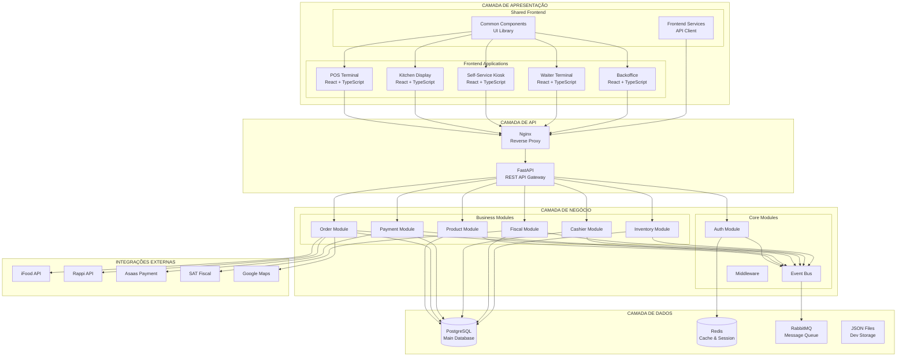

## 2. FLUXO DE DADOS

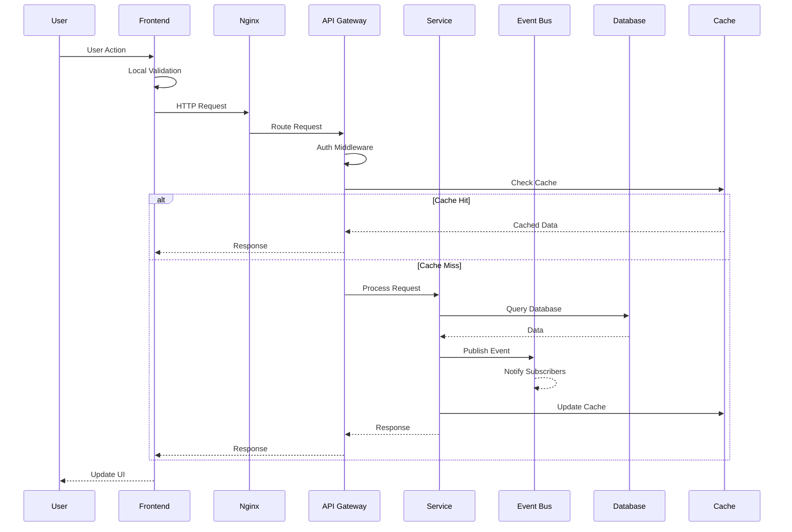

## 3. ARQUITETURA DE MICROSERVIÇOS (MODULAR MONOLITH)

```mermaid
graph LR
    subgraph "Monolith Application"
        subgraph "API Layer"
            R1[/api/v1/products]
            R2[/api/v1/orders]
            R3[/api/v1/payments]
            R4[/api/v1/fiscal]
        end
        
        subgraph "Service Layer"
            PS[ProductService]
            OS[OrderService]
            PAS[PaymentService]
            FS[FiscalService]
        end
        
        subgraph "Repository Layer"
            PR[ProductRepo]
            OR[OrderRepo]
            PAR[PaymentRepo]
            FR[FiscalRepo]
        end
        
        subgraph "Event System"
            EB[Event Bus]
            EH1[ProductHandler]
            EH2[OrderHandler]
            EH3[PaymentHandler]
        end
    end
    
    R1 --> PS
    R2 --> OS
    R3 --> PAS
    R4 --> FS
    
    PS --> PR
    OS --> OR
    PAS --> PAR
    FS --> FR
    
    PS --> EB
    OS --> EB
    PAS --> EB
    FS --> EB
    
    EB --> EH1
    EB --> EH2
    EB --> EH3
    
    PR --> DB[(Database)]
    OR --> DB
    PAR --> DB
    FR --> DB
```

## 4. COMPONENTES DO FRONTEND

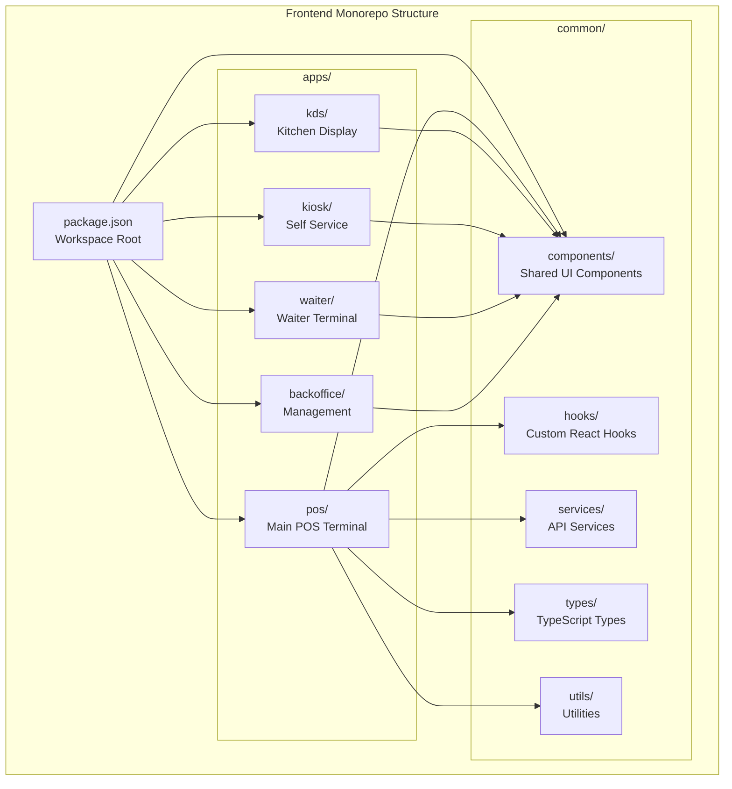

## 5. EVENT-DRIVEN ARCHITECTURE

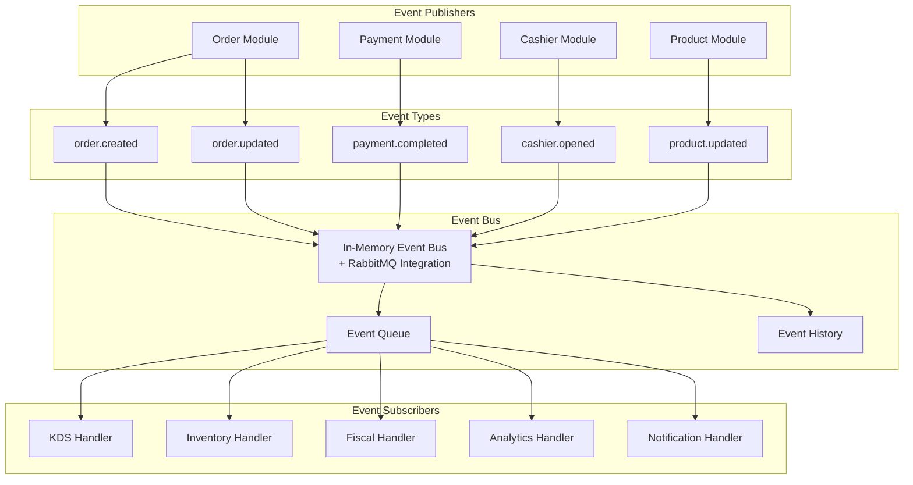

## 6. FLUXO DE PEDIDO (ORDER FLOW)

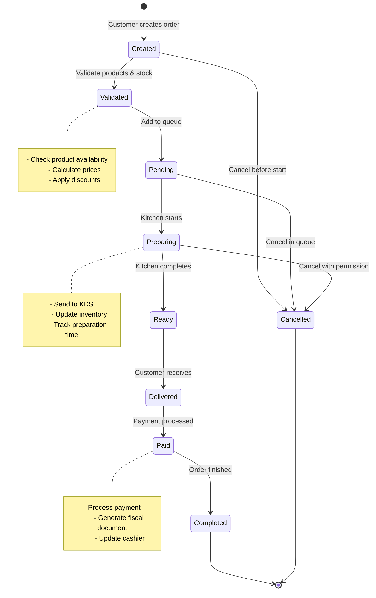

## 7. INFRAESTRUTURA DE DEPLOYMENT

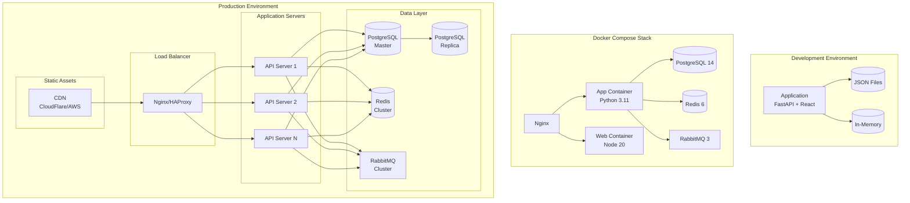

## 8. SEGURANÇA E AUTENTICAÇÃO

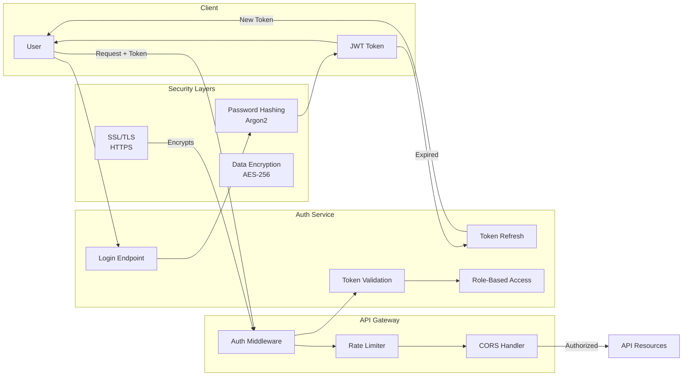

## 9. INTEGRAÇÃO COM HARDWARE

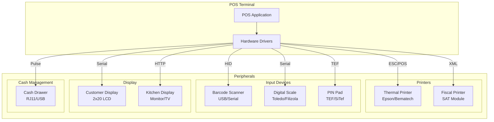

## 10. FLUXO DE SINCRONIZAÇÃO OFFLINE

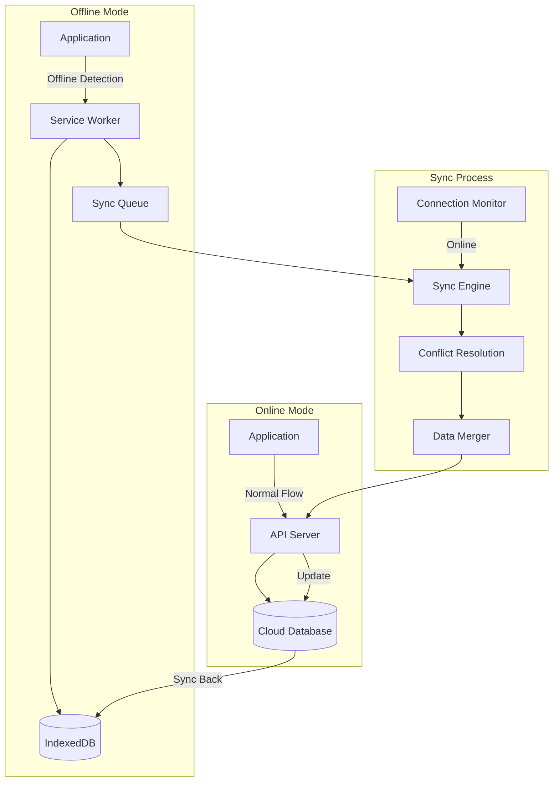

## 11. MONITORAMENTO E OBSERVABILIDADE

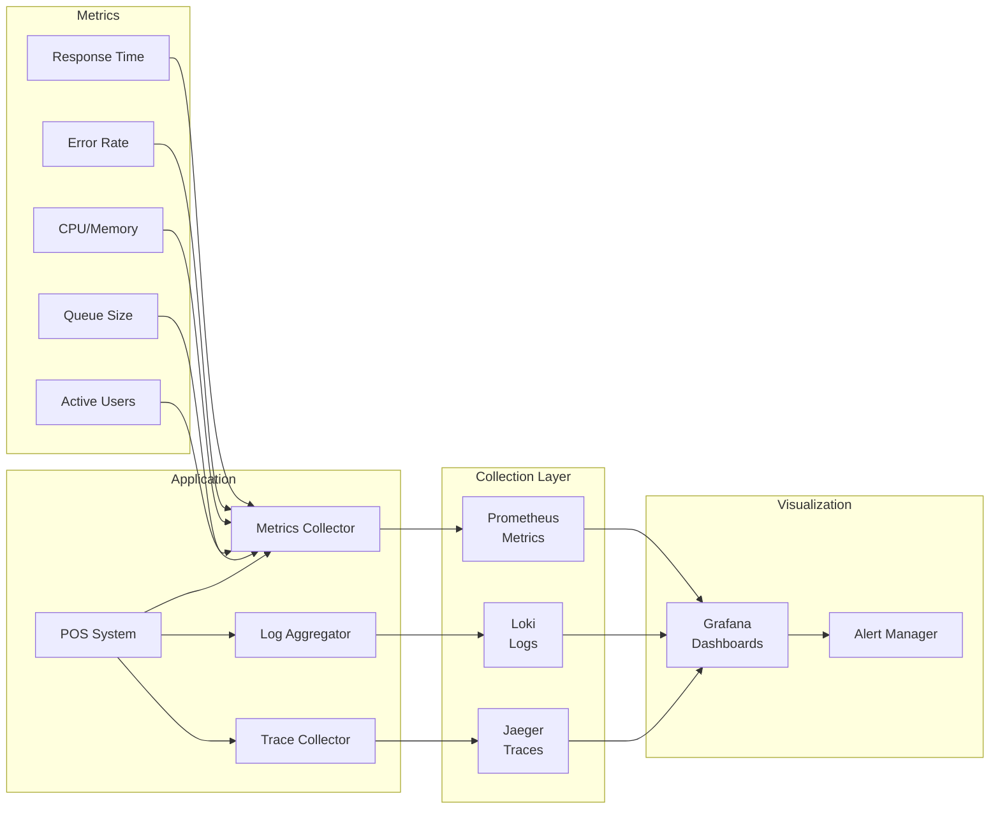

## 12. PIPELINE CI/CD

```mermaid
graph LR
    subgraph "Development"
        DEV[Developer]
        LOCAL[Local Tests]
    end
    
    subgraph "Version Control"
        GIT[Git Repository]
        PR[Pull Request]
    end
    
    subgraph "CI Pipeline"
        BUILD[Build]
        TEST[Run Tests]
        LINT[Lint/Format]
        SEC[Security Scan]
        DOCKER[Build Image]
    end
    
    subgraph "CD Pipeline"
        STAGING[Staging Deploy]
        E2E[E2E Tests]
        PROD[Production Deploy]
        ROLLBACK[Rollback]
    end
    
    subgraph "Monitoring"
        HEALTH[Health Check]
        SMOKE[Smoke Tests]
        METRICS[Metrics Check]
    end
    
    DEV --> LOCAL
    LOCAL --> GIT
    GIT --> PR
    PR --> BUILD
    BUILD --> TEST
    TEST --> LINT
    LINT --> SEC
    SEC --> DOCKER
    
    DOCKER --> STAGING
    STAGING --> E2E
    E2E --> |Success| PROD
    E2E --> |Failure| ROLLBACK
    
    PROD --> HEALTH
    HEALTH --> SMOKE
    SMOKE --> METRICS
```

## LEGENDA

### Componentes
- **Retângulos**: Aplicações/Serviços
- **Cilindros**: Bancos de Dados/Storage
- **Losangos**: Decisões/Condições
- **Setas**: Fluxo de Dados/Comunicação

### Cores (quando renderizado)
- **Azul**: Frontend/UI
- **Verde**: Backend/API
- **Amarelo**: Infraestrutura
- **Vermelho**: Segurança
- **Roxo**: Integrações Externas

### Protocolos
- **HTTP/HTTPS**: Comunicação web
- **WebSocket**: Real-time
- **TCP/IP**: Conexões diretas
- **Serial/USB**: Hardware
- **AMQP**: Message queue

## NOTAS DE ARQUITETURA

1. **Modular Monolith**: Sistema organizado em módulos mas deployado como unidade única
2. **Event-Driven**: Comunicação assíncrona entre módulos via Event Bus
3. **Multi-Tenant Ready**: Preparado para múltiplos restaurantes/franquias
4. **Offline-First**: Capacidade parcial offline com sincronização
5. **Hardware Agnostic**: Suporte a múltiplas marcas de periféricos
6. **Cloud Ready**: Preparado para deploy em nuvem mas funciona on-premise

Este diagrama representa a arquitetura atual do sistema Chefia POS, mostrando todos os componentes principais, suas interações e fluxos de dados.