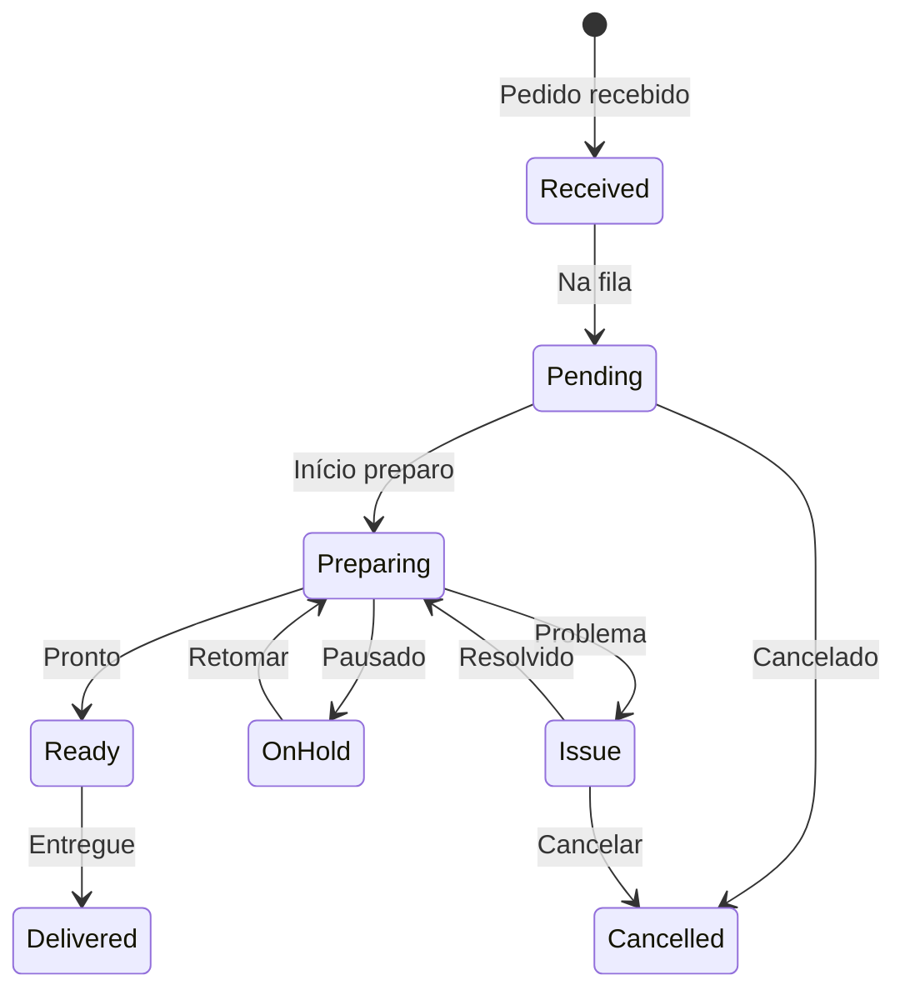

# Documentação Completa KDS (Kitchen Display System) - Negócio + Técnico

## 📊 Visão Executiva

O módulo KDS (Kitchen Display System) é o sistema de visualização e controle de pedidos na cozinha, responsável por otimizar o fluxo de trabalho, sincronizar o preparo de itens e garantir que os pedidos sejam entregues no tempo certo e com qualidade.

### Números do KDS
- **Maturidade**: ⭐⭐⭐ (3/5) - Em processo de evolução
- **Performance**: 150-200ms tempo de resposta
- **Bundle Size**: 1.2MB (meta: <500KB)
- **Cobertura de Testes**: 25% (meta: 80%)
- **Estações Suportadas**: Até 10 simultâneas
- **Pedidos Simultâneos**: 100+ sem degradação

## 🎯 PARTE 1: REGRAS DE NEGÓCIO DO KDS

## 1. Fluxo de Pedidos na Cozinha

### 1.1 Estados do Pedido no KDS



### 1.2 Priorização de Pedidos

#### Níveis de Prioridade
```typescript
enum KDSPriority {
  URGENT = 1,    // Delivery próximo do limite
  HIGH = 2,      // Cliente esperando na mesa
  NORMAL = 3,    // Pedido regular
  LOW = 4        // Pedido futuro/agendado
}

interface PriorityRules {
  // Fatores que aumentam prioridade
  deliveryTime: number      // Minutos até entrega
  waitingTime: number       // Minutos desde pedido
  customerType: 'VIP' | 'Regular' | 'New'
  orderType: 'Delivery' | 'TakeOut' | 'DineIn'
  
  // Cálculo automático
  calculatePriority(): KDSPriority
}
```

#### Regras de Priorização
1. **Delivery < 30min**: Prioridade URGENT
2. **Mesa esperando > 20min**: Prioridade HIGH
3. **VIP Customer**: Sempre HIGH ou superior
4. **Pedido agendado**: LOW até 30min antes

### 1.3 Sincronização de Preparo (Groomer Style)

#### Tempos de Preparo por Categoria
```yaml
tempos_preparo:
  bebidas:
    refrigerante: 30s
    suco_natural: 120s
    cafe: 90s
    
  entradas:
    salada: 180s
    bruschetta: 240s
    carpaccio: 300s
    
  pratos_principais:
    hamburguer: 480s
    pizza: 720s
    massa: 600s
    grelhados: 900s
    
  sobremesas:
    sorvete: 60s
    petit_gateau: 360s
    cheesecake: 120s
```

#### Algoritmo de Sincronização
```python
class KDSSynchronizer:
    """Sincroniza preparo para todos itens ficarem prontos juntos"""
    
    def calculate_start_times(self, items: List[OrderItem]) -> Dict:
        # Encontra item mais demorado
        longest_item = max(items, key=lambda x: x.prep_time)
        target_time = longest_item.prep_time
        
        # Calcula quando iniciar cada item
        start_times = {}
        for item in items:
            delay = target_time - item.prep_time
            start_times[item.id] = {
                'start_at': delay,
                'station': self.get_station(item),
                'dependencies': self.get_dependencies(item)
            }
        
        return start_times
    
    def get_dependencies(self, item):
        """Alguns itens dependem de outros"""
        # Ex: Molho precisa da massa pronta
        # Ex: Cobertura precisa da pizza assada
        return item.dependencies if hasattr(item, 'dependencies') else []
```

## 2. Gestão de Estações de Trabalho

### 2.1 Tipos de Estação

```typescript
interface KDSStation {
  id: string
  name: string
  type: StationType
  capacity: number         // Itens simultâneos
  currentLoad: number      // Itens em preparo
  operators: Operator[]   // Funcionários na estação
  categories: string[]     // Categorias que prepara
}

enum StationType {
  GRILL = "Grelha",
  FRYER = "Fritadeira", 
  OVEN = "Forno",
  COLD = "Frios",
  BEVERAGES = "Bebidas",
  DESSERTS = "Sobremesas",
  ASSEMBLY = "Montagem",
  EXPEDITE = "Expedição"
}
```

### 2.2 Balanceamento de Carga

```python
class LoadBalancer:
    """Distribui itens entre estações disponíveis"""
    
    def assign_item_to_station(self, item: OrderItem) -> Station:
        # Encontra estações capazes
        capable_stations = self.get_capable_stations(item.category)
        
        # Filtra por capacidade disponível
        available = [s for s in capable_stations 
                    if s.current_load < s.capacity]
        
        if not available:
            # Adiciona à fila da estação menos carregada
            return min(capable_stations, key=lambda s: s.queue_size)
        
        # Escolhe estação com menor carga
        return min(available, key=lambda s: s.current_load)
    
    def rebalance_if_needed(self):
        """Rebalanceia se alguma estação está sobrecarregada"""
        for station in self.stations:
            if station.is_overloaded():
                items_to_move = station.get_moveable_items()
                for item in items_to_move:
                    new_station = self.find_alternative_station(item)
                    if new_station:
                        self.move_item(item, station, new_station)
```

### 2.3 Regras de Operação

#### Capacidade por Estação
```yaml
capacidades:
  grelha:
    max_simultaneo: 6
    tempo_medio_item: 8min
    
  fritadeira:
    max_simultaneo: 4
    tempo_medio_item: 5min
    
  forno:
    max_simultaneo: 8
    tempo_medio_item: 12min
    
  montagem:
    max_simultaneo: 3
    tempo_medio_item: 2min
```

#### Restrições Operacionais
- **Cross-contamination**: Não preparar alérgenos na mesma estação
- **Temperature zones**: Manter frios e quentes separados
- **FIFO**: First In, First Out para ingredientes
- **Hold times**: Tempo máximo que item pode esperar

## 3. Métricas e KPIs da Cozinha

### 3.1 Métricas de Performance

```typescript
interface KDSMetrics {
  // Tempos
  averagePrepTime: number      // Tempo médio de preparo
  averageWaitTime: number      // Tempo médio de espera
  longestWaitTime: number      // Maior tempo de espera atual
  
  // Volume
  ordersInQueue: number        // Pedidos na fila
  ordersInProgress: number     // Pedidos em preparo
  ordersCompleted: number      // Pedidos completos (hoje)
  
  // Qualidade
  onTimeDeliveryRate: number   // % entregue no prazo
  remakeRate: number           // % de retrabalho
  wasteRate: number            // % de desperdício
  
  // Por estação
  stationMetrics: Map<string, StationMetrics>
}

interface StationMetrics {
  utilization: number          // % de utilização
  throughput: number           // Itens/hora
  efficiency: number           // % eficiência vs padrão
  bottleneck: boolean          // É gargalo?
}
```

### 3.2 Alertas e Notificações

```python
class KDSAlertSystem:
    """Sistema de alertas para problemas na cozinha"""
    
    alerts = {
        'DELAYED_ORDER': {
            'threshold': 25,  # minutos
            'color': 'red',
            'sound': 'urgent.mp3',
            'notify': ['manager', 'expeditor']
        },
        'STATION_OVERLOAD': {
            'threshold': 90,  # % capacity
            'color': 'orange',
            'sound': 'warning.mp3',
            'notify': ['chef']
        },
        'INGREDIENT_LOW': {
            'threshold': 10,  # % remaining
            'color': 'yellow',
            'sound': None,
            'notify': ['prep_cook']
        },
        'VIP_ORDER': {
            'threshold': None,
            'color': 'gold',
            'sound': 'vip.mp3',
            'notify': ['chef', 'expeditor']
        }
    }
    
    def check_alerts(self, order: Order) -> List[Alert]:
        triggered_alerts = []
        
        # Verifica atraso
        if order.waiting_time > self.alerts['DELAYED_ORDER']['threshold']:
            triggered_alerts.append(self.create_alert('DELAYED_ORDER', order))
        
        # Verifica VIP
        if order.customer_type == 'VIP':
            triggered_alerts.append(self.create_alert('VIP_ORDER', order))
        
        return triggered_alerts
```

## 4. Comunicação e Coordenação

### 4.1 Comunicação com Garçons

```typescript
interface KDSWaiterNotification {
  type: 'READY' | 'PARTIAL' | 'DELAYED' | 'ISSUE'
  orderId: string
  tableNumber: string
  items?: string[]        // Itens específicos prontos
  estimatedTime?: number  // Minutos até ficar pronto
  message?: string        // Mensagem adicional
}

class WaiterCommunication {
  notifyReady(order: Order) {
    // Notifica garçom via app
    this.sendNotification({
      type: 'READY',
      orderId: order.id,
      tableNumber: order.table,
      message: `Mesa ${order.table} - Pedido pronto!`
    })
    
    // Toca sino na expedição
    this.soundBell('expedition')
    
    // Atualiza display do garçom
    this.updateWaiterDisplay(order.waiter, order)
  }
}
```

### 4.2 Integração com POS

```python
class KDSPOSIntegration:
    """Sincronização bidirecional com POS"""
    
    async def sync_order_status(self, order_id: str, status: str):
        """Atualiza status no POS"""
        await self.pos_api.update_order_status(order_id, {
            'kds_status': status,
            'updated_at': datetime.now(),
            'station': self.current_station
        })
    
    async def receive_order_update(self, update: OrderUpdate):
        """Recebe mudanças do POS"""
        if update.type == 'ITEM_ADDED':
            await self.add_item_to_order(update.order_id, update.item)
        elif update.type == 'ITEM_REMOVED':
            await self.remove_item_from_order(update.order_id, update.item_id)
        elif update.type == 'ORDER_CANCELLED':
            await self.cancel_order(update.order_id)
```

## 5. Regras Especiais e Customizações

### 5.1 Modificadores e Observações

```typescript
interface ItemModifiers {
  // Ponto de carne
  cookingPoint?: 'rare' | 'medium_rare' | 'medium' | 'medium_well' | 'well_done'
  
  // Restrições alimentares
  allergies?: string[]
  dietary?: 'vegetarian' | 'vegan' | 'gluten_free' | 'kosher' | 'halal'
  
  // Customizações
  customizations?: string[]  // "Sem cebola", "Extra queijo", etc
  
  // Observações especiais
  notes?: string
}

class ModifierHandler {
  displayModifiers(item: OrderItem): DisplayInfo {
    const alerts = []
    
    // Destaca alergias em vermelho
    if (item.modifiers?.allergies?.length > 0) {
      alerts.push({
        type: 'ALLERGY',
        color: 'red',
        text: `⚠️ ALERGIA: ${item.modifiers.allergies.join(', ')}`
      })
    }
    
    // Mostra customizações em amarelo
    if (item.modifiers?.customizations?.length > 0) {
      alerts.push({
        type: 'CUSTOM',
        color: 'yellow',
        text: item.modifiers.customizations.join(', ')
      })
    }
    
    return { alerts, priority: this.calculatePriority(alerts) }
  }
}
```

### 5.2 Modo Rush e Happy Hour

```python
class KDSModeManager:
    """Gerencia modos especiais de operação"""
    
    modes = {
        'RUSH': {
            'auto_activate': {'start': '12:00', 'end': '14:00'},
            'prep_time_multiplier': 0.8,  # Reduz tempo estimado
            'batch_similar': True,         # Agrupa itens similares
            'skip_garnish': False,         # Mantém qualidade
            'priority_boost': 1            # Aumenta todas prioridades
        },
        'HAPPY_HOUR': {
            'auto_activate': {'start': '17:00', 'end': '19:00'},
            'focus_categories': ['bebidas', 'petiscos'],
            'prep_time_multiplier': 1.0,
            'batch_drinks': True,
            'priority_boost': 0
        },
        'CLOSING': {
            'auto_activate': {'before_close': 60},  # 60 min antes
            'accept_limited_menu': True,
            'clean_while_cooking': True,
            'priority_boost': 2
        }
    }
    
    def apply_mode_rules(self, order: Order) -> Order:
        current_mode = self.get_current_mode()
        
        if current_mode == 'RUSH':
            order.estimated_time *= self.modes['RUSH']['prep_time_multiplier']
            order.priority += self.modes['RUSH']['priority_boost']
            
        elif current_mode == 'HAPPY_HOUR':
            if order.has_category(self.modes['HAPPY_HOUR']['focus_categories']):
                order.priority = KDSPriority.HIGH
                
        return order
```

## 🔧 PARTE 2: ARQUITETURA TÉCNICA DO KDS

## 6. Stack Tecnológico Atual

### 6.1 Frontend KDS

```yaml
tecnologias_atuais:
  framework: React 18.2
  linguagem: TypeScript 5.0
  bundler: Vite 5.0
  estilização: Material-UI + CSS Modules  # ❌ A ser removido
  gerenciamento_estado: Redux Toolkit     # ⚠️ Migrar para Context
  roteamento: React Router 6.20
  
problemas_atuais:
  - Material-UI aumenta bundle (800KB só MUI)
  - Redux overhead para estado simples
  - Componentes do common/ não otimizados
  - Falta de virtual scrolling
  - Re-renders desnecessários
  
métricas_atuais:
  bundle_size: 1.2MB         # ❌ Meta: <500KB
  first_paint: 1200ms        # ⚠️ Meta: <600ms
  interactive: 2500ms        # ❌ Meta: <1000ms
  memory_usage: 85MB         # ⚠️ Meta: <50MB
```

### 6.2 Arquitetura de Componentes (Atual)

```typescript
// Estrutura atual (A SER REFATORADA)
src/
├── components/          # ⚠️ Usa common/ (remover)
│   ├── OrderCard/      # Refatorar sem MUI
│   ├── StationView/    # Otimizar renders
│   ├── Timer/          # Criar versão performática
│   └── AlertSystem/    # Implementar Web Workers
│
├── store/              # ❌ Redux (migrar para Context)
│   ├── orders/
│   ├── stations/
│   └── metrics/
│
├── hooks/              # ✅ Manter e expandir
│   ├── useKDSOrders.ts
│   ├── useStations.ts
│   └── useAlerts.ts
│
└── services/           # ⚠️ Melhorar cache
    ├── api/
    ├── websocket/      # ❌ Não implementado
    └── notifications/  # ❌ Não implementado
```

## 7. Plano de Migração para Arquitetura POS

### 7.1 Fase 1: Remover Material-UI (Q1 2025)

```typescript
// ANTES (Material-UI) ❌
import { Card, CardContent, Typography, Button } from '@mui/material'

export const KDSOrderCard = ({ order }) => (
  <Card elevation={3}>
    <CardContent>
      <Typography variant="h6">
        Order #{order.number}
      </Typography>
      <Button variant="contained" color="primary">
        Start Preparation
      </Button>
    </CardContent>
  </Card>
)

// DEPOIS (TailwindCSS) ✅
export const KDSOrderCard = memo(({ order }) => {
  const urgencyClass = order.priority === 'URGENT' 
    ? 'border-red-500 animate-pulse' 
    : 'border-gray-300'
    
  return (
    <div className={`
      bg-white rounded-lg shadow-md p-4 
      border-2 ${urgencyClass}
      transition-all duration-200
    `}>
      <h3 className="text-lg font-bold mb-2">
        Order #{order.number}
      </h3>
      <button className="
        bg-blue-500 text-white px-4 py-2 rounded
        hover:bg-blue-600 active:scale-95
        transition-transform
      ">
        Start Preparation
      </button>
    </div>
  )
})
```

### 7.2 Fase 2: Implementar Virtual Scrolling

```typescript
// Virtual scrolling para centenas de pedidos
import { VirtualList } from '@tanstack/react-virtual'

export const KDSOrderGrid = ({ orders }) => {
  const parentRef = useRef<HTMLDivElement>(null)
  
  const virtualizer = useVirtualizer({
    count: orders.length,
    getScrollElement: () => parentRef.current,
    estimateSize: () => 200, // Height of each card
    overscan: 5
  })
  
  return (
    <div ref={parentRef} className="h-screen overflow-auto">
      <div style={{ height: `${virtualizer.getTotalSize()}px` }}>
        {virtualizer.getVirtualItems().map(virtualItem => (
          <div
            key={virtualItem.key}
            style={{
              position: 'absolute',
              top: 0,
              left: 0,
              width: '100%',
              transform: `translateY(${virtualItem.start}px)`
            }}
          >
            <KDSOrderCard order={orders[virtualItem.index]} />
          </div>
        ))}
      </div>
    </div>
  )
}
```

### 7.3 Fase 3: Context API no lugar de Redux

```typescript
// Novo gerenciamento de estado (sem Redux)
interface KDSContextState {
  orders: KDSOrder[]
  stations: Station[]
  currentStation: string
  metrics: KDSMetrics
  alerts: Alert[]
}

const KDSContext = createContext<{
  state: KDSContextState
  dispatch: Dispatch<KDSAction>
}>({} as any)

export const KDSProvider: FC<{ children: ReactNode }> = ({ children }) => {
  const [state, dispatch] = useReducer(kdsReducer, initialState)
  
  // WebSocket para real-time
  useEffect(() => {
    const ws = new WebSocket('ws://localhost:8001/kds')
    
    ws.onmessage = (event) => {
      const data = JSON.parse(event.data)
      dispatch({ type: 'ORDER_UPDATE', payload: data })
    }
    
    return () => ws.close()
  }, [])
  
  return (
    <KDSContext.Provider value={{ state, dispatch }}>
      {children}
    </KDSContext.Provider>
  )
}

// Hook customizado
export const useKDS = () => {
  const context = useContext(KDSContext)
  if (!context) throw new Error('useKDS must be inside KDSProvider')
  return context
}
```

## 8. Otimizações de Performance

### 8.1 Componentes Otimizados

```typescript
// Timer otimizado com RAF (Request Animation Frame)
export const KDSTimer = memo(({ startTime }: { startTime: number }) => {
  const [elapsed, setElapsed] = useState(0)
  const rafRef = useRef<number>()
  
  useEffect(() => {
    const animate = () => {
      const now = Date.now()
      const diff = Math.floor((now - startTime) / 1000)
      setElapsed(diff)
      
      rafRef.current = requestAnimationFrame(animate)
    }
    
    rafRef.current = requestAnimationFrame(animate)
    
    return () => {
      if (rafRef.current) {
        cancelAnimationFrame(rafRef.current)
      }
    }
  }, [startTime])
  
  const minutes = Math.floor(elapsed / 60)
  const seconds = elapsed % 60
  
  const urgencyClass = minutes >= 20 ? 'text-red-500' :
                      minutes >= 15 ? 'text-yellow-500' :
                      'text-green-500'
  
  return (
    <span className={`font-mono text-2xl ${urgencyClass}`}>
      {String(minutes).padStart(2, '0')}:
      {String(seconds).padStart(2, '0')}
    </span>
  )
})
```

### 8.2 Web Workers para Processamento Pesado

```typescript
// worker.ts - Processamento em background
self.addEventListener('message', (event) => {
  const { type, data } = event.data
  
  switch (type) {
    case 'CALCULATE_SYNC_TIMES':
      const syncTimes = calculateSyncTimes(data.items)
      self.postMessage({ type: 'SYNC_TIMES_CALCULATED', data: syncTimes })
      break
      
    case 'OPTIMIZE_STATION_LOAD':
      const optimized = optimizeStationLoad(data.stations, data.orders)
      self.postMessage({ type: 'STATIONS_OPTIMIZED', data: optimized })
      break
  }
})

// Uso no componente
export const KDSManager = () => {
  const workerRef = useRef<Worker>()
  
  useEffect(() => {
    workerRef.current = new Worker('/kds-worker.js')
    
    workerRef.current.onmessage = (event) => {
      if (event.data.type === 'SYNC_TIMES_CALCULATED') {
        updateSyncTimes(event.data.data)
      }
    }
    
    return () => workerRef.current?.terminate()
  }, [])
  
  const optimizeOrders = (orders: Order[]) => {
    workerRef.current?.postMessage({
      type: 'CALCULATE_SYNC_TIMES',
      data: { items: orders.flatMap(o => o.items) }
    })
  }
}
```

## 9. Real-time e WebSocket

### 9.1 Implementação WebSocket

```typescript
class KDSWebSocket {
  private ws: WebSocket | null = null
  private reconnectAttempts = 0
  private maxReconnectAttempts = 5
  private reconnectDelay = 1000
  private subscribers = new Map<string, Set<Function>>()
  
  connect() {
    this.ws = new WebSocket('ws://localhost:8001/kds/ws')
    
    this.ws.onopen = () => {
      console.log('KDS WebSocket connected')
      this.reconnectAttempts = 0
      this.subscribe('orders')
      this.subscribe('stations')
      this.subscribe('alerts')
    }
    
    this.ws.onmessage = (event) => {
      const message = JSON.parse(event.data)
      this.dispatch(message.channel, message.data)
    }
    
    this.ws.onerror = (error) => {
      console.error('KDS WebSocket error:', error)
    }
    
    this.ws.onclose = () => {
      this.handleReconnect()
    }
  }
  
  private handleReconnect() {
    if (this.reconnectAttempts < this.maxReconnectAttempts) {
      setTimeout(() => {
        console.log(`Reconnecting... (attempt ${this.reconnectAttempts + 1})`)
        this.reconnectAttempts++
        this.connect()
      }, this.reconnectDelay * Math.pow(2, this.reconnectAttempts))
    }
  }
  
  subscribe(channel: string) {
    if (this.ws?.readyState === WebSocket.OPEN) {
      this.ws.send(JSON.stringify({
        type: 'SUBSCRIBE',
        channel
      }))
    }
  }
  
  on(channel: string, callback: Function) {
    if (!this.subscribers.has(channel)) {
      this.subscribers.set(channel, new Set())
    }
    this.subscribers.get(channel)!.add(callback)
  }
  
  private dispatch(channel: string, data: any) {
    const callbacks = this.subscribers.get(channel)
    callbacks?.forEach(callback => callback(data))
  }
}
```

### 9.2 Hook para Real-time Updates

```typescript
export const useKDSRealtime = () => {
  const [orders, setOrders] = useState<KDSOrder[]>([])
  const [connected, setConnected] = useState(false)
  const wsRef = useRef<KDSWebSocket>()
  
  useEffect(() => {
    wsRef.current = new KDSWebSocket()
    wsRef.current.connect()
    
    // Subscribe to order updates
    wsRef.current.on('orders', (data: any) => {
      if (data.type === 'NEW_ORDER') {
        setOrders(prev => [...prev, data.order])
        
        // Play sound for new order
        playSound('new-order.mp3')
        
        // Show notification
        showNotification(`New order #${data.order.number}`)
      } else if (data.type === 'UPDATE_ORDER') {
        setOrders(prev => prev.map(o => 
          o.id === data.order.id ? data.order : o
        ))
      }
    })
    
    // Subscribe to alerts
    wsRef.current.on('alerts', (data: any) => {
      if (data.priority === 'URGENT') {
        playSound('urgent-alert.mp3')
        showUrgentAlert(data.message)
      }
    })
    
    return () => {
      wsRef.current?.disconnect()
    }
  }, [])
  
  return { orders, connected }
}
```

## 10. Interface Touch-Optimized

### 10.1 Gestos e Interações

```typescript
export const KDSTouchCard = ({ order, onStatusChange }) => {
  const [startX, setStartX] = useState(0)
  const [currentX, setCurrentX] = useState(0)
  const [dragging, setDragging] = useState(false)
  
  const handleTouchStart = (e: TouchEvent) => {
    setStartX(e.touches[0].clientX)
    setDragging(true)
  }
  
  const handleTouchMove = (e: TouchEvent) => {
    if (!dragging) return
    setCurrentX(e.touches[0].clientX)
  }
  
  const handleTouchEnd = () => {
    const diff = currentX - startX
    
    // Swipe right to mark as ready
    if (diff > 100) {
      onStatusChange(order.id, 'READY')
      hapticFeedback('success')
    }
    // Swipe left to hold
    else if (diff < -100) {
      onStatusChange(order.id, 'ON_HOLD')
      hapticFeedback('warning')
    }
    
    setDragging(false)
    setCurrentX(0)
  }
  
  return (
    <div
      className="kds-card touch-none select-none"
      onTouchStart={handleTouchStart}
      onTouchMove={handleTouchMove}
      onTouchEnd={handleTouchEnd}
      style={{
        transform: dragging ? `translateX(${currentX - startX}px)` : '',
        transition: dragging ? 'none' : 'transform 0.3s'
      }}
    >
      {/* Card content */}
    </div>
  )
}

// Haptic feedback for mobile devices
const hapticFeedback = (type: 'success' | 'warning' | 'error') => {
  if ('vibrate' in navigator) {
    const patterns = {
      success: [50],
      warning: [50, 50, 50],
      error: [100, 50, 100]
    }
    navigator.vibrate(patterns[type])
  }
}
```

### 10.2 Layout Responsivo para Tablets

```css
/* KDS Layout Grid */
.kds-grid {
  display: grid;
  gap: 1rem;
  padding: 1rem;
  height: 100vh;
  grid-template-columns: repeat(auto-fill, minmax(300px, 1fr));
}

/* Tablet Landscape */
@media (min-width: 768px) and (orientation: landscape) {
  .kds-grid {
    grid-template-columns: repeat(4, 1fr);
    grid-template-rows: auto 1fr;
  }
  
  .kds-header {
    grid-column: 1 / -1;
  }
  
  .kds-urgent {
    grid-column: 1 / 3;
    grid-row: 2;
  }
  
  .kds-preparing {
    grid-column: 3 / 5;
    grid-row: 2;
  }
}

/* Large Kitchen Displays */
@media (min-width: 1920px) {
  .kds-grid {
    grid-template-columns: repeat(6, 1fr);
    font-size: 1.2rem;
  }
  
  .kds-timer {
    font-size: 2.5rem;
  }
}
```

## 11. Integração com Hardware

### 11.1 Bump Bar (Teclado Especializado)

```typescript
class BumpBarIntegration {
  private keyMap = {
    'F1': 'START_PREPARATION',
    'F2': 'MARK_READY',
    'F3': 'RECALL_LAST',
    'F4': 'NEXT_ORDER',
    'F5': 'PREVIOUS_ORDER',
    'F6': 'BUMP_ITEM',
    'F7': 'HOLD_ORDER',
    'F8': 'RELEASE_HOLD',
    'F9': 'CALL_WAITER',
    'F10': 'EMERGENCY_STOP'
  }
  
  initialize() {
    document.addEventListener('keydown', this.handleKeyPress)
  }
  
  handleKeyPress = (event: KeyboardEvent) => {
    const action = this.keyMap[event.key]
    
    if (action) {
      event.preventDefault()
      this.executeAction(action)
      
      // Visual feedback
      this.showKeyFeedback(event.key)
      
      // Audio feedback
      this.playKeySound()
    }
  }
  
  executeAction(action: string) {
    switch (action) {
      case 'START_PREPARATION':
        this.startSelectedOrder()
        break
      case 'MARK_READY':
        this.markSelectedAsReady()
        break
      case 'EMERGENCY_STOP':
        this.handleEmergency()
        break
      // ... other actions
    }
  }
}
```

### 11.2 Kitchen Printer Integration

```typescript
class KDSPrinter {
  async printKitchenTicket(order: KDSOrder) {
    const ticket = this.formatTicket(order)
    
    try {
      await this.sendToPrinter({
        printerName: 'KITCHEN_PRINTER_1',
        data: ticket,
        cut: true,
        beep: order.priority === 'URGENT'
      })
    } catch (error) {
      // Fallback to backup printer
      await this.sendToPrinter({
        printerName: 'KITCHEN_PRINTER_2',
        data: ticket
      })
    }
  }
  
  formatTicket(order: KDSOrder): string {
    return `
================================
ORDER #${order.number}
${order.type} - Table ${order.table || 'N/A'}
Time: ${new Date().toLocaleTimeString()}
================================

${order.items.map(item => `
${item.quantity}x ${item.name}
${item.modifiers ? `  [${item.modifiers}]` : ''}
${item.notes ? `  Note: ${item.notes}` : ''}
`).join('\n')}

================================
${order.priority === 'URGENT' ? '*** URGENT ***' : ''}
${order.notes || ''}
================================
    `.trim()
  }
}
```

## 12. Testes e Qualidade

### 12.1 Estratégia de Testes

```typescript
// Teste de sincronização de preparo
describe('KDS Synchronization', () => {
  it('should calculate correct start times for items', () => {
    const items = [
      { id: '1', name: 'Burger', prepTime: 480 },    // 8 min
      { id: '2', name: 'Fries', prepTime: 180 },     // 3 min
      { id: '3', name: 'Drink', prepTime: 30 }       // 0.5 min
    ]
    
    const synchronizer = new KDSSynchronizer()
    const startTimes = synchronizer.calculateStartTimes(items)
    
    expect(startTimes['1'].startAt).toBe(0)     // Start immediately
    expect(startTimes['2'].startAt).toBe(300)   // Start after 5 min
    expect(startTimes['3'].startAt).toBe(450)   // Start after 7.5 min
  })
  
  it('should handle station capacity', () => {
    const station = new Station({ capacity: 2 })
    const items = [
      { id: '1', station: 'GRILL' },
      { id: '2', station: 'GRILL' },
      { id: '3', station: 'GRILL' }  // Should queue
    ]
    
    const balancer = new LoadBalancer()
    const assignments = balancer.assignItems(items, [station])
    
    expect(assignments['1'].status).toBe('ACTIVE')
    expect(assignments['2'].status).toBe('ACTIVE')
    expect(assignments['3'].status).toBe('QUEUED')
  })
})

// Teste de performance
describe('KDS Performance', () => {
  it('should render 100 orders without lag', async () => {
    const orders = generateMockOrders(100)
    
    const { container } = render(<KDSGrid orders={orders} />)
    
    // Measure render time
    const startTime = performance.now()
    await act(async () => {
      fireEvent.scroll(container, { target: { scrollY: 5000 } })
    })
    const endTime = performance.now()
    
    expect(endTime - startTime).toBeLessThan(100) // <100ms
  })
})
```

## 13. Monitoramento e Analytics

### 13.1 Métricas em Tempo Real

```typescript
class KDSAnalytics {
  private metrics: Map<string, any> = new Map()
  
  trackOrderMetrics(order: KDSOrder) {
    const metrics = {
      orderId: order.id,
      receivedAt: order.receivedAt,
      startedAt: order.startedAt,
      completedAt: order.completedAt,
      waitTime: this.calculateWaitTime(order),
      prepTime: this.calculatePrepTime(order),
      totalTime: this.calculateTotalTime(order),
      station: order.station,
      operator: order.operator,
      itemCount: order.items.length,
      priority: order.priority
    }
    
    // Send to analytics service
    this.sendAnalytics('order_completed', metrics)
    
    // Update dashboard metrics
    this.updateDashboard(metrics)
  }
  
  getDashboardMetrics(): DashboardMetrics {
    return {
      avgPrepTime: this.calculateAverage('prepTime'),
      avgWaitTime: this.calculateAverage('waitTime'),
      ordersPerHour: this.calculateThroughput(),
      stationUtilization: this.calculateUtilization(),
      bottlenecks: this.identifyBottlenecks(),
      trends: this.analyzeTrends()
    }
  }
}
```

## 14. Roadmap de Evolução

### 14.1 Fases de Migração

```yaml
fase_1_Q1_2025:
  objetivo: "Remover Material-UI e Redux"
  tasks:
    - Migrar componentes para TailwindCSS
    - Implementar Context API
    - Remover dependências do common/
    - Reduzir bundle para <800KB
  resultado_esperado:
    bundle_size: 800KB
    performance_gain: 30%
    
fase_2_Q2_2025:
  objetivo: "Otimização e Real-time"
  tasks:
    - Implementar virtual scrolling
    - Adicionar WebSocket
    - Criar Web Workers
    - Implementar PWA
  resultado_esperado:
    bundle_size: 500KB
    real_time: true
    offline_capable: true
    
fase_3_Q3_2025:
  objetivo: "Inteligência e Automação"
  tasks:
    - ML para previsão de tempos
    - Auto-balanceamento de carga
    - Voice commands
    - AR para montagem
  resultado_esperado:
    efficiency_gain: 40%
    error_reduction: 60%
```

### 14.2 Comparação Antes/Depois

| Métrica | Atual | Meta (Pós-Migração) | Melhoria |
|---------|-------|---------------------|----------|
| Bundle Size | 1.2MB | 400KB | -67% |
| First Paint | 1200ms | 400ms | -67% |
| Time to Interactive | 2500ms | 800ms | -68% |
| Memory Usage | 85MB | 40MB | -53% |
| Test Coverage | 25% | 80% | +220% |
| Real-time Updates | ❌ | ✅ | ∞ |
| Offline Support | Partial | Full | 100% |
| Virtual Scrolling | ❌ | ✅ | ∞ |

## Conclusão

O módulo KDS está em processo de evolução, migrando da arquitetura atual (Material-UI + Redux) para a arquitetura de referência do POS (TailwindCSS + Context). As principais melhorias incluem:

✅ **Redução drástica do bundle size** (1.2MB → 400KB)
✅ **Performance otimizada** com virtual scrolling e Web Workers
✅ **Real-time updates** via WebSocket
✅ **Touch-optimized** para tablets de cozinha
✅ **Sincronização inteligente** de preparo (estilo Groomer)
✅ **Integração completa** com POS e outros módulos

O KDS se tornará o segundo módulo mais avançado do sistema, seguindo os padrões estabelecidos pelo POS e servindo como ponte para a modernização dos demais módulos.