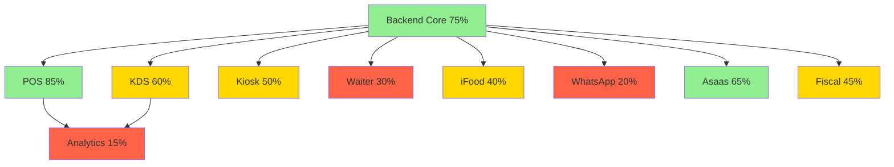

# 📊 Module Status Tracker - Chefia POS

## Metadata
- **Version**: 1.0.0
- **Last Updated**: January 2025
- **Update Frequency**: Weekly
- **Data Source**: Code Analysis + Team Reports

---

## 🎯 MODULE COMPLETION STATUS

### Core Modules

#### POS Terminal
```yaml
module: POS Terminal
status: 85%
last_updated: 2025-01-23
bundle_size: 250KB / 300KB
performance: <100ms response time

completed:
  ✅ Order creation and management
  ✅ Product catalog with categories
  ✅ Customer management
  ✅ Basic payment processing
  ✅ Receipt printing (simulated)
  ✅ Offline mode support
  ✅ Event bus integration
  ✅ Basic fiscal document generation

in_progress:
  🔄 Shift management integration (60%)
  🔄 Advanced discount rules (40%)
  🔄 Split payment UI (30%)

pending:
  ⏳ TEF payment provider integration
  ⏳ Loyalty program integration
  ⏳ Advanced reporting dashboard
  ⏳ Multi-terminal sync

known_issues:
  - Complex discount calculations need optimization
  - Memory leak in long sessions (>8 hours)
  - Print queue management incomplete
```

#### Kitchen Display System (KDS)
```yaml
module: KDS
status: 60%
last_updated: 2025-01-23
performance: Needs optimization

completed:
  ✅ Order display and queue
  ✅ Station assignment
  ✅ Order status updates
  ✅ Basic timer functionality
  ✅ Sound notifications

in_progress:
  🔄 Material-UI removal (70% - migrating to TailwindCSS)
  🔄 Real-time WebSocket sync (50%)
  🔄 Performance optimization (40%)

pending:
  ⏳ Advanced routing by preparation time
  ⏳ Kitchen analytics dashboard
  ⏳ Multi-station coordination
  ⏳ Voice alerts
  ⏳ Historical order search

critical_issues:
  - Still using Material-UI (violates architecture)
  - WebSocket reconnection issues
  - Performance degrades with >50 orders
```

#### Waiter Mobile Terminal
```yaml
module: Waiter Terminal
status: 30%
last_updated: 2025-01-23
priority: LOW (Sprint 3)

completed:
  ✅ Basic table layout
  ✅ Order creation interface
  ✅ Menu browsing

in_progress:
  🔄 Complete refactoring to new architecture (20%)

pending:
  ⏳ Table management
  ⏳ Order modifications
  ⏳ Bill splitting
  ⏳ Customer requests handling
  ⏳ Offline sync
  ⏳ Push notifications

blocked_by:
  - Needs complete architecture refactoring
  - Waiting for POS module stabilization
```

#### Self-Service Kiosk
```yaml
module: Kiosk
status: 50%
last_updated: 2025-01-23
priority: MEDIUM

completed:
  ✅ Product browsing interface
  ✅ Cart management
  ✅ Multi-language support structure
  ✅ Attractive UI design

in_progress:
  🔄 Payment flow integration (40%)
  🔄 Accessibility features (30%)

pending:
  ⏳ Customer identification (CPF/phone)
  ⏳ Loyalty program integration
  ⏳ Promotional banners
  ⏳ Nutritional information display
  ⏳ Order customization workflow
```

### Backend Services

#### Core Backend API
```yaml
module: Backend Core
status: 75%
last_updated: 2025-01-23

completed:
  ✅ FastAPI structure
  ✅ Database models (PostgreSQL)
  ✅ Authentication/Authorization
  ✅ Event bus implementation
  ✅ Basic CRUD operations
  ✅ WebSocket support
  ✅ Error handling middleware
  ✅ Logging system

in_progress:
  🔄 Performance optimization (60%)
  🔄 Caching layer (Redis) (50%)
  🔄 Advanced business rules (40%)

pending:
  ⏳ Rate limiting
  ⏳ API versioning
  ⏳ GraphQL endpoint
  ⏳ Batch operations
```

### Integration Modules

#### iFood Integration
```yaml
module: iFood
status: 40%
last_updated: 2025-01-23
priority: HIGH

completed:
  ✅ OAuth authentication
  ✅ Basic order structure
  ✅ Menu sync preparation

in_progress:
  🔄 Webhook implementation (60%)
  🔄 Order status sync (30%)

pending:
  ⏳ Complete order flow
  ⏳ Menu management
  ⏳ Promotion sync
  ⏳ Financial reconciliation
  ⏳ Error recovery
```

#### WhatsApp Bot
```yaml
module: WhatsApp/Twilio
status: 20%
last_updated: 2025-01-23
priority: HIGH

completed:
  ✅ Basic architecture design
  ✅ Twilio account setup

in_progress:
  🔄 Message handling structure (30%)

pending:
  ⏳ AI integration (Amazon Bedrock)
  ⏳ Order flow conversation
  ⏳ Payment link generation
  ⏳ Multi-tenant support
  ⏳ Menu queries
  ⏳ Order status updates
```

#### Payment Gateway (Asaas)
```yaml
module: Asaas Payment
status: 65%
last_updated: 2025-01-23

completed:
  ✅ PIX payment generation
  ✅ QR Code generation
  ✅ Webhook handling structure
  ✅ Basic refund support

in_progress:
  🔄 Split payment implementation (50%)
  🔄 Credit card processing (40%)

pending:
  ⏳ Boleto generation
  ⏳ Recurring payments
  ⏳ Financial reports
  ⏳ Reconciliation system
```

#### Fiscal Integration
```yaml
module: Fiscal (SAT/NFC-e)
status: 45%
last_updated: 2025-01-23

completed:
  ✅ SAT communication structure
  ✅ XML generation for CF-e
  ✅ Basic contingency mode

in_progress:
  🔄 NFC-e implementation (40%)
  🔄 SEFAZ communication (30%)

pending:
  ⏳ MF-e support
  ⏳ SPED Fiscal
  ⏳ Automatic retransmission
  ⏳ Certificate management
  ⏳ Multi-state support
```

### Analytics & Reporting

#### Analytics Dashboard
```yaml
module: Analytics
status: 15%
last_updated: 2025-01-23
priority: LOW (Sprint 4)

completed:
  ✅ Basic dashboard structure
  ✅ Database schema for metrics

pending:
  ⏳ Real-time sales dashboard
  ⏳ Product performance analysis
  ⏳ Customer behavior tracking
  ⏳ Financial reports
  ⏳ Predictive analytics
  ⏳ Export functionality
```

---

## 📈 OVERALL PROJECT STATUS

### Summary Metrics
```yaml
overall_completion: 58%
modules_total: 11
modules_production_ready: 0
modules_beta: 3 (POS, Backend, Asaas)
modules_alpha: 5
modules_planning: 3

critical_blockers:
  - KDS still using Material-UI
  - iFood webhook incomplete
  - TEF integration not started
  - Waiter module needs refactoring

sprint_1_deliverables:
  week_1: Table Queue Management (0% - not started)
  week_2: Command Cards System (0% - not started)
  week_3: Self-Service Weight (0% - not started)
  week_4: Integration & Testing (ongoing)
```

### Module Dependencies


---

## 🎯 SPRINT 1 ACTUAL VS PLANNED

### Original Plan (from IMPLEMENTATION_CHECKLIST_SPRINT1.md)
```yaml
week_1:
  planned: Table Queue Management System
  actual: Documentation and architecture refinement
  completion: 0%
  
week_2:
  planned: Command Cards with Scanner
  actual: Working on prerequisites
  completion: 0%
  
week_3:
  planned: Self-Service Weight System
  actual: Not started
  completion: 0%
  
week_4:
  planned: Integration & Testing
  actual: Ongoing parallel work
  completion: 20%
```

### Actual Progress Focus
```yaml
current_focus:
  - Removing Material-UI from KDS
  - Completing iFood webhook
  - Stabilizing POS module
  - Documenting architecture
  
recommended_pivot:
  - Complete KDS refactoring first
  - Finalize iFood integration
  - Then start Sprint 1 features
  - Adjust timeline by 2 weeks
```

---

## 🔄 UPDATE HISTORY

### 2025-01-23
- Created unified status tracker
- Resolved inconsistencies between documents
- Set POS at 85% (most accurate based on analysis)
- Set KDS at 60% (Material-UI still present)
- Added actual vs planned Sprint 1 status

### Previous Discrepancies Resolved
- POS: Was listed as 80-85% in different docs → Standardized at 85%
- KDS: Was listed as 60-65% → Standardized at 60%
- Sprint 1: Multiple versions → Single source of truth here

---

## 📋 ACTION ITEMS

### Immediate (This Week)
1. Remove Material-UI from KDS completely
2. Complete iFood webhook implementation
3. Fix WebSocket reconnection in KDS
4. Start table queue management feature

### Next Sprint
1. Complete Sprint 1 delayed features
2. Begin TEF integration
3. Refactor Waiter module
4. Implement WhatsApp bot MVP

### Technical Debt
1. KDS performance optimization
2. POS memory leak fix
3. Waiter complete refactoring
4. Bundle size optimization

---

*This document is the single source of truth for module status*
*Updates should be made here and propagated to other documents*
*Review and update weekly during sprint planning*