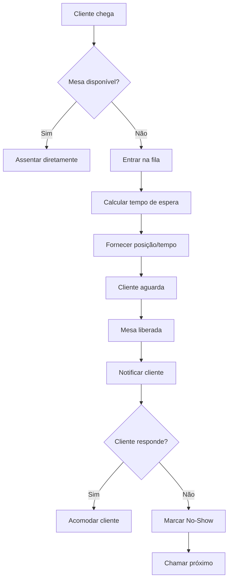
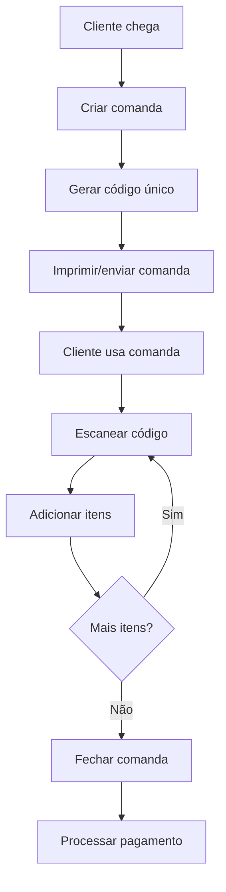

# Sistema Completo de Gestão de Mesas - Chefia POS

## Visão Geral

O Sistema de Gestão de Mesas do Chefia POS é uma solução integrada que combina:

- **🔄 Queue Management**: Fila de espera inteligente
- **📅 Reservation System**: Sistema de reservas avançado  
- **🎫 Command Cards**: Comandas físicas e digitais
- **⚖️ Self-Service**: Cobrança por peso para buffets
- **🪑 Table Layout**: Layout dinâmico de mesas

## Arquitetura do Sistema

### Módulos Backend

```
src/
├── tables/         # Gestão de layout e estados das mesas
├── queue/          # Sistema de fila de espera
├── reservation/    # Sistema de reservas
├── command/        # Comandas físicas/digitais
└── selfservice/    # Self-service com balança
```

### Integração entre Módulos

```
┌─────────────────────────────────────────────────────────┐
│                  FRONTEND APPS                          │
├─────────────────────────────────────────────────────────┤
│ POS │ Waiter │ KDS │ Kiosk │ Display │ Customer App    │
└─────────────────────────────────────────────────────────┘
                         ↕ HTTP/WebSocket
┌─────────────────────────────────────────────────────────┐
│                 TABLE MANAGEMENT                        │
├─────────────────────────────────────────────────────────┤
│  Queue ←→ Reservation ←→ Tables ←→ Command ←→ Orders    │
│              ↕ Event Bus ↕                              │
│  SMS/WhatsApp ←→ Payment ←→ Self-Service               │
└─────────────────────────────────────────────────────────┘
                         ↕
┌─────────────────────────────────────────────────────────┐
│                   INFRASTRUCTURE                        │
├─────────────────────────────────────────────────────────┤
│ PostgreSQL │ Redis │ RabbitMQ │ Hardware (Scales, etc) │
└─────────────────────────────────────────────────────────┘
```

## 1. QUEUE MANAGEMENT SYSTEM

### 1.1 Funcionalidades Principais

#### Entrada na Fila
- Registro de clientes com dados básicos
- Categorização automática por tamanho de grupo
- Geração de número/posição na fila
- Cálculo inteligente de tempo de espera

#### Gerenciamento Inteligente
- **Algoritmo de Tempo de Espera**:
  ```python
  def calculate_wait_time(party_size: int) -> int:
      # Buscar mesas adequadas
      suitable_tables = get_tables_for_party_size(party_size)
      
      # Calcular tempo baseado em ocupação atual
      wait_times = []
      for table in suitable_tables:
          if table.is_available:
              return 5  # Imediato
          else:
              # Tempo restante estimado + limpeza
              remaining = table.avg_dining_time - table.elapsed_time
              wait_times.append(remaining + table.cleanup_time)
      
      return min(wait_times) if wait_times else 60
  ```

#### Sistema de Notificações
- **SMS**: Integração com provedores brasileiros
- **WhatsApp**: API oficial do WhatsApp Business
- **Sistema interno**: Alto-falantes/displays

### 1.2 Modelos de Dados

```python
class QueueEntry(BaseModel):
    id: str
    customer_name: str
    customer_phone: str
    party_size: int
    party_type: PartySize  # SMALL, MEDIUM, LARGE, XLARGE
    estimated_wait_minutes: int
    check_in_time: datetime
    status: QueueStatus  # WAITING, NOTIFIED, SEATED, NO_SHOW
    position_in_queue: int
    table_preferences: List[str]
    notification_method: str
```

### 1.3 Fluxo Operacional



## 2. RESERVATION SYSTEM

### 2.1 Funcionalidades Principais

#### Criação de Reservas
- Validação de disponibilidade em tempo real
- Alocação automática de mesas adequadas
- Suporte a preferências (janela, canto, etc.)
- Sistema de depósitos para grupos grandes

#### Gestão Avançada
- **Reservas Recorrentes**: Eventos regulares
- **Overbooking Controlado**: Margem configurável
- **Integração com Fila**: Walk-ins vs. Reservas

### 2.2 Modelos de Dados

```python
class Reservation(BaseModel):
    id: str
    customer_name: str
    customer_phone: str
    customer_email: Optional[str]
    party_size: int
    reservation_datetime: datetime
    table_id: Optional[str]  # Auto-alocado
    status: ReservationStatus
    deposit_required: bool
    deposit_amount: Decimal
    special_requests: Optional[str]
    recurring_type: Optional[RecurringType]
    confirmation_sent: bool
    reminder_sent: bool
```

### 2.3 Algoritmo de Alocação

```python
def allocate_table(reservation: Reservation) -> str:
    # Buscar mesas adequadas
    suitable_tables = get_tables_by_capacity(
        min_size=reservation.party_size,
        max_size=reservation.party_size + 2  # Tolerância
    )
    
    # Filtrar por preferências
    if reservation.preferences:
        suitable_tables = filter_by_preferences(
            suitable_tables, 
            reservation.preferences
        )
    
    # Verificar disponibilidade no horário
    available_tables = check_availability(
        suitable_tables,
        reservation.reservation_datetime,
        duration=120  # 2h padrão
    )
    
    # Escolher a mesa mais adequada
    return select_best_table(available_tables, reservation)
```

## 3. COMMAND CARDS SYSTEM

### 3.1 Tipos de Comandas

#### Físicas
1. **Barcode**: Code128 impresso
2. **QR Code**: URL ou código único
3. **RFID**: Tags 13.56MHz
4. **NFC**: Near Field Communication

#### Digitais
- App móvel com código dinâmico
- SMS com link único
- Email com QR code

### 3.2 Fluxo de Uso



### 3.3 Modelos de Dados

```python
class CommandCard(BaseModel):
    id: str
    code: str  # Código único escaneável
    type: CommandType  # BARCODE, QRCODE, RFID, NFC
    table_id: Optional[str]
    customer_name: Optional[str]
    status: CommandStatus  # OPEN, CLOSED, PAID, CANCELLED
    credit_limit: Decimal = Decimal("500.00")
    items: List[CommandItem]
    subtotal: Decimal
    service_charge: Decimal
    total: Decimal
    opened_at: datetime
    closed_at: Optional[datetime]
```

## 4. SELF-SERVICE SYSTEM

### 4.1 Integração com Hardware

#### Balanças Suportadas
- **Serial RS-232**: Toledo, Filizola
- **USB**: Modelos modernos plug-and-play  
- **TCP/IP**: Balanças em rede
- **Bluetooth**: Balanças móveis

### 4.2 Processo de Pesagem

```python
class WeightService:
    async def create_weight_order(
        self,
        scale_id: str,
        additional_items: List[dict] = None
    ) -> SelfServiceOrder:
        # 1. Ler peso da balança
        gross_weight = await self.read_weight(scale_id)
        
        # 2. Calcular peso líquido
        scale_config = await self.get_scale_config(scale_id)
        net_weight = gross_weight - scale_config.tare_weight
        
        # 3. Calcular preço da comida
        food_price = (net_weight / 1000) * scale_config.price_per_kg
        
        # 4. Adicionar itens extras
        extras_price = sum(
            item['price'] * item['quantity'] 
            for item in additional_items or []
        )
        
        # 5. Criar pedido
        return SelfServiceOrder(
            gross_weight=gross_weight,
            net_weight=net_weight,
            food_subtotal=food_price,
            additional_subtotal=extras_price,
            total=food_price + extras_price,
            scale_id=scale_id
        )
```

### 4.3 Anti-Fraude

#### Controles Implementados
- **Limite de tara**: Máximo 300g
- **Supervisão**: Pesos > 1.5kg precisam aprovação
- **Foto opcional**: Para auditoria
- **Histórico**: Log de todas as pesagens

## 5. TABLE LAYOUT MANAGEMENT

### 5.1 Layout Dinâmico

#### Editor Visual
- Arrastar e soltar mesas
- Redimensionamento em tempo real
- Formas: redonda, quadrada, retangular
- Numeração automática ou manual

### 5.2 Estados das Mesas

```python
class TableStatus(str, Enum):
    AVAILABLE = "available"      # Livre e limpa
    OCCUPIED = "occupied"        # Com clientes
    RESERVED = "reserved"        # Reservada
    CLEANING = "cleaning"        # Em limpeza
    MAINTENANCE = "maintenance"  # Manutenção
    BLOCKED = "blocked"         # Bloqueada
```

### 5.3 Integração com Outros Sistemas

```python
class TableEventHandler:
    async def on_table_available(self, table_id: str):
        # Notificar fila de espera
        await self.queue_service.check_waiting_customers(table_id)
        
        # Verificar reservas
        await self.reservation_service.check_upcoming_reservations(table_id)
        
        # Atualizar display
        await self.websocket_service.broadcast_table_status(table_id)
    
    async def on_order_completed(self, table_id: str):
        # Iniciar timer de limpeza
        await self.schedule_cleaning(table_id)
        
        # Notificar garçom
        await self.waiter_service.notify_table_ready_to_clear(table_id)
```

## 6. FLUXOS INTEGRADOS

### 6.1 Cenário: Cliente sem Reserva

```
1. Cliente chega → Verificar mesas disponíveis
2. Se não há mesa → Entrar na fila
3. Gerar posição e tempo estimado
4. Aguardar notificação
5. Mesa liberada → Cliente notificado
6. Cliente acomodado → Remover da fila
```

### 6.2 Cenário: Reserva Confirmada

```
1. Horário da reserva chega
2. Sistema verifica mesa alocada
3. Se ocupada → Realoca automaticamente
4. Marca mesa como RESERVED
5. Cliente chega → Confirma reserva
6. Mesa liberada para uso
```

### 6.3 Cenário: Comanda com Self-Service

```
1. Cliente solicita comanda
2. Gerar código QR/barcode
3. Cliente vai ao buffet
4. Pesar comida na balança
5. Escanear comanda
6. Adicionar peso ao total
7. Adicionar bebidas/extras
8. Fechar comanda para pagamento
```

## 7. INTERFACES DE USUÁRIO

### 7.1 POS Terminal - Gestão de Fila

```typescript
interface QueueManagementProps {
  queue: QueueEntry[]
  onAddCustomer: (customer: CustomerData) => void
  onNotifyCustomer: (entryId: string) => void
}

export const QueueManagement: FC<QueueManagementProps> = ({
  queue,
  onAddCustomer,
  onNotifyCustomer
}) => {
  return (
    <div className="queue-management">
      <QueueStats queue={queue} />
      <QueueList 
        entries={queue}
        onNotify={onNotifyCustomer}
      />
      <AddCustomerForm onSubmit={onAddCustomer} />
    </div>
  )
}
```

### 7.2 Waiter Terminal - Reservas

```typescript
export const ReservationCalendar: FC = () => {
  const [reservations, setReservations] = useState<Reservation[]>([])
  const [selectedDate, setSelectedDate] = useState(new Date())
  
  const handleCreateReservation = async (data: ReservationData) => {
    const response = await api.post('/reservations', data)
    if (response.ok) {
      const newReservation = await response.json()
      setReservations(prev => [...prev, newReservation])
    }
  }
  
  return (
    <div className="reservation-calendar">
      <Calendar 
        date={selectedDate}
        onChange={setSelectedDate}
        reservations={reservations}
      />
      <ReservationForm onSubmit={handleCreateReservation} />
    </div>
  )
}
```

### 7.3 Self-Service Checkout

```typescript
export const SelfServiceCheckout: FC = () => {
  const [weight, setWeight] = useState<WeightReading | null>(null)
  const [items, setItems] = useState<AdditionalItem[]>([])
  
  const handleWeigh = async () => {
    const response = await api.post('/selfservice/weigh', {
      scale_id: 'scale_01'
    })
    if (response.ok) {
      const weightData = await response.json()
      setWeight(weightData)
    }
  }
  
  return (
    <div className="self-service-checkout">
      <WeightDisplay weight={weight} onWeigh={handleWeigh} />
      <AdditionalItems items={items} onChange={setItems} />
      <CheckoutSummary weight={weight} items={items} />
    </div>
  )
}
```

## 8. CONFIGURAÇÕES E PARÂMETROS

### 8.1 Configurações da Fila

```json
{
  "queue": {
    "max_customers": 50,
    "max_wait_time_hours": 3,
    "notification_timeout_minutes": 5,
    "party_size_categories": {
      "small": "1-2",
      "medium": "3-4", 
      "large": "5-6",
      "xlarge": "7+"
    },
    "notification_methods": ["sms", "whatsapp", "system"]
  }
}
```

### 8.2 Configurações de Reserva

```json
{
  "reservations": {
    "min_advance_hours": 1,
    "max_advance_days": 30,
    "deposit_required_for_party_size": 6,
    "deposit_per_person": 10.00,
    "cancellation_free_hours": 4,
    "no_show_tolerance_minutes": 15,
    "overbooking_percentage": 5
  }
}
```

### 8.3 Configurações Self-Service

```json
{
  "self_service": {
    "price_per_kg": 69.90,
    "min_weight_grams": 100,
    "max_weight_grams": 2000,
    "default_tare_grams": 150,
    "child_discount_percentage": 50,
    "child_age_limit": 6,
    "scale_precision_grams": 5
  }
}
```

## 9. EVENTOS DO SISTEMA

### 9.1 Eventos de Fila

```python
# Eventos publicados pelo sistema de fila
events = [
    "queue.customer_added",     # Cliente adicionado à fila
    "queue.customer_notified",  # Cliente notificado
    "queue.customer_seated",    # Cliente acomodado
    "queue.customer_no_show",   # Cliente não compareceu
    "queue.position_updated",   # Posição na fila atualizada
]
```

### 9.2 Eventos de Reserva

```python
events = [
    "reservation.created",      # Reserva criada
    "reservation.confirmed",    # Reserva confirmada
    "reservation.cancelled",    # Reserva cancelada
    "reservation.no_show",      # No-show detectado
    "reservation.reminder_sent", # Lembrete enviado
]
```

### 9.3 Eventos de Mesa

```python
events = [
    "table.status_changed",     # Status da mesa mudou
    "table.occupied",          # Mesa foi ocupada
    "table.available",         # Mesa ficou disponível
    "table.cleaning_started",  # Limpeza iniciada
    "table.maintenance_mode",  # Mesa em manutenção
]
```

## 10. MÉTRICAS E RELATÓRIOS

### 10.1 KPIs da Fila

- **Tempo médio de espera** por categoria de grupo
- **Taxa de no-show** da fila
- **Pico de fila** por horário/dia
- **Satisfação do cliente** (surveys opcionais)

### 10.2 KPIs de Reservas  

- **Taxa de ocupação** por período
- **No-show rate** de reservas
- **Tempo médio de permanência**
- **Receita por reserva**

### 10.3 KPIs Self-Service

- **Peso médio por transação**
- **Valor médio por kg**
- **Itens adicionais por cliente**
- **Fraudes detectadas**

## 11. TROUBLESHOOTING

### 11.1 Problemas Comuns da Fila

**Problema**: Cliente não recebe notificação SMS
```
Verificar:
1. Número de telefone válido (+55...)
2. Créditos SMS disponíveis
3. Status da integração com provedor
4. Logs de erro no sistema
```

**Problema**: Tempo de espera incorreto
```
Verificar:
1. Status real das mesas
2. Configuração de tempo médio por categoria
3. Dados históricos atualizados
4. Mesas em manutenção/limpeza
```

### 11.2 Problemas de Reserva

**Problema**: Overbooking não intencional
```
Verificar:
1. Configuração de capacidade máxima
2. Durações de reserva
3. Conflitos de horário
4. Mesas em manutenção
```

### 11.3 Problemas Self-Service

**Problema**: Balança não responde
```
Verificar:
1. Conexão física (USB/Serial)
2. Drivers instalados
3. Configuração da porta COM
4. Testes de comunicação
```

## 12. ROADMAP E MELHORIAS FUTURAS

### 12.1 Curto Prazo (3 meses)
- [ ] App móvel para clientes na fila
- [ ] Integração com Google Maps para tempo de chegada
- [ ] Push notifications para reservas
- [ ] Dashboard analytics em tempo real

### 12.2 Médio Prazo (6 meses)
- [ ] IA para predição de tempo de espera
- [ ] Chatbot WhatsApp para reservas
- [ ] Programa de fidelidade integrado
- [ ] API para terceiros

### 12.3 Longo Prazo (12 meses)
- [ ] Reservas por reconhecimento facial
- [ ] Pagamento automático por NFC
- [ ] Análise preditiva de demanda
- [ ] Integração com sistemas de delivery

## Conclusão

O Sistema de Gestão de Mesas do Chefia POS representa uma solução completa e integrada para restaurantes modernos, combinando tecnologia avançada com praticidade operacional. A arquitetura modular permite implementação gradual e personalização conforme as necessidades específicas de cada estabelecimento.