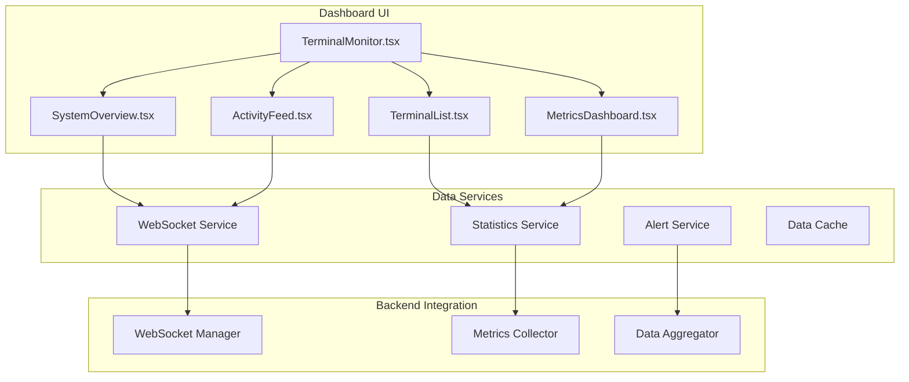

# Terminal Monitor Dashboard - Documentação Completa

## Visão Geral

O **Terminal Monitor Dashboard** é uma ferramenta de monitoramento em tempo real que oferece visibilidade completa sobre todos os terminais conectados ao sistema Chefia POS. Desenvolvido com React e integrado ao sistema de sincronização WebSocket, o dashboard permite:

- **Monitoramento em tempo real** de todos os terminais conectados
- **Visibilidade completa** de atividades de sincronização
- **Métricas de performance** detalhadas por terminal
- **Sistema de alertas** automático para problemas
- **Análise histórica** de operações e performance

## Arquitetura

### Componentes Principais



## Interface do Usuário

### 1. Visão Geral do Sistema

Dashboard principal com métricas agregadas:

```typescript
interface SystemOverview {
  totalTerminals: number;
  onlineTerminals: number;
  offlineTerminals: number;
  errorTerminals: number;
  syncOperationsPerMinute: number;
  averageLatency: number;
  systemUptime: number;
  lastUpdate: string;
}
```

**Cards de Métricas:**
- **Total de Terminais**: Quantidade total de terminais registrados
- **Terminais Online**: Terminais conectados e operacionais
- **Terminais Offline**: Terminais desconectados
- **Sincronizações/min**: Taxa de operações de sincronização
- **Latência Média**: Tempo médio de resposta WebSocket
- **System Health**: Indicador geral de saúde do sistema

### 2. Lista de Terminais

Visualização detalhada de cada terminal conectado:

```typescript
interface TerminalInfo {
  id: string;
  type: 'pos' | 'kds' | 'waiter' | 'monitor';
  status: 'online' | 'offline' | 'error' | 'reconnecting';
  location?: string;
  version?: string;
  
  // Timestamps
  connectedAt: Date;
  lastPing: Date;
  lastActivity: Date;
  
  // Métricas de Performance
  performance: {
    responseTime: number;        // ms
    errorRate: number;           // 0-1
    memoryUsage: number;         // MB
    cacheHitRate: number;        // 0-1
    syncOperations: number;      // total today
    conflictsResolved: number;   // total today
  };
  
  // Estatísticas de Conexão
  connection: {
    reconnectCount: number;
    lastReconnectAt?: Date;
    totalUptime: number;         // seconds today
    dataTransferred: number;     // bytes
  };
}
```

**Visualização por Terminal:**
- **Ícone e Tipo**: Representação visual do tipo de terminal
- **Status Indicator**: Código de cores para status (verde/vermelho/amarelo)
- **Métricas Básicas**: Tempo de resposta, uso de memória, taxa de erro
- **Detalhes Expandíveis**: Informações completas ao clicar

### 3. Feed de Atividade em Tempo Real

Stream de atividades de sincronização:

```typescript
interface SyncActivity {
  id: string;
  type: 'data_sync' | 'conflict_resolution' | 'lock_operation' | 'backup_created';
  entityType: string;
  entityId: string;
  operation: 'CREATE' | 'UPDATE' | 'DELETE' | 'BULK_UPDATE';
  
  // Origem e destinos
  sourceTerminal: string;
  targetTerminals: string[];
  
  // Timing
  timestamp: Date;
  duration?: number;           // ms
  
  // Status
  status: 'success' | 'pending' | 'error' | 'conflict';
  errorMessage?: string;
  conflictType?: 'version_conflict' | 'data_conflict' | 'lock_conflict';
  
  // Dados adicionais
  dataSize?: number;           // bytes
  priority: 'low' | 'medium' | 'high' | 'critical';
}
```

**Recursos do Feed:**
- **Filtros**: Por tipo de atividade, terminal, status
- **Busca**: Por ID de entidade ou terminal
- **Exportação**: Para análise offline
- **Alertas**: Notificações para atividades críticas

### 4. Métricas de Performance

Dashboard com gráficos e métricas detalhadas:

```typescript
interface PerformanceMetrics {
  // Métricas WebSocket
  websocket: {
    connectionCount: number;
    messagesPerSecond: number;
    averageLatency: number;
    maxLatency: number;
    reconnectionRate: number;
    errorRate: number;
  };
  
  // Métricas de Sincronização
  synchronization: {
    operationsPerSecond: number;
    successRate: number;
    conflictRate: number;
    averageResolutionTime: number;
    queueSize: number;
  };
  
  // Métricas de Sistema
  system: {
    memoryUsage: number;
    cpuUsage: number;
    diskUsage: number;
    networkThroughput: number;
  };
  
  // Métricas por Terminal
  terminals: Record<string, TerminalMetrics>;
}
```

## Implementação do Dashboard

### Componente Principal

```typescript
// components/TerminalMonitor/TerminalMonitor.tsx
import React, { useState, useEffect, useCallback } from 'react';
import { useSyncService } from '@/services/RealtimeSyncService';
import { useTerminalMetrics } from '@/hooks/useTerminalMetrics';

const TerminalMonitor: React.FC = () => {
  // Estado do dashboard
  const [selectedView, setSelectedView] = useState<'overview' | 'terminals' | 'activity' | 'metrics'>('overview');
  const [terminals, setTerminals] = useState<TerminalInfo[]>([]);
  const [syncActivity, setSyncActivity] = useState<SyncActivity[]>([]);
  const [systemMetrics, setSystemMetrics] = useState<SystemOverview | null>(null);
  const [alerts, setAlerts] = useState<Alert[]>([]);

  // Serviços
  const syncService = useSyncService('monitor-dashboard', 'monitor');
  const { metrics, loading: metricsLoading } = useTerminalMetrics();

  // Handlers para mensagens WebSocket
  const handleWebSocketMessage = useCallback((message: WebSocketMessage) => {
    switch (message.type) {
      case 'terminal_status_update':
        handleTerminalStatusUpdate(message.data);
        break;
      
      case 'sync_activity':
        handleSyncActivity(message.data);
        break;
      
      case 'performance_metrics':
        handlePerformanceMetrics(message.data);
        break;
      
      case 'system_alert':
        handleSystemAlert(message.data);
        break;
    }
  }, []);

  const handleTerminalStatusUpdate = useCallback((data: any) => {
    setTerminals(prevTerminals => {
      const updatedTerminals = { ...data.terminals };
      
      return Object.entries(updatedTerminals).map(([id, info]: [string, any]) => ({
        id,
        ...info,
        connectedAt: new Date(info.connected_at),
        lastPing: new Date(info.last_ping),
        lastActivity: new Date(info.last_activity || info.last_ping)
      }));
    });

    // Atualiza métricas do sistema
    setSystemMetrics(prevMetrics => ({
      ...prevMetrics,
      totalTerminals: data.total_terminals || 0,
      onlineTerminals: data.total_online || 0,
      offlineTerminals: (data.total_terminals || 0) - (data.total_online || 0),
      lastUpdate: new Date().toISOString()
    }));
  }, []);

  const handleSyncActivity = useCallback((activity: SyncActivity) => {
    setSyncActivity(prevActivity => {
      const newActivity = [...prevActivity, activity].slice(-100); // Keep last 100
      return newActivity.sort((a, b) => b.timestamp.getTime() - a.timestamp.getTime());
    });

    // Verifica se é uma atividade crítica que requer alerta
    if (activity.status === 'error' || activity.priority === 'critical') {
      const alert: Alert = {
        id: `alert-${Date.now()}`,
        type: activity.status === 'error' ? 'error' : 'warning',
        title: `Sync ${activity.status} - ${activity.entityType}`,
        message: activity.errorMessage || `Critical operation on ${activity.entityId}`,
        timestamp: new Date(),
        terminalId: activity.sourceTerminal,
        acknowledged: false
      };
      
      setAlerts(prevAlerts => [...prevAlerts, alert]);
    }
  }, []);

  // Configuração do WebSocket
  useEffect(() => {
    syncService.onMessage = handleWebSocketMessage;
    
    return () => {
      syncService.onMessage = undefined;
    };
  }, [syncService, handleWebSocketMessage]);

  // Polling para métricas complementares
  useEffect(() => {
    const interval = setInterval(async () => {
      try {
        const response = await fetch('/api/v1/websocket/stats');
        const stats = await response.json();
        
        setSystemMetrics(prevMetrics => ({
          ...prevMetrics,
          syncOperationsPerMinute: stats.operations_per_minute || 0,
          averageLatency: stats.average_latency || 0,
          systemUptime: stats.uptime_seconds || 0
        }));
      } catch (error) {
        console.error('Failed to fetch system stats:', error);
      }
    }, 5000); // Atualiza a cada 5 segundos

    return () => clearInterval(interval);
  }, []);

  return (
    <div className="terminal-monitor min-h-screen bg-gray-50">
      {/* Header */}
      <div className="bg-white shadow-sm border-b border-gray-200">
        <div className="max-w-7xl mx-auto px-4 sm:px-6 lg:px-8">
          <div className="flex justify-between items-center py-6">
            <div>
              <h1 className="text-2xl font-bold text-gray-900">
                Terminal Monitor
              </h1>
              <p className="text-sm text-gray-600">
                Monitoramento em tempo real de terminais Chefia POS
              </p>
            </div>
            
            <div className="flex items-center space-x-4">
              {/* Status Indicator */}
              <div className="flex items-center">
                <div className={`w-2 h-2 rounded-full mr-2 ${
                  syncService.connectionStatus === 'connected' ? 'bg-green-500' : 'bg-red-500'
                }`} />
                <span className="text-sm text-gray-600">
                  {syncService.connectionStatus === 'connected' ? 'Connected' : 'Disconnected'}
                </span>
              </div>
              
              {/* Alerts Badge */}
              {alerts.filter(a => !a.acknowledged).length > 0 && (
                <div className="relative">
                  <button className="p-2 text-gray-400 hover:text-gray-500">
                    <svg className="h-6 w-6" fill="none" viewBox="0 0 24 24" stroke="currentColor">
                      <path strokeLinecap="round" strokeLinejoin="round" strokeWidth={2} d="M15 17h5l-5 -5l5 -5h-5l-5 5l5 5z" />
                    </svg>
                  </button>
                  <div className="absolute -top-1 -right-1 h-4 w-4 bg-red-500 rounded-full flex items-center justify-center">
                    <span className="text-xs text-white">
                      {alerts.filter(a => !a.acknowledged).length}
                    </span>
                  </div>
                </div>
              )}
            </div>
          </div>
          
          {/* Navigation Tabs */}
          <div className="border-t border-gray-200">
            <nav className="-mb-px flex space-x-8">
              {[
                { key: 'overview', label: 'Visão Geral', icon: '📊' },
                { key: 'terminals', label: 'Terminais', icon: '🖥️' },
                { key: 'activity', label: 'Atividade', icon: '🔄' },
                { key: 'metrics', label: 'Métricas', icon: '📈' }
              ].map((tab) => (
                <button
                  key={tab.key}
                  onClick={() => setSelectedView(tab.key as any)}
                  className={`${
                    selectedView === tab.key
                      ? 'border-blue-500 text-blue-600'
                      : 'border-transparent text-gray-500 hover:text-gray-700 hover:border-gray-300'
                  } whitespace-nowrap py-4 px-1 border-b-2 font-medium text-sm flex items-center`}
                >
                  <span className="mr-2">{tab.icon}</span>
                  {tab.label}
                </button>
              ))}
            </nav>
          </div>
        </div>
      </div>

      {/* Main Content */}
      <div className="max-w-7xl mx-auto px-4 sm:px-6 lg:px-8 py-8">
        {selectedView === 'overview' && (
          <SystemOverviewView 
            systemMetrics={systemMetrics}
            terminals={terminals}
            recentActivity={syncActivity.slice(0, 10)}
          />
        )}
        
        {selectedView === 'terminals' && (
          <TerminalListView
            terminals={terminals}
            onTerminalSelect={(terminalId) => {
              // Implementar detalhes do terminal
            }}
          />
        )}
        
        {selectedView === 'activity' && (
          <ActivityFeedView
            activities={syncActivity}
            onActivityFilter={(filters) => {
              // Implementar filtros
            }}
          />
        )}
        
        {selectedView === 'metrics' && (
          <MetricsDashboardView
            metrics={metrics}
            terminals={terminals}
            loading={metricsLoading}
          />
        )}
      </div>
      
      {/* Alerts Sidebar */}
      <AlertsSidebar
        alerts={alerts}
        onAlertAcknowledge={(alertId) => {
          setAlerts(prev => prev.map(alert => 
            alert.id === alertId ? { ...alert, acknowledged: true } : alert
          ));
        }}
        onAlertDismiss={(alertId) => {
          setAlerts(prev => prev.filter(alert => alert.id !== alertId));
        }}
      />
    </div>
  );
};

export default TerminalMonitor;
```

### Sistema de Alertas

```typescript
// services/AlertService.ts
interface Alert {
  id: string;
  type: 'error' | 'warning' | 'info' | 'success';
  title: string;
  message: string;
  timestamp: Date;
  terminalId?: string;
  acknowledged: boolean;
  severity: 'low' | 'medium' | 'high' | 'critical';
  category: 'connectivity' | 'performance' | 'sync' | 'system';
}

class AlertService {
  private alerts: Alert[] = [];
  private subscribers: ((alerts: Alert[]) => void)[] = [];
  private alertRules: AlertRule[] = [];

  constructor() {
    this.setupDefaultRules();
  }

  private setupDefaultRules() {
    this.alertRules = [
      {
        id: 'high-latency',
        condition: (metrics: any) => metrics.averageLatency > 100,
        severity: 'warning',
        category: 'performance',
        title: 'High Latency Detected',
        message: 'WebSocket latency is above 100ms'
      },
      {
        id: 'terminal-offline',
        condition: (terminals: TerminalInfo[]) => 
          terminals.some(t => t.status === 'offline' && 
          Date.now() - t.lastPing.getTime() > 60000),
        severity: 'error',
        category: 'connectivity',
        title: 'Terminal Offline',
        message: 'One or more terminals have been offline for over 1 minute'
      },
      {
        id: 'high-conflict-rate',
        condition: (metrics: any) => metrics.conflictRate > 0.05,
        severity: 'warning',
        category: 'sync',
        title: 'High Conflict Rate',
        message: 'Sync conflict rate is above 5%'
      },
      {
        id: 'memory-usage-high',
        condition: (terminals: TerminalInfo[]) =>
          terminals.some(t => t.performance.memoryUsage > 80),
        severity: 'warning',
        category: 'system',
        title: 'High Memory Usage',
        message: 'Terminal memory usage is above 80MB'
      }
    ];
  }

  checkAlerts(systemMetrics: any, terminals: TerminalInfo[]) {
    for (const rule of this.alertRules) {
      if (rule.condition(systemMetrics, terminals)) {
        const existingAlert = this.alerts.find(a => 
          a.category === rule.category && 
          a.title === rule.title && 
          !a.acknowledged
        );

        if (!existingAlert) {
          this.createAlert({
            type: rule.severity === 'critical' || rule.severity === 'high' ? 'error' : 'warning',
            title: rule.title,
            message: rule.message,
            severity: rule.severity,
            category: rule.category,
            timestamp: new Date(),
            acknowledged: false
          });
        }
      }
    }
  }

  private createAlert(alertData: Partial<Alert>) {
    const alert: Alert = {
      id: `alert-${Date.now()}-${Math.random().toString(36).substr(2, 9)}`,
      type: 'info',
      acknowledged: false,
      severity: 'medium',
      category: 'system',
      ...alertData
    } as Alert;

    this.alerts.unshift(alert);
    
    // Manter apenas os últimos 100 alertas
    if (this.alerts.length > 100) {
      this.alerts = this.alerts.slice(0, 100);
    }

    this.notifySubscribers();
  }

  private notifySubscribers() {
    this.subscribers.forEach(callback => callback([...this.alerts]));
  }

  subscribe(callback: (alerts: Alert[]) => void) {
    this.subscribers.push(callback);
    callback([...this.alerts]);

    return () => {
      this.subscribers = this.subscribers.filter(cb => cb !== callback);
    };
  }

  acknowledgeAlert(alertId: string) {
    const alert = this.alerts.find(a => a.id === alertId);
    if (alert) {
      alert.acknowledged = true;
      this.notifySubscribers();
    }
  }

  dismissAlert(alertId: string) {
    this.alerts = this.alerts.filter(a => a.id !== alertId);
    this.notifySubscribers();
  }

  getActiveAlerts(): Alert[] {
    return this.alerts.filter(a => !a.acknowledged);
  }

  getAlertsByCategory(category: string): Alert[] {
    return this.alerts.filter(a => a.category === category);
  }
}

export const alertService = new AlertService();
```

## Métricas e KPIs

### Métricas de Sistema

| Métrica | Descrição | Alerta |
|---------|-----------|--------|
| **Terminais Online** | Número de terminais conectados | < 80% dos terminais esperados |
| **Latência WebSocket** | Tempo de resposta médio | > 100ms |
| **Taxa de Sincronização** | Operações por minuto | < 50% da média histórica |
| **Taxa de Conflitos** | % de sincronizações com conflito | > 5% |
| **Uptime do Sistema** | Tempo de atividade | < 99% |

### Métricas por Terminal

| Métrica | Descrição | Alerta |
|---------|-----------|--------|
| **Uso de Memória** | Consumo de RAM | > 80MB |
| **Taxa de Erro** | % de operações com falha | > 1% |
| **Cache Hit Rate** | Eficiência do cache | < 90% |
| **Operações/hora** | Volume de atividade | 50% abaixo da média |
| **Última Atividade** | Tempo desde última operação | > 30 minutos |

### Métricas de Performance

```typescript
interface PerformanceKPIs {
  // SLA Targets
  websocketLatency: {
    target: 10;      // ms
    warning: 50;     // ms
    critical: 100;   // ms
  };
  
  syncPropagation: {
    target: 50;      // ms
    warning: 100;    // ms
    critical: 500;   // ms
  };
  
  conflictRate: {
    target: 0.001;   // 0.1%
    warning: 0.01;   // 1%
    critical: 0.05;  // 5%
  };
  
  systemUptime: {
    target: 0.999;   // 99.9%
    warning: 0.99;   // 99%
    critical: 0.95;  // 95%
  };
}
```

## Exportação e Relatórios

### Exportação de Dados

```typescript
class ReportExporter {
  async exportTerminalReport(
    terminalId: string, 
    dateRange: { start: Date; end: Date },
    format: 'json' | 'csv' | 'excel'
  ): Promise<Blob> {
    const data = await this.collectTerminalData(terminalId, dateRange);
    
    switch (format) {
      case 'json':
        return new Blob([JSON.stringify(data, null, 2)], { 
          type: 'application/json' 
        });
        
      case 'csv':
        return new Blob([this.convertToCSV(data)], { 
          type: 'text/csv' 
        });
        
      case 'excel':
        return this.generateExcelReport(data);
    }
  }

  async exportSyncActivityReport(
    dateRange: { start: Date; end: Date },
    filters?: {
      terminalIds?: string[];
      entityTypes?: string[];
      statusFilter?: string[];
    }
  ): Promise<Blob> {
    const activities = await this.collectSyncActivities(dateRange, filters);
    return this.generateActivityReport(activities);
  }

  async exportPerformanceReport(
    dateRange: { start: Date; end: Date }
  ): Promise<Blob> {
    const metrics = await this.collectPerformanceMetrics(dateRange);
    return this.generatePerformanceReport(metrics);
  }
}
```

### Dashboards Personalizados

```typescript
interface DashboardWidget {
  id: string;
  type: 'metric' | 'chart' | 'table' | 'alert' | 'terminal_status';
  title: string;
  size: 'small' | 'medium' | 'large';
  config: {
    dataSource: string;
    refreshInterval: number;
    filters?: Record<string, any>;
  };
  position: { x: number; y: number; width: number; height: number };
}

interface CustomDashboard {
  id: string;
  name: string;
  description: string;
  widgets: DashboardWidget[];
  permissions: string[];
  createdBy: string;
  createdAt: Date;
  lastModified: Date;
}
```

## Segurança e Permissions

### Controle de Acesso

```typescript
interface MonitorPermissions {
  canViewAllTerminals: boolean;
  canViewTerminalDetails: boolean;
  canViewSyncActivity: boolean;
  canViewPerformanceMetrics: boolean;
  canExportReports: boolean;
  canManageAlerts: boolean;
  canConfigureDashboard: boolean;
  restrictedTerminals?: string[];  // IDs dos terminais com acesso restrito
}

interface UserRole {
  id: string;
  name: string;
  permissions: MonitorPermissions;
  description: string;
}

// Roles predefinidos
const MONITOR_ROLES: UserRole[] = [
  {
    id: 'monitor_viewer',
    name: 'Monitor Viewer',
    description: 'Visualização básica de terminais e atividades',
    permissions: {
      canViewAllTerminals: true,
      canViewTerminalDetails: false,
      canViewSyncActivity: true,
      canViewPerformanceMetrics: false,
      canExportReports: false,
      canManageAlerts: false,
      canConfigureDashboard: false
    }
  },
  {
    id: 'monitor_operator',
    name: 'Monitor Operator',
    description: 'Operação completa do monitor com exportação',
    permissions: {
      canViewAllTerminals: true,
      canViewTerminalDetails: true,
      canViewSyncActivity: true,
      canViewPerformanceMetrics: true,
      canExportReports: true,
      canManageAlerts: true,
      canConfigureDashboard: false
    }
  },
  {
    id: 'monitor_admin',
    name: 'Monitor Admin',
    description: 'Acesso completo incluindo configuração',
    permissions: {
      canViewAllTerminals: true,
      canViewTerminalDetails: true,
      canViewSyncActivity: true,
      canViewPerformanceMetrics: true,
      canExportReports: true,
      canManageAlerts: true,
      canConfigureDashboard: true
    }
  }
];
```

## Integração e APIs

### APIs REST para o Monitor

```http
# Terminal Status
GET /api/v1/monitor/terminals
GET /api/v1/monitor/terminals/{terminal_id}
GET /api/v1/monitor/terminals/{terminal_id}/metrics
GET /api/v1/monitor/terminals/{terminal_id}/history

# System Metrics
GET /api/v1/monitor/system/overview
GET /api/v1/monitor/system/performance
GET /api/v1/monitor/system/health

# Sync Activity
GET /api/v1/monitor/sync/activity
GET /api/v1/monitor/sync/conflicts
GET /api/v1/monitor/sync/statistics

# Alerts
GET /api/v1/monitor/alerts
POST /api/v1/monitor/alerts/{alert_id}/acknowledge
DELETE /api/v1/monitor/alerts/{alert_id}

# Reports
POST /api/v1/monitor/reports/terminals
POST /api/v1/monitor/reports/sync-activity
POST /api/v1/monitor/reports/performance

# Dashboard Configuration
GET /api/v1/monitor/dashboards
POST /api/v1/monitor/dashboards
PUT /api/v1/monitor/dashboards/{dashboard_id}
DELETE /api/v1/monitor/dashboards/{dashboard_id}
```

### WebSocket Events para Monitor

```typescript
// Eventos recebidos pelo monitor
interface MonitorWebSocketEvents {
  'terminal_connected': TerminalInfo;
  'terminal_disconnected': { terminalId: string; reason: string };
  'terminal_status_update': { terminals: Record<string, TerminalInfo> };
  'sync_activity': SyncActivity;
  'performance_metrics': PerformanceMetrics;
  'system_alert': Alert;
  'conflict_detected': ConflictInfo;
  'conflict_resolved': ConflictResolution;
}
```

## Performance e Otimizações

### Otimizações Implementadas

1. **Lazy Loading**: Componentes carregados sob demanda
2. **Virtual Scrolling**: Para listas longas de atividades
3. **Data Debouncing**: Reduz atualizações excessivas da UI
4. **Memory Management**: Limpeza automática de dados antigos
5. **WebSocket Compression**: Comprime mensagens grandes
6. **Caching Inteligente**: Cache de dados históricos

### Configurações de Performance

```typescript
const MONITOR_CONFIG = {
  // UI Update Intervals
  TERMINAL_STATUS_INTERVAL: 5000,     // 5s
  METRICS_UPDATE_INTERVAL: 10000,     // 10s
  ACTIVITY_FEED_INTERVAL: 1000,       // 1s
  
  // Data Retention
  MAX_ACTIVITY_ITEMS: 1000,
  MAX_ALERT_ITEMS: 100,
  HISTORY_RETENTION_DAYS: 30,
  
  // Performance Limits
  MAX_CONCURRENT_TERMINALS: 100,
  MAX_WEBSOCKET_CONNECTIONS: 50,
  DEBOUNCE_DELAY: 300,                // ms
  
  // Alert Thresholds
  HIGH_LATENCY_THRESHOLD: 100,        // ms
  HIGH_MEMORY_THRESHOLD: 80,          // MB
  HIGH_ERROR_RATE_THRESHOLD: 0.01,    // 1%
  OFFLINE_ALERT_DELAY: 60000          // 1 minute
};
```

## Troubleshooting

### Problemas Comuns

| Problema | Causa | Solução |
|----------|-------|---------|
| Dashboard não conecta | WebSocket indisponível | Verificar backend e conectividade |
| Dados desatualizados | Conexão intermitente | Implementar retry automático |
| Performance ruim | Muitos terminais | Implementar paginação e filtros |
| Alertas falsos | Thresholds muito baixos | Ajustar configurações de alert |
| Memory leak | Event listeners não limpos | Implementar cleanup em useEffect |

### Logs e Debugging

```typescript
// Logging estruturado para debugging
const monitorLogger = {
  websocket: (event: string, data: any) => {
    console.log(`[Monitor WS] ${event}:`, data);
  },
  
  performance: (metric: string, value: number) => {
    console.log(`[Monitor Perf] ${metric}: ${value}`);
  },
  
  error: (component: string, error: Error) => {
    console.error(`[Monitor Error] ${component}:`, error);
  },
  
  alert: (type: string, message: string) => {
    console.warn(`[Monitor Alert] ${type}: ${message}`);
  }
};
```

## Roadmap de Melhorias

### Próximas Features

1. **Mobile Support**: Versão responsiva para tablets
2. **Historical Analytics**: Análise de tendências de longo prazo
3. **Predictive Alerts**: Machine learning para alertas preventivos
4. **Advanced Filters**: Filtros mais granulares para dados
5. **Custom Widgets**: Widgets personalizáveis por usuário
6. **Integration Hub**: Conectores para sistemas externos
7. **API Rate Limiting**: Proteção contra sobrecarga
8. **Multi-language**: Suporte a múltiplos idiomas

### Métricas de Sucesso

- **Redução de Downtime**: 99.9% uptime dos terminais
- **Detecção Precoce**: 90% dos problemas detectados antes de afetar usuários
- **Time to Resolution**: <2 minutos para problemas críticos
- **User Adoption**: 100% dos administradores usando o dashboard
- **Performance**: <100ms tempo de carregamento inicial

O Terminal Monitor Dashboard é uma ferramenta essencial para manter a operação estável e eficiente do sistema Chefia POS, oferecendo visibilidade completa e controle proativo sobre toda a infraestrutura de terminais.