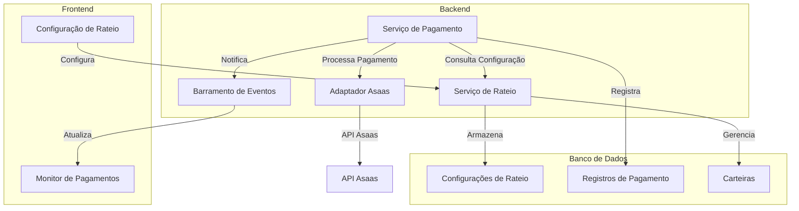
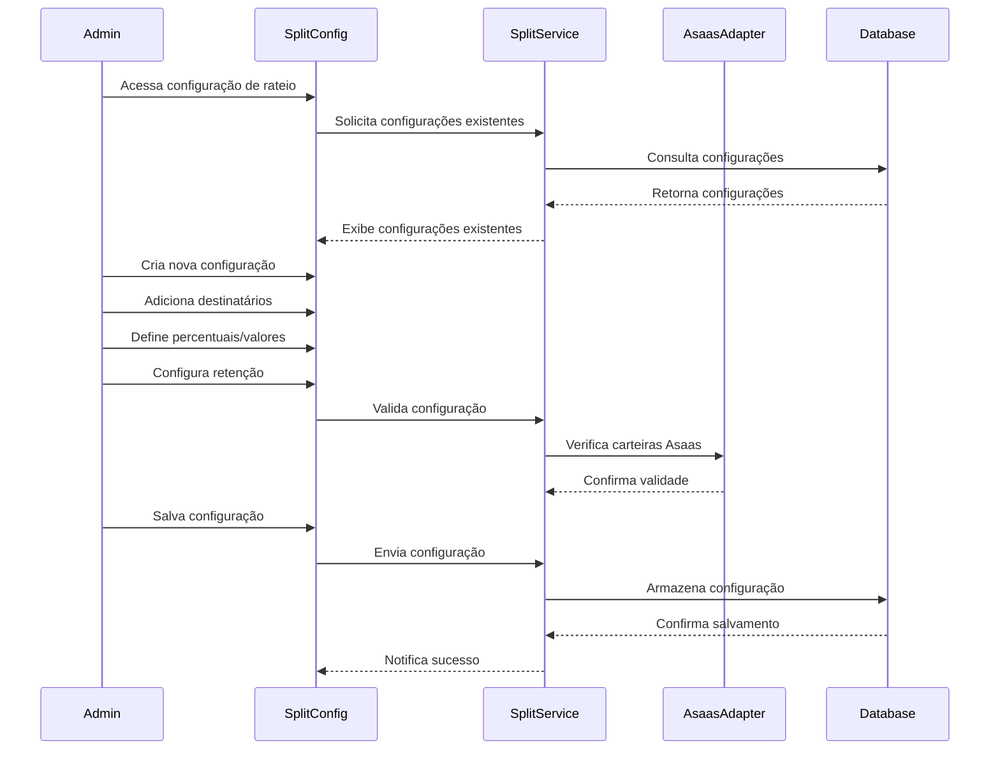
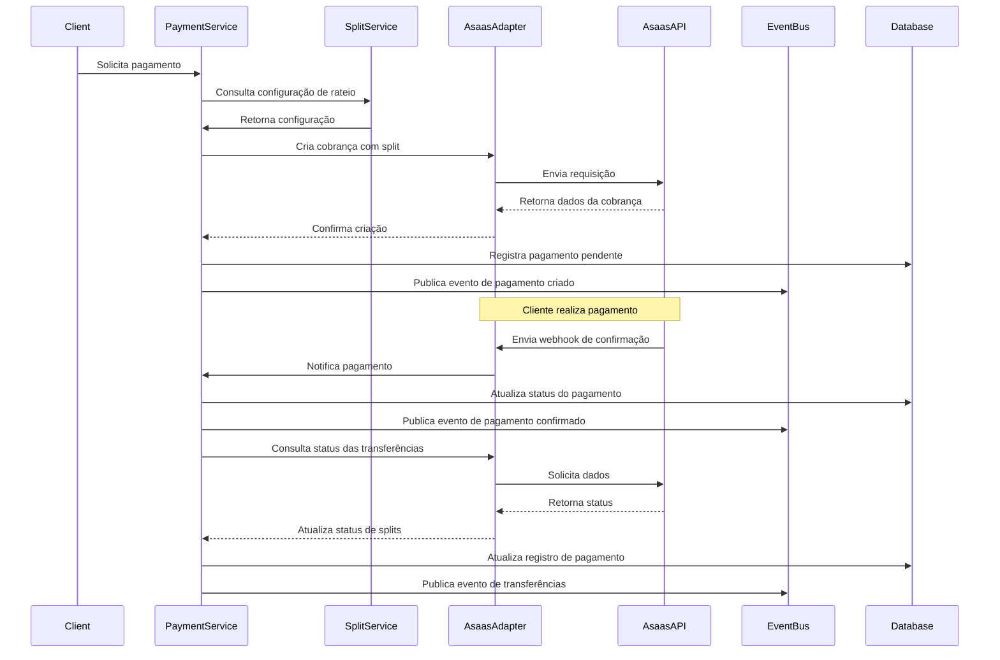
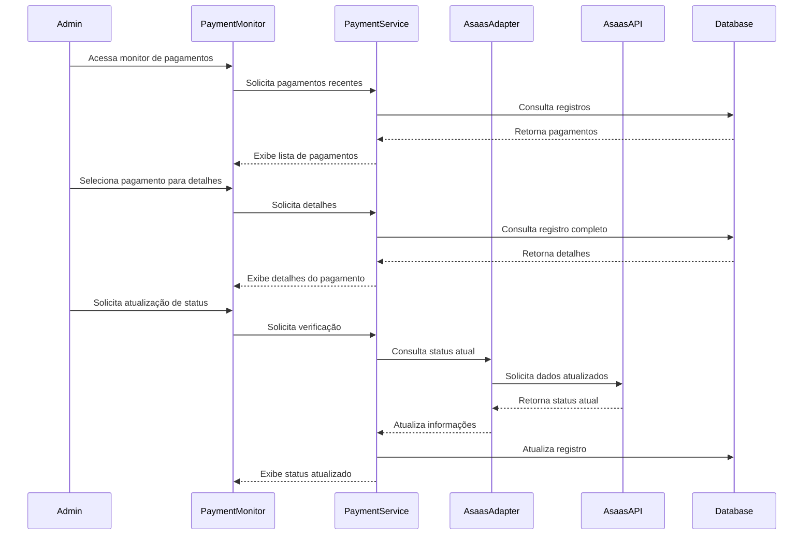

# Configuração de Rateio e Retenção de Pagamentos no Asaas

## 1. Visão Geral

Este documento detalha o design da integração aprimorada com o Asaas para suportar o rateio de pagamentos e a retenção parcial de valores. Esta funcionalidade permitirá que o sistema POS Modern distribua automaticamente os valores recebidos para contas específicas de clientes (restaurantes/lojas) e, opcionalmente, retenha uma porcentagem como taxa de serviço ou comissão.

## 2. Requisitos Funcionais

### 2.1. Configuração de Destinatários

- Cadastro de contas Asaas de destinatários (restaurantes/lojas)
- Definição de percentuais ou valores fixos para cada destinatário
- Configuração de regras de rateio por cliente/loja
- Suporte a múltiplos destinatários por transação
- Validação de contas de destinatários

### 2.2. Retenção de Valores

- Configuração de percentual ou valor fixo para retenção
- Definição de conta para recebimento dos valores retidos
- Regras de retenção personalizáveis por cliente/loja
- Cálculo automático de valores retidos

### 2.3. Processamento de Pagamentos

- Suporte a pagamentos via PIX, cartão de crédito e débito
- Criação automática de cobranças com split configurado
- Rastreamento de status de pagamentos divididos
- Reconciliação de valores recebidos e distribuídos

### 2.4. Relatórios e Monitoramento

- Visualização de histórico de pagamentos com rateio
- Relatórios de valores retidos por período
- Monitoramento de status de transferências para destinatários
- Alertas para falhas no processo de rateio

## 3. Integração com API Asaas

### 3.1. Recursos da API Utilizados

O Asaas oferece suporte nativo para split de pagamentos através dos seguintes endpoints:

- `POST /api/v3/payments` - Criação de cobranças com split
- `POST /api/v3/paymentLinks` - Criação de links de pagamento com split
- `GET /api/v3/payments/{id}` - Consulta de status de pagamentos
- `GET /api/v3/transfers` - Consulta de transferências realizadas

### 3.2. Modelo de Split do Asaas

O Asaas utiliza o conceito de "split" para dividir o valor de uma cobrança entre diferentes contas. A configuração de split é enviada no momento da criação da cobrança:

```json
{
  "customer": "cus_000005113026",
  "billingType": "PIX",
  "value": 100.00,
  "dueDate": "2025-05-30",
  "description": "Pedido #12345",
  "externalReference": "order_12345",
  "split": [
    {
      "walletId": "wlt_000005113026",
      "fixedValue": 70.00
    },
    {
      "walletId": "wlt_000005113027",
      "percentualValue": 20
    }
  ]
}
```

Neste exemplo, do valor total de R$ 100,00:
- R$ 70,00 serão transferidos para a wallet wlt_000005113026
- 20% (R$ 20,00) serão transferidos para a wallet wlt_000005113027
- O restante (R$ 10,00) permanece na conta principal do Asaas

## 4. Arquitetura

### 4.1. Componentes Principais



### 4.2. Modelo de Dados

#### Configuração de Rateio

```json
{
  "splitConfigId": "string",
  "clientId": "string",
  "storeId": "string",
  "name": "string",
  "description": "string",
  "isActive": "boolean",
  "createdAt": "datetime",
  "updatedAt": "datetime",
  "retentionConfig": {
    "type": "PERCENTAGE|FIXED",
    "value": "number",
    "walletId": "string",
    "description": "string"
  },
  "recipients": [
    {
      "recipientId": "string",
      "name": "string",
      "walletId": "string",
      "type": "PERCENTAGE|FIXED",
      "value": "number",
      "description": "string"
    }
  ],
  "validFrom": "datetime",
  "validUntil": "datetime"
}
```

#### Carteira

```json
{
  "walletId": "string",
  "asaasWalletId": "string",
  "clientId": "string",
  "storeId": "string",
  "name": "string",
  "description": "string",
  "isActive": "boolean",
  "createdAt": "datetime",
  "updatedAt": "datetime",
  "walletType": "MAIN|RECIPIENT|RETENTION",
  "bankInfo": {
    "bankCode": "string",
    "agencyNumber": "string",
    "accountNumber": "string",
    "accountType": "CHECKING|SAVINGS",
    "documentType": "CPF|CNPJ",
    "documentNumber": "string"
  }
}
```

#### Registro de Pagamento com Split

```json
{
  "paymentId": "string",
  "asaasPaymentId": "string",
  "orderId": "string",
  "clientId": "string",
  "storeId": "string",
  "value": "number",
  "netValue": "number",
  "status": "PENDING|RECEIVED|CONFIRMED|REFUNDED|FAILED",
  "paymentMethod": "PIX|CREDIT_CARD|DEBIT_CARD",
  "createdAt": "datetime",
  "updatedAt": "datetime",
  "splitConfigId": "string",
  "splits": [
    {
      "splitId": "string",
      "recipientId": "string",
      "walletId": "string",
      "type": "PERCENTAGE|FIXED",
      "value": "number",
      "calculatedValue": "number",
      "status": "PENDING|TRANSFERRED|FAILED",
      "transferId": "string",
      "transferredAt": "datetime"
    }
  ],
  "retention": {
    "type": "PERCENTAGE|FIXED",
    "value": "number",
    "calculatedValue": "number",
    "walletId": "string",
    "description": "string"
  }
}
```

## 5. Interface do Usuário

### 5.1. Configuração de Rateio

A interface de configuração de rateio permitirá aos administradores definir como os pagamentos serão divididos entre diferentes destinatários. A interface incluirá:

- Formulário para criação/edição de configurações de rateio
- Adição/remoção de destinatários
- Definição de percentuais ou valores fixos
- Configuração de retenção
- Validação de carteiras Asaas
- Visualização de configurações ativas


### 5.2. Monitor de Pagamentos

O monitor de pagamentos permitirá visualizar e gerenciar pagamentos com rateio. A interface incluirá:

- Lista de pagamentos recentes com status de rateio
- Detalhes de cada pagamento, incluindo valores distribuídos
- Filtros por status, período, cliente/loja
- Ações para resolver problemas de transferência
- Exportação de relatórios


## 6. Fluxos de Trabalho

### 6.1. Configuração de Rateio



### 6.2. Processamento de Pagamento com Rateio



### 6.3. Monitoramento e Reconciliação



## 7. Integração com Outros Módulos

### 7.1. Integração com Módulo de Pedidos

- Associação de configurações de rateio a pedidos
- Processamento automático de pagamentos com rateio
- Atualização de status de pedidos com base em pagamentos

### 7.2. Integração com Módulo de Clientes

- Associação de carteiras Asaas a clientes/lojas
- Configurações de rateio específicas por cliente
- Histórico de pagamentos e transferências por cliente

### 7.3. Integração com Módulo de Relatórios

- Geração de relatórios de pagamentos com rateio
- Análise de valores retidos e transferidos
- Reconciliação financeira

## 8. Considerações Técnicas

### 8.1. Segurança

- Armazenamento seguro de credenciais Asaas
- Validação de webhooks do Asaas
- Autorização baseada em funções para configurações de rateio
- Registro de auditoria para todas as operações financeiras

### 8.2. Tratamento de Erros

- Monitoramento de falhas em transferências
- Tentativas automáticas de reprocessamento
- Notificações para administradores em caso de falhas persistentes
- Logs detalhados para diagnóstico

### 8.3. Conciliação

- Verificação periódica de status de transferências
- Reconciliação automática de valores
- Detecção de discrepâncias entre valores esperados e transferidos
- Ferramentas para resolução manual de problemas

## 9. Implementação

### 9.1. Adaptador Asaas

O adaptador Asaas será estendido para suportar as operações de split:

```python
class AsaasAdapter:
    def __init__(self, api_key, environment="production"):
        self.api_key = api_key
        self.base_url = "https://api.asaas.com" if environment == "production" else "https://sandbox.asaas.com"
        self.session = aiohttp.ClientSession(headers={"access_token": api_key})
    
    async def create_payment_with_split(self, payment_data, split_config):
        """
        Cria um pagamento com configuração de split no Asaas
        
        Args:
            payment_data (dict): Dados do pagamento
            split_config (dict): Configuração de rateio
            
        Returns:
            dict: Dados do pagamento criado
        """
        # Preparar dados de split
        split = []
        
        # Adicionar destinatários
        for recipient in split_config["recipients"]:
            split_item = {
                "walletId": recipient["walletId"]
            }
            
            if recipient["type"] == "PERCENTAGE":
                split_item["percentualValue"] = recipient["value"]
            else:
                split_item["fixedValue"] = recipient["value"]
                
            split.append(split_item)
        
        # Adicionar dados de pagamento
        payment_data["split"] = split
        
        # Enviar requisição
        async with self.session.post(f"{self.base_url}/api/v3/payments", json=payment_data) as response:
            if response.status != 200:
                error_data = await response.json()
                raise AsaasError(f"Erro ao criar pagamento: {error_data}")
                
            return await response.json()
    
    async def get_transfer_status(self, payment_id):
        """
        Consulta o status das transferências de um pagamento
        
        Args:
            payment_id (str): ID do pagamento no Asaas
            
        Returns:
            list: Lista de transferências
        """
        async with self.session.get(f"{self.base_url}/api/v3/transfers?payment={payment_id}") as response:
            if response.status != 200:
                error_data = await response.json()
                raise AsaasError(f"Erro ao consultar transferências: {error_data}")
                
            return await response.json()
    
    async def validate_wallet(self, wallet_id):
        """
        Valida se uma carteira existe no Asaas
        
        Args:
            wallet_id (str): ID da carteira no Asaas
            
        Returns:
            bool: True se a carteira existe, False caso contrário
        """
        async with self.session.get(f"{self.base_url}/api/v3/wallets/{wallet_id}") as response:
            return response.status == 200
```

### 9.2. Serviço de Rateio

O serviço de rateio gerenciará as configurações de split:

```python
class SplitService:
    def __init__(self, db_connection, asaas_adapter):
        self.db = db_connection
        self.asaas_adapter = asaas_adapter
    
    async def create_split_config(self, config_data):
        """
        Cria uma nova configuração de rateio
        
        Args:
            config_data (dict): Dados da configuração
            
        Returns:
            dict: Configuração criada
        """
        # Validar carteiras
        for recipient in config_data["recipients"]:
            if not await self.asaas_adapter.validate_wallet(recipient["walletId"]):
                raise ValueError(f"Carteira inválida: {recipient['walletId']}")
        
        if "retentionConfig" in config_data and config_data["retentionConfig"]:
            if not await self.asaas_adapter.validate_wallet(config_data["retentionConfig"]["walletId"]):
                raise ValueError(f"Carteira de retenção inválida: {config_data['retentionConfig']['walletId']}")
        
        # Validar percentuais/valores
        total_percentage = 0
        for recipient in config_data["recipients"]:
            if recipient["type"] == "PERCENTAGE":
                total_percentage += recipient["value"]
        
        if "retentionConfig" in config_data and config_data["retentionConfig"]:
            if config_data["retentionConfig"]["type"] == "PERCENTAGE":
                total_percentage += config_data["retentionConfig"]["value"]
        
        if total_percentage > 100:
            raise ValueError("Total de percentuais excede 100%")
        
        # Gerar ID
        config_data["splitConfigId"] = str(uuid.uuid4())
        config_data["createdAt"] = datetime.utcnow().isoformat()
        config_data["updatedAt"] = config_data["createdAt"]
        
        # Salvar no banco
        await self.db.split_configs.insert_one(config_data)
        
        return config_data
    
    async def get_split_config(self, client_id, store_id=None):
        """
        Obtém a configuração de rateio ativa para um cliente/loja
        
        Args:
            client_id (str): ID do cliente
            store_id (str, optional): ID da loja
            
        Returns:
            dict: Configuração de rateio
        """
        query = {
            "clientId": client_id,
            "isActive": True
        }
        
        if store_id:
            query["storeId"] = store_id
        
        now = datetime.utcnow().isoformat()
        
        # Buscar configuração válida para a data atual
        config = await self.db.split_configs.find_one({
            **query,
            "$or": [
                {"validFrom": {"$lte": now}, "validUntil": {"$gte": now}},
                {"validFrom": {"$lte": now}, "validUntil": None},
                {"validFrom": None, "validUntil": {"$gte": now}},
                {"validFrom": None, "validUntil": None}
            ]
        }, sort=[("updatedAt", -1)])
        
        return config
    
    async def calculate_split_values(self, amount, split_config):
        """
        Calcula os valores de split com base na configuração
        
        Args:
            amount (float): Valor total
            split_config (dict): Configuração de rateio
            
        Returns:
            dict: Valores calculados
        """
        result = {
            "total": amount,
            "splits": [],
            "retention": None,
            "remaining": amount
        }
        
        # Calcular valores fixos primeiro
        for recipient in split_config["recipients"]:
            if recipient["type"] == "FIXED":
                split_value = recipient["value"]
                result["splits"].append({
                    "recipientId": recipient["recipientId"],
                    "walletId": recipient["walletId"],
                    "type": "FIXED",
                    "value": recipient["value"],
                    "calculatedValue": split_value
                })
                result["remaining"] -= split_value
        
        # Calcular retenção fixa
        if "retentionConfig" in split_config and split_config["retentionConfig"]:
            retention_config = split_config["retentionConfig"]
            if retention_config["type"] == "FIXED":
                retention_value = retention_config["value"]
                result["retention"] = {
                    "type": "FIXED",
                    "value": retention_config["value"],
                    "calculatedValue": retention_value,
                    "walletId": retention_config["walletId"],
                    "description": retention_config.get("description", "")
                }
                result["remaining"] -= retention_value
        
        # Calcular percentuais sobre o valor restante
        for recipient in split_config["recipients"]:
            if recipient["type"] == "PERCENTAGE":
                split_value = round(result["remaining"] * (recipient["value"] / 100), 2)
                result["splits"].append({
                    "recipientId": recipient["recipientId"],
                    "walletId": recipient["walletId"],
                    "type": "PERCENTAGE",
                    "value": recipient["value"],
                    "calculatedValue": split_value
                })
                result["remaining"] -= split_value
        
        # Calcular retenção percentual
        if "retentionConfig" in split_config and split_config["retentionConfig"]:
            retention_config = split_config["retentionConfig"]
            if retention_config["type"] == "PERCENTAGE":
                retention_value = round(result["remaining"] * (retention_config["value"] / 100), 2)
                result["retention"] = {
                    "type": "PERCENTAGE",
                    "value": retention_config["value"],
                    "calculatedValue": retention_value,
                    "walletId": retention_config["walletId"],
                    "description": retention_config.get("description", "")
                }
                result["remaining"] -= retention_value
        
        return result
```

### 9.3. Serviço de Pagamento

O serviço de pagamento será estendido para suportar pagamentos com rateio:

```python
class PaymentService:
    def __init__(self, db_connection, asaas_adapter, split_service, event_bus):
        self.db = db_connection
        self.asaas_adapter = asaas_adapter
        self.split_service = split_service
        self.event_bus = event_bus
    
    async def create_payment_with_split(self, payment_data, client_id, store_id=None):
        """
        Cria um pagamento com rateio
        
        Args:
            payment_data (dict): Dados do pagamento
            client_id (str): ID do cliente
            store_id (str, optional): ID da loja
            
        Returns:
            dict: Dados do pagamento criado
        """
        # Obter configuração de rateio
        split_config = await self.split_service.get_split_config(client_id, store_id)
        if not split_config:
            raise ValueError("Configuração de rateio não encontrada")
        
        # Calcular valores de split
        split_values = await self.split_service.calculate_split_values(payment_data["value"], split_config)
        
        # Criar pagamento no Asaas
        asaas_payment = await self.asaas_adapter.create_payment_with_split(payment_data, split_config)
        
        # Registrar pagamento no banco
        payment_record = {
            "paymentId": str(uuid.uuid4()),
            "asaasPaymentId": asaas_payment["id"],
            "orderId": payment_data.get("externalReference", ""),
            "clientId": client_id,
            "storeId": store_id,
            "value": payment_data["value"],
            "netValue": split_values["remaining"],
            "status": "PENDING",
            "paymentMethod": payment_data["billingType"],
            "createdAt": datetime.utcnow().isoformat(),
            "updatedAt": datetime.utcnow().isoformat(),
            "splitConfigId": split_config["splitConfigId"],
            "splits": []
        }
        
        # Adicionar informações de split
        for split in split_values["splits"]:
            payment_record["splits"].append({
                "splitId": str(uuid.uuid4()),
                "recipientId": split["recipientId"],
                "walletId": split["walletId"],
                "type": split["type"],
                "value": split["value"],
                "calculatedValue": split["calculatedValue"],
                "status": "PENDING"
            })
        
        # Adicionar informações de retenção
        if split_values["retention"]:
            payment_record["retention"] = split_values["retention"]
        
        # Salvar no banco
        await self.db.payment_records.insert_one(payment_record)
        
        # Publicar evento
        await self.event_bus.publish("payment.created", payment_record)
        
        return payment_record
    
    async def process_payment_webhook(self, webhook_data):
        """
        Processa webhook de pagamento do Asaas
        
        Args:
            webhook_data (dict): Dados do webhook
            
        Returns:
            dict: Registro de pagamento atualizado
        """
        payment_id = webhook_data["payment"]["id"]
        
        # Buscar registro de pagamento
        payment_record = await self.db.payment_records.find_one({"asaasPaymentId": payment_id})
        if not payment_record:
            raise ValueError(f"Pagamento não encontrado: {payment_id}")
        
        # Atualizar status
        payment_record["status"] = self._map_asaas_status(webhook_data["payment"]["status"])
        payment_record["updatedAt"] = datetime.utcnow().isoformat()
        
        # Se confirmado, verificar transferências
        if payment_record["status"] == "CONFIRMED":
            transfers = await self.asaas_adapter.get_transfer_status(payment_id)
            
            # Atualizar status de splits
            for transfer in transfers:
                for split in payment_record["splits"]:
                    if split["walletId"] == transfer["walletId"]:
                        split["status"] = self._map_transfer_status(transfer["status"])
                        split["transferId"] = transfer["id"]
                        if transfer["status"] == "DONE":
                            split["transferredAt"] = datetime.utcnow().isoformat()
        
        # Atualizar no banco
        await self.db.payment_records.replace_one({"paymentId": payment_record["paymentId"]}, payment_record)
        
        # Publicar evento
        await self.event_bus.publish("payment.updated", payment_record)
        
        return payment_record
    
    def _map_asaas_status(self, asaas_status):
        """Mapeia status do Asaas para status interno"""
        status_map = {
            "PENDING": "PENDING",
            "RECEIVED": "RECEIVED",
            "CONFIRMED": "CONFIRMED",
            "REFUNDED": "REFUNDED",
            "FAILED": "FAILED"
        }
        return status_map.get(asaas_status, "PENDING")
    
    def _map_transfer_status(self, transfer_status):
        """Mapeia status de transferência do Asaas para status interno"""
        status_map = {
            "PENDING": "PENDING",
            "DONE": "TRANSFERRED",
            "FAILED": "FAILED"
        }
        return status_map.get(transfer_status, "PENDING")
```

## 10. Plano de Implementação

### 10.1. Fase 1: Modelo de Dados e Adaptador

- Implementação do modelo de dados para configurações de rateio
- Extensão do adaptador Asaas para suportar operações de split
- Testes de integração com a API do Asaas

### 10.2. Fase 2: Serviços de Backend

- Implementação do serviço de rateio
- Extensão do serviço de pagamento
- Integração com barramento de eventos
- Testes unitários e de integração

### 10.3. Fase 3: Interface de Usuário

- Desenvolvimento da interface de configuração de rateio
- Implementação do monitor de pagamentos
- Testes de usabilidade

### 10.4. Fase 4: Integração e Testes

- Integração com outros módulos do sistema
- Testes end-to-end
- Validação com dados reais
- Documentação e treinamento

## 11. Conclusão

A implementação da configuração de rateio e retenção de pagamentos no Asaas permitirá que o sistema POS Modern distribua automaticamente os valores recebidos para as contas específicas dos clientes (restaurantes/lojas) e, opcionalmente, retenha uma porcentagem como taxa de serviço ou comissão. Esta funcionalidade é essencial para operações com múltiplos estabelecimentos e para modelos de negócio baseados em comissão.

A arquitetura proposta garante flexibilidade na configuração, rastreabilidade das transações e integração completa com o restante do sistema, proporcionando uma solução robusta para o gerenciamento financeiro dos pagamentos processados pela plataforma.
