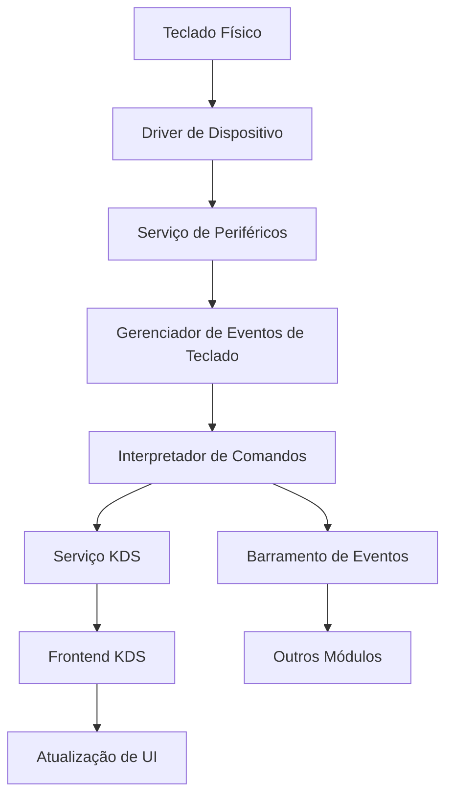
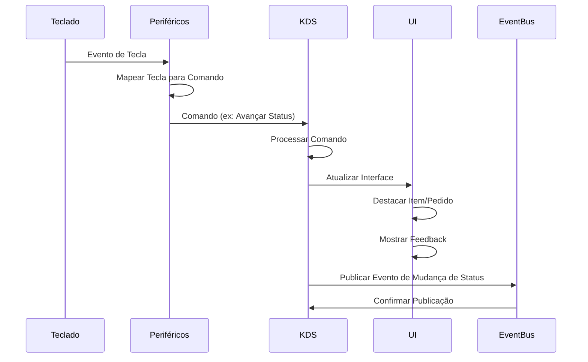

# Integração com Teclado Físico para Avanço de Status de Pedidos na Cozinha

## 1. Visão Geral

Este documento descreve o design e a implementação da integração com teclados físicos para permitir que a equipe da cozinha avance o status dos pedidos de forma rápida e eficiente. Esta funcionalidade é especialmente útil em ambientes de alta demanda, onde a interação com telas de toque pode ser impraticável devido a condições como mãos molhadas ou sujas.

## 2. Requisitos Funcionais

### 2.1. Funcionalidades Principais

- **Avanço de Status**: Permitir que a equipe da cozinha avance o status dos pedidos (ex: de "Pendente" para "Em Preparação", de "Em Preparação" para "Pronto") usando teclas físicas.
- **Seleção de Pedidos**: Permitir a navegação entre pedidos usando teclas de direção ou teclas específicas.
- **Seleção de Itens**: Permitir a navegação entre itens de um pedido usando teclas de direção ou teclas específicas.
- **Feedback Visual**: Fornecer feedback visual na tela do KDS para confirmar as ações realizadas via teclado.
- **Feedback Sonoro**: (Opcional) Fornecer feedback sonoro para confirmar as ações realizadas.
- **Configuração Flexível**: Permitir a configuração das teclas e ações associadas.
- **Suporte a Múltiplos Modelos**: Suportar diferentes modelos de teclados e dispositivos de entrada.

### 2.2. Requisitos Não-Funcionais

- **Responsividade**: O sistema deve responder imediatamente às entradas do teclado (latência < 100ms).
- **Robustez**: O sistema deve ser resistente a falhas e continuar funcionando mesmo em caso de problemas com o dispositivo de entrada.
- **Compatibilidade**: O sistema deve ser compatível com teclados USB padrão e dispositivos de entrada especializados.
- **Configurabilidade**: O sistema deve permitir a configuração das teclas e ações sem necessidade de alterações no código-fonte.

## 3. Arquitetura

### 3.1. Componentes Principais



1. **Driver de Dispositivo**: Componente de baixo nível que interage diretamente com o hardware do teclado.
2. **Serviço de Periféricos**: Gerencia a comunicação com periféricos, incluindo teclados.
3. **Gerenciador de Eventos de Teclado**: Captura e processa eventos de teclado.
4. **Interpretador de Comandos**: Converte eventos de teclado em comandos do sistema.
5. **Serviço KDS**: Processa comandos relacionados ao KDS e atualiza o estado dos pedidos.
6. **Frontend KDS**: Atualiza a interface do usuário com base nas mudanças de estado.
7. **Barramento de Eventos**: Distribui eventos para outros módulos do sistema.

### 3.2. Fluxo de Dados



### 3.3. Modelo de Dados

#### 3.3.1. Configuração de Teclado

```python
class KeyboardConfig(BaseModel):
    id: str
    name: str
    description: str
    device_type: str  # "standard_keyboard", "numeric_keypad", "custom_device"
    key_mappings: Dict[str, str]  # Mapeamento de teclas para comandos
    active: bool
    created_at: datetime
    updated_at: datetime
```

#### 3.3.2. Mapeamento de Teclas

```python
class KeyMapping(BaseModel):
    key_code: str  # Código da tecla (ex: "F1", "NUMPAD_1")
    command: str  # Comando associado (ex: "next_order", "advance_status")
    params: Optional[Dict[str, Any]]  # Parâmetros adicionais para o comando
```

#### 3.3.3. Comandos Disponíveis

```python
class CommandType(str, Enum):
    NEXT_ORDER = "next_order"
    PREVIOUS_ORDER = "previous_order"
    NEXT_ITEM = "next_item"
    PREVIOUS_ITEM = "previous_item"
    ADVANCE_STATUS = "advance_status"
    MARK_READY = "mark_ready"
    MARK_ALL_READY = "mark_all_ready"
    CANCEL_ITEM = "cancel_item"
    PRINT_ORDER = "print_order"
```

## 4. Implementação

### 4.1. Serviço de Periféricos (Extensão)

```python
# Adicionar ao serviço de periféricos existente

from typing import Dict, Any, Optional, List
import evdev
from evdev import InputDevice, categorize, ecodes
import threading
import logging
import json
import os
from datetime import datetime

from src.peripherals.models.peripheral_models import PeripheralType, PeripheralStatus
from src.peripherals.events.peripheral_events import PeripheralEventType
from src.core.events.event_bus import EventBus

logger = logging.getLogger(__name__)

class KeyboardManager:
    """Gerenciador de teclados físicos para o sistema POS."""
    
    def __init__(self, event_bus: EventBus, config_path: str):
        """
        Inicializa o gerenciador de teclados.
        
        Args:
            event_bus: Barramento de eventos do sistema
            config_path: Caminho para o arquivo de configuração
        """
        self.event_bus = event_bus
        self.config_path = config_path
        self.devices: Dict[str, InputDevice] = {}
        self.configs: Dict[str, Dict[str, Any]] = {}
        self.running = False
        self.threads: List[threading.Thread] = []
        
        # Carregar configurações
        self._load_configs()
    
    def _load_configs(self):
        """Carrega as configurações de teclado do arquivo."""
        try:
            if os.path.exists(self.config_path):
                with open(self.config_path, 'r') as f:
                    self.configs = json.load(f)
            else:
                logger.warning(f"Arquivo de configuração não encontrado: {self.config_path}")
                self.configs = {}
        except Exception as e:
            logger.error(f"Erro ao carregar configurações de teclado: {e}")
            self.configs = {}
    
    def _save_configs(self):
        """Salva as configurações de teclado no arquivo."""
        try:
            with open(self.config_path, 'w') as f:
                json.dump(self.configs, f, indent=2)
        except Exception as e:
            logger.error(f"Erro ao salvar configurações de teclado: {e}")
    
    def start(self):
        """Inicia o monitoramento de teclados."""
        if self.running:
            return
        
        self.running = True
        
        # Descobrir dispositivos disponíveis
        self._discover_devices()
        
        # Iniciar threads de monitoramento
        for device_id, device in self.devices.items():
            thread = threading.Thread(
                target=self._monitor_device,
                args=(device_id, device),
                daemon=True
            )
            thread.start()
            self.threads.append(thread)
        
        logger.info(f"Monitoramento de teclados iniciado. {len(self.devices)} dispositivos encontrados.")
    
    def stop(self):
        """Para o monitoramento de teclados."""
        self.running = False
        
        # Aguardar threads terminarem
        for thread in self.threads:
            thread.join(timeout=1.0)
        
        # Fechar dispositivos
        for device in self.devices.values():
            device.close()
        
        self.devices = {}
        self.threads = []
        
        logger.info("Monitoramento de teclados parado.")
    
    def _discover_devices(self):
        """Descobre dispositivos de teclado disponíveis."""
        try:
            devices = [evdev.InputDevice(path) for path in evdev.list_devices()]
            
            for device in devices:
                # Verificar se é um teclado
                if evdev.ecodes.EV_KEY in device.capabilities():
                    device_id = f"keyboard_{device.path.split('/')[-1]}"
                    self.devices[device_id] = device
                    
                    # Verificar se já existe configuração para este dispositivo
                    if device_id not in self.configs:
                        # Criar configuração padrão
                        self.configs[device_id] = {
                            "name": device.name,
                            "description": f"Teclado {device.name}",
                            "device_type": "standard_keyboard",
                            "key_mappings": self._get_default_key_mappings(),
                            "active": True,
                            "created_at": datetime.now().isoformat(),
                            "updated_at": datetime.now().isoformat()
                        }
                        
                        # Salvar configurações
                        self._save_configs()
        except Exception as e:
            logger.error(f"Erro ao descobrir dispositivos de teclado: {e}")
    
    def _get_default_key_mappings(self) -> Dict[str, str]:
        """Retorna o mapeamento padrão de teclas para comandos."""
        return {
            "KEY_F1": "next_order",
            "KEY_F2": "previous_order",
            "KEY_F3": "next_item",
            "KEY_F4": "previous_item",
            "KEY_F5": "advance_status",
            "KEY_F6": "mark_ready",
            "KEY_F7": "mark_all_ready",
            "KEY_F8": "cancel_item",
            "KEY_F9": "print_order",
            "KEY_1": "advance_status",
            "KEY_2": "mark_ready",
            "KEY_3": "mark_all_ready"
        }
    
    def _monitor_device(self, device_id: str, device: InputDevice):
        """
        Monitora eventos de um dispositivo de teclado.
        
        Args:
            device_id: ID do dispositivo
            device: Objeto do dispositivo
        """
        logger.info(f"Iniciando monitoramento do dispositivo: {device.name} ({device_id})")
        
        try:
            # Verificar se o dispositivo está ativo na configuração
            if not self.configs.get(device_id, {}).get("active", False):
                logger.info(f"Dispositivo {device_id} está inativo. Ignorando.")
                return
            
            # Obter mapeamento de teclas
            key_mappings = self.configs.get(device_id, {}).get("key_mappings", {})
            
            # Monitorar eventos
            for event in device.read_loop():
                if not self.running:
                    break
                
                if event.type == evdev.ecodes.EV_KEY:
                    key_event = categorize(event)
                    
                    # Processar apenas eventos de tecla pressionada
                    if key_event.keystate == key_event.key_down:
                        key_code = evdev.ecodes.KEY[key_event.keycode]
                        
                        # Verificar se a tecla está mapeada
                        if key_code in key_mappings:
                            command = key_mappings[key_code]
                            
                            # Processar comando
                            self._process_command(command, device_id)
        except Exception as e:
            logger.error(f"Erro ao monitorar dispositivo {device_id}: {e}")
            
            # Tentar reconectar
            self._reconnect_device(device_id)
    
    def _reconnect_device(self, device_id: str):
        """
        Tenta reconectar um dispositivo.
        
        Args:
            device_id: ID do dispositivo
        """
        try:
            # Fechar dispositivo
            if device_id in self.devices:
                self.devices[device_id].close()
                del self.devices[device_id]
            
            # Redescobrir dispositivos
            self._discover_devices()
            
            # Reiniciar monitoramento se o dispositivo foi encontrado
            if device_id in self.devices:
                thread = threading.Thread(
                    target=self._monitor_device,
                    args=(device_id, self.devices[device_id]),
                    daemon=True
                )
                thread.start()
                self.threads.append(thread)
                
                logger.info(f"Dispositivo {device_id} reconectado com sucesso.")
            else:
                logger.warning(f"Não foi possível reconectar o dispositivo {device_id}.")
        except Exception as e:
            logger.error(f"Erro ao reconectar dispositivo {device_id}: {e}")
    
    def _process_command(self, command: str, device_id: str):
        """
        Processa um comando de teclado.
        
        Args:
            command: Comando a ser processado
            device_id: ID do dispositivo que gerou o comando
        """
        logger.debug(f"Processando comando: {command} do dispositivo {device_id}")
        
        try:
            # Publicar evento no barramento
            self.event_bus.publish(
                event_type=PeripheralEventType.KEYBOARD_COMMAND,
                payload={
                    "command": command,
                    "device_id": device_id,
                    "timestamp": datetime.now().isoformat()
                }
            )
            
            logger.debug(f"Comando {command} publicado com sucesso.")
        except Exception as e:
            logger.error(f"Erro ao processar comando {command}: {e}")
    
    def get_devices(self) -> List[Dict[str, Any]]:
        """
        Retorna a lista de dispositivos disponíveis.
        
        Returns:
            List: Lista de dispositivos
        """
        devices = []
        
        for device_id, config in self.configs.items():
            device_info = {
                "id": device_id,
                "name": config.get("name", ""),
                "description": config.get("description", ""),
                "device_type": config.get("device_type", ""),
                "active": config.get("active", False),
                "connected": device_id in self.devices
            }
            
            devices.append(device_info)
        
        return devices
    
    def get_device_config(self, device_id: str) -> Optional[Dict[str, Any]]:
        """
        Retorna a configuração de um dispositivo.
        
        Args:
            device_id: ID do dispositivo
            
        Returns:
            Dict: Configuração do dispositivo ou None se não encontrado
        """
        return self.configs.get(device_id)
    
    def update_device_config(self, device_id: str, config: Dict[str, Any]) -> bool:
        """
        Atualiza a configuração de um dispositivo.
        
        Args:
            device_id: ID do dispositivo
            config: Nova configuração
            
        Returns:
            bool: True se a atualização foi bem-sucedida
        """
        try:
            # Verificar se o dispositivo existe
            if device_id not in self.configs:
                logger.warning(f"Dispositivo {device_id} não encontrado.")
                return False
            
            # Atualizar configuração
            self.configs[device_id].update(config)
            self.configs[device_id]["updated_at"] = datetime.now().isoformat()
            
            # Salvar configurações
            self._save_configs()
            
            return True
        except Exception as e:
            logger.error(f"Erro ao atualizar configuração do dispositivo {device_id}: {e}")
            return False
```

### 4.2. Integração com o Serviço KDS

```python
# Adicionar ao serviço KDS existente

from typing import Dict, Any, List, Optional
from datetime import datetime
import logging

from src.kds.models.kds_models import OrderStatus, ItemStatus
from src.core.events.event_bus import EventBus, EventType
from src.peripherals.events.peripheral_events import PeripheralEventType

logger = logging.getLogger(__name__)

class KdsKeyboardHandler:
    """Manipulador de comandos de teclado para o KDS."""
    
    def __init__(self, kds_service, event_bus: EventBus):
        """
        Inicializa o manipulador de comandos de teclado.
        
        Args:
            kds_service: Serviço KDS
            event_bus: Barramento de eventos
        """
        self.kds_service = kds_service
        self.event_bus = event_bus
        self.current_order_index = 0
        self.current_item_index = 0
        
        # Registrar manipulador de eventos
        self.event_bus.subscribe(
            event_type=PeripheralEventType.KEYBOARD_COMMAND,
            handler=self._handle_keyboard_command
        )
    
    async def _handle_keyboard_command(self, event_type: str, payload: Dict[str, Any]):
        """
        Manipula eventos de comando de teclado.
        
        Args:
            event_type: Tipo do evento
            payload: Dados do evento
        """
        try:
            command = payload.get("command")
            
            if not command:
                return
            
            # Obter pedidos ativos
            active_orders = await self.kds_service.get_active_orders()
            
            if not active_orders:
                logger.debug("Nenhum pedido ativo para processar comando de teclado.")
                return
            
            # Processar comando
            if command == "next_order":
                await self._handle_next_order(active_orders)
            elif command == "previous_order":
                await self._handle_previous_order(active_orders)
            elif command == "next_item":
                await self._handle_next_item(active_orders)
            elif command == "previous_item":
                await self._handle_previous_item(active_orders)
            elif command == "advance_status":
                await self._handle_advance_status(active_orders)
            elif command == "mark_ready":
                await self._handle_mark_ready(active_orders)
            elif command == "mark_all_ready":
                await self._handle_mark_all_ready(active_orders)
            elif command == "cancel_item":
                await self._handle_cancel_item(active_orders)
            elif command == "print_order":
                await self._handle_print_order(active_orders)
            else:
                logger.warning(f"Comando de teclado desconhecido: {command}")
        except Exception as e:
            logger.error(f"Erro ao processar comando de teclado: {e}")
    
    async def _handle_next_order(self, active_orders: List[Dict[str, Any]]):
        """
        Manipula o comando para avançar para o próximo pedido.
        
        Args:
            active_orders: Lista de pedidos ativos
        """
        if not active_orders:
            return
        
        # Avançar para o próximo pedido
        self.current_order_index = (self.current_order_index + 1) % len(active_orders)
        self.current_item_index = 0
        
        # Publicar evento de seleção de pedido
        await self._publish_selection_event(active_orders)
    
    async def _handle_previous_order(self, active_orders: List[Dict[str, Any]]):
        """
        Manipula o comando para voltar para o pedido anterior.
        
        Args:
            active_orders: Lista de pedidos ativos
        """
        if not active_orders:
            return
        
        # Voltar para o pedido anterior
        self.current_order_index = (self.current_order_index - 1) % len(active_orders)
        self.current_item_index = 0
        
        # Publicar evento de seleção de pedido
        await self._publish_selection_event(active_orders)
    
    async def _handle_next_item(self, active_orders: List[Dict[str, Any]]):
        """
        Manipula o comando para avançar para o próximo item.
        
        Args:
            active_orders: Lista de pedidos ativos
        """
        if not active_orders or self.current_order_index >= len(active_orders):
            return
        
        current_order = active_orders[self.current_order_index]
        items = current_order.get("items", [])
        
        if not items:
            return
        
        # Avançar para o próximo item
        self.current_item_index = (self.current_item_index + 1) % len(items)
        
        # Publicar evento de seleção de item
        await self._publish_selection_event(active_orders)
    
    async def _handle_previous_item(self, active_orders: List[Dict[str, Any]]):
        """
        Manipula o comando para voltar para o item anterior.
        
        Args:
            active_orders: Lista de pedidos ativos
        """
        if not active_orders or self.current_order_index >= len(active_orders):
            return
        
        current_order = active_orders[self.current_order_index]
        items = current_order.get("items", [])
        
        if not items:
            return
        
        # Voltar para o item anterior
        self.current_item_index = (self.current_item_index - 1) % len(items)
        
        # Publicar evento de seleção de item
        await self._publish_selection_event(active_orders)
    
    async def _handle_advance_status(self, active_orders: List[Dict[str, Any]]):
        """
        Manipula o comando para avançar o status do item atual.
        
        Args:
            active_orders: Lista de pedidos ativos
        """
        if not active_orders or self.current_order_index >= len(active_orders):
            return
        
        current_order = active_orders[self.current_order_index]
        items = current_order.get("items", [])
        
        if not items or self.current_item_index >= len(items):
            return
        
        current_item = items[self.current_item_index]
        item_id = current_item.get("id")
        
        if not item_id:
            return
        
        # Avançar status do item
        await self.kds_service.advance_item_status(item_id)
        
        # Publicar evento de atualização
        await self._publish_update_event(active_orders)
    
    async def _handle_mark_ready(self, active_orders: List[Dict[str, Any]]):
        """
        Manipula o comando para marcar o item atual como pronto.
        
        Args:
            active_orders: Lista de pedidos ativos
        """
        if not active_orders or self.current_order_index >= len(active_orders):
            return
        
        current_order = active_orders[self.current_order_index]
        items = current_order.get("items", [])
        
        if not items or self.current_item_index >= len(items):
            return
        
        current_item = items[self.current_item_index]
        item_id = current_item.get("id")
        
        if not item_id:
            return
        
        # Marcar item como pronto
        await self.kds_service.mark_item_ready(item_id)
        
        # Publicar evento de atualização
        await self._publish_update_event(active_orders)
    
    async def _handle_mark_all_ready(self, active_orders: List[Dict[str, Any]]):
        """
        Manipula o comando para marcar todos os itens do pedido atual como prontos.
        
        Args:
            active_orders: Lista de pedidos ativos
        """
        if not active_orders or self.current_order_index >= len(active_orders):
            return
        
        current_order = active_orders[self.current_order_index]
        order_id = current_order.get("id")
        
        if not order_id:
            return
        
        # Marcar todos os itens como prontos
        await self.kds_service.mark_order_ready(order_id)
        
        # Publicar evento de atualização
        await self._publish_update_event(active_orders)
    
    async def _handle_cancel_item(self, active_orders: List[Dict[str, Any]]):
        """
        Manipula o comando para cancelar o item atual.
        
        Args:
            active_orders: Lista de pedidos ativos
        """
        if not active_orders or self.current_order_index >= len(active_orders):
            return
        
        current_order = active_orders[self.current_order_index]
        items = current_order.get("items", [])
        
        if not items or self.current_item_index >= len(items):
            return
        
        current_item = items[self.current_item_index]
        item_id = current_item.get("id")
        
        if not item_id:
            return
        
        # Cancelar item
        await self.kds_service.cancel_item(item_id, "Cancelado via teclado")
        
        # Publicar evento de atualização
        await self._publish_update_event(active_orders)
    
    async def _handle_print_order(self, active_orders: List[Dict[str, Any]]):
        """
        Manipula o comando para imprimir o pedido atual.
        
        Args:
            active_orders: Lista de pedidos ativos
        """
        if not active_orders or self.current_order_index >= len(active_orders):
            return
        
        current_order = active_orders[self.current_order_index]
        order_id = current_order.get("id")
        
        if not order_id:
            return
        
        # Imprimir pedido
        await self.kds_service.print_order(order_id)
    
    async def _publish_selection_event(self, active_orders: List[Dict[str, Any]]):
        """
        Publica um evento de seleção de pedido/item.
        
        Args:
            active_orders: Lista de pedidos ativos
        """
        if not active_orders or self.current_order_index >= len(active_orders):
            return
        
        current_order = active_orders[self.current_order_index]
        order_id = current_order.get("id")
        
        if not order_id:
            return
        
        items = current_order.get("items", [])
        item_id = None
        
        if items and self.current_item_index < len(items):
            item_id = items[self.current_item_index].get("id")
        
        # Publicar evento
        await self.event_bus.publish(
            event_type=EventType.KDS_SELECTION_CHANGED,
            payload={
                "order_id": order_id,
                "item_id": item_id,
                "timestamp": datetime.now().isoformat()
            }
        )
    
    async def _publish_update_event(self, active_orders: List[Dict[str, Any]]):
        """
        Publica um evento de atualização de pedido/item.
        
        Args:
            active_orders: Lista de pedidos ativos
        """
        if not active_orders or self.current_order_index >= len(active_orders):
            return
        
        current_order = active_orders[self.current_order_index]
        order_id = current_order.get("id")
        
        if not order_id:
            return
        
        # Publicar evento
        await self.event_bus.publish(
            event_type=EventType.KDS_ORDER_UPDATED,
            payload={
                "order_id": order_id,
                "timestamp": datetime.now().isoformat()
            }
        )
```

### 4.3. Integração com o Frontend KDS

```javascript
// Adicionar ao frontend KDS existente

import React, { useEffect, useState } from 'react';
import { useSelector, useDispatch } from 'react-redux';

// Componente para destacar o item/pedido selecionado via teclado
const KeyboardHighlight = ({ orderId, itemId }) => {
  const dispatch = useDispatch();
  const selectedOrder = useSelector(state => state.kds.selectedOrder);
  const selectedItem = useSelector(state => state.kds.selectedItem);
  
  useEffect(() => {
    // Atualizar seleção quando receber evento de teclado
    if (orderId) {
      dispatch({ type: 'SET_SELECTED_ORDER', payload: orderId });
    }
    
    if (itemId) {
      dispatch({ type: 'SET_SELECTED_ITEM', payload: itemId });
    }
  }, [orderId, itemId, dispatch]);
  
  return null; // Componente não renderiza nada, apenas gerencia o estado
};

// Hook para lidar com eventos de teclado
const useKeyboardEvents = () => {
  const dispatch = useDispatch();
  const orders = useSelector(state => state.kds.orders);
  const selectedOrder = useSelector(state => state.kds.selectedOrder);
  const selectedItem = useSelector(state => state.kds.selectedItem);
  
  useEffect(() => {
    // Função para lidar com eventos de teclado
    const handleKeyDown = (event) => {
      // Verificar se há pedidos
      if (!orders || orders.length === 0) {
        return;
      }
      
      // Encontrar índice do pedido selecionado
      const orderIndex = orders.findIndex(order => order.id === selectedOrder);
      const currentOrder = orderIndex >= 0 ? orders[orderIndex] : orders[0];
      
      // Encontrar índice do item selecionado
      const items = currentOrder.items || [];
      const itemIndex = items.findIndex(item => item.id === selectedItem);
      
      // Processar tecla
      switch (event.key) {
        case 'ArrowRight':
          // Próximo pedido
          const nextOrderIndex = (orderIndex + 1) % orders.length;
          dispatch({ type: 'SET_SELECTED_ORDER', payload: orders[nextOrderIndex].id });
          dispatch({ type: 'SET_SELECTED_ITEM', payload: null });
          break;
          
        case 'ArrowLeft':
          // Pedido anterior
          const prevOrderIndex = (orderIndex - 1 + orders.length) % orders.length;
          dispatch({ type: 'SET_SELECTED_ORDER', payload: orders[prevOrderIndex].id });
          dispatch({ type: 'SET_SELECTED_ITEM', payload: null });
          break;
          
        case 'ArrowDown':
          // Próximo item
          if (items.length > 0) {
            const nextItemIndex = itemIndex >= 0 ? (itemIndex + 1) % items.length : 0;
            dispatch({ type: 'SET_SELECTED_ITEM', payload: items[nextItemIndex].id });
          }
          break;
          
        case 'ArrowUp':
          // Item anterior
          if (items.length > 0) {
            const prevItemIndex = itemIndex >= 0 ? (itemIndex - 1 + items.length) % items.length : items.length - 1;
            dispatch({ type: 'SET_SELECTED_ITEM', payload: items[prevItemIndex].id });
          }
          break;
          
        case 'Enter':
          // Avançar status do item selecionado
          if (selectedItem) {
            dispatch({ type: 'ADVANCE_ITEM_STATUS', payload: selectedItem });
          }
          break;
          
        case ' ':
          // Marcar item como pronto
          if (selectedItem) {
            dispatch({ type: 'MARK_ITEM_READY', payload: selectedItem });
          }
          break;
          
        default:
          // Outras teclas
          break;
      }
    };
    
    // Adicionar listener de teclado
    window.addEventListener('keydown', handleKeyDown);
    
    // Remover listener ao desmontar
    return () => {
      window.removeEventListener('keydown', handleKeyDown);
    };
  }, [dispatch, orders, selectedOrder, selectedItem]);
  
  return null;
};

// Componente para destacar visualmente o item/pedido selecionado
const HighlightedItem = ({ item, isSelected }) => {
  return (
    <div className={`kds-item ${isSelected ? 'kds-item-selected' : ''}`}>
      {/* Conteúdo do item */}
      <div className="kds-item-name">{item.name}</div>
      <div className="kds-item-quantity">x{item.quantity}</div>
      <div className="kds-item-status">{item.status}</div>
      
      {/* Indicador visual de seleção */}
      {isSelected && (
        <div className="kds-item-selection-indicator">
          <span className="kds-item-selection-icon">▶</span>
        </div>
      )}
    </div>
  );
};

// Componente para destacar visualmente o pedido selecionado
const HighlightedOrder = ({ order, isSelected, selectedItemId }) => {
  return (
    <div className={`kds-order ${isSelected ? 'kds-order-selected' : ''}`}>
      {/* Cabeçalho do pedido */}
      <div className="kds-order-header">
        <div className="kds-order-number">#{order.orderNumber}</div>
        <div className="kds-order-time">{formatTime(order.createdAt)}</div>
        <div className="kds-order-status">{order.status}</div>
        
        {/* Indicador visual de seleção */}
        {isSelected && (
          <div className="kds-order-selection-indicator">
            <span className="kds-order-selection-icon">▶</span>
          </div>
        )}
      </div>
      
      {/* Itens do pedido */}
      <div className="kds-order-items">
        {order.items.map(item => (
          <HighlightedItem
            key={item.id}
            item={item}
            isSelected={item.id === selectedItemId}
          />
        ))}
      </div>
    </div>
  );
};

// Componente principal do KDS com suporte a teclado
const KdsScreen = () => {
  const dispatch = useDispatch();
  const orders = useSelector(state => state.kds.orders);
  const selectedOrder = useSelector(state => state.kds.selectedOrder);
  const selectedItem = useSelector(state => state.kds.selectedItem);
  const [keyboardEvents, setKeyboardEvents] = useState([]);
  
  // Usar hook de eventos de teclado
  useKeyboardEvents();
  
  // Efeito para carregar pedidos
  useEffect(() => {
    dispatch({ type: 'FETCH_ORDERS' });
    
    // Configurar polling para atualizar pedidos
    const interval = setInterval(() => {
      dispatch({ type: 'FETCH_ORDERS' });
    }, 10000);
    
    return () => clearInterval(interval);
  }, [dispatch]);
  
  // Efeito para escutar eventos de seleção via WebSocket
  useEffect(() => {
    const socket = new WebSocket('ws://localhost:8000/ws/kds');
    
    socket.onmessage = (event) => {
      const data = JSON.parse(event.data);
      
      if (data.type === 'KDS_SELECTION_CHANGED') {
        if (data.payload.order_id) {
          dispatch({ type: 'SET_SELECTED_ORDER', payload: data.payload.order_id });
        }
        
        if (data.payload.item_id) {
          dispatch({ type: 'SET_SELECTED_ITEM', payload: data.payload.item_id });
        }
        
        // Adicionar evento à lista para feedback visual
        setKeyboardEvents(prev => [...prev, {
          id: Date.now(),
          type: 'selection',
          timestamp: new Date()
        }]);
      } else if (data.type === 'KDS_ORDER_UPDATED') {
        // Atualizar pedidos
        dispatch({ type: 'FETCH_ORDERS' });
        
        // Adicionar evento à lista para feedback visual
        setKeyboardEvents(prev => [...prev, {
          id: Date.now(),
          type: 'update',
          timestamp: new Date()
        }]);
      }
    };
    
    return () => {
      socket.close();
    };
  }, [dispatch]);
  
  // Remover eventos antigos após 2 segundos
  useEffect(() => {
    const timer = setTimeout(() => {
      setKeyboardEvents(prev => prev.filter(event => {
        return Date.now() - event.timestamp.getTime() < 2000;
      }));
    }, 2000);
    
    return () => clearTimeout(timer);
  }, [keyboardEvents]);
  
  return (
    <div className="kds-screen">
      {/* Feedback visual para eventos de teclado */}
      {keyboardEvents.length > 0 && (
        <div className="kds-keyboard-feedback">
          {keyboardEvents.map(event => (
            <div key={event.id} className={`kds-keyboard-event kds-keyboard-event-${event.type}`}>
              {event.type === 'selection' ? 'Seleção alterada' : 'Pedido atualizado'}
            </div>
          ))}
        </div>
      )}
      
      {/* Lista de pedidos */}
      <div className="kds-orders-grid">
        {orders.map(order => (
          <HighlightedOrder
            key={order.id}
            order={order}
            isSelected={order.id === selectedOrder}
            selectedItemId={selectedItem}
          />
        ))}
      </div>
      
      {/* Legenda de teclas */}
      <div className="kds-keyboard-legend">
        <div className="kds-keyboard-legend-item">
          <span className="kds-keyboard-key">←→</span>
          <span className="kds-keyboard-description">Navegar entre pedidos</span>
        </div>
        <div className="kds-keyboard-legend-item">
          <span className="kds-keyboard-key">↑↓</span>
          <span className="kds-keyboard-description">Navegar entre itens</span>
        </div>
        <div className="kds-keyboard-legend-item">
          <span className="kds-keyboard-key">Enter</span>
          <span className="kds-keyboard-description">Avançar status</span>
        </div>
        <div className="kds-keyboard-legend-item">
          <span className="kds-keyboard-key">Espaço</span>
          <span className="kds-keyboard-description">Marcar como pronto</span>
        </div>
      </div>
    </div>
  );
};

export default KdsScreen;
```

### 4.4. Estilos CSS para Feedback Visual

```css
/* Estilos para destacar itens e pedidos selecionados */
.kds-item-selected {
  border: 2px solid #ffcc00;
  background-color: rgba(255, 204, 0, 0.1);
  box-shadow: 0 0 10px rgba(255, 204, 0, 0.5);
}

.kds-order-selected {
  border: 2px solid #ffcc00;
  background-color: rgba(255, 204, 0, 0.1);
  box-shadow: 0 0 10px rgba(255, 204, 0, 0.5);
}

.kds-item-selection-indicator {
  position: absolute;
  left: -15px;
  top: 50%;
  transform: translateY(-50%);
  color: #ffcc00;
  font-size: 20px;
  animation: pulse 1s infinite;
}

.kds-order-selection-indicator {
  position: absolute;
  left: -15px;
  top: 15px;
  color: #ffcc00;
  font-size: 20px;
  animation: pulse 1s infinite;
}

/* Animação de pulso para indicadores de seleção */
@keyframes pulse {
  0% { opacity: 0.5; }
  50% { opacity: 1; }
  100% { opacity: 0.5; }
}

/* Feedback visual para eventos de teclado */
.kds-keyboard-feedback {
  position: fixed;
  top: 20px;
  right: 20px;
  z-index: 1000;
}

.kds-keyboard-event {
  padding: 10px 15px;
  margin-bottom: 10px;
  border-radius: 5px;
  color: white;
  font-weight: bold;
  animation: fadeOut 2s forwards;
}

.kds-keyboard-event-selection {
  background-color: #3498db;
}

.kds-keyboard-event-update {
  background-color: #2ecc71;
}

@keyframes fadeOut {
  0% { opacity: 1; }
  70% { opacity: 1; }
  100% { opacity: 0; }
}

/* Legenda de teclas */
.kds-keyboard-legend {
  position: fixed;
  bottom: 0;
  left: 0;
  right: 0;
  background-color: rgba(0, 0, 0, 0.8);
  color: white;
  display: flex;
  justify-content: center;
  padding: 10px;
}

.kds-keyboard-legend-item {
  margin: 0 15px;
  display: flex;
  align-items: center;
}

.kds-keyboard-key {
  background-color: #333;
  border: 1px solid #555;
  border-radius: 3px;
  padding: 3px 8px;
  margin-right: 5px;
  font-family: monospace;
}

.kds-keyboard-description {
  font-size: 14px;
}
```

### 4.5. Configuração do Teclado

```json
// Exemplo de arquivo de configuração de teclado (keyboard_config.json)
{
  "keyboard_event0": {
    "name": "Teclado Principal",
    "description": "Teclado principal da cozinha",
    "device_type": "standard_keyboard",
    "key_mappings": {
      "KEY_F1": "next_order",
      "KEY_F2": "previous_order",
      "KEY_F3": "next_item",
      "KEY_F4": "previous_item",
      "KEY_F5": "advance_status",
      "KEY_F6": "mark_ready",
      "KEY_F7": "mark_all_ready",
      "KEY_F8": "cancel_item",
      "KEY_F9": "print_order",
      "KEY_1": "advance_status",
      "KEY_2": "mark_ready",
      "KEY_3": "mark_all_ready"
    },
    "active": true,
    "created_at": "2025-05-24T12:00:00.000Z",
    "updated_at": "2025-05-24T12:00:00.000Z"
  },
  "keyboard_numpad0": {
    "name": "Teclado Numérico",
    "description": "Teclado numérico da cozinha",
    "device_type": "numeric_keypad",
    "key_mappings": {
      "KEY_KP1": "advance_status",
      "KEY_KP2": "mark_ready",
      "KEY_KP3": "mark_all_ready",
      "KEY_KP4": "next_order",
      "KEY_KP5": "previous_order",
      "KEY_KP6": "next_item",
      "KEY_KP7": "previous_item",
      "KEY_KP8": "cancel_item",
      "KEY_KP9": "print_order"
    },
    "active": true,
    "created_at": "2025-05-24T12:00:00.000Z",
    "updated_at": "2025-05-24T12:00:00.000Z"
  }
}
```

## 5. Interface de Administração

### 5.1. Configuração de Teclados

```javascript
import React, { useState, useEffect } from 'react';
import {
  Box,
  Button,
  Card,
  CardContent,
  CardHeader,
  Checkbox,
  Divider,
  FormControl,
  FormControlLabel,
  Grid,
  IconButton,
  InputLabel,
  MenuItem,
  Paper,
  Select,
  Table,
  TableBody,
  TableCell,
  TableContainer,
  TableHead,
  TableRow,
  TextField,
  Typography
} from '@mui/material';
import {
  Add as AddIcon,
  Delete as DeleteIcon,
  Refresh as RefreshIcon,
  Save as SaveIcon
} from '@mui/icons-material';
import { useDispatch, useSelector } from 'react-redux';

const KeyboardConfigPage = () => {
  const dispatch = useDispatch();
  const devices = useSelector(state => state.peripherals.keyboards);
  const [selectedDevice, setSelectedDevice] = useState(null);
  const [keyMappings, setKeyMappings] = useState({});
  const [isActive, setIsActive] = useState(true);
  
  // Carregar dispositivos
  useEffect(() => {
    dispatch({ type: 'FETCH_KEYBOARD_DEVICES' });
  }, [dispatch]);
  
  // Carregar configuração do dispositivo selecionado
  useEffect(() => {
    if (selectedDevice) {
      dispatch({ type: 'FETCH_KEYBOARD_CONFIG', payload: selectedDevice });
    }
  }, [dispatch, selectedDevice]);
  
  // Atualizar estado local quando a configuração for carregada
  useEffect(() => {
    if (selectedDevice && devices) {
      const device = devices.find(d => d.id === selectedDevice);
      
      if (device && device.config) {
        setKeyMappings(device.config.key_mappings || {});
        setIsActive(device.config.active || false);
      }
    }
  }, [devices, selectedDevice]);
  
  // Manipular seleção de dispositivo
  const handleDeviceChange = (event) => {
    setSelectedDevice(event.target.value);
  };
  
  // Manipular alteração de mapeamento de tecla
  const handleMappingChange = (keyCode, command) => {
    setKeyMappings(prev => ({
      ...prev,
      [keyCode]: command
    }));
  };
  
  // Manipular alteração de status ativo
  const handleActiveChange = (event) => {
    setIsActive(event.target.checked);
  };
  
  // Salvar configuração
  const handleSave = () => {
    if (selectedDevice) {
      dispatch({
        type: 'UPDATE_KEYBOARD_CONFIG',
        payload: {
          deviceId: selectedDevice,
          config: {
            key_mappings: keyMappings,
            active: isActive
          }
        }
      });
    }
  };
  
  // Adicionar novo mapeamento
  const handleAddMapping = () => {
    setKeyMappings(prev => ({
      ...prev,
      [`KEY_NEW_${Object.keys(prev).length}`]: "next_order"
    }));
  };
  
  // Remover mapeamento
  const handleRemoveMapping = (keyCode) => {
    setKeyMappings(prev => {
      const newMappings = { ...prev };
      delete newMappings[keyCode];
      return newMappings;
    });
  };
  
  // Atualizar lista de dispositivos
  const handleRefresh = () => {
    dispatch({ type: 'FETCH_KEYBOARD_DEVICES' });
  };
  
  // Lista de comandos disponíveis
  const availableCommands = [
    { value: "next_order", label: "Próximo Pedido" },
    { value: "previous_order", label: "Pedido Anterior" },
    { value: "next_item", label: "Próximo Item" },
    { value: "previous_item", label: "Item Anterior" },
    { value: "advance_status", label: "Avançar Status" },
    { value: "mark_ready", label: "Marcar como Pronto" },
    { value: "mark_all_ready", label: "Marcar Todos como Prontos" },
    { value: "cancel_item", label: "Cancelar Item" },
    { value: "print_order", label: "Imprimir Pedido" }
  ];
  
  return (
    <Box sx={{ p: 3 }}>
      <Typography variant="h4" gutterBottom>
        Configuração de Teclados
      </Typography>
      
      <Grid container spacing={3}>
        {/* Seleção de Dispositivo */}
        <Grid item xs={12}>
          <Paper sx={{ p: 2 }}>
            <Box sx={{ display: 'flex', alignItems: 'center' }}>
              <FormControl fullWidth>
                <InputLabel>Dispositivo</InputLabel>
                <Select
                  value={selectedDevice || ''}
                  onChange={handleDeviceChange}
                  label="Dispositivo"
                >
                  {devices.map(device => (
                    <MenuItem key={device.id} value={device.id}>
                      {device.name} ({device.connected ? 'Conectado' : 'Desconectado'})
                    </MenuItem>
                  ))}
                </Select>
              </FormControl>
              
              <IconButton onClick={handleRefresh} sx={{ ml: 2 }}>
                <RefreshIcon />
              </IconButton>
            </Box>
          </Paper>
        </Grid>
        
        {/* Configuração do Dispositivo */}
        {selectedDevice && (
          <>
            <Grid item xs={12}>
              <Card>
                <CardHeader
                  title="Configuração do Dispositivo"
                  action={
                    <FormControlLabel
                      control={
                        <Checkbox
                          checked={isActive}
                          onChange={handleActiveChange}
                        />
                      }
                      label="Ativo"
                    />
                  }
                />
                <Divider />
                <CardContent>
                  <Box sx={{ mb: 2 }}>
                    <Typography variant="h6" gutterBottom>
                      Mapeamento de Teclas
                    </Typography>
                    
                    <Button
                      variant="outlined"
                      startIcon={<AddIcon />}
                      onClick={handleAddMapping}
                      sx={{ mb: 2 }}
                    >
                      Adicionar Mapeamento
                    </Button>
                    
                    <TableContainer>
                      <Table>
                        <TableHead>
                          <TableRow>
                            <TableCell>Tecla</TableCell>
                            <TableCell>Comando</TableCell>
                            <TableCell>Ações</TableCell>
                          </TableRow>
                        </TableHead>
                        <TableBody>
                          {Object.entries(keyMappings).map(([keyCode, command]) => (
                            <TableRow key={keyCode}>
                              <TableCell>
                                <TextField
                                  value={keyCode}
                                  disabled
                                  fullWidth
                                />
                              </TableCell>
                              <TableCell>
                                <Select
                                  value={command}
                                  onChange={(e) => handleMappingChange(keyCode, e.target.value)}
                                  fullWidth
                                >
                                  {availableCommands.map(cmd => (
                                    <MenuItem key={cmd.value} value={cmd.value}>
                                      {cmd.label}
                                    </MenuItem>
                                  ))}
                                </Select>
                              </TableCell>
                              <TableCell>
                                <IconButton
                                  color="error"
                                  onClick={() => handleRemoveMapping(keyCode)}
                                >
                                  <DeleteIcon />
                                </IconButton>
                              </TableCell>
                            </TableRow>
                          ))}
                        </TableBody>
                      </Table>
                    </TableContainer>
                  </Box>
                </CardContent>
              </Card>
            </Grid>
            
            <Grid item xs={12}>
              <Box sx={{ display: 'flex', justifyContent: 'flex-end' }}>
                <Button
                  variant="contained"
                  color="primary"
                  startIcon={<SaveIcon />}
                  onClick={handleSave}
                >
                  Salvar Configuração
                </Button>
              </Box>
            </Grid>
          </>
        )}
      </Grid>
    </Box>
  );
};

export default KeyboardConfigPage;
```

## 6. Considerações de Implementação

### 6.1. Dependências

- **evdev**: Biblioteca Python para interação com dispositivos de entrada no Linux.
- **threading**: Módulo Python para gerenciamento de threads.
- **aiohttp**: Biblioteca Python para requisições HTTP assíncronas.
- **fastapi**: Framework Python para APIs.
- **react-redux**: Biblioteca JavaScript para gerenciamento de estado no frontend.
- **material-ui**: Biblioteca de componentes React para a interface de usuário.

### 6.2. Instalação de Dependências

```bash
# Instalar dependências Python
pip install evdev aiohttp fastapi uvicorn

# Instalar dependências JavaScript (no diretório do frontend)
npm install @mui/material @mui/icons-material @emotion/react @emotion/styled react-redux
```

### 6.3. Permissões de Acesso

Para acessar dispositivos de entrada no Linux, o usuário que executa o serviço precisa ter permissões adequadas. Isso pode ser configurado de duas maneiras:

1. **Adicionar o usuário ao grupo `input`**:
   ```bash
   sudo usermod -a -G input <username>
   ```

2. **Configurar regras udev**:
   ```bash
   # Criar arquivo de regras
   sudo nano /etc/udev/rules.d/99-input.rules
   
   # Adicionar a seguinte linha
   KERNEL=="event*", SUBSYSTEM=="input", MODE="0660", GROUP="input"
   
   # Recarregar regras
   sudo udevadm control --reload-rules
   sudo udevadm trigger
   ```

## 7. Testes

### 7.1. Testes Unitários

```python
import unittest
from unittest.mock import MagicMock, patch
import json
import os
import tempfile

from src.peripherals.services.peripheral_service import KeyboardManager
from src.core.events.event_bus import EventBus

class TestKeyboardManager(unittest.TestCase):
    """Testes para o gerenciador de teclados."""
    
    def setUp(self):
        """Configuração dos testes."""
        # Criar arquivo de configuração temporário
        self.temp_file = tempfile.NamedTemporaryFile(delete=False)
        self.temp_file.write(json.dumps({
            "keyboard_test": {
                "name": "Teclado de Teste",
                "description": "Teclado para testes",
                "device_type": "standard_keyboard",
                "key_mappings": {
                    "KEY_F1": "next_order",
                    "KEY_F2": "previous_order"
                },
                "active": True,
                "created_at": "2025-05-24T12:00:00.000Z",
                "updated_at": "2025-05-24T12:00:00.000Z"
            }
        }).encode())
        self.temp_file.close()
        
        # Criar mock do barramento de eventos
        self.event_bus = MagicMock(spec=EventBus)
        
        # Criar gerenciador de teclados
        self.keyboard_manager = KeyboardManager(
            event_bus=self.event_bus,
            config_path=self.temp_file.name
        )
    
    def tearDown(self):
        """Limpeza após os testes."""
        os.unlink(self.temp_file.name)
    
    def test_load_configs(self):
        """Testa o carregamento de configurações."""
        # Verificar se as configurações foram carregadas
        self.assertIn("keyboard_test", self.keyboard_manager.configs)
        self.assertEqual(
            self.keyboard_manager.configs["keyboard_test"]["name"],
            "Teclado de Teste"
        )
    
    def test_get_default_key_mappings(self):
        """Testa o mapeamento padrão de teclas."""
        # Obter mapeamento padrão
        mappings = self.keyboard_manager._get_default_key_mappings()
        
        # Verificar mapeamentos
        self.assertIn("KEY_F1", mappings)
        self.assertEqual(mappings["KEY_F1"], "next_order")
        self.assertIn("KEY_F5", mappings)
        self.assertEqual(mappings["KEY_F5"], "advance_status")
    
    @patch("evdev.InputDevice")
    @patch("evdev.list_devices")
    def test_discover_devices(self, mock_list_devices, mock_input_device):
        """Testa a descoberta de dispositivos."""
        # Configurar mocks
        mock_list_devices.return_value = ["/dev/input/event0"]
        
        mock_device = MagicMock()
        mock_device.path = "/dev/input/event0"
        mock_device.name = "Test Keyboard"
        mock_device.capabilities.return_value = {1: []}  # EV_KEY
        
        mock_input_device.return_value = mock_device
        
        # Executar descoberta
        self.keyboard_manager._discover_devices()
        
        # Verificar se o dispositivo foi descoberto
        self.assertIn("keyboard_event0", self.keyboard_manager.devices)
        
        # Verificar se a configuração foi criada
        self.assertIn("keyboard_event0", self.keyboard_manager.configs)
        self.assertEqual(
            self.keyboard_manager.configs["keyboard_event0"]["name"],
            "Test Keyboard"
        )
    
    def test_process_command(self):
        """Testa o processamento de comandos."""
        # Processar comando
        self.keyboard_manager._process_command("next_order", "keyboard_test")
        
        # Verificar se o evento foi publicado
        self.event_bus.publish.assert_called_once()
        args, kwargs = self.event_bus.publish.call_args
        self.assertEqual(kwargs["event_type"], "PERIPHERAL_KEYBOARD_COMMAND")
        self.assertEqual(kwargs["payload"]["command"], "next_order")
        self.assertEqual(kwargs["payload"]["device_id"], "keyboard_test")
    
    def test_get_devices(self):
        """Testa a obtenção da lista de dispositivos."""
        # Adicionar dispositivo
        self.keyboard_manager.devices["keyboard_test"] = MagicMock()
        
        # Obter dispositivos
        devices = self.keyboard_manager.get_devices()
        
        # Verificar resultado
        self.assertEqual(len(devices), 1)
        self.assertEqual(devices[0]["id"], "keyboard_test")
        self.assertEqual(devices[0]["name"], "Teclado de Teste")
        self.assertTrue(devices[0]["connected"])
    
    def test_update_device_config(self):
        """Testa a atualização da configuração de um dispositivo."""
        # Atualizar configuração
        result = self.keyboard_manager.update_device_config(
            "keyboard_test",
            {
                "name": "Novo Nome",
                "key_mappings": {
                    "KEY_F1": "mark_ready"
                }
            }
        )
        
        # Verificar resultado
        self.assertTrue(result)
        self.assertEqual(
            self.keyboard_manager.configs["keyboard_test"]["name"],
            "Novo Nome"
        )
        self.assertEqual(
            self.keyboard_manager.configs["keyboard_test"]["key_mappings"]["KEY_F1"],
            "mark_ready"
        )

class TestKdsKeyboardHandler(unittest.IsolatedAsyncioTestCase):
    """Testes para o manipulador de comandos de teclado do KDS."""
    
    async def asyncSetUp(self):
        """Configuração dos testes."""
        # Criar mock do serviço KDS
        self.kds_service = MagicMock()
        self.kds_service.get_active_orders = MagicMock(return_value=[
            {
                "id": "order1",
                "items": [
                    {"id": "item1", "name": "Item 1"},
                    {"id": "item2", "name": "Item 2"}
                ]
            },
            {
                "id": "order2",
                "items": [
                    {"id": "item3", "name": "Item 3"}
                ]
            }
        ])
        
        # Criar mock do barramento de eventos
        self.event_bus = MagicMock(spec=EventBus)
        
        # Criar manipulador
        from src.kds.services.kds_service import KdsKeyboardHandler
        self.handler = KdsKeyboardHandler(
            kds_service=self.kds_service,
            event_bus=self.event_bus
        )
    
    async def test_handle_next_order(self):
        """Testa o comando para avançar para o próximo pedido."""
        # Configurar estado inicial
        self.handler.current_order_index = 0
        self.handler.current_item_index = 0
        
        # Executar comando
        await self.handler._handle_next_order(await self.kds_service.get_active_orders())
        
        # Verificar resultado
        self.assertEqual(self.handler.current_order_index, 1)
        self.assertEqual(self.handler.current_item_index, 0)
        
        # Verificar publicação de evento
        self.event_bus.publish.assert_called_once()
        args, kwargs = self.event_bus.publish.call_args
        self.assertEqual(kwargs["event_type"], "KDS_SELECTION_CHANGED")
        self.assertEqual(kwargs["payload"]["order_id"], "order2")
        self.assertEqual(kwargs["payload"]["item_id"], "item3")
    
    async def test_handle_advance_status(self):
        """Testa o comando para avançar o status do item atual."""
        # Configurar estado inicial
        self.handler.current_order_index = 0
        self.handler.current_item_index = 1
        
        # Executar comando
        await self.handler._handle_advance_status(await self.kds_service.get_active_orders())
        
        # Verificar chamada ao serviço
        self.kds_service.advance_item_status.assert_called_once_with("item2")
        
        # Verificar publicação de evento
        self.event_bus.publish.assert_called_once()
        args, kwargs = self.event_bus.publish.call_args
        self.assertEqual(kwargs["event_type"], "KDS_ORDER_UPDATED")
        self.assertEqual(kwargs["payload"]["order_id"], "order1")
```

### 7.2. Testes de Integração

```python
import unittest
from unittest.mock import MagicMock, patch
import asyncio
import json
import os
import tempfile

from src.peripherals.services.peripheral_service import KeyboardManager
from src.kds.services.kds_service import KdsKeyboardHandler
from src.core.events.event_bus import EventBus

class TestKeyboardIntegration(unittest.IsolatedAsyncioTestCase):
    """Testes de integração para o sistema de teclado."""
    
    async def asyncSetUp(self):
        """Configuração dos testes."""
        # Criar arquivo de configuração temporário
        self.temp_file = tempfile.NamedTemporaryFile(delete=False)
        self.temp_file.write(json.dumps({
            "keyboard_test": {
                "name": "Teclado de Teste",
                "description": "Teclado para testes",
                "device_type": "standard_keyboard",
                "key_mappings": {
                    "KEY_F1": "next_order",
                    "KEY_F2": "previous_order",
                    "KEY_F5": "advance_status",
                    "KEY_F6": "mark_ready"
                },
                "active": True,
                "created_at": "2025-05-24T12:00:00.000Z",
                "updated_at": "2025-05-24T12:00:00.000Z"
            }
        }).encode())
        self.temp_file.close()
        
        # Criar barramento de eventos real
        self.event_bus = EventBus()
        
        # Criar mock do serviço KDS
        self.kds_service = MagicMock()
        self.kds_service.get_active_orders = MagicMock(return_value=[
            {
                "id": "order1",
                "items": [
                    {"id": "item1", "name": "Item 1"},
                    {"id": "item2", "name": "Item 2"}
                ]
            },
            {
                "id": "order2",
                "items": [
                    {"id": "item3", "name": "Item 3"}
                ]
            }
        ])
        
        # Criar gerenciador de teclados
        self.keyboard_manager = KeyboardManager(
            event_bus=self.event_bus,
            config_path=self.temp_file.name
        )
        
        # Criar manipulador de teclado do KDS
        from src.kds.services.kds_service import KdsKeyboardHandler
        self.kds_handler = KdsKeyboardHandler(
            kds_service=self.kds_service,
            event_bus=self.event_bus
        )
    
    async def asyncTearDown(self):
        """Limpeza após os testes."""
        os.unlink(self.temp_file.name)
    
    async def test_keyboard_to_kds_integration(self):
        """Testa a integração entre o gerenciador de teclados e o manipulador do KDS."""
        # Simular evento de teclado
        self.keyboard_manager._process_command("advance_status", "keyboard_test")
        
        # Aguardar processamento assíncrono
        await asyncio.sleep(0.1)
        
        # Verificar chamada ao serviço KDS
        self.kds_service.advance_item_status.assert_called_once()
    
    async def test_keyboard_to_kds_navigation(self):
        """Testa a navegação entre pedidos e itens via teclado."""
        # Simular evento de teclado para próximo pedido
        self.keyboard_manager._process_command("next_order", "keyboard_test")
        
        # Aguardar processamento assíncrono
        await asyncio.sleep(0.1)
        
        # Verificar índice do pedido atual
        self.assertEqual(self.kds_handler.current_order_index, 1)
        
        # Simular evento de teclado para pedido anterior
        self.keyboard_manager._process_command("previous_order", "keyboard_test")
        
        # Aguardar processamento assíncrono
        await asyncio.sleep(0.1)
        
        # Verificar índice do pedido atual
        self.assertEqual(self.kds_handler.current_order_index, 0)
```

## 8. Considerações de Segurança

### 8.1. Acesso a Dispositivos

- Limitar o acesso aos dispositivos de entrada apenas aos usuários autorizados.
- Utilizar regras udev para controlar permissões de dispositivos.
- Validar todos os eventos de entrada antes de processá-los.

### 8.2. Validação de Comandos

- Validar todos os comandos recebidos do teclado antes de executá-los.
- Implementar limites de taxa para evitar sobrecarga do sistema.
- Registrar todos os comandos em logs para auditoria.

### 8.3. Proteção contra Falhas

- Implementar mecanismos de recuperação para falhas de dispositivos.
- Utilizar timeouts para operações que podem bloquear.
- Implementar circuit breakers para evitar cascata de falhas.

## 9. Conclusão

A integração com teclados físicos para avanço de status de pedidos na cozinha proporcionará uma experiência mais eficiente e prática para a equipe da cozinha, especialmente em ambientes de alta demanda. A solução proposta é flexível, configurável e se integra perfeitamente com a arquitetura modular do sistema POS Modern.

A implementação suporta múltiplos modelos de teclados e dispositivos de entrada, permitindo que cada restaurante configure a solução de acordo com suas necessidades específicas. O feedback visual e sonoro garante que a equipe da cozinha tenha uma experiência de usuário clara e intuitiva.

A arquitetura modular permite que a solução seja facilmente estendida no futuro para suportar novos tipos de dispositivos de entrada ou novas funcionalidades.
