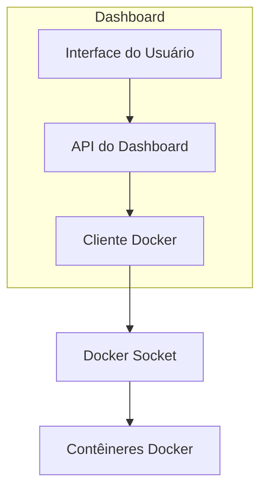

# Integração com PostgreSQL e Docker Compose

## 1. Visão Geral

Este documento detalha o design da integração do sistema POS Modern com o banco de dados PostgreSQL e a configuração do ambiente utilizando Docker Compose. A solução proposta permitirá a execução de todos os módulos do sistema em contêineres Docker, com persistência de dados no PostgreSQL, facilitando a implantação, escalabilidade e manutenção do sistema.

## 2. Requisitos Funcionais

### 2.1. Integração com PostgreSQL

- Migração do modelo de dados atual para PostgreSQL
- Suporte a transações ACID para garantir integridade dos dados
- Otimização de consultas para alto desempenho
- Backup e recuperação de dados
- Suporte a múltiplos esquemas para isolamento de dados por cliente

### 2.2. Containerização com Docker

- Containerização de todos os módulos do sistema
- Configuração de rede para comunicação entre contêineres
- Persistência de dados em volumes Docker
- Configuração de variáveis de ambiente para diferentes ambientes
- Suporte a escalabilidade horizontal

### 2.3. Orquestração com Docker Compose

- Definição de serviços para todos os módulos
- Configuração de dependências entre serviços
- Gestão de recursos (CPU, memória)
- Reinicialização automática em caso de falha
- Logs centralizados

### 2.4. Monitoramento e Gestão

- Visualização de serviços em execução
- Monitoramento de saúde dos contêineres
- Visualização de logs em tempo real
- Interface para iniciar/parar serviços
- Métricas de utilização de recursos

## 3. Arquitetura

### 3.1. Visão Geral da Arquitetura

```mermaid
graph TD
    subgraph "Docker Compose"
        subgraph "Frontend"
            POS[POS Frontend]
            KDS[KDS Frontend]
            Waiter[Waiter Frontend]
            Kiosk[Kiosk Frontend]
            Admin[Admin Frontend]
        end
        
        subgraph "Backend"
            APIGateway[API Gateway]
            OrderService[Order Service]
            ProductService[Product Service]
            CustomerService[Customer Service]
            PaymentService[Payment Service]
            StockService[Stock Service]
            RemoteOrderService[Remote Order Service]
            KDSService[KDS Service]
            WaiterService[Waiter Service]
            KioskService[Kiosk Service]
            PeripheralService[Peripheral Service]
            FiscalService[Fiscal Service]
            SATService[SAT Service]
        end
        
        subgraph "Messaging"
            EventBus[Event Bus - RabbitMQ]
        end
        
        subgraph "Database"
            PostgreSQL[PostgreSQL]
        end
        
        subgraph "Monitoring"
            Dashboard[Service Dashboard]
        end
    end
    
    POS --> APIGateway
    KDS --> APIGateway
    Waiter --> APIGateway
    Kiosk --> APIGateway
    Admin --> APIGateway
    
    APIGateway --> OrderService
    APIGateway --> ProductService
    APIGateway --> CustomerService
    APIGateway --> PaymentService
    APIGateway --> StockService
    APIGateway --> RemoteOrderService
    APIGateway --> KDSService
    APIGateway --> WaiterService
    APIGateway --> KioskService
    APIGateway --> PeripheralService
    APIGateway --> FiscalService
    APIGateway --> SATService
    
    OrderService --> EventBus
    ProductService --> EventBus
    CustomerService --> EventBus
    PaymentService --> EventBus
    StockService --> EventBus
    RemoteOrderService --> EventBus
    KDSService --> EventBus
    WaiterService --> EventBus
    KioskService --> EventBus
    PeripheralService --> EventBus
    FiscalService --> EventBus
    SATService --> EventBus
    
    OrderService --> PostgreSQL
    ProductService --> PostgreSQL
    CustomerService --> PostgreSQL
    PaymentService --> PostgreSQL
    StockService --> PostgreSQL
    RemoteOrderService --> PostgreSQL
    KDSService --> PostgreSQL
    WaiterService --> PostgreSQL
    KioskService --> PostgreSQL
    PeripheralService --> PostgreSQL
    FiscalService --> PostgreSQL
    SATService --> PostgreSQL
    
    Dashboard --> Docker[Docker API]
```



### 3.2. Modelo de Dados PostgreSQL

O modelo de dados atual será migrado para o PostgreSQL, mantendo a estrutura existente, mas aproveitando os recursos específicos do PostgreSQL:

- Uso de tipos JSON/JSONB para dados flexíveis
- Índices apropriados para consultas frequentes
- Chaves estrangeiras para garantir integridade referencial
- Esquemas para isolamento de dados por cliente
- Funções e triggers para lógica de negócio no banco de dados

#### Exemplo de Esquema para Módulo de Pedidos:

```sql
CREATE SCHEMA IF NOT EXISTS pos_modern;

CREATE TABLE pos_modern.orders (
    order_id UUID PRIMARY KEY,
    client_id VARCHAR(50) NOT NULL,
    store_id VARCHAR(50) NOT NULL,
    order_number VARCHAR(20) NOT NULL,
    status VARCHAR(20) NOT NULL,
    customer_id UUID,
    waiter_id UUID,
    table_id UUID,
    created_at TIMESTAMP WITH TIME ZONE NOT NULL DEFAULT NOW(),
    updated_at TIMESTAMP WITH TIME ZONE NOT NULL DEFAULT NOW(),
    subtotal DECIMAL(10, 2) NOT NULL,
    tax DECIMAL(10, 2) NOT NULL,
    discount DECIMAL(10, 2) NOT NULL,
    total DECIMAL(10, 2) NOT NULL,
    payment_status VARCHAR(20) NOT NULL,
    notes TEXT,
    metadata JSONB
);

CREATE INDEX idx_orders_client_store ON pos_modern.orders(client_id, store_id);
CREATE INDEX idx_orders_status ON pos_modern.orders(status);
CREATE INDEX idx_orders_created_at ON pos_modern.orders(created_at);

CREATE TABLE pos_modern.order_items (
    item_id UUID PRIMARY KEY,
    order_id UUID NOT NULL REFERENCES pos_modern.orders(order_id) ON DELETE CASCADE,
    product_id UUID NOT NULL,
    quantity DECIMAL(10, 3) NOT NULL,
    unit_price DECIMAL(10, 2) NOT NULL,
    subtotal DECIMAL(10, 2) NOT NULL,
    status VARCHAR(20) NOT NULL,
    notes TEXT,
    customizations JSONB,
    created_at TIMESTAMP WITH TIME ZONE NOT NULL DEFAULT NOW(),
    updated_at TIMESTAMP WITH TIME ZONE NOT NULL DEFAULT NOW()
);

CREATE INDEX idx_order_items_order_id ON pos_modern.order_items(order_id);
```

### 3.3. Estrutura de Contêineres

```mermaid
graph TD
    subgraph "Frontend Containers"
        POS_Container[POS Frontend]
        KDS_Container[KDS Frontend]
        Waiter_Container[Waiter Frontend]
        Kiosk_Container[Kiosk Frontend]
        Admin_Container[Admin Frontend]
    end
    
    subgraph "Backend Containers"
        API_Container[API Gateway]
        Order_Container[Order Service]
        Product_Container[Product Service]
        Customer_Container[Customer Service]
        Payment_Container[Payment Service]
        Stock_Container[Stock Service]
        RemoteOrder_Container[Remote Order Service]
        KDS_Service_Container[KDS Service]
        Waiter_Service_Container[Waiter Service]
        Kiosk_Service_Container[Kiosk Service]
        Peripheral_Container[Peripheral Service]
        Fiscal_Container[Fiscal Service]
        SAT_Container[SAT Service]
    end
    
    subgraph "Infrastructure Containers"
        RabbitMQ_Container[RabbitMQ]
        PostgreSQL_Container[PostgreSQL]
        Redis_Container[Redis]
        Dashboard_Container[Service Dashboard]
    end
    
    POS_Container --> API_Container
    KDS_Container --> API_Container
    Waiter_Container --> API_Container
    Kiosk_Container --> API_Container
    Admin_Container --> API_Container
    
    API_Container --> Order_Container
    API_Container --> Product_Container
    API_Container --> Customer_Container
    API_Container --> Payment_Container
    API_Container --> Stock_Container
    API_Container --> RemoteOrder_Container
    API_Container --> KDS_Service_Container
    API_Container --> Waiter_Service_Container
    API_Container --> Kiosk_Service_Container
    API_Container --> Peripheral_Container
    API_Container --> Fiscal_Container
    API_Container --> SAT_Container
    
    Order_Container --> RabbitMQ_Container
    Product_Container --> RabbitMQ_Container
    Customer_Container --> RabbitMQ_Container
    Payment_Container --> RabbitMQ_Container
    Stock_Container --> RabbitMQ_Container
    RemoteOrder_Container --> RabbitMQ_Container
    KDS_Service_Container --> RabbitMQ_Container
    Waiter_Service_Container --> RabbitMQ_Container
    Kiosk_Service_Container --> RabbitMQ_Container
    Peripheral_Container --> RabbitMQ_Container
    Fiscal_Container --> RabbitMQ_Container
    SAT_Container --> RabbitMQ_Container
    
    Order_Container --> PostgreSQL_Container
    Product_Container --> PostgreSQL_Container
    Customer_Container --> PostgreSQL_Container
    Payment_Container --> PostgreSQL_Container
    Stock_Container --> PostgreSQL_Container
    RemoteOrder_Container --> PostgreSQL_Container
    KDS_Service_Container --> PostgreSQL_Container
    Waiter_Service_Container --> PostgreSQL_Container
    Kiosk_Service_Container --> PostgreSQL_Container
    Peripheral_Container --> PostgreSQL_Container
    Fiscal_Container --> PostgreSQL_Container
    SAT_Container --> PostgreSQL_Container
    
    Order_Container --> Redis_Container
    Product_Container --> Redis_Container
    Customer_Container --> Redis_Container
    Payment_Container --> Redis_Container
    
    Dashboard_Container --> Docker_Socket[Docker Socket]
```



## 4. Configuração do Docker Compose

### 4.1. Estrutura de Diretórios

```
pos-modern/
├── docker/
│   ├── docker-compose.yml
│   ├── docker-compose.dev.yml
│   ├── docker-compose.prod.yml
│   ├── .env
│   ├── .env.dev
│   ├── .env.prod
│   └── scripts/
│       ├── init-db.sh
│       ├── backup-db.sh
│       └── restore-db.sh
├── services/
│   ├── api-gateway/
│   │   └── Dockerfile
│   ├── order-service/
│   │   └── Dockerfile
│   ├── product-service/
│   │   └── Dockerfile
│   └── ...
├── frontend/
│   ├── pos/
│   │   └── Dockerfile
│   ├── kds/
│   │   └── Dockerfile
│   └── ...
└── dashboard/
    └── Dockerfile
```

### 4.2. Docker Compose Principal

```yaml
# docker-compose.yml
version: '3.8'

services:
  # Banco de Dados
  postgres:
    image: postgres:14
    container_name: pos_postgres
    restart: always
    environment:
      POSTGRES_USER: ${POSTGRES_USER}
      POSTGRES_PASSWORD: ${POSTGRES_PASSWORD}
      POSTGRES_DB: ${POSTGRES_DB}
    volumes:
      - postgres_data:/var/lib/postgresql/data
      - ./scripts/init-db.sh:/docker-entrypoint-initdb.d/init-db.sh
    ports:
      - "${POSTGRES_PORT}:5432"
    networks:
      - pos_network
    healthcheck:
      test: ["CMD-SHELL", "pg_isready -U ${POSTGRES_USER} -d ${POSTGRES_DB}"]
      interval: 10s
      timeout: 5s
      retries: 5

  # Message Broker
  rabbitmq:
    image: rabbitmq:3-management
    container_name: pos_rabbitmq
    restart: always
    environment:
      RABBITMQ_DEFAULT_USER: ${RABBITMQ_USER}
      RABBITMQ_DEFAULT_PASS: ${RABBITMQ_PASSWORD}
    ports:
      - "${RABBITMQ_PORT}:5672"
      - "${RABBITMQ_MANAGEMENT_PORT}:15672"
    volumes:
      - rabbitmq_data:/var/lib/rabbitmq
    networks:
      - pos_network
    healthcheck:
      test: ["CMD", "rabbitmqctl", "status"]
      interval: 10s
      timeout: 5s
      retries: 5

  # Cache
  redis:
    image: redis:6
    container_name: pos_redis
    restart: always
    command: redis-server --requirepass ${REDIS_PASSWORD}
    ports:
      - "${REDIS_PORT}:6379"
    volumes:
      - redis_data:/data
    networks:
      - pos_network
    healthcheck:
      test: ["CMD", "redis-cli", "ping"]
      interval: 10s
      timeout: 5s
      retries: 5

  # API Gateway
  api-gateway:
    build:
      context: ../services/api-gateway
      dockerfile: Dockerfile
    container_name: pos_api_gateway
    restart: always
    depends_on:
      postgres:
        condition: service_healthy
      rabbitmq:
        condition: service_healthy
    environment:
      NODE_ENV: ${NODE_ENV}
      PORT: 3000
      DB_HOST: postgres
      DB_PORT: 5432
      DB_USER: ${POSTGRES_USER}
      DB_PASSWORD: ${POSTGRES_PASSWORD}
      DB_NAME: ${POSTGRES_DB}
      RABBITMQ_HOST: rabbitmq
      RABBITMQ_PORT: 5672
      RABBITMQ_USER: ${RABBITMQ_USER}
      RABBITMQ_PASSWORD: ${RABBITMQ_PASSWORD}
      REDIS_HOST: redis
      REDIS_PORT: 6379
      REDIS_PASSWORD: ${REDIS_PASSWORD}
    ports:
      - "${API_GATEWAY_PORT}:3000"
    networks:
      - pos_network

  # Order Service
  order-service:
    build:
      context: ../services/order-service
      dockerfile: Dockerfile
    container_name: pos_order_service
    restart: always
    depends_on:
      postgres:
        condition: service_healthy
      rabbitmq:
        condition: service_healthy
    environment:
      PYTHON_ENV: ${NODE_ENV}
      DB_HOST: postgres
      DB_PORT: 5432
      DB_USER: ${POSTGRES_USER}
      DB_PASSWORD: ${POSTGRES_PASSWORD}
      DB_NAME: ${POSTGRES_DB}
      RABBITMQ_HOST: rabbitmq
      RABBITMQ_PORT: 5672
      RABBITMQ_USER: ${RABBITMQ_USER}
      RABBITMQ_PASSWORD: ${RABBITMQ_PASSWORD}
      REDIS_HOST: redis
      REDIS_PORT: 6379
      REDIS_PASSWORD: ${REDIS_PASSWORD}
    networks:
      - pos_network

  # Product Service
  product-service:
    build:
      context: ../services/product-service
      dockerfile: Dockerfile
    container_name: pos_product_service
    restart: always
    depends_on:
      postgres:
        condition: service_healthy
      rabbitmq:
        condition: service_healthy
    environment:
      PYTHON_ENV: ${NODE_ENV}
      DB_HOST: postgres
      DB_PORT: 5432
      DB_USER: ${POSTGRES_USER}
      DB_PASSWORD: ${POSTGRES_PASSWORD}
      DB_NAME: ${POSTGRES_DB}
      RABBITMQ_HOST: rabbitmq
      RABBITMQ_PORT: 5672
      RABBITMQ_USER: ${RABBITMQ_USER}
      RABBITMQ_PASSWORD: ${RABBITMQ_PASSWORD}
    networks:
      - pos_network

  # Customer Service
  customer-service:
    build:
      context: ../services/customer-service
      dockerfile: Dockerfile
    container_name: pos_customer_service
    restart: always
    depends_on:
      postgres:
        condition: service_healthy
      rabbitmq:
        condition: service_healthy
    environment:
      PYTHON_ENV: ${NODE_ENV}
      DB_HOST: postgres
      DB_PORT: 5432
      DB_USER: ${POSTGRES_USER}
      DB_PASSWORD: ${POSTGRES_PASSWORD}
      DB_NAME: ${POSTGRES_DB}
      RABBITMQ_HOST: rabbitmq
      RABBITMQ_PORT: 5672
      RABBITMQ_USER: ${RABBITMQ_USER}
      RABBITMQ_PASSWORD: ${RABBITMQ_PASSWORD}
    networks:
      - pos_network

  # Payment Service
  payment-service:
    build:
      context: ../services/payment-service
      dockerfile: Dockerfile
    container_name: pos_payment_service
    restart: always
    depends_on:
      postgres:
        condition: service_healthy
      rabbitmq:
        condition: service_healthy
    environment:
      PYTHON_ENV: ${NODE_ENV}
      DB_HOST: postgres
      DB_PORT: 5432
      DB_USER: ${POSTGRES_USER}
      DB_PASSWORD: ${POSTGRES_PASSWORD}
      DB_NAME: ${POSTGRES_DB}
      RABBITMQ_HOST: rabbitmq
      RABBITMQ_PORT: 5672
      RABBITMQ_USER: ${RABBITMQ_USER}
      RABBITMQ_PASSWORD: ${RABBITMQ_PASSWORD}
      ASAAS_API_KEY: ${ASAAS_API_KEY}
      ASAAS_ENV: ${ASAAS_ENV}
    networks:
      - pos_network

  # Stock Service
  stock-service:
    build:
      context: ../services/stock-service
      dockerfile: Dockerfile
    container_name: pos_stock_service
    restart: always
    depends_on:
      postgres:
        condition: service_healthy
      rabbitmq:
        condition: service_healthy
    environment:
      PYTHON_ENV: ${NODE_ENV}
      DB_HOST: postgres
      DB_PORT: 5432
      DB_USER: ${POSTGRES_USER}
      DB_PASSWORD: ${POSTGRES_PASSWORD}
      DB_NAME: ${POSTGRES_DB}
      RABBITMQ_HOST: rabbitmq
      RABBITMQ_PORT: 5672
      RABBITMQ_USER: ${RABBITMQ_USER}
      RABBITMQ_PASSWORD: ${RABBITMQ_PASSWORD}
    networks:
      - pos_network

  # Remote Order Service
  remote-order-service:
    build:
      context: ../services/remote-order-service
      dockerfile: Dockerfile
    container_name: pos_remote_order_service
    restart: always
    depends_on:
      postgres:
        condition: service_healthy
      rabbitmq:
        condition: service_healthy
    environment:
      PYTHON_ENV: ${NODE_ENV}
      DB_HOST: postgres
      DB_PORT: 5432
      DB_USER: ${POSTGRES_USER}
      DB_PASSWORD: ${POSTGRES_PASSWORD}
      DB_NAME: ${POSTGRES_DB}
      RABBITMQ_HOST: rabbitmq
      RABBITMQ_PORT: 5672
      RABBITMQ_USER: ${RABBITMQ_USER}
      RABBITMQ_PASSWORD: ${RABBITMQ_PASSWORD}
    ports:
      - "${REMOTE_ORDER_PORT}:3000"
    networks:
      - pos_network

  # KDS Service
  kds-service:
    build:
      context: ../services/kds-service
      dockerfile: Dockerfile
    container_name: pos_kds_service
    restart: always
    depends_on:
      postgres:
        condition: service_healthy
      rabbitmq:
        condition: service_healthy
    environment:
      PYTHON_ENV: ${NODE_ENV}
      DB_HOST: postgres
      DB_PORT: 5432
      DB_USER: ${POSTGRES_USER}
      DB_PASSWORD: ${POSTGRES_PASSWORD}
      DB_NAME: ${POSTGRES_DB}
      RABBITMQ_HOST: rabbitmq
      RABBITMQ_PORT: 5672
      RABBITMQ_USER: ${RABBITMQ_USER}
      RABBITMQ_PASSWORD: ${RABBITMQ_PASSWORD}
    networks:
      - pos_network

  # Waiter Service
  waiter-service:
    build:
      context: ../services/waiter-service
      dockerfile: Dockerfile
    container_name: pos_waiter_service
    restart: always
    depends_on:
      postgres:
        condition: service_healthy
      rabbitmq:
        condition: service_healthy
    environment:
      PYTHON_ENV: ${NODE_ENV}
      DB_HOST: postgres
      DB_PORT: 5432
      DB_USER: ${POSTGRES_USER}
      DB_PASSWORD: ${POSTGRES_PASSWORD}
      DB_NAME: ${POSTGRES_DB}
      RABBITMQ_HOST: rabbitmq
      RABBITMQ_PORT: 5672
      RABBITMQ_USER: ${RABBITMQ_USER}
      RABBITMQ_PASSWORD: ${RABBITMQ_PASSWORD}
    networks:
      - pos_network

  # Kiosk Service
  kiosk-service:
    build:
      context: ../services/kiosk-service
      dockerfile: Dockerfile
    container_name: pos_kiosk_service
    restart: always
    depends_on:
      postgres:
        condition: service_healthy
      rabbitmq:
        condition: service_healthy
    environment:
      PYTHON_ENV: ${NODE_ENV}
      DB_HOST: postgres
      DB_PORT: 5432
      DB_USER: ${POSTGRES_USER}
      DB_PASSWORD: ${POSTGRES_PASSWORD}
      DB_NAME: ${POSTGRES_DB}
      RABBITMQ_HOST: rabbitmq
      RABBITMQ_PORT: 5672
      RABBITMQ_USER: ${RABBITMQ_USER}
      RABBITMQ_PASSWORD: ${RABBITMQ_PASSWORD}
    networks:
      - pos_network

  # Peripheral Service
  peripheral-service:
    build:
      context: ../services/peripheral-service
      dockerfile: Dockerfile
    container_name: pos_peripheral_service
    restart: always
    depends_on:
      postgres:
        condition: service_healthy
      rabbitmq:
        condition: service_healthy
    environment:
      PYTHON_ENV: ${NODE_ENV}
      DB_HOST: postgres
      DB_PORT: 5432
      DB_USER: ${POSTGRES_USER}
      DB_PASSWORD: ${POSTGRES_PASSWORD}
      DB_NAME: ${POSTGRES_DB}
      RABBITMQ_HOST: rabbitmq
      RABBITMQ_PORT: 5672
      RABBITMQ_USER: ${RABBITMQ_USER}
      RABBITMQ_PASSWORD: ${RABBITMQ_PASSWORD}
    volumes:
      - /dev:/dev
    privileged: true
    networks:
      - pos_network

  # Fiscal Service
  fiscal-service:
    build:
      context: ../services/fiscal-service
      dockerfile: Dockerfile
    container_name: pos_fiscal_service
    restart: always
    depends_on:
      postgres:
        condition: service_healthy
      rabbitmq:
        condition: service_healthy
    environment:
      PYTHON_ENV: ${NODE_ENV}
      DB_HOST: postgres
      DB_PORT: 5432
      DB_USER: ${POSTGRES_USER}
      DB_PASSWORD: ${POSTGRES_PASSWORD}
      DB_NAME: ${POSTGRES_DB}
      RABBITMQ_HOST: rabbitmq
      RABBITMQ_PORT: 5672
      RABBITMQ_USER: ${RABBITMQ_USER}
      RABBITMQ_PASSWORD: ${RABBITMQ_PASSWORD}
    networks:
      - pos_network

  # SAT Service
  sat-service:
    build:
      context: ../services/sat-service
      dockerfile: Dockerfile
    container_name: pos_sat_service
    restart: always
    depends_on:
      postgres:
        condition: service_healthy
      rabbitmq:
        condition: service_healthy
    environment:
      PYTHON_ENV: ${NODE_ENV}
      DB_HOST: postgres
      DB_PORT: 5432
      DB_USER: ${POSTGRES_USER}
      DB_PASSWORD: ${POSTGRES_PASSWORD}
      DB_NAME: ${POSTGRES_DB}
      RABBITMQ_HOST: rabbitmq
      RABBITMQ_PORT: 5672
      RABBITMQ_USER: ${RABBITMQ_USER}
      RABBITMQ_PASSWORD: ${RABBITMQ_PASSWORD}
    volumes:
      - /dev:/dev
    privileged: true
    networks:
      - pos_network

  # POS Frontend
  pos-frontend:
    build:
      context: ../frontend/pos
      dockerfile: Dockerfile
    container_name: pos_frontend
    restart: always
    environment:
      NODE_ENV: ${NODE_ENV}
      API_URL: http://api-gateway:3000
    ports:
      - "${POS_FRONTEND_PORT}:80"
    networks:
      - pos_network

  # KDS Frontend
  kds-frontend:
    build:
      context: ../frontend/kds
      dockerfile: Dockerfile
    container_name: kds_frontend
    restart: always
    environment:
      NODE_ENV: ${NODE_ENV}
      API_URL: http://api-gateway:3000
    ports:
      - "${KDS_FRONTEND_PORT}:80"
    networks:
      - pos_network

  # Waiter Frontend
  waiter-frontend:
    build:
      context: ../frontend/waiter
      dockerfile: Dockerfile
    container_name: waiter_frontend
    restart: always
    environment:
      NODE_ENV: ${NODE_ENV}
      API_URL: http://api-gateway:3000
    ports:
      - "${WAITER_FRONTEND_PORT}:80"
    networks:
      - pos_network

  # Kiosk Frontend
  kiosk-frontend:
    build:
      context: ../frontend/kiosk
      dockerfile: Dockerfile
    container_name: kiosk_frontend
    restart: always
    environment:
      NODE_ENV: ${NODE_ENV}
      API_URL: http://api-gateway:3000
    ports:
      - "${KIOSK_FRONTEND_PORT}:80"
    networks:
      - pos_network

  # Admin Frontend
  admin-frontend:
    build:
      context: ../frontend/admin
      dockerfile: Dockerfile
    container_name: admin_frontend
    restart: always
    environment:
      NODE_ENV: ${NODE_ENV}
      API_URL: http://api-gateway:3000
    ports:
      - "${ADMIN_FRONTEND_PORT}:80"
    networks:
      - pos_network

  # Service Dashboard
  service-dashboard:
    build:
      context: ../dashboard
      dockerfile: Dockerfile
    container_name: service_dashboard
    restart: always
    environment:
      NODE_ENV: ${NODE_ENV}
    ports:
      - "${DASHBOARD_PORT}:3000"
    volumes:
      - /var/run/docker.sock:/var/run/docker.sock
    networks:
      - pos_network

networks:
  pos_network:
    driver: bridge

volumes:
  postgres_data:
  rabbitmq_data:
  redis_data:
```

### 4.3. Arquivo .env

```
# Ambiente
NODE_ENV=development

# PostgreSQL
POSTGRES_USER=pos_user
POSTGRES_PASSWORD=pos_password
POSTGRES_DB=pos_modern
POSTGRES_PORT=5432

# RabbitMQ
RABBITMQ_USER=pos_user
RABBITMQ_PASSWORD=pos_password
RABBITMQ_PORT=5672
RABBITMQ_MANAGEMENT_PORT=15672

# Redis
REDIS_PASSWORD=pos_password
REDIS_PORT=6379

# Portas de Serviço
API_GATEWAY_PORT=3000
REMOTE_ORDER_PORT=3001
DASHBOARD_PORT=8080

# Portas de Frontend
POS_FRONTEND_PORT=8081
KDS_FRONTEND_PORT=8082
WAITER_FRONTEND_PORT=8083
KIOSK_FRONTEND_PORT=8084
ADMIN_FRONTEND_PORT=8085

# Asaas
ASAAS_API_KEY=your_api_key
ASAAS_ENV=sandbox
```

### 4.4. Script de Inicialização do Banco de Dados

```bash
#!/bin/bash
# init-db.sh

set -e

psql -v ON_ERROR_STOP=1 --username "$POSTGRES_USER" --dbname "$POSTGRES_DB" <<-EOSQL
    -- Criar esquema principal
    CREATE SCHEMA IF NOT EXISTS pos_modern;
    
    -- Criar tabelas para módulo de produtos
    CREATE TABLE pos_modern.products (
        product_id UUID PRIMARY KEY,
        client_id VARCHAR(50) NOT NULL,
        store_id VARCHAR(50) NOT NULL,
        name VARCHAR(100) NOT NULL,
        description TEXT,
        price DECIMAL(10, 2) NOT NULL,
        cost DECIMAL(10, 2),
        category_id UUID,
        active BOOLEAN NOT NULL DEFAULT TRUE,
        created_at TIMESTAMP WITH TIME ZONE NOT NULL DEFAULT NOW(),
        updated_at TIMESTAMP WITH TIME ZONE NOT NULL DEFAULT NOW(),
        metadata JSONB
    );
    
    CREATE INDEX idx_products_client_store ON pos_modern.products(client_id, store_id);
    CREATE INDEX idx_products_category ON pos_modern.products(category_id);
    
    CREATE TABLE pos_modern.categories (
        category_id UUID PRIMARY KEY,
        client_id VARCHAR(50) NOT NULL,
        store_id VARCHAR(50) NOT NULL,
        name VARCHAR(50) NOT NULL,
        description TEXT,
        parent_id UUID,
        active BOOLEAN NOT NULL DEFAULT TRUE,
        created_at TIMESTAMP WITH TIME ZONE NOT NULL DEFAULT NOW(),
        updated_at TIMESTAMP WITH TIME ZONE NOT NULL DEFAULT NOW()
    );
    
    CREATE INDEX idx_categories_client_store ON pos_modern.categories(client_id, store_id);
    CREATE INDEX idx_categories_parent ON pos_modern.categories(parent_id);
    
    -- Criar tabelas para módulo de pedidos
    CREATE TABLE pos_modern.orders (
        order_id UUID PRIMARY KEY,
        client_id VARCHAR(50) NOT NULL,
        store_id VARCHAR(50) NOT NULL,
        order_number VARCHAR(20) NOT NULL,
        status VARCHAR(20) NOT NULL,
        customer_id UUID,
        waiter_id UUID,
        table_id UUID,
        created_at TIMESTAMP WITH TIME ZONE NOT NULL DEFAULT NOW(),
        updated_at TIMESTAMP WITH TIME ZONE NOT NULL DEFAULT NOW(),
        subtotal DECIMAL(10, 2) NOT NULL,
        tax DECIMAL(10, 2) NOT NULL,
        discount DECIMAL(10, 2) NOT NULL,
        total DECIMAL(10, 2) NOT NULL,
        payment_status VARCHAR(20) NOT NULL,
        notes TEXT,
        metadata JSONB
    );
    
    CREATE INDEX idx_orders_client_store ON pos_modern.orders(client_id, store_id);
    CREATE INDEX idx_orders_status ON pos_modern.orders(status);
    CREATE INDEX idx_orders_created_at ON pos_modern.orders(created_at);
    
    CREATE TABLE pos_modern.order_items (
        item_id UUID PRIMARY KEY,
        order_id UUID NOT NULL REFERENCES pos_modern.orders(order_id) ON DELETE CASCADE,
        product_id UUID NOT NULL,
        quantity DECIMAL(10, 3) NOT NULL,
        unit_price DECIMAL(10, 2) NOT NULL,
        subtotal DECIMAL(10, 2) NOT NULL,
        status VARCHAR(20) NOT NULL,
        notes TEXT,
        customizations JSONB,
        created_at TIMESTAMP WITH TIME ZONE NOT NULL DEFAULT NOW(),
        updated_at TIMESTAMP WITH TIME ZONE NOT NULL DEFAULT NOW()
    );
    
    CREATE INDEX idx_order_items_order_id ON pos_modern.order_items(order_id);
    
    -- Criar tabelas para módulo de clientes
    CREATE TABLE pos_modern.customers (
        customer_id UUID PRIMARY KEY,
        client_id VARCHAR(50) NOT NULL,
        store_id VARCHAR(50) NOT NULL,
        name VARCHAR(100) NOT NULL,
        email VARCHAR(100),
        phone VARCHAR(20),
        document_type VARCHAR(10),
        document_number VARCHAR(20),
        address JSONB,
        created_at TIMESTAMP WITH TIME ZONE NOT NULL DEFAULT NOW(),
        updated_at TIMESTAMP WITH TIME ZONE NOT NULL DEFAULT NOW(),
        metadata JSONB
    );
    
    CREATE INDEX idx_customers_client_store ON pos_modern.customers(client_id, store_id);
    CREATE INDEX idx_customers_email ON pos_modern.customers(email);
    CREATE INDEX idx_customers_phone ON pos_modern.customers(phone);
    CREATE INDEX idx_customers_document ON pos_modern.customers(document_number);
    
    -- Criar tabelas para módulo de pagamentos
    CREATE TABLE pos_modern.payments (
        payment_id UUID PRIMARY KEY,
        order_id UUID NOT NULL,
        client_id VARCHAR(50) NOT NULL,
        store_id VARCHAR(50) NOT NULL,
        amount DECIMAL(10, 2) NOT NULL,
        payment_method VARCHAR(20) NOT NULL,
        status VARCHAR(20) NOT NULL,
        external_id VARCHAR(100),
        created_at TIMESTAMP WITH TIME ZONE NOT NULL DEFAULT NOW(),
        updated_at TIMESTAMP WITH TIME ZONE NOT NULL DEFAULT NOW(),
        metadata JSONB
    );
    
    CREATE INDEX idx_payments_order_id ON pos_modern.payments(order_id);
    CREATE INDEX idx_payments_client_store ON pos_modern.payments(client_id, store_id);
    CREATE INDEX idx_payments_status ON pos_modern.payments(status);
    
    -- Criar tabelas para módulo de estoque
    CREATE TABLE pos_modern.stock_items (
        stock_item_id UUID PRIMARY KEY,
        client_id VARCHAR(50) NOT NULL,
        store_id VARCHAR(50) NOT NULL,
        product_id UUID NOT NULL,
        quantity DECIMAL(10, 3) NOT NULL,
        min_quantity DECIMAL(10, 3),
        max_quantity DECIMAL(10, 3),
        created_at TIMESTAMP WITH TIME ZONE NOT NULL DEFAULT NOW(),
        updated_at TIMESTAMP WITH TIME ZONE NOT NULL DEFAULT NOW()
    );
    
    CREATE INDEX idx_stock_items_client_store ON pos_modern.stock_items(client_id, store_id);
    CREATE INDEX idx_stock_items_product ON pos_modern.stock_items(product_id);
    
    CREATE TABLE pos_modern.stock_movements (
        movement_id UUID PRIMARY KEY,
        stock_item_id UUID NOT NULL REFERENCES pos_modern.stock_items(stock_item_id),
        quantity DECIMAL(10, 3) NOT NULL,
        movement_type VARCHAR(20) NOT NULL,
        reference_id UUID,
        reference_type VARCHAR(20),
        created_at TIMESTAMP WITH TIME ZONE NOT NULL DEFAULT NOW(),
        notes TEXT
    );
    
    CREATE INDEX idx_stock_movements_stock_item ON pos_modern.stock_movements(stock_item_id);
    CREATE INDEX idx_stock_movements_reference ON pos_modern.stock_movements(reference_id);
    
    -- Criar tabelas para módulo de mesas (garçom)
    CREATE TABLE pos_modern.layouts (
        layout_id UUID PRIMARY KEY,
        client_id VARCHAR(50) NOT NULL,
        store_id VARCHAR(50) NOT NULL,
        name VARCHAR(100) NOT NULL,
        description TEXT,
        is_active BOOLEAN NOT NULL DEFAULT TRUE,
        created_at TIMESTAMP WITH TIME ZONE NOT NULL DEFAULT NOW(),
        updated_at TIMESTAMP WITH TIME ZONE NOT NULL DEFAULT NOW(),
        elements JSONB NOT NULL,
        sections JSONB
    );
    
    CREATE INDEX idx_layouts_client_store ON pos_modern.layouts(client_id, store_id);
    
    CREATE TABLE pos_modern.tables (
        table_id UUID PRIMARY KEY,
        layout_id UUID NOT NULL REFERENCES pos_modern.layouts(layout_id),
        table_number VARCHAR(20) NOT NULL,
        status VARCHAR(20) NOT NULL,
        capacity INTEGER NOT NULL,
        occupied_seats INTEGER,
        waiter_id UUID,
        occupied_at TIMESTAMP WITH TIME ZONE,
        reserved_until TIMESTAMP WITH TIME ZONE,
        current_order_id UUID,
        section VARCHAR(50)
    );
    
    CREATE INDEX idx_tables_layout ON pos_modern.tables(layout_id);
    CREATE INDEX idx_tables_status ON pos_modern.tables(status);
    
    -- Criar tabelas para módulo de configuração
    CREATE TABLE pos_modern.configurations (
        config_id UUID PRIMARY KEY,
        client_id VARCHAR(50) NOT NULL,
        store_id VARCHAR(50),
        config_key VARCHAR(100) NOT NULL,
        config_value JSONB NOT NULL,
        created_at TIMESTAMP WITH TIME ZONE NOT NULL DEFAULT NOW(),
        updated_at TIMESTAMP WITH TIME ZONE NOT NULL DEFAULT NOW()
    );
    
    CREATE UNIQUE INDEX idx_configurations_key ON pos_modern.configurations(client_id, store_id, config_key);
    
    -- Criar função para atualizar timestamp de atualização
    CREATE OR REPLACE FUNCTION pos_modern.update_updated_at_column()
    RETURNS TRIGGER AS $$
    BEGIN
        NEW.updated_at = NOW();
        RETURN NEW;
    END;
    $$ LANGUAGE plpgsql;
    
    -- Aplicar trigger em todas as tabelas com updated_at
    CREATE TRIGGER update_products_updated_at
    BEFORE UPDATE ON pos_modern.products
    FOR EACH ROW EXECUTE FUNCTION pos_modern.update_updated_at_column();
    
    CREATE TRIGGER update_categories_updated_at
    BEFORE UPDATE ON pos_modern.categories
    FOR EACH ROW EXECUTE FUNCTION pos_modern.update_updated_at_column();
    
    CREATE TRIGGER update_orders_updated_at
    BEFORE UPDATE ON pos_modern.orders
    FOR EACH ROW EXECUTE FUNCTION pos_modern.update_updated_at_column();
    
    CREATE TRIGGER update_order_items_updated_at
    BEFORE UPDATE ON pos_modern.order_items
    FOR EACH ROW EXECUTE FUNCTION pos_modern.update_updated_at_column();
    
    CREATE TRIGGER update_customers_updated_at
    BEFORE UPDATE ON pos_modern.customers
    FOR EACH ROW EXECUTE FUNCTION pos_modern.update_updated_at_column();
    
    CREATE TRIGGER update_payments_updated_at
    BEFORE UPDATE ON pos_modern.payments
    FOR EACH ROW EXECUTE FUNCTION pos_modern.update_updated_at_column();
    
    CREATE TRIGGER update_stock_items_updated_at
    BEFORE UPDATE ON pos_modern.stock_items
    FOR EACH ROW EXECUTE FUNCTION pos_modern.update_updated_at_column();
    
    CREATE TRIGGER update_layouts_updated_at
    BEFORE UPDATE ON pos_modern.layouts
    FOR EACH ROW EXECUTE FUNCTION pos_modern.update_updated_at_column();
    
    CREATE TRIGGER update_configurations_updated_at
    BEFORE UPDATE ON pos_modern.configurations
    FOR EACH ROW EXECUTE FUNCTION pos_modern.update_updated_at_column();
EOSQL
```

## 5. Adaptação do Código para PostgreSQL

### 5.1. Classe Base de Conexão

```python
# db/connection.py
import os
import asyncpg
from contextlib import asynccontextmanager

class PostgresConnection:
    _pool = None
    
    @classmethod
    async def get_pool(cls):
        if cls._pool is None:
            cls._pool = await asyncpg.create_pool(
                host=os.getenv("DB_HOST", "localhost"),
                port=os.getenv("DB_PORT", 5432),
                user=os.getenv("DB_USER", "pos_user"),
                password=os.getenv("DB_PASSWORD", "pos_password"),
                database=os.getenv("DB_NAME", "pos_modern"),
                min_size=5,
                max_size=20
            )
        return cls._pool
    
    @classmethod
    @asynccontextmanager
    async def get_connection(cls):
        pool = await cls.get_pool()
        async with pool.acquire() as connection:
            yield connection
    
    @classmethod
    @asynccontextmanager
    async def get_transaction(cls):
        pool = await cls.get_pool()
        async with pool.acquire() as connection:
            async with connection.transaction():
                yield connection
    
    @classmethod
    async def close(cls):
        if cls._pool is not None:
            await cls._pool.close()
            cls._pool = None
```

### 5.2. Exemplo de Repositório

```python
# repositories/order_repository.py
import uuid
from datetime import datetime
from typing import List, Optional, Dict, Any
from db.connection import PostgresConnection

class OrderRepository:
    @staticmethod
    async def create_order(order_data: Dict[str, Any]) -> Dict[str, Any]:
        order_id = str(uuid.uuid4())
        created_at = datetime.utcnow()
        
        async with PostgresConnection.get_transaction() as conn:
            # Inserir pedido
            await conn.execute("""
                INSERT INTO pos_modern.orders (
                    order_id, client_id, store_id, order_number, status,
                    customer_id, waiter_id, table_id, created_at, updated_at,
                    subtotal, tax, discount, total, payment_status, notes, metadata
                ) VALUES (
                    $1, $2, $3, $4, $5, $6, $7, $8, $9, $10, $11, $12, $13, $14, $15, $16, $17
                )
            """, 
            order_id, 
            order_data["client_id"],
            order_data["store_id"],
            order_data["order_number"],
            order_data["status"],
            order_data.get("customer_id"),
            order_data.get("waiter_id"),
            order_data.get("table_id"),
            created_at,
            created_at,
            order_data["subtotal"],
            order_data["tax"],
            order_data["discount"],
            order_data["total"],
            order_data["payment_status"],
            order_data.get("notes"),
            order_data.get("metadata")
            )
            
            # Inserir itens do pedido
            for item in order_data.get("items", []):
                item_id = str(uuid.uuid4())
                await conn.execute("""
                    INSERT INTO pos_modern.order_items (
                        item_id, order_id, product_id, quantity, unit_price,
                        subtotal, status, notes, customizations, created_at, updated_at
                    ) VALUES (
                        $1, $2, $3, $4, $5, $6, $7, $8, $9, $10, $11
                    )
                """,
                item_id,
                order_id,
                item["product_id"],
                item["quantity"],
                item["unit_price"],
                item["subtotal"],
                item["status"],
                item.get("notes"),
                item.get("customizations"),
                created_at,
                created_at
                )
            
            # Buscar pedido completo
            order = await conn.fetchrow("""
                SELECT * FROM pos_modern.orders WHERE order_id = $1
            """, order_id)
            
            # Buscar itens do pedido
            items = await conn.fetch("""
                SELECT * FROM pos_modern.order_items WHERE order_id = $1
            """, order_id)
            
            # Converter para dicionário
            order_dict = dict(order)
            order_dict["items"] = [dict(item) for item in items]
            
            return order_dict
    
    @staticmethod
    async def get_order_by_id(order_id: str) -> Optional[Dict[str, Any]]:
        async with PostgresConnection.get_connection() as conn:
            # Buscar pedido
            order = await conn.fetchrow("""
                SELECT * FROM pos_modern.orders WHERE order_id = $1
            """, order_id)
            
            if not order:
                return None
            
            # Buscar itens do pedido
            items = await conn.fetch("""
                SELECT * FROM pos_modern.order_items WHERE order_id = $1
            """, order_id)
            
            # Converter para dicionário
            order_dict = dict(order)
            order_dict["items"] = [dict(item) for item in items]
            
            return order_dict
    
    @staticmethod
    async def update_order_status(order_id: str, status: str) -> Optional[Dict[str, Any]]:
        async with PostgresConnection.get_transaction() as conn:
            # Atualizar status do pedido
            updated = await conn.execute("""
                UPDATE pos_modern.orders SET status = $1 WHERE order_id = $2
            """, status, order_id)
            
            if updated == "UPDATE 0":
                return None
            
            # Buscar pedido atualizado
            order = await conn.fetchrow("""
                SELECT * FROM pos_modern.orders WHERE order_id = $1
            """, order_id)
            
            # Buscar itens do pedido
            items = await conn.fetch("""
                SELECT * FROM pos_modern.order_items WHERE order_id = $1
            """, order_id)
            
            # Converter para dicionário
            order_dict = dict(order)
            order_dict["items"] = [dict(item) for item in items]
            
            return order_dict
    
    @staticmethod
    async def get_orders_by_client_store(
        client_id: str, 
        store_id: str, 
        status: Optional[str] = None,
        limit: int = 100,
        offset: int = 0
    ) -> List[Dict[str, Any]]:
        async with PostgresConnection.get_connection() as conn:
            # Construir query base
            query = """
                SELECT * FROM pos_modern.orders 
                WHERE client_id = $1 AND store_id = $2
            """
            params = [client_id, store_id]
            
            # Adicionar filtro de status se fornecido
            if status:
                query += " AND status = $3"
                params.append(status)
            
            # Adicionar ordenação, limite e offset
            query += " ORDER BY created_at DESC LIMIT $" + str(len(params) + 1) + " OFFSET $" + str(len(params) + 2)
            params.extend([limit, offset])
            
            # Executar query
            orders = await conn.fetch(query, *params)
            
            # Buscar itens para cada pedido
            result = []
            for order in orders:
                order_dict = dict(order)
                
                items = await conn.fetch("""
                    SELECT * FROM pos_modern.order_items WHERE order_id = $1
                """, order_dict["order_id"])
                
                order_dict["items"] = [dict(item) for item in items]
                result.append(order_dict)
            
            return result
```

### 5.3. Exemplo de Serviço

```python
# services/order_service.py
from typing import List, Optional, Dict, Any
from repositories.order_repository import OrderRepository
from repositories.product_repository import ProductRepository
from repositories.customer_repository import CustomerRepository
from repositories.table_repository import TableRepository
from events.event_bus import EventBus

class OrderService:
    def __init__(self, event_bus: EventBus):
        self.event_bus = event_bus
    
    async def create_order(self, order_data: Dict[str, Any]) -> Dict[str, Any]:
        # Validar produtos
        for item in order_data.get("items", []):
            product = await ProductRepository.get_product_by_id(item["product_id"])
            if not product:
                raise ValueError(f"Produto não encontrado: {item['product_id']}")
            
            # Calcular subtotal do item
            item["subtotal"] = item["quantity"] * item["unit_price"]
        
        # Calcular totais
        subtotal = sum(item["subtotal"] for item in order_data.get("items", []))
        tax = order_data.get("tax", 0)
        discount = order_data.get("discount", 0)
        total = subtotal + tax - discount
        
        # Atualizar dados do pedido
        order_data["subtotal"] = subtotal
        order_data["tax"] = tax
        order_data["discount"] = discount
        order_data["total"] = total
        
        # Definir status inicial
        order_data["status"] = "PENDING"
        order_data["payment_status"] = "PENDING"
        
        # Criar pedido
        order = await OrderRepository.create_order(order_data)
        
        # Atualizar status da mesa se aplicável
        if order_data.get("table_id"):
            await TableRepository.update_table_status(
                order_data["table_id"],
                "OCCUPIED",
                order["order_id"]
            )
        
        # Publicar evento
        await self.event_bus.publish("order.created", order)
        
        return order
    
    async def update_order_status(self, order_id: str, status: str) -> Optional[Dict[str, Any]]:
        # Validar status
        valid_statuses = ["PENDING", "CONFIRMED", "IN_PREPARATION", "READY", "DELIVERED", "COMPLETED", "CANCELLED"]
        if status not in valid_statuses:
            raise ValueError(f"Status inválido: {status}")
        
        # Buscar pedido atual
        current_order = await OrderRepository.get_order_by_id(order_id)
        if not current_order:
            return None
        
        # Atualizar status
        updated_order = await OrderRepository.update_order_status(order_id, status)
        
        # Publicar evento
        if updated_order:
            await self.event_bus.publish("order.status_updated", {
                "order_id": order_id,
                "previous_status": current_order["status"],
                "new_status": status,
                "order": updated_order
            })
            
            # Liberar mesa se pedido for concluído ou cancelado
            if status in ["COMPLETED", "CANCELLED"] and updated_order.get("table_id"):
                await TableRepository.update_table_status(
                    updated_order["table_id"],
                    "FREE",
                    None
                )
        
        return updated_order
    
    async def get_order_by_id(self, order_id: str) -> Optional[Dict[str, Any]]:
        return await OrderRepository.get_order_by_id(order_id)
    
    async def get_orders_by_client_store(
        self, 
        client_id: str, 
        store_id: str, 
        status: Optional[str] = None,
        limit: int = 100,
        offset: int = 0
    ) -> List[Dict[str, Any]]:
        return await OrderRepository.get_orders_by_client_store(
            client_id, store_id, status, limit, offset
        )
```

## 6. Dashboard de Serviços

### 6.1. Arquitetura do Dashboard

O dashboard de serviços será uma aplicação web que permitirá visualizar e gerenciar os serviços em execução no Docker Compose. Ele utilizará a API do Docker para obter informações sobre os contêineres e permitirá iniciar, parar e reiniciar serviços.



### 6.2. Implementação do Dashboard

O dashboard será implementado como uma aplicação Node.js com Express para o backend e React para o frontend.

#### Backend (server.js)

```javascript
const express = require('express');
const Docker = require('dockerode');
const cors = require('cors');
const path = require('path');

const app = express();
const port = process.env.PORT || 3000;

// Middleware
app.use(cors());
app.use(express.json());
app.use(express.static(path.join(__dirname, 'build')));

// Cliente Docker
const docker = new Docker({ socketPath: '/var/run/docker.sock' });

// Rotas da API
app.get('/api/services', async (req, res) => {
  try {
    const containers = await docker.listContainers({ all: true });
    
    // Filtrar apenas contêineres do POS Modern
    const posContainers = containers.filter(container => {
      const labels = container.Labels || {};
      return labels['com.docker.compose.project'] === 'pos-modern';
    });
    
    // Formatar dados
    const services = posContainers.map(container => {
      const name = container.Names[0].replace(/^\//, '');
      const status = container.State;
      const image = container.Image;
      const created = new Date(container.Created * 1000).toISOString();
      const ports = container.Ports.map(port => ({
        internal: port.PrivatePort,
        external: port.PublicPort,
        type: port.Type
      }));
      
      return {
        id: container.Id,
        name,
        status,
        image,
        created,
        ports,
        labels: container.Labels
      };
    });
    
    res.json(services);
  } catch (error) {
    console.error('Error fetching services:', error);
    res.status(500).json({ error: 'Failed to fetch services' });
  }
});

app.get('/api/services/:id', async (req, res) => {
  try {
    const container = docker.getContainer(req.params.id);
    const info = await container.inspect();
    
    res.json({
      id: info.Id,
      name: info.Name.replace(/^\//, ''),
      status: info.State.Status,
      image: info.Config.Image,
      created: info.Created,
      ports: Object.keys(info.NetworkSettings.Ports || {}).map(key => {
        const [internal, type] = key.split('/');
        const mappings = info.NetworkSettings.Ports[key] || [];
        return mappings.map(mapping => ({
          internal: parseInt(internal),
          external: mapping ? parseInt(mapping.HostPort) : null,
          type
        }));
      }).flat(),
      env: info.Config.Env,
      volumes: info.Mounts.map(mount => ({
        source: mount.Source,
        destination: mount.Destination,
        mode: mount.Mode
      })),
      networks: Object.keys(info.NetworkSettings.Networks).map(key => ({
        name: key,
        ipAddress: info.NetworkSettings.Networks[key].IPAddress
      })),
      stats: {
        cpu: info.State.Status === 'running' ? await getCpuStats(container) : null,
        memory: info.State.Status === 'running' ? await getMemoryStats(container) : null
      }
    });
  } catch (error) {
    console.error('Error fetching service details:', error);
    res.status(500).json({ error: 'Failed to fetch service details' });
  }
});

app.post('/api/services/:id/start', async (req, res) => {
  try {
    const container = docker.getContainer(req.params.id);
    await container.start();
    res.json({ success: true });
  } catch (error) {
    console.error('Error starting service:', error);
    res.status(500).json({ error: 'Failed to start service' });
  }
});

app.post('/api/services/:id/stop', async (req, res) => {
  try {
    const container = docker.getContainer(req.params.id);
    await container.stop();
    res.json({ success: true });
  } catch (error) {
    console.error('Error stopping service:', error);
    res.status(500).json({ error: 'Failed to stop service' });
  }
});

app.post('/api/services/:id/restart', async (req, res) => {
  try {
    const container = docker.getContainer(req.params.id);
    await container.restart();
    res.json({ success: true });
  } catch (error) {
    console.error('Error restarting service:', error);
    res.status(500).json({ error: 'Failed to restart service' });
  }
});

app.get('/api/services/:id/logs', async (req, res) => {
  try {
    const container = docker.getContainer(req.params.id);
    const logs = await container.logs({
      stdout: true,
      stderr: true,
      tail: req.query.tail || 100,
      timestamps: true
    });
    
    // Formatar logs
    const logLines = logs.toString().split('\n').filter(Boolean).map(line => {
      // Remover caracteres de controle
      const cleanLine = line.replace(/[\u0000-\u0008\u000B\u000C\u000E-\u001F]/g, '');
      
      // Extrair timestamp e mensagem
      const match = cleanLine.match(/^(\d{4}-\d{2}-\d{2}T\d{2}:\d{2}:\d{2}.\d+Z) (.+)$/);
      if (match) {
        return {
          timestamp: match[1],
          message: match[2]
        };
      }
      
      return {
        timestamp: null,
        message: cleanLine
      };
    });
    
    res.json(logLines);
  } catch (error) {
    console.error('Error fetching service logs:', error);
    res.status(500).json({ error: 'Failed to fetch service logs' });
  }
});

app.get('/api/event-bus', async (req, res) => {
  try {
    const container = docker.getContainer('pos_rabbitmq');
    const info = await container.inspect();
    
    if (info.State.Status !== 'running') {
      return res.json({
        status: 'stopped',
        queues: [],
        exchanges: []
      });
    }
    
    // Obter estatísticas do RabbitMQ via API de gerenciamento
    const managementPort = info.NetworkSettings.Ports['15672/tcp'][0].HostPort;
    const response = await fetch(`http://localhost:${managementPort}/api/overview`, {
      headers: {
        'Authorization': 'Basic ' + Buffer.from(`${process.env.RABBITMQ_USER}:${process.env.RABBITMQ_PASSWORD}`).toString('base64')
      }
    });
    
    const data = await response.json();
    
    // Obter filas
    const queuesResponse = await fetch(`http://localhost:${managementPort}/api/queues`, {
      headers: {
        'Authorization': 'Basic ' + Buffer.from(`${process.env.RABBITMQ_USER}:${process.env.RABBITMQ_PASSWORD}`).toString('base64')
      }
    });
    
    const queues = await queuesResponse.json();
    
    // Obter exchanges
    const exchangesResponse = await fetch(`http://localhost:${managementPort}/api/exchanges`, {
      headers: {
        'Authorization': 'Basic ' + Buffer.from(`${process.env.RABBITMQ_USER}:${process.env.RABBITMQ_PASSWORD}`).toString('base64')
      }
    });
    
    const exchanges = await exchangesResponse.json();
    
    res.json({
      status: 'running',
      version: data.rabbitmq_version,
      stats: {
        connections: data.object_totals.connections,
        channels: data.object_totals.channels,
        queues: data.object_totals.queues,
        consumers: data.object_totals.consumers,
        exchanges: data.object_totals.exchanges
      },
      queues: queues.map(queue => ({
        name: queue.name,
        state: queue.state,
        messages: queue.messages,
        consumers: queue.consumers
      })),
      exchanges: exchanges.map(exchange => ({
        name: exchange.name,
        type: exchange.type,
        durable: exchange.durable
      }))
    });
  } catch (error) {
    console.error('Error fetching event bus info:', error);
    res.status(500).json({ error: 'Failed to fetch event bus info' });
  }
});

// Funções auxiliares para estatísticas
async function getCpuStats(container) {
  const stats = await container.stats({ stream: false });
  
  const cpuDelta = stats.cpu_stats.cpu_usage.total_usage - stats.precpu_stats.cpu_usage.total_usage;
  const systemCpuDelta = stats.cpu_stats.system_cpu_usage - stats.precpu_stats.system_cpu_usage;
  const cpuCount = stats.cpu_stats.cpu_usage.percpu_usage ? stats.cpu_stats.cpu_usage.percpu_usage.length : 1;
  
  const cpuPercent = (cpuDelta / systemCpuDelta) * cpuCount * 100;
  
  return {
    percent: cpuPercent.toFixed(2),
    usage: stats.cpu_stats.cpu_usage.total_usage
  };
}

async function getMemoryStats(container) {
  const stats = await container.stats({ stream: false });
  
  const memoryUsage = stats.memory_stats.usage;
  const memoryLimit = stats.memory_stats.limit;
  const memoryPercent = (memoryUsage / memoryLimit) * 100;
  
  return {
    percent: memoryPercent.toFixed(2),
    usage: memoryUsage,
    limit: memoryLimit
  };
}

// Rota para o frontend
app.get('*', (req, res) => {
  res.sendFile(path.join(__dirname, 'build', 'index.html'));
});

app.listen(port, () => {
  console.log(`Service Dashboard running on port ${port}`);
});
```

#### Frontend (React)

O frontend do dashboard será implementado em React, com componentes para visualização de serviços, logs e estatísticas.

## 7. Scripts de Build e Execução

### 7.1. Script de Build

```bash
#!/bin/bash
# build.sh

set -e

# Diretório base
BASE_DIR=$(pwd)
BUILD_DIR="$BASE_DIR/build"

# Cores para output
RED='\033[0;31m'
GREEN='\033[0;32m'
YELLOW='\033[0;33m'
NC='\033[0m' # No Color

# Função para construir um serviço
build_service() {
    local service_name=$1
    local service_dir=$2
    
    echo -e "${YELLOW}Building service: $service_name${NC}"
    
    # Criar diretório de build se não existir
    mkdir -p "$BUILD_DIR/$service_name"
    
    # Entrar no diretório do serviço
    cd "$service_dir"
    
    # Verificar tipo de serviço (Python ou Node.js)
    if [ -f "requirements.txt" ]; then
        echo "Detected Python service"
        
        # Criar ambiente virtual se não existir
        if [ ! -d "venv" ]; then
            python3 -m venv venv
        fi
        
        # Ativar ambiente virtual
        source venv/bin/activate
        
        # Instalar dependências
        pip install -r requirements.txt
        
        # Executar testes
        if [ -d "tests" ]; then
            echo "Running tests..."
            python -m pytest tests
        fi
        
        # Copiar arquivos para diretório de build
        cp -r src "$BUILD_DIR/$service_name/"
        cp requirements.txt "$BUILD_DIR/$service_name/"
        
        # Desativar ambiente virtual
        deactivate
    elif [ -f "package.json" ]; then
        echo "Detected Node.js service"
        
        # Instalar dependências
        npm install
        
        # Executar build
        if grep -q "\"build\"" package.json; then
            npm run build
            
            # Copiar build para diretório de build
            if [ -d "build" ]; then
                cp -r build/* "$BUILD_DIR/$service_name/"
            elif [ -d "dist" ]; then
                cp -r dist/* "$BUILD_DIR/$service_name/"
            fi
        else
            # Copiar arquivos para diretório de build
            cp -r src "$BUILD_DIR/$service_name/"
            cp package.json "$BUILD_DIR/$service_name/"
        fi
    else
        echo -e "${RED}Unknown service type${NC}"
        return 1
    fi
    
    echo -e "${GREEN}Service $service_name built successfully${NC}"
    
    # Voltar para o diretório base
    cd "$BASE_DIR"
}

# Limpar diretório de build
echo -e "${YELLOW}Cleaning build directory${NC}"
rm -rf "$BUILD_DIR"
mkdir -p "$BUILD_DIR"

# Construir serviços de backend
echo -e "${YELLOW}Building backend services${NC}"
for service_dir in services/*; do
    if [ -d "$service_dir" ]; then
        service_name=$(basename "$service_dir")
        build_service "$service_name" "$service_dir"
    fi
done

# Construir frontends
echo -e "${YELLOW}Building frontend applications${NC}"
for frontend_dir in frontend/*; do
    if [ -d "$frontend_dir" ]; then
        frontend_name=$(basename "$frontend_dir")
        build_service "$frontend_name" "$frontend_dir"
    fi
done

# Construir dashboard
echo -e "${YELLOW}Building service dashboard${NC}"
build_service "dashboard" "dashboard"

# Copiar arquivos Docker
echo -e "${YELLOW}Copying Docker files${NC}"
cp -r docker "$BUILD_DIR/"

echo -e "${GREEN}Build completed successfully${NC}"
echo "Build artifacts are available in $BUILD_DIR"
```

### 7.2. Script de Execução

```bash
#!/bin/bash
# run.sh

set -e

# Diretório base
BASE_DIR=$(pwd)
BUILD_DIR="$BASE_DIR/build"

# Cores para output
RED='\033[0;31m'
GREEN='\033[0;32m'
YELLOW='\033[0;33m'
NC='\033[0m' # No Color

# Verificar se o diretório de build existe
if [ ! -d "$BUILD_DIR" ]; then
    echo -e "${RED}Build directory not found. Please run build.sh first.${NC}"
    exit 1
fi

# Verificar se o Docker está instalado
if ! command -v docker &> /dev/null; then
    echo -e "${RED}Docker is not installed. Please install Docker and try again.${NC}"
    exit 1
fi

# Verificar se o Docker Compose está instalado
if ! command -v docker-compose &> /dev/null; then
    echo -e "${RED}Docker Compose is not installed. Please install Docker Compose and try again.${NC}"
    exit 1
fi

# Função para exibir ajuda
show_help() {
    echo "Usage: $0 [options]"
    echo ""
    echo "Options:"
    echo "  -h, --help              Show this help message"
    echo "  -e, --env ENV           Set environment (dev, prod) [default: dev]"
    echo "  -s, --service SERVICE   Start specific service"
    echo "  -d, --dashboard         Open service dashboard in browser"
    echo "  --stop                  Stop all services"
    echo "  --restart               Restart all services"
    echo "  --logs                  Show logs"
    echo "  --status                Show status of services"
    echo ""
}

# Função para iniciar serviços
start_services() {
    local env=$1
    local service=$2
    
    echo -e "${YELLOW}Starting services in $env environment${NC}"
    
    # Entrar no diretório Docker
    cd "$BUILD_DIR/docker"
    
    # Definir arquivo de ambiente
    local env_file=".env.$env"
    if [ ! -f "$env_file" ]; then
        echo -e "${YELLOW}Environment file $env_file not found, using default .env${NC}"
        env_file=".env"
    fi
    
    # Iniciar serviços
    if [ -n "$service" ]; then
        echo -e "${YELLOW}Starting service: $service${NC}"
        docker-compose --env-file "$env_file" -f docker-compose.yml -f docker-compose.$env.yml up -d "$service"
    else
        echo -e "${YELLOW}Starting all services${NC}"
        docker-compose --env-file "$env_file" -f docker-compose.yml -f docker-compose.$env.yml up -d
    fi
    
    echo -e "${GREEN}Services started successfully${NC}"
    
    # Voltar para o diretório base
    cd "$BASE_DIR"
}

# Função para parar serviços
stop_services() {
    echo -e "${YELLOW}Stopping services${NC}"
    
    # Entrar no diretório Docker
    cd "$BUILD_DIR/docker"
    
    # Parar serviços
    docker-compose down
    
    echo -e "${GREEN}Services stopped successfully${NC}"
    
    # Voltar para o diretório base
    cd "$BASE_DIR"
}

# Função para reiniciar serviços
restart_services() {
    local env=$1
    
    echo -e "${YELLOW}Restarting services in $env environment${NC}"
    
    # Entrar no diretório Docker
    cd "$BUILD_DIR/docker"
    
    # Definir arquivo de ambiente
    local env_file=".env.$env"
    if [ ! -f "$env_file" ]; then
        echo -e "${YELLOW}Environment file $env_file not found, using default .env${NC}"
        env_file=".env"
    fi
    
    # Reiniciar serviços
    docker-compose --env-file "$env_file" -f docker-compose.yml -f docker-compose.$env.yml restart
    
    echo -e "${GREEN}Services restarted successfully${NC}"
    
    # Voltar para o diretório base
    cd "$BASE_DIR"
}

# Função para exibir logs
show_logs() {
    local service=$1
    
    echo -e "${YELLOW}Showing logs${NC}"
    
    # Entrar no diretório Docker
    cd "$BUILD_DIR/docker"
    
    # Exibir logs
    if [ -n "$service" ]; then
        docker-compose logs -f "$service"
    else
        docker-compose logs -f
    fi
    
    # Voltar para o diretório base
    cd "$BASE_DIR"
}

# Função para exibir status
show_status() {
    echo -e "${YELLOW}Service status${NC}"
    
    # Entrar no diretório Docker
    cd "$BUILD_DIR/docker"
    
    # Exibir status
    docker-compose ps
    
    # Voltar para o diretório base
    cd "$BASE_DIR"
}

# Função para abrir dashboard
open_dashboard() {
    echo -e "${YELLOW}Opening service dashboard${NC}"
    
    # Obter URL do dashboard
    local dashboard_url="http://localhost:8080"
    
    # Abrir no navegador
    if command -v xdg-open &> /dev/null; then
        xdg-open "$dashboard_url"
    elif command -v open &> /dev/null; then
        open "$dashboard_url"
    else
        echo -e "${YELLOW}Could not open browser automatically. Please open $dashboard_url manually.${NC}"
    fi
}

# Processar argumentos
ENV="dev"
SERVICE=""
ACTION="start"

while [[ $# -gt 0 ]]; do
    case $1 in
        -h|--help)
            show_help
            exit 0
            ;;
        -e|--env)
            ENV="$2"
            shift
            shift
            ;;
        -s|--service)
            SERVICE="$2"
            shift
            shift
            ;;
        -d|--dashboard)
            ACTION="dashboard"
            shift
            ;;
        --stop)
            ACTION="stop"
            shift
            ;;
        --restart)
            ACTION="restart"
            shift
            ;;
        --logs)
            ACTION="logs"
            shift
            ;;
        --status)
            ACTION="status"
            shift
            ;;
        *)
            echo -e "${RED}Unknown option: $1${NC}"
            show_help
            exit 1
            ;;
    esac
done

# Executar ação
case $ACTION in
    start)
        start_services "$ENV" "$SERVICE"
        ;;
    stop)
        stop_services
        ;;
    restart)
        restart_services "$ENV"
        ;;
    logs)
        show_logs "$SERVICE"
        ;;
    status)
        show_status
        ;;
    dashboard)
        open_dashboard
        ;;
esac
```

## 8. Migração de Dados

### 8.1. Script de Migração

```python
# migrate.py
import os
import json
import asyncio
import asyncpg
from datetime import datetime

# Configuração
SOURCE_DIR = "data"
DB_HOST = os.getenv("DB_HOST", "localhost")
DB_PORT = os.getenv("DB_PORT", 5432)
DB_USER = os.getenv("DB_USER", "pos_user")
DB_PASSWORD = os.getenv("DB_PASSWORD", "pos_password")
DB_NAME = os.getenv("DB_NAME", "pos_modern")

async def connect_db():
    """Conecta ao banco de dados PostgreSQL"""
    return await asyncpg.connect(
        host=DB_HOST,
        port=DB_PORT,
        user=DB_USER,
        password=DB_PASSWORD,
        database=DB_NAME
    )

async def migrate_products():
    """Migra produtos do JSON para o PostgreSQL"""
    print("Migrando produtos...")
    
    # Carregar dados do JSON
    try:
        with open(os.path.join(SOURCE_DIR, "products.json"), "r") as f:
            products = json.load(f)
    except FileNotFoundError:
        print("Arquivo products.json não encontrado")
        return
    
    # Conectar ao banco de dados
    conn = await connect_db()
    
    try:
        # Iniciar transação
        async with conn.transaction():
            # Inserir produtos
            for product in products:
                await conn.execute("""
                    INSERT INTO pos_modern.products (
                        product_id, client_id, store_id, name, description,
                        price, cost, category_id, active, created_at, updated_at, metadata
                    ) VALUES ($1, $2, $3, $4, $5, $6, $7, $8, $9, $10, $11, $12)
                    ON CONFLICT (product_id) DO UPDATE SET
                        name = EXCLUDED.name,
                        description = EXCLUDED.description,
                        price = EXCLUDED.price,
                        cost = EXCLUDED.cost,
                        category_id = EXCLUDED.category_id,
                        active = EXCLUDED.active,
                        updated_at = EXCLUDED.updated_at,
                        metadata = EXCLUDED.metadata
                """,
                product["id"],
                product["client_id"],
                product["store_id"],
                product["name"],
                product.get("description"),
                product["price"],
                product.get("cost"),
                product.get("category_id"),
                product.get("active", True),
                datetime.fromisoformat(product.get("created_at", datetime.utcnow().isoformat())),
                datetime.utcnow(),
                json.dumps(product.get("metadata", {}))
                )
        
        print(f"Migrados {len(products)} produtos com sucesso")
    finally:
        # Fechar conexão
        await conn.close()

async def migrate_categories():
    """Migra categorias do JSON para o PostgreSQL"""
    print("Migrando categorias...")
    
    # Carregar dados do JSON
    try:
        with open(os.path.join(SOURCE_DIR, "categories.json"), "r") as f:
            categories = json.load(f)
    except FileNotFoundError:
        print("Arquivo categories.json não encontrado")
        return
    
    # Conectar ao banco de dados
    conn = await connect_db()
    
    try:
        # Iniciar transação
        async with conn.transaction():
            # Inserir categorias
            for category in categories:
                await conn.execute("""
                    INSERT INTO pos_modern.categories (
                        category_id, client_id, store_id, name, description,
                        parent_id, active, created_at, updated_at
                    ) VALUES ($1, $2, $3, $4, $5, $6, $7, $8, $9)
                    ON CONFLICT (category_id) DO UPDATE SET
                        name = EXCLUDED.name,
                        description = EXCLUDED.description,
                        parent_id = EXCLUDED.parent_id,
                        active = EXCLUDED.active,
                        updated_at = EXCLUDED.updated_at
                """,
                category["id"],
                category["client_id"],
                category["store_id"],
                category["name"],
                category.get("description"),
                category.get("parent_id"),
                category.get("active", True),
                datetime.fromisoformat(category.get("created_at", datetime.utcnow().isoformat())),
                datetime.utcnow()
                )
        
        print(f"Migradas {len(categories)} categorias com sucesso")
    finally:
        # Fechar conexão
        await conn.close()

async def migrate_customers():
    """Migra clientes do JSON para o PostgreSQL"""
    print("Migrando clientes...")
    
    # Carregar dados do JSON
    try:
        with open(os.path.join(SOURCE_DIR, "customers.json"), "r") as f:
            customers = json.load(f)
    except FileNotFoundError:
        print("Arquivo customers.json não encontrado")
        return
    
    # Conectar ao banco de dados
    conn = await connect_db()
    
    try:
        # Iniciar transação
        async with conn.transaction():
            # Inserir clientes
            for customer in customers:
                await conn.execute("""
                    INSERT INTO pos_modern.customers (
                        customer_id, client_id, store_id, name, email, phone,
                        document_type, document_number, address, created_at, updated_at, metadata
                    ) VALUES ($1, $2, $3, $4, $5, $6, $7, $8, $9, $10, $11, $12)
                    ON CONFLICT (customer_id) DO UPDATE SET
                        name = EXCLUDED.name,
                        email = EXCLUDED.email,
                        phone = EXCLUDED.phone,
                        document_type = EXCLUDED.document_type,
                        document_number = EXCLUDED.document_number,
                        address = EXCLUDED.address,
                        updated_at = EXCLUDED.updated_at,
                        metadata = EXCLUDED.metadata
                """,
                customer["id"],
                customer["client_id"],
                customer["store_id"],
                customer["name"],
                customer.get("email"),
                customer.get("phone"),
                customer.get("document_type"),
                customer.get("document_number"),
                json.dumps(customer.get("address", {})),
                datetime.fromisoformat(customer.get("created_at", datetime.utcnow().isoformat())),
                datetime.utcnow(),
                json.dumps(customer.get("metadata", {}))
                )
        
        print(f"Migrados {len(customers)} clientes com sucesso")
    finally:
        # Fechar conexão
        await conn.close()

async def migrate_orders():
    """Migra pedidos do JSON para o PostgreSQL"""
    print("Migrando pedidos...")
    
    # Carregar dados do JSON
    try:
        with open(os.path.join(SOURCE_DIR, "orders.json"), "r") as f:
            orders = json.load(f)
    except FileNotFoundError:
        print("Arquivo orders.json não encontrado")
        return
    
    # Conectar ao banco de dados
    conn = await connect_db()
    
    try:
        # Iniciar transação
        async with conn.transaction():
            # Inserir pedidos
            for order in orders:
                # Inserir pedido
                await conn.execute("""
                    INSERT INTO pos_modern.orders (
                        order_id, client_id, store_id, order_number, status,
                        customer_id, waiter_id, table_id, created_at, updated_at,
                        subtotal, tax, discount, total, payment_status, notes, metadata
                    ) VALUES ($1, $2, $3, $4, $5, $6, $7, $8, $9, $10, $11, $12, $13, $14, $15, $16, $17)
                    ON CONFLICT (order_id) DO UPDATE SET
                        status = EXCLUDED.status,
                        customer_id = EXCLUDED.customer_id,
                        waiter_id = EXCLUDED.waiter_id,
                        table_id = EXCLUDED.table_id,
                        subtotal = EXCLUDED.subtotal,
                        tax = EXCLUDED.tax,
                        discount = EXCLUDED.discount,
                        total = EXCLUDED.total,
                        payment_status = EXCLUDED.payment_status,
                        notes = EXCLUDED.notes,
                        updated_at = EXCLUDED.updated_at,
                        metadata = EXCLUDED.metadata
                """,
                order["id"],
                order["client_id"],
                order["store_id"],
                order["order_number"],
                order["status"],
                order.get("customer_id"),
                order.get("waiter_id"),
                order.get("table_id"),
                datetime.fromisoformat(order.get("created_at", datetime.utcnow().isoformat())),
                datetime.utcnow(),
                order["subtotal"],
                order["tax"],
                order["discount"],
                order["total"],
                order["payment_status"],
                order.get("notes"),
                json.dumps(order.get("metadata", {}))
                )
                
                # Inserir itens do pedido
                for item in order.get("items", []):
                    await conn.execute("""
                        INSERT INTO pos_modern.order_items (
                            item_id, order_id, product_id, quantity, unit_price,
                            subtotal, status, notes, customizations, created_at, updated_at
                        ) VALUES ($1, $2, $3, $4, $5, $6, $7, $8, $9, $10, $11)
                        ON CONFLICT (item_id) DO UPDATE SET
                            quantity = EXCLUDED.quantity,
                            unit_price = EXCLUDED.unit_price,
                            subtotal = EXCLUDED.subtotal,
                            status = EXCLUDED.status,
                            notes = EXCLUDED.notes,
                            customizations = EXCLUDED.customizations,
                            updated_at = EXCLUDED.updated_at
                    """,
                    item["id"],
                    order["id"],
                    item["product_id"],
                    item["quantity"],
                    item["unit_price"],
                    item["subtotal"],
                    item["status"],
                    item.get("notes"),
                    json.dumps(item.get("customizations", {})),
                    datetime.fromisoformat(item.get("created_at", datetime.utcnow().isoformat())),
                    datetime.utcnow()
                    )
        
        print(f"Migrados {len(orders)} pedidos com sucesso")
    finally:
        # Fechar conexão
        await conn.close()

async def main():
    """Função principal"""
    print("Iniciando migração de dados...")
    
    # Criar diretório de dados se não existir
    os.makedirs(SOURCE_DIR, exist_ok=True)
    
    # Executar migrações
    await migrate_categories()
    await migrate_products()
    await migrate_customers()
    await migrate_orders()
    
    print("Migração concluída com sucesso")

if __name__ == "__main__":
    asyncio.run(main())
```

## 9. Considerações de Segurança

### 9.1. Proteção de Dados

- Uso de variáveis de ambiente para credenciais
- Armazenamento seguro de senhas com hash e salt
- Criptografia de dados sensíveis no banco de dados
- Uso de HTTPS para comunicação entre serviços

### 9.2. Controle de Acesso

- Autenticação baseada em tokens JWT
- Autorização baseada em funções (RBAC)
- Isolamento de dados por cliente/loja
- Logs de auditoria para operações sensíveis

### 9.3. Segurança de Contêineres

- Uso de imagens oficiais e atualizadas
- Princípio de menor privilégio
- Escaneamento de vulnerabilidades
- Limitação de recursos por contêiner

## 10. Plano de Implementação

### 10.1. Fase 1: Preparação

- Configuração do ambiente de desenvolvimento
- Criação dos scripts de build e execução
- Configuração do Docker Compose
- Criação do esquema do banco de dados PostgreSQL

### 10.2. Fase 2: Migração

- Adaptação do código para PostgreSQL
- Implementação do script de migração
- Testes de migração com dados de exemplo
- Validação da integridade dos dados

### 10.3. Fase 3: Containerização

- Criação dos Dockerfiles para cada serviço
- Configuração das redes e volumes
- Testes de comunicação entre contêineres
- Otimização de imagens Docker

### 10.4. Fase 4: Dashboard

- Implementação do dashboard de serviços
- Integração com a API do Docker
- Testes de monitoramento e controle
- Documentação de uso

### 10.5. Fase 5: Testes e Validação

- Testes de integração
- Testes de carga
- Testes de recuperação de falhas
- Validação de segurança

## 11. Conclusão

A integração do sistema POS Modern com o PostgreSQL e a configuração do ambiente utilizando Docker Compose proporcionarão uma solução robusta, escalável e de fácil manutenção. A migração do modelo de dados atual para o PostgreSQL permitirá aproveitar recursos avançados do banco de dados, como transações ACID, índices otimizados e funções específicas.

A containerização de todos os módulos do sistema facilitará a implantação em diferentes ambientes, garantindo consistência e isolamento. O dashboard de serviços proporcionará uma interface amigável para monitoramento e gestão dos contêineres em execução, facilitando a identificação e resolução de problemas.

Os scripts de build e execução simplificarão o processo de desenvolvimento e implantação, permitindo que os desenvolvedores e operadores trabalhem de forma mais eficiente. A documentação detalhada e os testes abrangentes garantirão a qualidade e a confiabilidade do sistema.

Com esta implementação, o sistema POS Modern estará preparado para atender às necessidades de múltiplos clientes e lojas, com isolamento adequado de dados e recursos, e capacidade de escalar horizontalmente conforme necessário.
