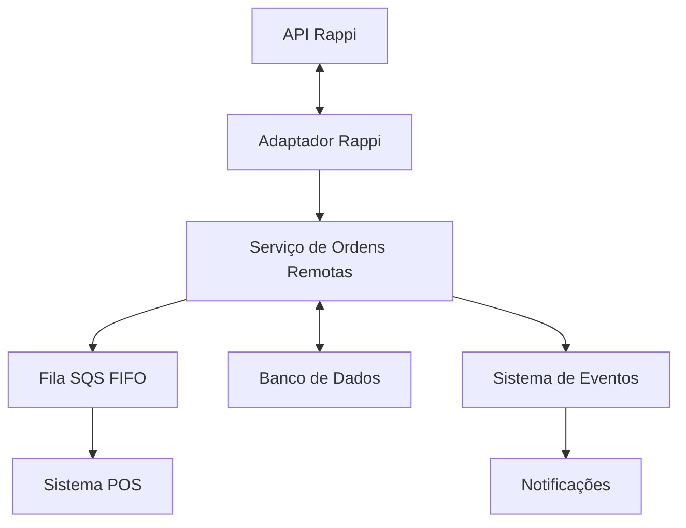
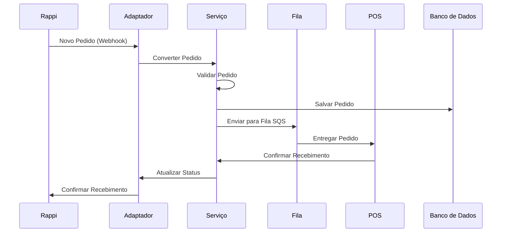
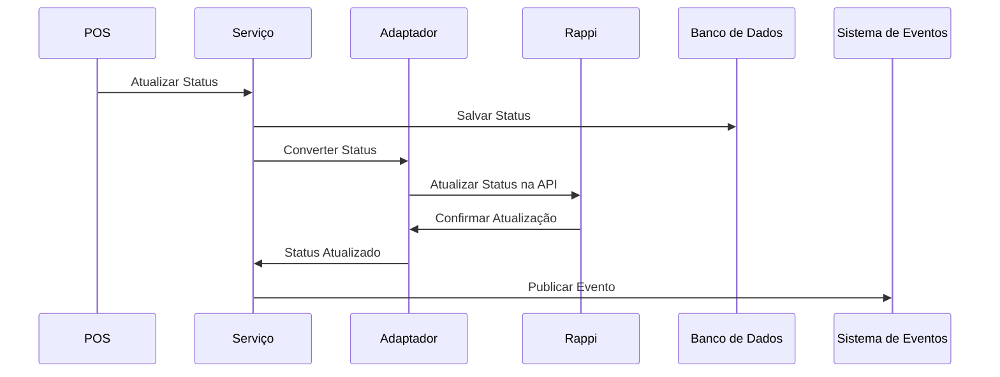

# Integração com Rappi - Design e Implementação

## 1. Visão Geral

Este documento descreve o design e a implementação da integração do sistema POS Modern com a plataforma Rappi, permitindo o recebimento e processamento automático de pedidos. A integração seguirá uma arquitetura similar à já implementada para o iFood, aproveitando a infraestrutura de ordens remotas existente e adaptando-a para as especificidades da API Rappi.

## 2. Requisitos Funcionais

### 2.1. Recebimento de Pedidos
- Receber pedidos da plataforma Rappi via API
- Converter pedidos para o formato interno do sistema
- Validar e processar informações de cliente, itens e pagamento

### 2.2. Gerenciamento de Status
- Atualizar status do pedido no Rappi (aceito, rejeitado, em preparação, pronto, em entrega, entregue)
- Sincronizar alterações de status entre o POS Modern e o Rappi
- Suportar confirmação manual ou automática de pedidos (configurável)

### 2.3. Notificações
- Notificar o restaurante sobre novos pedidos
- Notificar o cliente sobre atualizações de status
- Alertar sobre problemas na integração

### 2.4. Configuração
- Permitir configuração por restaurante/loja
- Configurar credenciais de API
- Definir políticas de aceitação automática
- Mapear produtos entre o Rappi e o sistema interno

### 2.5. Reembolsos
- Processar reembolsos para pedidos não confirmados
- Registrar motivos de rejeição/cancelamento
- Integrar com o módulo de pagamento para estornos

## 3. Arquitetura

### 3.1. Componentes

A integração com o Rappi será implementada como um adaptador dentro do módulo de ordens remotas existente, seguindo o padrão já estabelecido para o iFood:



### 3.2. Componentes Principais

1. **Adaptador Rappi**: Responsável pela comunicação direta com a API do Rappi, convertendo dados entre os formatos Rappi e POS Modern.

2. **Serviço de Ordens Remotas**: Gerencia o ciclo de vida dos pedidos remotos, incluindo validação, processamento e atualização de status.

3. **Fila SQS FIFO**: Garante a entrega ordenada e sem duplicação dos pedidos para o sistema POS.

4. **Sistema de Eventos**: Publica eventos relacionados a pedidos para outros módulos do sistema.

5. **Banco de Dados**: Armazena configurações, mapeamentos de produtos e histórico de pedidos.

### 3.3. Fluxo de Dados

#### 3.3.1. Recebimento de Pedido



#### 3.3.2. Atualização de Status



### 3.4. Modelo de Dados

#### 3.4.1. Configuração Rappi

```python
class RappiConfiguration(BaseModel):
    id: str
    restaurant_id: str
    store_id: str
    api_key: str
    api_secret: str
    webhook_url: str
    auto_accept: bool
    notification_email: str
    notification_phone: str
    active: bool
    created_at: datetime
    updated_at: datetime
```

#### 3.4.2. Mapeamento de Produtos

```python
class RappiProductMapping(BaseModel):
    id: str
    restaurant_id: str
    rappi_product_id: str
    pos_product_id: str
    rappi_product_name: str
    pos_product_name: str
    active: bool
    created_at: datetime
    updated_at: datetime
```

#### 3.4.3. Pedido Rappi

```python
class RappiOrder(BaseModel):
    id: str
    restaurant_id: str
    store_id: str
    rappi_order_id: str
    remote_order_id: str
    order_number: str
    status: str
    customer: Dict[str, Any]
    items: List[Dict[str, Any]]
    payment: Dict[str, Any]
    delivery: Dict[str, Any]
    total_amount: float
    created_at: datetime
    updated_at: datetime
```

## 4. Implementação

### 4.1. Adaptador Rappi

```python
from typing import Dict, Any, List, Optional
import aiohttp
import json
import logging
from datetime import datetime
from pydantic import BaseModel

from src.remote_orders.models.remote_order_models import (
    RemoteOrder, RemoteOrderItem, RemoteOrderStatus, RemoteOrderCustomer,
    RemoteOrderPayment, RemoteOrderDelivery
)

logger = logging.getLogger(__name__)

class RappiAdapter:
    """Adaptador para integração com a API do Rappi."""
    
    def __init__(self, config: Dict[str, Any]):
        """
        Inicializa o adaptador com as configurações necessárias.
        
        Args:
            config: Dicionário com as configurações da integração Rappi
        """
        self.api_key = config.get("api_key")
        self.api_secret = config.get("api_secret")
        self.restaurant_id = config.get("restaurant_id")
        self.store_id = config.get("store_id")
        self.base_url = "https://api.rappi.com/api/v1"
        self.session = None
    
    async def __aenter__(self):
        """Inicializa a sessão HTTP."""
        self.session = aiohttp.ClientSession(
            headers={
                "Content-Type": "application/json",
                "X-API-Key": self.api_key,
                "X-API-Secret": self.api_secret
            }
        )
        return self
    
    async def __aexit__(self, exc_type, exc_val, exc_tb):
        """Fecha a sessão HTTP."""
        if self.session:
            await self.session.close()
            self.session = None
    
    async def convert_to_remote_order(self, rappi_order: Dict[str, Any]) -> RemoteOrder:
        """
        Converte um pedido do formato Rappi para o formato interno RemoteOrder.
        
        Args:
            rappi_order: Pedido no formato da API Rappi
            
        Returns:
            RemoteOrder: Pedido no formato interno
        """
        # Extrair informações do cliente
        customer_data = rappi_order.get("customer", {})
        customer = RemoteOrderCustomer(
            id=customer_data.get("id", ""),
            name=customer_data.get("name", ""),
            email=customer_data.get("email", ""),
            phone=customer_data.get("phone", ""),
            address=customer_data.get("address", {})
        )
        
        # Extrair itens do pedido
        items_data = rappi_order.get("items", [])
        items = []
        for item_data in items_data:
            item = RemoteOrderItem(
                id=item_data.get("id", ""),
                name=item_data.get("name", ""),
                quantity=item_data.get("quantity", 1),
                unit_price=item_data.get("unitPrice", 0.0),
                total_price=item_data.get("totalPrice", 0.0),
                notes=item_data.get("notes", ""),
                options=item_data.get("options", [])
            )
            items.append(item)
        
        # Extrair informações de pagamento
        payment_data = rappi_order.get("payment", {})
        payment = RemoteOrderPayment(
            method=payment_data.get("method", ""),
            status=payment_data.get("status", ""),
            total=payment_data.get("total", 0.0),
            currency=payment_data.get("currency", "BRL"),
            online=payment_data.get("online", False)
        )
        
        # Extrair informações de entrega
        delivery_data = rappi_order.get("delivery", {})
        delivery = RemoteOrderDelivery(
            type=delivery_data.get("type", "delivery"),
            address=delivery_data.get("address", {}),
            notes=delivery_data.get("notes", ""),
            estimated_time=delivery_data.get("estimatedTime", 0)
        )
        
        # Criar o pedido remoto
        remote_order = RemoteOrder(
            id=f"rappi_{rappi_order.get('id', '')}",
            external_id=rappi_order.get("id", ""),
            source="rappi",
            restaurant_id=self.restaurant_id,
            store_id=self.store_id,
            order_number=rappi_order.get("orderNumber", ""),
            status=RemoteOrderStatus.PENDING,
            customer=customer,
            items=items,
            payment=payment,
            delivery=delivery,
            total_amount=rappi_order.get("totalAmount", 0.0),
            created_at=datetime.now(),
            updated_at=datetime.now(),
            raw_data=rappi_order
        )
        
        return remote_order
    
    async def convert_status_to_rappi(self, status: RemoteOrderStatus) -> str:
        """
        Converte um status interno para o formato da API Rappi.
        
        Args:
            status: Status interno do pedido
            
        Returns:
            str: Status no formato da API Rappi
        """
        status_mapping = {
            RemoteOrderStatus.PENDING: "PENDING",
            RemoteOrderStatus.CONFIRMED: "CONFIRMED",
            RemoteOrderStatus.REJECTED: "REJECTED",
            RemoteOrderStatus.PREPARING: "PREPARING",
            RemoteOrderStatus.READY: "READY",
            RemoteOrderStatus.DELIVERING: "DELIVERING",
            RemoteOrderStatus.DELIVERED: "DELIVERED",
            RemoteOrderStatus.CANCELLED: "CANCELLED"
        }
        
        return status_mapping.get(status, "PENDING")
    
    async def get_order(self, order_id: str) -> Dict[str, Any]:
        """
        Obtém os detalhes de um pedido da API Rappi.
        
        Args:
            order_id: ID do pedido no Rappi
            
        Returns:
            Dict: Detalhes do pedido
        """
        if not self.session:
            raise ValueError("Session not initialized. Use 'async with' context.")
        
        url = f"{self.base_url}/orders/{order_id}"
        
        async with self.session.get(url) as response:
            if response.status != 200:
                error_text = await response.text()
                logger.error(f"Error getting order from Rappi: {error_text}")
                raise Exception(f"Failed to get order from Rappi: {response.status}")
            
            return await response.json()
    
    async def update_order_status(self, order_id: str, status: RemoteOrderStatus) -> bool:
        """
        Atualiza o status de um pedido na API Rappi.
        
        Args:
            order_id: ID do pedido no Rappi
            status: Novo status do pedido
            
        Returns:
            bool: True se a atualização foi bem-sucedida
        """
        if not self.session:
            raise ValueError("Session not initialized. Use 'async with' context.")
        
        rappi_status = await self.convert_status_to_rappi(status)
        url = f"{self.base_url}/orders/{order_id}/status"
        
        payload = {
            "status": rappi_status
        }
        
        async with self.session.put(url, json=payload) as response:
            if response.status != 200:
                error_text = await response.text()
                logger.error(f"Error updating order status in Rappi: {error_text}")
                return False
            
            return True
    
    async def reject_order(self, order_id: str, reason: str) -> bool:
        """
        Rejeita um pedido na API Rappi.
        
        Args:
            order_id: ID do pedido no Rappi
            reason: Motivo da rejeição
            
        Returns:
            bool: True se a rejeição foi bem-sucedida
        """
        if not self.session:
            raise ValueError("Session not initialized. Use 'async with' context.")
        
        url = f"{self.base_url}/orders/{order_id}/reject"
        
        payload = {
            "reason": reason
        }
        
        async with self.session.post(url, json=payload) as response:
            if response.status != 200:
                error_text = await response.text()
                logger.error(f"Error rejecting order in Rappi: {error_text}")
                return False
            
            return True
    
    async def process_webhook(self, webhook_data: Dict[str, Any]) -> Optional[RemoteOrder]:
        """
        Processa dados recebidos via webhook do Rappi.
        
        Args:
            webhook_data: Dados recebidos no webhook
            
        Returns:
            Optional[RemoteOrder]: Pedido processado ou None se não for um pedido
        """
        event_type = webhook_data.get("eventType")
        
        if event_type == "ORDER_CREATED":
            order_data = webhook_data.get("order", {})
            return await self.convert_to_remote_order(order_data)
        
        return None
```

### 4.2. Serviço de Ordens Remotas (Extensão)

```python
# Adicionar ao serviço existente de ordens remotas

async def process_rappi_order(self, rappi_order: Dict[str, Any]) -> RemoteOrder:
    """
    Processa um novo pedido do Rappi.
    
    Args:
        rappi_order: Pedido no formato da API Rappi
        
    Returns:
        RemoteOrder: Pedido processado
    """
    # Obter configuração do restaurante
    restaurant_id = rappi_order.get("restaurantId")
    config = await self.get_rappi_configuration(restaurant_id)
    
    if not config:
        logger.error(f"Rappi configuration not found for restaurant {restaurant_id}")
        raise ValueError(f"Rappi configuration not found for restaurant {restaurant_id}")
    
    # Converter para formato interno
    async with RappiAdapter(config) as adapter:
        remote_order = await adapter.convert_to_remote_order(rappi_order)
    
    # Salvar no banco de dados
    saved_order = await self.save_remote_order(remote_order)
    
    # Publicar evento
    await self.event_bus.publish(
        EventType.REMOTE_ORDER_RECEIVED,
        {
            "order_id": saved_order.id,
            "source": "rappi",
            "restaurant_id": saved_order.restaurant_id,
            "store_id": saved_order.store_id
        }
    )
    
    # Verificar aceitação automática
    if config.get("auto_accept", False):
        await self.confirm_remote_order(saved_order.id)
    
    # Enviar para fila SQS
    await self.send_to_sqs(saved_order)
    
    return saved_order

async def update_rappi_order_status(self, order_id: str, status: RemoteOrderStatus) -> bool:
    """
    Atualiza o status de um pedido do Rappi.
    
    Args:
        order_id: ID do pedido
        status: Novo status
        
    Returns:
        bool: True se a atualização foi bem-sucedida
    """
    # Obter pedido
    order = await self.get_remote_order(order_id)
    
    if not order or order.source != "rappi":
        logger.error(f"Order {order_id} not found or not from Rappi")
        return False
    
    # Obter configuração do restaurante
    config = await self.get_rappi_configuration(order.restaurant_id)
    
    if not config:
        logger.error(f"Rappi configuration not found for restaurant {order.restaurant_id}")
        return False
    
    # Atualizar status na API Rappi
    async with RappiAdapter(config) as adapter:
        success = await adapter.update_order_status(order.external_id, status)
    
    if success:
        # Atualizar status no banco de dados
        order.status = status
        order.updated_at = datetime.now()
        await self.update_remote_order(order)
        
        # Publicar evento
        await self.event_bus.publish(
            EventType.REMOTE_ORDER_STATUS_UPDATED,
            {
                "order_id": order.id,
                "source": "rappi",
                "restaurant_id": order.restaurant_id,
                "store_id": order.store_id,
                "status": status.value
            }
        )
        
        # Processar reembolso se necessário
        if status == RemoteOrderStatus.REJECTED and order.payment.online:
            await self.process_refund(order)
    
    return success

async def get_rappi_configuration(self, restaurant_id: str) -> Dict[str, Any]:
    """
    Obtém a configuração do Rappi para um restaurante.
    
    Args:
        restaurant_id: ID do restaurante
        
    Returns:
        Dict: Configuração do Rappi
    """
    # Implementar busca no banco de dados
    pass

async def process_refund(self, order: RemoteOrder) -> bool:
    """
    Processa o reembolso de um pedido online rejeitado.
    
    Args:
        order: Pedido a ser reembolsado
        
    Returns:
        bool: True se o reembolso foi bem-sucedido
    """
    # Integrar com o módulo de pagamento para processar o reembolso
    pass
```

### 4.3. Router para Webhooks do Rappi

```python
from fastapi import APIRouter, Depends, HTTPException, Request
from typing import Dict, Any

from src.remote_orders.services.remote_order_service import RemoteOrderService
from src.auth.auth import get_api_key

router = APIRouter()

@router.post("/webhooks/rappi", status_code=200)
async def rappi_webhook(
    request: Request,
    service: RemoteOrderService = Depends()
):
    """
    Endpoint para receber webhooks do Rappi.
    """
    try:
        # Obter dados do webhook
        webhook_data = await request.json()
        
        # Validar assinatura do webhook (implementar conforme documentação do Rappi)
        
        # Processar webhook
        result = await service.process_rappi_webhook(webhook_data)
        
        return {"success": True, "message": "Webhook processed successfully"}
    except Exception as e:
        raise HTTPException(status_code=500, detail=str(e))

@router.post("/rappi/orders/{order_id}/status", status_code=200)
async def update_rappi_order_status(
    order_id: str,
    status_data: Dict[str, Any],
    service: RemoteOrderService = Depends(),
    api_key: str = Depends(get_api_key)
):
    """
    Endpoint para atualizar o status de um pedido do Rappi.
    """
    try:
        status = status_data.get("status")
        if not status:
            raise HTTPException(status_code=400, detail="Status is required")
        
        success = await service.update_rappi_order_status(order_id, status)
        
        if not success:
            raise HTTPException(status_code=400, detail="Failed to update order status")
        
        return {"success": True, "message": "Order status updated successfully"}
    except Exception as e:
        raise HTTPException(status_code=500, detail=str(e))
```

### 4.4. Testes

```python
import unittest
from unittest.mock import AsyncMock, patch, MagicMock
import json
from datetime import datetime

from src.remote_orders.adapters.rappi_adapter import RappiAdapter
from src.remote_orders.models.remote_order_models import RemoteOrderStatus

class TestRappiAdapter(unittest.IsolatedAsyncioTestCase):
    """Testes para o adaptador Rappi."""
    
    def setUp(self):
        """Configuração dos testes."""
        self.config = {
            "api_key": "test_api_key",
            "api_secret": "test_api_secret",
            "restaurant_id": "test_restaurant_id",
            "store_id": "test_store_id"
        }
        
        self.rappi_order = {
            "id": "123456",
            "orderNumber": "R123456",
            "restaurantId": "test_restaurant_id",
            "customer": {
                "id": "cust123",
                "name": "John Doe",
                "email": "john@example.com",
                "phone": "1234567890",
                "address": {
                    "street": "Main St",
                    "number": "123",
                    "complement": "Apt 4B",
                    "neighborhood": "Downtown",
                    "city": "São Paulo",
                    "state": "SP",
                    "zipCode": "01234-567",
                    "country": "Brazil"
                }
            },
            "items": [
                {
                    "id": "item123",
                    "name": "Hambúrguer",
                    "quantity": 2,
                    "unitPrice": 15.90,
                    "totalPrice": 31.80,
                    "notes": "Sem cebola",
                    "options": [
                        {
                            "id": "opt1",
                            "name": "Queijo extra",
                            "price": 2.00
                        }
                    ]
                }
            ],
            "payment": {
                "method": "CREDIT_CARD",
                "status": "PAID",
                "total": 31.80,
                "currency": "BRL",
                "online": True
            },
            "delivery": {
                "type": "delivery",
                "address": {
                    "street": "Main St",
                    "number": "123",
                    "complement": "Apt 4B",
                    "neighborhood": "Downtown",
                    "city": "São Paulo",
                    "state": "SP",
                    "zipCode": "01234-567",
                    "country": "Brazil"
                },
                "notes": "Portão azul",
                "estimatedTime": 30
            },
            "totalAmount": 31.80
        }
    
    async def test_convert_to_remote_order(self):
        """Testa a conversão de um pedido do formato Rappi para o formato interno."""
        adapter = RappiAdapter(self.config)
        
        remote_order = await adapter.convert_to_remote_order(self.rappi_order)
        
        self.assertEqual(remote_order.external_id, "123456")
        self.assertEqual(remote_order.source, "rappi")
        self.assertEqual(remote_order.restaurant_id, "test_restaurant_id")
        self.assertEqual(remote_order.order_number, "R123456")
        self.assertEqual(remote_order.status, RemoteOrderStatus.PENDING)
        self.assertEqual(remote_order.customer.name, "John Doe")
        self.assertEqual(len(remote_order.items), 1)
        self.assertEqual(remote_order.items[0].name, "Hambúrguer")
        self.assertEqual(remote_order.items[0].quantity, 2)
        self.assertEqual(remote_order.payment.method, "CREDIT_CARD")
        self.assertEqual(remote_order.payment.online, True)
        self.assertEqual(remote_order.delivery.type, "delivery")
        self.assertEqual(remote_order.total_amount, 31.80)
    
    async def test_convert_status_to_rappi(self):
        """Testa a conversão de um status interno para o formato da API Rappi."""
        adapter = RappiAdapter(self.config)
        
        rappi_status = await adapter.convert_status_to_rappi(RemoteOrderStatus.CONFIRMED)
        self.assertEqual(rappi_status, "CONFIRMED")
        
        rappi_status = await adapter.convert_status_to_rappi(RemoteOrderStatus.PREPARING)
        self.assertEqual(rappi_status, "PREPARING")
        
        rappi_status = await adapter.convert_status_to_rappi(RemoteOrderStatus.DELIVERED)
        self.assertEqual(rappi_status, "DELIVERED")
    
    @patch("aiohttp.ClientSession")
    async def test_update_order_status(self, mock_session):
        """Testa a atualização de status de um pedido na API Rappi."""
        # Configurar mock
        mock_response = AsyncMock()
        mock_response.status = 200
        mock_response.__aenter__.return_value = mock_response
        
        mock_session_instance = MagicMock()
        mock_session_instance.put.return_value = mock_response
        mock_session.return_value = mock_session_instance
        
        # Executar teste
        adapter = RappiAdapter(self.config)
        adapter.session = mock_session_instance
        
        success = await adapter.update_order_status("123456", RemoteOrderStatus.CONFIRMED)
        
        # Verificar resultado
        self.assertTrue(success)
        mock_session_instance.put.assert_called_once()
        args, kwargs = mock_session_instance.put.call_args
        self.assertEqual(args[0], "https://api.rappi.com/api/v1/orders/123456/status")
        self.assertEqual(kwargs["json"], {"status": "CONFIRMED"})
    
    @patch("aiohttp.ClientSession")
    async def test_reject_order(self, mock_session):
        """Testa a rejeição de um pedido na API Rappi."""
        # Configurar mock
        mock_response = AsyncMock()
        mock_response.status = 200
        mock_response.__aenter__.return_value = mock_response
        
        mock_session_instance = MagicMock()
        mock_session_instance.post.return_value = mock_response
        mock_session.return_value = mock_session_instance
        
        # Executar teste
        adapter = RappiAdapter(self.config)
        adapter.session = mock_session_instance
        
        success = await adapter.reject_order("123456", "Restaurante fechado")
        
        # Verificar resultado
        self.assertTrue(success)
        mock_session_instance.post.assert_called_once()
        args, kwargs = mock_session_instance.post.call_args
        self.assertEqual(args[0], "https://api.rappi.com/api/v1/orders/123456/reject")
        self.assertEqual(kwargs["json"], {"reason": "Restaurante fechado"})
    
    async def test_process_webhook_order_created(self):
        """Testa o processamento de um webhook de criação de pedido."""
        adapter = RappiAdapter(self.config)
        
        webhook_data = {
            "eventType": "ORDER_CREATED",
            "order": self.rappi_order
        }
        
        remote_order = await adapter.process_webhook(webhook_data)
        
        self.assertIsNotNone(remote_order)
        self.assertEqual(remote_order.external_id, "123456")
        self.assertEqual(remote_order.source, "rappi")
    
    async def test_process_webhook_other_event(self):
        """Testa o processamento de um webhook de outro tipo de evento."""
        adapter = RappiAdapter(self.config)
        
        webhook_data = {
            "eventType": "OTHER_EVENT",
            "data": {}
        }
        
        remote_order = await adapter.process_webhook(webhook_data)
        
        self.assertIsNone(remote_order)
```

## 5. Configuração e Implantação

### 5.1. Configuração do Adaptador Rappi

Para configurar a integração com o Rappi, é necessário adicionar as seguintes informações no banco de dados:

```sql
-- Tabela para configuração do Rappi
CREATE TABLE rappi_configuration (
    id UUID PRIMARY KEY,
    restaurant_id UUID NOT NULL,
    store_id UUID NOT NULL,
    api_key VARCHAR(255) NOT NULL,
    api_secret VARCHAR(255) NOT NULL,
    webhook_url VARCHAR(255) NOT NULL,
    auto_accept BOOLEAN DEFAULT FALSE,
    notification_email VARCHAR(255),
    notification_phone VARCHAR(255),
    active BOOLEAN DEFAULT TRUE,
    created_at TIMESTAMP NOT NULL DEFAULT NOW(),
    updated_at TIMESTAMP NOT NULL DEFAULT NOW(),
    FOREIGN KEY (restaurant_id) REFERENCES restaurants(id)
);

-- Tabela para mapeamento de produtos
CREATE TABLE rappi_product_mapping (
    id UUID PRIMARY KEY,
    restaurant_id UUID NOT NULL,
    rappi_product_id VARCHAR(255) NOT NULL,
    pos_product_id UUID NOT NULL,
    rappi_product_name VARCHAR(255) NOT NULL,
    pos_product_name VARCHAR(255) NOT NULL,
    active BOOLEAN DEFAULT TRUE,
    created_at TIMESTAMP NOT NULL DEFAULT NOW(),
    updated_at TIMESTAMP NOT NULL DEFAULT NOW(),
    FOREIGN KEY (restaurant_id) REFERENCES restaurants(id),
    FOREIGN KEY (pos_product_id) REFERENCES products(id)
);

-- Tabela para pedidos do Rappi
CREATE TABLE rappi_orders (
    id UUID PRIMARY KEY,
    restaurant_id UUID NOT NULL,
    store_id UUID NOT NULL,
    rappi_order_id VARCHAR(255) NOT NULL,
    remote_order_id UUID NOT NULL,
    order_number VARCHAR(255) NOT NULL,
    status VARCHAR(50) NOT NULL,
    customer JSONB NOT NULL,
    items JSONB NOT NULL,
    payment JSONB NOT NULL,
    delivery JSONB NOT NULL,
    total_amount DECIMAL(10, 2) NOT NULL,
    created_at TIMESTAMP NOT NULL DEFAULT NOW(),
    updated_at TIMESTAMP NOT NULL DEFAULT NOW(),
    FOREIGN KEY (restaurant_id) REFERENCES restaurants(id),
    FOREIGN KEY (remote_order_id) REFERENCES remote_orders(id)
);
```

### 5.2. Configuração de Webhook

Para receber webhooks do Rappi, é necessário configurar o endpoint no painel do Rappi:

1. Acessar o painel de integração do Rappi
2. Configurar o webhook URL: `https://api.seu-dominio.com/api/webhooks/rappi`
3. Selecionar os eventos a serem recebidos (ORDER_CREATED, ORDER_UPDATED, etc.)
4. Salvar a configuração

### 5.3. Integração com o Sistema POS

Para integrar o adaptador Rappi com o sistema POS, é necessário:

1. Adicionar o adaptador Rappi ao módulo de ordens remotas
2. Configurar a fila SQS para receber pedidos do Rappi
3. Atualizar o serviço de ordens remotas para processar pedidos do Rappi
4. Configurar o mapeamento de produtos entre o Rappi e o sistema POS

## 6. Considerações de Segurança

### 6.1. Autenticação

- Utilizar HTTPS para todas as comunicações
- Validar a assinatura dos webhooks do Rappi
- Armazenar chaves de API e segredos de forma segura
- Implementar autenticação para endpoints de API

### 6.2. Validação de Dados

- Validar todos os dados recebidos do Rappi
- Implementar limites de tamanho para campos de texto
- Validar valores numéricos (preços, quantidades, etc.)
- Sanitizar dados antes de armazenar no banco de dados

### 6.3. Tratamento de Erros

- Implementar retry para falhas de comunicação com a API do Rappi
- Registrar erros detalhados em logs
- Notificar administradores sobre falhas críticas
- Implementar circuit breaker para evitar sobrecarga em caso de falhas

## 7. Testes e Validação

### 7.1. Testes Unitários

- Testar a conversão de formatos de pedido
- Testar a conversão de status
- Testar a validação de dados
- Testar o processamento de webhooks

### 7.2. Testes de Integração

- Testar a comunicação com a API do Rappi
- Testar o fluxo completo de pedido (recebimento, processamento, atualização de status)
- Testar cenários de erro e recuperação
- Testar a integração com o sistema POS

### 7.3. Testes de Carga

- Testar o desempenho com múltiplos pedidos simultâneos
- Testar a escalabilidade do sistema
- Testar a recuperação após falhas

## 8. Conclusão

A integração com o Rappi permitirá que o sistema POS Modern receba e processe pedidos da plataforma Rappi de forma automática, aumentando a eficiência e reduzindo erros. A arquitetura modular e a reutilização de componentes existentes facilitam a implementação e manutenção da integração.

A implementação seguirá as melhores práticas de segurança e desempenho, garantindo uma integração robusta e confiável. A configuração flexível por restaurante/loja permite que cada cliente tenha sua própria integração com o Rappi, adaptada às suas necessidades específicas.
