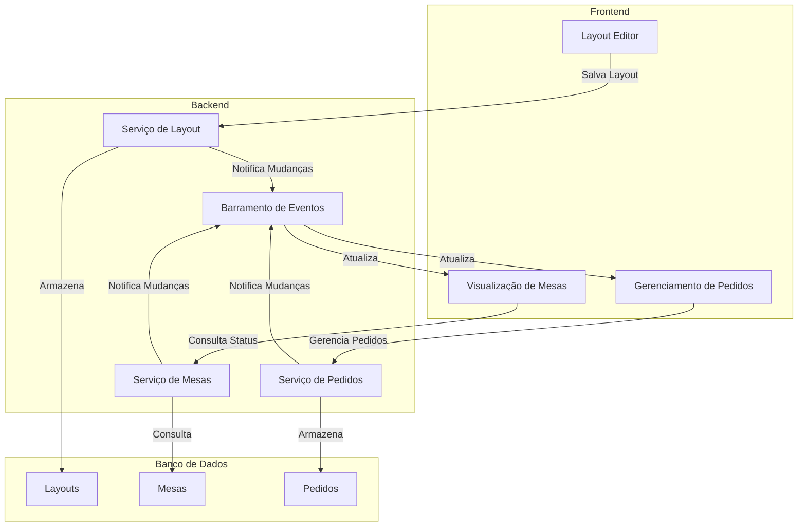
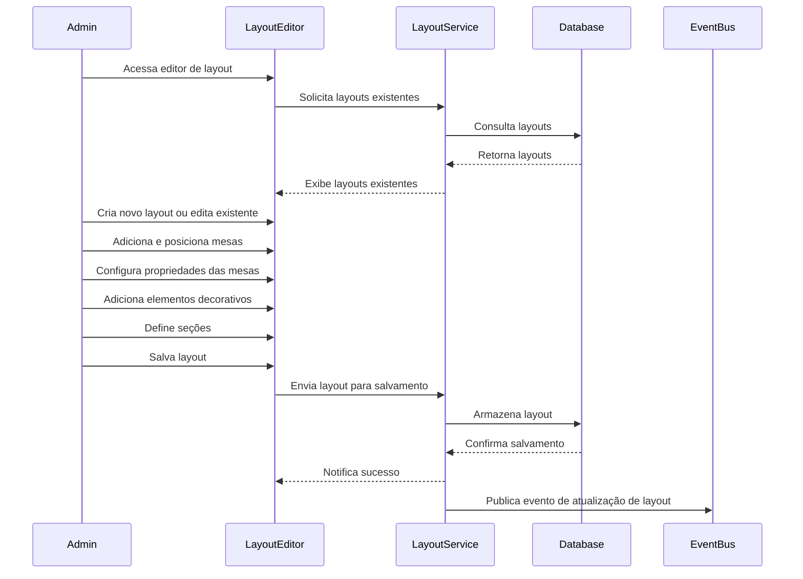
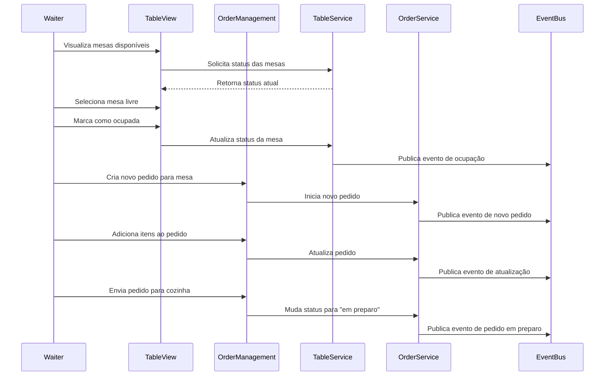
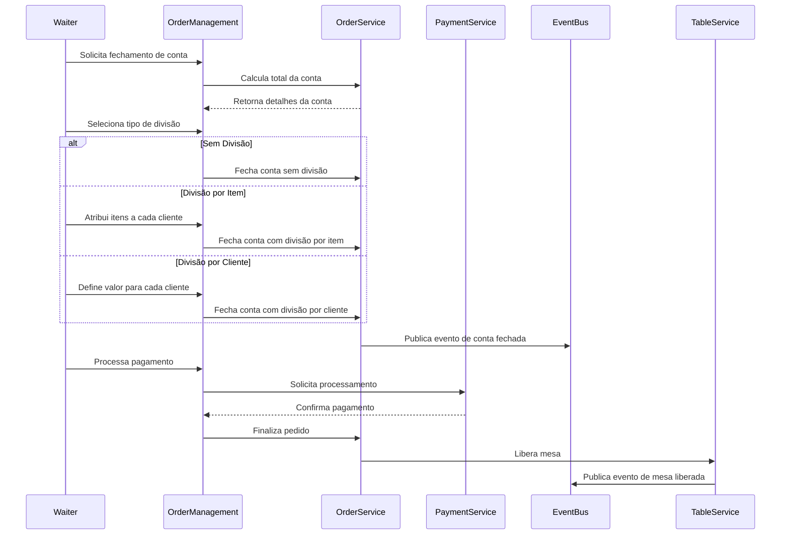

# Módulo de Garçom com Layout Personalizado de Mesas

## 1. Visão Geral

O módulo de garçom do sistema POS Modern será aprimorado para incluir uma funcionalidade de layout personalizado de mesas, permitindo que cada restaurante configure a disposição das mesas de acordo com o layout físico do estabelecimento. Esta funcionalidade estará disponível tanto em tablets/smartphones (iOS/Android) quanto em totens, facilitando a identificação visual e o gerenciamento das mesas pelos garçons.

## 2. Requisitos Funcionais

### 2.1. Editor de Layout

- Interface de arrastar e soltar para posicionamento de mesas
- Suporte a diferentes formatos de mesa (redonda, quadrada, retangular)
- Capacidade de definir tamanhos variados de mesas
- Agrupamento de mesas para atendimento de grupos grandes
- Definição de áreas/seções do restaurante (varanda, salão interno, área VIP, etc.)
- Adição de elementos decorativos e obstáculos (paredes, plantas, balcão)
- Salvamento de múltiplos layouts para diferentes configurações do restaurante

### 2.2. Visualização e Operação

- Visualização em tempo real do status das mesas (livre, ocupada, reservada, em atendimento)
- Indicadores visuais de tempo de ocupação da mesa
- Indicadores de status do pedido (aguardando, em preparo, pronto para servir)
- Funcionalidade para liberar/ocupar mesas com um toque
- Visualização de detalhes da mesa (número de clientes, garçom responsável, tempo de ocupação)
- Modo de visualização adaptável para diferentes tamanhos de tela

### 2.3. Gerenciamento de Pedidos

- Criação de pedidos associados a mesas específicas
- Adição/remoção de itens ao pedido da mesa
- Transferência de itens ou pedidos completos entre mesas
- Divisão de conta por cliente ou por item
- Fechamento de conta sem pagamento imediato
- Geração de conta para pagamento apenas no final do atendimento
- Histórico de pedidos por mesa

## 3. Arquitetura

### 3.1. Componentes Principais



### 3.2. Modelo de Dados

#### Layout

```json
{
  "layoutId": "string",
  "restaurantId": "string",
  "name": "string",
  "description": "string",
  "isActive": "boolean",
  "createdAt": "datetime",
  "updatedAt": "datetime",
  "elements": [
    {
      "elementId": "string",
      "type": "TABLE|WALL|DECORATION",
      "x": "number",
      "y": "number",
      "width": "number",
      "height": "number",
      "rotation": "number",
      "properties": {
        "shape": "ROUND|SQUARE|RECTANGLE",
        "capacity": "number",
        "tableNumber": "string",
        "section": "string"
      }
    }
  ],
  "sections": [
    {
      "sectionId": "string",
      "name": "string",
      "color": "string"
    }
  ]
}
```

#### Mesa

```json
{
  "tableId": "string",
  "layoutId": "string",
  "tableNumber": "string",
  "status": "FREE|OCCUPIED|RESERVED|IN_SERVICE",
  "capacity": "number",
  "occupiedSeats": "number",
  "waiterId": "string",
  "occupiedAt": "datetime",
  "reservedUntil": "datetime",
  "currentOrderId": "string",
  "section": "string"
}
```

#### Pedido de Mesa

```json
{
  "orderId": "string",
  "tableId": "string",
  "status": "OPEN|IN_PREPARATION|PARTIALLY_SERVED|SERVED|CLOSED|PAID",
  "waiterId": "string",
  "customerCount": "number",
  "createdAt": "datetime",
  "updatedAt": "datetime",
  "items": [
    {
      "itemId": "string",
      "productId": "string",
      "quantity": "number",
      "unitPrice": "number",
      "notes": "string",
      "status": "ORDERED|IN_PREPARATION|READY|SERVED|CANCELLED",
      "servedAt": "datetime"
    }
  ],
  "subtotal": "number",
  "tax": "number",
  "serviceCharge": "number",
  "discount": "number",
  "total": "number",
  "splitType": "NONE|BY_ITEM|BY_CUSTOMER",
  "splits": [
    {
      "splitId": "string",
      "description": "string",
      "items": ["string"],
      "amount": "number",
      "status": "OPEN|PAID",
      "paymentId": "string"
    }
  ]
}
```

## 4. Interface do Usuário

### 4.1. Editor de Layout

O editor de layout será uma interface web responsiva que permitirá aos administradores do restaurante configurar o layout das mesas. A interface incluirá:

- Área de desenho com grade para posicionamento preciso
- Paleta de elementos (mesas, paredes, decorações)
- Propriedades configuráveis para cada elemento
- Ferramentas de alinhamento e distribuição
- Opções de zoom e navegação
- Salvamento automático e versionamento


### 4.2. Visualização de Mesas

A visualização de mesas será a interface principal para os garçons, mostrando o layout do restaurante com o status atual de cada mesa. A interface incluirá:

- Representação visual do layout configurado
- Código de cores para status das mesas
- Indicadores de tempo de ocupação
- Indicadores de status do pedido
- Botões de ação rápida (ocupar, liberar, ver detalhes)
- Filtros por seção ou status


### 4.3. Gerenciamento de Pedidos

A interface de gerenciamento de pedidos permitirá aos garçons criar e gerenciar pedidos para cada mesa. A interface incluirá:

- Lista de itens do cardápio por categoria
- Opções de personalização para cada item
- Visualização do pedido atual da mesa
- Histórico de pedidos anteriores
- Opções para divisão de conta
- Geração de conta para pagamento


## 5. Fluxos de Trabalho

### 5.1. Configuração de Layout



### 5.2. Atendimento de Mesa



### 5.3. Fechamento de Conta



## 6. Integração com Outros Módulos

### 6.1. Integração com Módulo de Produtos

- Consulta de produtos disponíveis para inclusão nos pedidos
- Verificação de estoque em tempo real
- Atualização automática de cardápio

### 6.2. Integração com Módulo de Pagamento

- Processamento de pagamentos no fechamento de conta
- Suporte a múltiplos métodos de pagamento
- Divisão de conta entre diferentes métodos de pagamento

### 6.3. Integração com Módulo de Cozinha (KDS)

- Envio de pedidos para preparação na cozinha
- Recebimento de atualizações de status dos itens
- Notificação quando itens estão prontos para servir

### 6.4. Integração com Módulo de Relatórios

- Geração de relatórios de ocupação de mesas
- Análise de tempo médio de atendimento
- Relatórios de vendas por mesa/seção

## 7. Considerações Técnicas

### 7.1. Responsividade

O módulo será desenvolvido com design responsivo para funcionar em diferentes dispositivos:

- Tablets (iOS e Android)
- Smartphones
- Totens de autoatendimento
- Computadores desktop

### 7.2. Performance

- Otimização para atualizações em tempo real
- Caching de layouts e configurações
- Sincronização eficiente entre dispositivos

### 7.3. Offline Mode

- Suporte a operação offline com sincronização posterior
- Armazenamento local de layouts e pedidos em andamento
- Resolução de conflitos na sincronização

### 7.4. Segurança

- Autenticação de garçons e administradores
- Autorização baseada em funções
- Registro de auditoria para todas as operações

## 8. Implementação

### 8.1. Frontend

- React/Next.js para interface web
- React Native para aplicativos móveis
- Styled Components para estilização
- Redux para gerenciamento de estado
- Socket.io para comunicação em tempo real

### 8.2. Backend

- API RESTful para operações CRUD
- WebSockets para atualizações em tempo real
- Integração com barramento de eventos
- Serviços modulares para layout, mesas e pedidos

### 8.3. Banco de Dados

- PostgreSQL para armazenamento persistente
- Índices otimizados para consultas frequentes
- Transações para garantir consistência de dados

## 9. Plano de Implementação

### 9.1. Fase 1: Editor de Layout

- Desenvolvimento da interface de editor de layout
- Implementação do serviço de gerenciamento de layouts
- Armazenamento e recuperação de layouts
- Testes de usabilidade com administradores

### 9.2. Fase 2: Visualização de Mesas

- Desenvolvimento da interface de visualização de mesas
- Implementação do serviço de gerenciamento de mesas
- Atualizações em tempo real de status
- Testes com garçons em ambiente controlado

### 9.3. Fase 3: Gerenciamento de Pedidos

- Desenvolvimento da interface de gerenciamento de pedidos
- Implementação do fluxo de pedidos para mesas
- Integração com módulo de cozinha
- Implementação de divisão de conta
- Testes em ambiente de produção controlado

### 9.4. Fase 4: Integração e Refinamento

- Integração completa com outros módulos
- Otimização de performance
- Refinamento baseado em feedback dos usuários
- Documentação e treinamento

## 10. Conclusão

O módulo de garçom com layout personalizado de mesas proporcionará uma experiência mais intuitiva e eficiente para os garçons, permitindo uma representação visual fiel do ambiente físico do restaurante. A capacidade de gerenciar pedidos diretamente associados às mesas, com suporte a diferentes fluxos de trabalho e divisão de conta, tornará o atendimento mais ágil e reduzirá erros operacionais.

A implementação modular e a integração com o restante do sistema POS Modern garantirão uma experiência coesa e completa, desde a ocupação da mesa até o pagamento final, sem necessidade de pagamento imediato para cada pedido, conforme solicitado.
