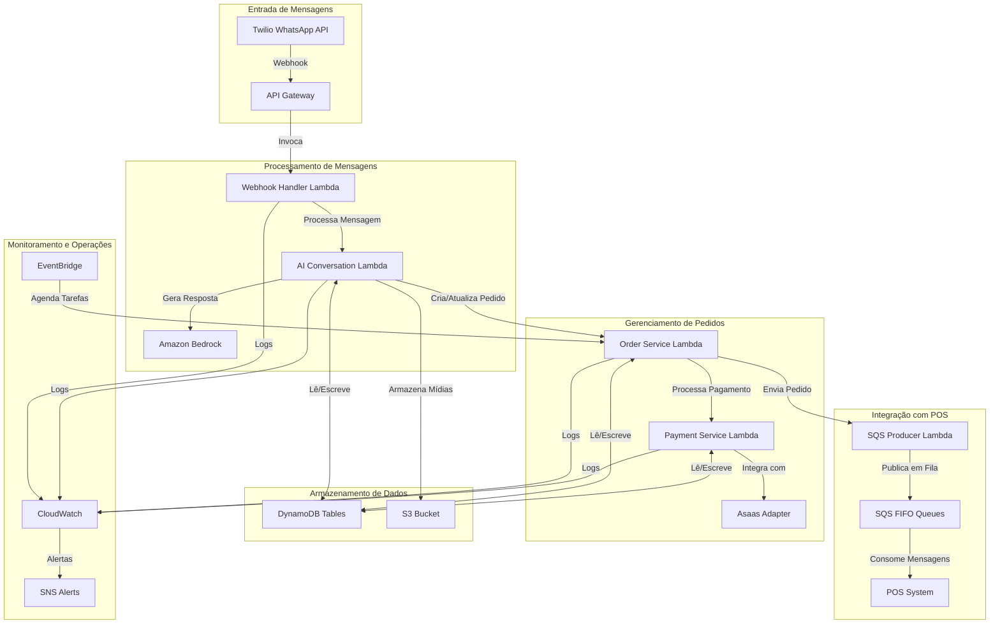
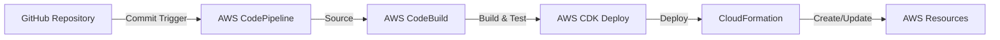

# Plano de Implantação e Escalabilidade AWS para Chatbot WhatsApp

## 1. Visão Geral da Arquitetura

A arquitetura do chatbot WhatsApp para o sistema POS Modern é projetada para ser serverless, escalável, resiliente e multi-tenant. Utilizamos serviços gerenciados da AWS para minimizar a sobrecarga operacional e maximizar a disponibilidade.



## 2. Serviços AWS Utilizados

### 2.1. Computação

| Serviço | Uso | Configuração |
|---------|-----|--------------|
| **AWS Lambda** | Processamento serverless | Memória: 1024-2048 MB<br>Timeout: 15-30s<br>Concorrência: Provisionada |
| **API Gateway** | Endpoints HTTP para webhooks | Throttling: 1000 req/s<br>Timeout: 29s<br>Autenticação: API Key |
| **Amazon Bedrock** | Modelo de IA generativa | Modelo: Claude 3 Sonnet<br>Temperatura: 0.7<br>Tokens máximos: 4096 |

### 2.2. Armazenamento e Banco de Dados

| Serviço | Uso | Configuração |
|---------|-----|--------------|
| **DynamoDB** | Armazenamento de dados | Capacidade: Sob demanda<br>Tabelas: 5-7<br>Índices: 10-15 |
| **S3** | Armazenamento de mídias e logs | Lifecycle: 90 dias<br>Criptografia: SSE-S3<br>Versionamento: Habilitado |
| **ElastiCache** | Cache de sessão e contexto | Tipo: Redis<br>Nós: 2 (Multi-AZ)<br>Tamanho: cache.t3.small |

### 2.3. Mensageria e Integração

| Serviço | Uso | Configuração |
|---------|-----|--------------|
| **SQS** | Filas de mensagens para POS | Tipo: FIFO<br>Retenção: 14 dias<br>DLQ: Habilitado |
| **EventBridge** | Agendamento de tarefas | Regras: 5-10<br>Frequência: 1-15 min |
| **SNS** | Notificações e alertas | Tópicos: 3-5<br>Protocolos: Email, SMS |

### 2.4. Monitoramento e Operações

| Serviço | Uso | Configuração |
|---------|-----|--------------|
| **CloudWatch** | Logs e métricas | Retenção: 30 dias<br>Alarmes: 15-20<br>Dashboards: 3-5 |
| **X-Ray** | Rastreamento de requisições | Amostragem: 5%<br>Retenção: 7 dias |
| **AWS Secrets Manager** | Gerenciamento de segredos | Rotação: 90 dias<br>Criptografia: KMS |

## 3. Estratégia Multi-Tenant

### 3.1. Isolamento de Dados

Utilizamos uma abordagem de particionamento lógico no DynamoDB para isolar dados de diferentes clientes (restaurantes) e lojas:

```
Chave de Partição: clientId
Chave de Ordenação: storeId (quando aplicável)
```

Todas as tabelas incluem esses atributos para garantir isolamento adequado:

- **ConversationTable**: Armazena contexto de conversas
- **OrderConfigTable**: Configurações de pedidos por cliente/loja
- **WhatsAppBotOrders**: Pedidos realizados via chatbot
- **PaymentRecordsTable**: Registros de pagamentos
- **CustomerTable**: Dados de clientes finais

### 3.2. Isolamento de Processamento

Para garantir que um cliente não afete o desempenho de outro:

1. **Filas SQS Dedicadas**: Cada cliente/loja tem sua própria fila SQS FIFO
2. **Concorrência Lambda**: Limites de concorrência por cliente para funções críticas
3. **Throttling por API Key**: Limites de taxa específicos por cliente no API Gateway

### 3.3. Configuração Multi-Tenant

Tabela DynamoDB `TenantConfig` para armazenar configurações específicas por cliente:

```json
{
  "clientId": "client_123abc",
  "name": "Restaurante Exemplo",
  "active": true,
  "twilioConfig": {
    "accountSid": "ACXXXXXXXXXXXXXXXXXXXXXXXXXXXXXXXX",
    "phoneNumber": "+5511999999999",
    "webhookUrl": "https://api.example.com/webhook/twilio/client_123abc"
  },
  "asaasConfig": {
    "apiKey": "secreto",
    "sandbox": false,
    "splitPayments": true,
    "walletId": "wallet_xyz"
  },
  "aiConfig": {
    "model": "claude-3-sonnet",
    "temperature": 0.7,
    "systemPrompt": "Você é um assistente virtual do Restaurante Exemplo..."
  },
  "integrationConfig": {
    "sqsQueueUrl": "https://sqs.us-east-1.amazonaws.com/123456789012/client_123abc.fifo",
    "sqsQueueArn": "arn:aws:sqs:us-east-1:123456789012:client_123abc.fifo"
  },
  "notificationConfig": {
    "adminEmails": ["admin@restauranteexemplo.com"],
    "adminPhones": ["+5511988888888"],
    "alertTopicArn": "arn:aws:sns:us-east-1:123456789012:client_123abc_alerts"
  },
  "stores": [
    {
      "storeId": "store_456def",
      "name": "Unidade Centro",
      "active": true,
      "address": "Rua Exemplo, 123 - Centro",
      "operatingHours": {
        "monday": ["11:00-15:00", "18:00-23:00"],
        "tuesday": ["11:00-15:00", "18:00-23:00"],
        "wednesday": ["11:00-15:00", "18:00-23:00"],
        "thursday": ["11:00-15:00", "18:00-23:00"],
        "friday": ["11:00-15:00", "18:00-23:00"],
        "saturday": ["11:00-15:00", "18:00-23:00"],
        "sunday": ["11:00-15:00", "18:00-23:00"]
      },
      "sqsQueueUrl": "https://sqs.us-east-1.amazonaws.com/123456789012/client_123abc_store_456def.fifo",
      "sqsQueueArn": "arn:aws:sqs:us-east-1:123456789012:client_123abc_store_456def.fifo"
    }
  ],
  "createdAt": "2025-05-01T12:00:00Z",
  "updatedAt": "2025-05-24T15:30:45Z"
}
```

## 4. Implantação com Infrastructure as Code (IaC)

### 4.1. AWS CDK

Utilizamos AWS CDK com TypeScript para definir toda a infraestrutura como código:

```typescript
import * as cdk from 'aws-cdk-lib';
import { Construct } from 'constructs';
import * as lambda from 'aws-cdk-lib/aws-lambda';
import * as apigateway from 'aws-cdk-lib/aws-apigateway';
import * as dynamodb from 'aws-cdk-lib/aws-dynamodb';
import * as sqs from 'aws-cdk-lib/aws-sqs';
import * as s3 from 'aws-cdk-lib/aws-s3';
import * as events from 'aws-cdk-lib/aws-events';
import * as targets from 'aws-cdk-lib/aws-events-targets';
import * as iam from 'aws-cdk-lib/aws-iam';
import * as secretsmanager from 'aws-cdk-lib/aws-secretsmanager';

export class WhatsAppChatbotStack extends cdk.Stack {
  constructor(scope: Construct, id: string, props?: cdk.StackProps) {
    super(scope, id, props);

    // DynamoDB Tables
    const conversationTable = new dynamodb.Table(this, 'ConversationTable', {
      partitionKey: { name: 'clientId', type: dynamodb.AttributeType.STRING },
      sortKey: { name: 'conversationId', type: dynamodb.AttributeType.STRING },
      billingMode: dynamodb.BillingMode.PAY_PER_REQUEST,
      timeToLiveAttribute: 'ttl',
    });
    
    conversationTable.addGlobalSecondaryIndex({
      indexName: 'PhoneNumberIndex',
      partitionKey: { name: 'phoneNumber', type: dynamodb.AttributeType.STRING },
      sortKey: { name: 'lastUpdated', type: dynamodb.AttributeType.STRING },
    });

    const orderConfigTable = new dynamodb.Table(this, 'OrderConfigTable', {
      partitionKey: { name: 'clientId', type: dynamodb.AttributeType.STRING },
      sortKey: { name: 'storeId', type: dynamodb.AttributeType.STRING },
      billingMode: dynamodb.BillingMode.PAY_PER_REQUEST,
    });

    const ordersTable = new dynamodb.Table(this, 'WhatsAppBotOrders', {
      partitionKey: { name: 'orderId', type: dynamodb.AttributeType.STRING },
      billingMode: dynamodb.BillingMode.PAY_PER_REQUEST,
      timeToLiveAttribute: 'ttl',
    });
    
    ordersTable.addGlobalSecondaryIndex({
      indexName: 'ClientStoreStatusIndex',
      partitionKey: { name: 'clientId', type: dynamodb.AttributeType.STRING },
      sortKey: { name: 'status', type: dynamodb.AttributeType.STRING },
    });
    
    ordersTable.addGlobalSecondaryIndex({
      indexName: 'PhoneNumberIndex',
      partitionKey: { name: 'phoneNumber', type: dynamodb.AttributeType.STRING },
      sortKey: { name: 'createdAt', type: dynamodb.AttributeType.STRING },
    });

    const paymentRecordsTable = new dynamodb.Table(this, 'PaymentRecordsTable', {
      partitionKey: { name: 'paymentId', type: dynamodb.AttributeType.STRING },
      billingMode: dynamodb.BillingMode.PAY_PER_REQUEST,
    });
    
    paymentRecordsTable.addGlobalSecondaryIndex({
      indexName: 'OrderIdIndex',
      partitionKey: { name: 'orderId', type: dynamodb.AttributeType.STRING },
    });

    const tenantConfigTable = new dynamodb.Table(this, 'TenantConfigTable', {
      partitionKey: { name: 'clientId', type: dynamodb.AttributeType.STRING },
      billingMode: dynamodb.BillingMode.PAY_PER_REQUEST,
    });

    // S3 Bucket for media storage
    const mediaBucket = new s3.Bucket(this, 'MediaBucket', {
      versioned: true,
      encryption: s3.BucketEncryption.S3_MANAGED,
      lifecycleRules: [
        {
          expiration: cdk.Duration.days(90),
        },
      ],
    });

    // Secrets Manager for API keys
    const twilioSecret = new secretsmanager.Secret(this, 'TwilioSecret', {
      description: 'Twilio API credentials',
    });

    const asaasSecret = new secretsmanager.Secret(this, 'AsaasSecret', {
      description: 'Asaas API credentials',
    });

    const bedrockSecret = new secretsmanager.Secret(this, 'BedrockSecret', {
      description: 'Amazon Bedrock API credentials',
    });

    // Lambda Functions
    const webhookHandlerLambda = new lambda.Function(this, 'WebhookHandlerLambda', {
      runtime: lambda.Runtime.NODEJS_18_X,
      code: lambda.Code.fromAsset('lambda/webhook-handler'),
      handler: 'index.handler',
      memorySize: 1024,
      timeout: cdk.Duration.seconds(30),
      environment: {
        CONVERSATION_TABLE: conversationTable.tableName,
        TENANT_CONFIG_TABLE: tenantConfigTable.tableName,
        AI_CONVERSATION_LAMBDA_ARN: 'to-be-filled',
        TWILIO_SECRET_ARN: twilioSecret.secretArn,
      },
    });

    const aiConversationLambda = new lambda.Function(this, 'AIConversationLambda', {
      runtime: lambda.Runtime.PYTHON_3_9,
      code: lambda.Code.fromAsset('lambda/ai-conversation'),
      handler: 'index.handler',
      memorySize: 2048,
      timeout: cdk.Duration.seconds(30),
      environment: {
        CONVERSATION_TABLE: conversationTable.tableName,
        TENANT_CONFIG_TABLE: tenantConfigTable.tableName,
        ORDER_SERVICE_LAMBDA_ARN: 'to-be-filled',
        MEDIA_BUCKET: mediaBucket.bucketName,
        BEDROCK_SECRET_ARN: bedrockSecret.secretArn,
      },
    });

    const orderServiceLambda = new lambda.Function(this, 'OrderServiceLambda', {
      runtime: lambda.Runtime.PYTHON_3_9,
      code: lambda.Code.fromAsset('lambda/order-service'),
      handler: 'index.handler',
      memorySize: 1024,
      timeout: cdk.Duration.seconds(30),
      environment: {
        ORDERS_TABLE: ordersTable.tableName,
        ORDER_CONFIG_TABLE: orderConfigTable.tableName,
        TENANT_CONFIG_TABLE: tenantConfigTable.tableName,
        PAYMENT_SERVICE_LAMBDA_ARN: 'to-be-filled',
        AI_CONVERSATION_LAMBDA_ARN: 'to-be-filled',
      },
    });

    const paymentServiceLambda = new lambda.Function(this, 'PaymentServiceLambda', {
      runtime: lambda.Runtime.PYTHON_3_9,
      code: lambda.Code.fromAsset('lambda/payment-service'),
      handler: 'index.handler',
      memorySize: 1024,
      timeout: cdk.Duration.seconds(30),
      environment: {
        PAYMENT_RECORDS_TABLE: paymentRecordsTable.tableName,
        TENANT_CONFIG_TABLE: tenantConfigTable.tableName,
        ORDER_SERVICE_LAMBDA_ARN: 'to-be-filled',
        ASAAS_SECRET_ARN: asaasSecret.secretArn,
      },
    });

    // Update environment variables with Lambda ARNs
    webhookHandlerLambda.addEnvironment('AI_CONVERSATION_LAMBDA_ARN', aiConversationLambda.functionArn);
    aiConversationLambda.addEnvironment('ORDER_SERVICE_LAMBDA_ARN', orderServiceLambda.functionArn);
    orderServiceLambda.addEnvironment('PAYMENT_SERVICE_LAMBDA_ARN', paymentServiceLambda.functionArn);
    orderServiceLambda.addEnvironment('AI_CONVERSATION_LAMBDA_ARN', aiConversationLambda.functionArn);
    paymentServiceLambda.addEnvironment('ORDER_SERVICE_LAMBDA_ARN', orderServiceLambda.functionArn);

    // Grant permissions
    conversationTable.grantReadWriteData(webhookHandlerLambda);
    conversationTable.grantReadWriteData(aiConversationLambda);
    tenantConfigTable.grantReadData(webhookHandlerLambda);
    tenantConfigTable.grantReadData(aiConversationLambda);
    tenantConfigTable.grantReadData(orderServiceLambda);
    tenantConfigTable.grantReadData(paymentServiceLambda);
    ordersTable.grantReadWriteData(orderServiceLambda);
    orderConfigTable.grantReadWriteData(orderServiceLambda);
    paymentRecordsTable.grantReadWriteData(paymentServiceLambda);
    mediaBucket.grantReadWrite(aiConversationLambda);
    
    twilioSecret.grantRead(webhookHandlerLambda);
    bedrockSecret.grantRead(aiConversationLambda);
    asaasSecret.grantRead(paymentServiceLambda);
    
    aiConversationLambda.grantInvoke(webhookHandlerLambda);
    orderServiceLambda.grantInvoke(aiConversationLambda);
    paymentServiceLambda.grantInvoke(orderServiceLambda);
    orderServiceLambda.grantInvoke(paymentServiceLambda);
    aiConversationLambda.grantInvoke(orderServiceLambda);

    // API Gateway
    const api = new apigateway.RestApi(this, 'WhatsAppChatbotApi', {
      description: 'API for WhatsApp Chatbot',
      deployOptions: {
        stageName: 'prod',
        throttlingRateLimit: 1000,
        throttlingBurstLimit: 2000,
      },
    });

    // Webhook endpoint
    const webhookResource = api.root.addResource('webhook');
    const clientResource = webhookResource.addResource('{clientId}');
    
    clientResource.addMethod('POST', new apigateway.LambdaIntegration(webhookHandlerLambda), {
      apiKeyRequired: true,
    });

    // API Key and Usage Plan
    const apiKey = api.addApiKey('WhatsAppChatbotApiKey');
    
    const plan = api.addUsagePlan('WhatsAppChatbotUsagePlan', {
      name: 'Standard',
      throttle: {
        rateLimit: 1000,
        burstLimit: 2000,
      },
      quota: {
        limit: 1000000,
        period: apigateway.Period.MONTH,
      },
    });
    
    plan.addApiKey(apiKey);
    plan.addApiStage({
      stage: api.deploymentStage,
    });

    // EventBridge Rule for processing expired orders
    const rule = new events.Rule(this, 'ProcessExpiredOrdersRule', {
      schedule: events.Schedule.rate(cdk.Duration.minutes(5)),
    });
    
    rule.addTarget(new targets.LambdaFunction(orderServiceLambda, {
      event: events.RuleTargetInput.fromObject({
        action: 'process_expired_orders',
        params: {},
      }),
    }));

    // Outputs
    new cdk.CfnOutput(this, 'ApiEndpoint', {
      value: api.url,
      description: 'API Gateway endpoint URL',
    });
    
    new cdk.CfnOutput(this, 'WebhookUrl', {
      value: `${api.url}webhook/{clientId}`,
      description: 'Webhook URL pattern for Twilio',
    });
  }
}
```

### 4.2. CI/CD Pipeline

Utilizamos AWS CodePipeline para automação de implantação:



Etapas do pipeline:

1. **Source**: Código fonte do GitHub
2. **Build**: Compilação e testes unitários
3. **Test**: Testes de integração em ambiente de desenvolvimento
4. **Deploy Dev**: Implantação no ambiente de desenvolvimento
5. **Approval**: Aprovação manual para produção
6. **Deploy Prod**: Implantação no ambiente de produção

## 5. Escalabilidade

### 5.1. Dimensionamento Automático

| Componente | Estratégia de Escalabilidade |
|------------|------------------------------|
| **Lambda** | Concorrência provisionada para funções críticas<br>Reserva de 10-20 instâncias para picos<br>Limites por cliente para evitar monopolização |
| **DynamoDB** | Capacidade sob demanda<br>Auto-scaling para tabelas com tráfego previsível<br>Particionamento eficiente para evitar hot keys |
| **SQS** | Filas FIFO com alta capacidade<br>Configuração de throughput por cliente<br>Dead-letter queues para mensagens problemáticas |

### 5.2. Limites e Cotas

| Recurso | Limite Inicial | Estratégia de Aumento |
|---------|----------------|------------------------|
| **Lambda Concurrency** | 100 por função | Solicitar aumento para 1000+ |
| **API Gateway RPS** | 1000 req/s | Solicitar aumento para 5000+ |
| **DynamoDB Throughput** | Sob demanda | Monitorar custos e ajustar |
| **SQS Throughput** | 300 TPS por fila | Distribuir entre múltiplas filas |
| **Bedrock Tokens** | 100K tokens/min | Solicitar aumento conforme necessário |

### 5.3. Estratégia Multi-Região

Para alta disponibilidade e conformidade com requisitos de residência de dados:

1. **Implantação Primária**: us-east-1 (N. Virginia)
2. **Implantação Secundária**: sa-east-1 (São Paulo)

Componentes multi-região:

- **DynamoDB Global Tables** para replicação de dados
- **S3 Cross-Region Replication** para mídias
- **Route 53** para failover automático
- **API Gateway Regional Endpoints** em cada região

## 6. Segurança e Conformidade

### 6.1. Proteção de Dados

| Aspecto | Implementação |
|---------|---------------|
| **Dados em Repouso** | Criptografia padrão em DynamoDB e S3<br>KMS para chaves gerenciadas pelo cliente<br>Backups criptografados |
| **Dados em Trânsito** | TLS 1.2+ para todas as comunicações<br>API Gateway com HTTPS obrigatório<br>VPC Endpoints para serviços AWS |
| **Dados Sensíveis** | Secrets Manager para credenciais<br>Mascaramento de CPF/CNPJ em logs<br>Tokenização de dados de pagamento |

### 6.2. Controle de Acesso

| Aspecto | Implementação |
|---------|---------------|
| **IAM** | Princípio de menor privilégio<br>Roles específicas por função<br>Políticas baseadas em recursos |
| **API Gateway** | Autenticação via API Key<br>Throttling por cliente<br>WAF para proteção contra ataques |
| **Secrets** | Rotação automática a cada 90 dias<br>Acesso auditado<br>Integração com AWS KMS |

### 6.3. Monitoramento e Auditoria

| Aspecto | Implementação |
|---------|---------------|
| **Logs** | CloudWatch Logs para todas as funções<br>Retenção de 30 dias<br>Exportação para S3 para retenção longa |
| **Métricas** | CloudWatch Metrics para performance<br>Dashboards por cliente<br>Alertas para anomalias |
| **Rastreamento** | X-Ray para análise de requisições<br>Correlação de eventos<br>Mapa de serviços |

## 7. Monitoramento e Observabilidade

### 7.1. Dashboards

Criamos dashboards específicos no CloudWatch:

1. **Dashboard Operacional**:
   - Saúde geral do sistema
   - Taxas de erro por componente
   - Latência de resposta
   - Utilização de recursos

2. **Dashboard por Cliente**:
   - Volume de mensagens
   - Taxa de conversão (conversa → pedido)
   - Tempo médio de resposta
   - Satisfação do cliente

3. **Dashboard de Negócios**:
   - Número de pedidos
   - Valor médio de pedidos
   - Métodos de pagamento
   - Taxa de cancelamento/reembolso

### 7.2. Alertas

Configuramos alertas para situações críticas:

| Alerta | Condição | Ação |
|--------|----------|------|
| **Erro de Lambda** | Taxa de erro > 5% em 5 min | SNS → Email + SMS |
| **Latência Alta** | p95 > 3000ms em 5 min | SNS → Email |
| **Fila Acumulando** | Mensagens > 1000 por 15 min | SNS → Email + Lambda de escala |
| **Falha de Pagamento** | Taxa de falha > 10% em 15 min | SNS → Email + SMS |
| **Limite de Concorrência** | Throttling > 10 em 5 min | SNS → Email + Auto-scale |

### 7.3. Logs e Rastreamento

Implementamos uma estratégia de logging consistente:

1. **Estrutura de Log Padronizada**:
   ```json
   {
     "timestamp": "2025-05-24T15:30:45Z",
     "level": "INFO",
     "service": "AIConversation",
     "clientId": "client_123abc",
     "storeId": "store_456def",
     "conversationId": "conv_789ghi",
     "requestId": "req_012jkl",
     "message": "Processando mensagem do cliente",
     "data": {
       "phoneNumber": "+5511999999999",
       "messageType": "text",
       "processingTime": 235
     }
   }
   ```

2. **Correlação de Requisições**:
   - X-Ray Trace ID em todos os componentes
   - Propagação de IDs de correlação entre serviços
   - Agrupamento de logs por conversação

3. **Filtragem e Análise**:
   - CloudWatch Logs Insights para consultas ad-hoc
   - Métricas extraídas de logs
   - Exportação para análise em Athena

## 8. Estimativa de Custos

### 8.1. Custos Mensais Estimados

Baseado em 100 restaurantes com volume médio de 1000 conversas/mês cada:

| Serviço | Uso Estimado | Custo Mensal (USD) |
|---------|--------------|---------------------|
| **Lambda** | 10M invocações, 2000 GB-s | $40 |
| **API Gateway** | 10M requisições | $35 |
| **DynamoDB** | 50 GB armazenamento, 30M leituras, 10M escritas | $60 |
| **S3** | 20 GB armazenamento, 1M requisições | $5 |
| **SQS** | 5M mensagens | $2 |
| **Bedrock** | 50M tokens | $250 |
| **CloudWatch** | 50 GB logs, 20 métricas, 5 dashboards | $30 |
| **Secrets Manager** | 5 segredos | $5 |
| **Outros** | EventBridge, X-Ray, etc. | $10 |
| **Total** | | **$437** |

### 8.2. Otimização de Custos

Estratégias para redução de custos:

1. **Lambda**:
   - Otimização de memória para melhor custo/performance
   - Reutilização de conexões para reduzir cold starts
   - Compressão de payloads

2. **DynamoDB**:
   - Uso de TTL para expirar dados antigos
   - Índices seletivos para reduzir leituras
   - Transações em lote para reduzir escritas

3. **Bedrock**:
   - Caching de respostas comuns
   - Otimização de prompts para reduzir tokens
   - Uso seletivo de modelos menores quando apropriado

4. **CloudWatch**:
   - Filtragem de logs antes do envio
   - Retenção seletiva por importância
   - Consolidação de métricas

## 9. Próximos Passos

### 9.1. Implementação Inicial

1. **Configuração de Conta AWS**:
   - Criar conta dedicada ou utilizar conta existente
   - Configurar IAM, VPC e segurança básica
   - Estabelecer limites de serviço adequados

2. **Desenvolvimento de Código**:
   - Implementar Lambdas conforme arquitetura
   - Desenvolver CDK para infraestrutura
   - Criar testes automatizados

3. **Implantação de Ambiente de Desenvolvimento**:
   - Implantar stack CDK em ambiente de desenvolvimento
   - Configurar pipeline CI/CD
   - Realizar testes de integração

### 9.2. Piloto e Expansão

1. **Piloto com Cliente Inicial**:
   - Selecionar 1-3 restaurantes para piloto
   - Configurar integração com Twilio e Asaas
   - Monitorar intensivamente e ajustar

2. **Expansão Gradual**:
   - Adicionar 5-10 restaurantes por semana
   - Monitorar métricas de desempenho e custo
   - Ajustar capacidade conforme necessário

3. **Integração com Backoffice**:
   - Desenvolver interface de administração
   - Implementar relatórios e análises
   - Criar ferramentas de autoatendimento

### 9.3. Evolução Contínua

1. **Melhorias de IA**:
   - Refinar prompts e modelos
   - Implementar feedback loop para aprendizado
   - Adicionar recursos de personalização

2. **Expansão de Funcionalidades**:
   - Integrar com programas de fidelidade
   - Adicionar suporte a promoções e cupons
   - Implementar pesquisas de satisfação

3. **Otimização de Infraestrutura**:
   - Revisar e ajustar configurações
   - Implementar estratégia multi-região
   - Otimizar para redução de custos
