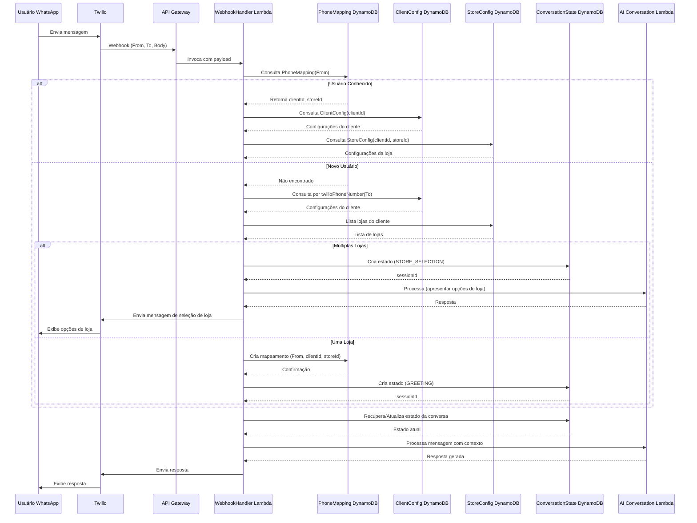

# Multi-Tenant Support e Identificação de Cliente/Loja para Chatbot WhatsApp

## 1. Visão Geral

Este documento detalha a estratégia para implementar o suporte multi-tenant e a identificação de cliente/loja no sistema de chatbot WhatsApp. O sistema deve suportar múltiplos clientes (restaurantes), cada um com suas próprias lojas, configurações e instâncias de chatbot.

## 2. Modelo de Dados para Multi-Tenancy

### 2.1. Tabela DynamoDB - Configuração de Clientes

**Tabela: `WhatsAppBotClientConfig`**

| Atributo | Tipo | Descrição |
|----------|------|-----------|
| `clientId` | String | Identificador único do cliente (restaurante) - Chave de Partição |
| `name` | String | Nome do cliente |
| `active` | Boolean | Status de ativação do cliente |
| `twilioAccountSid` | String | SID da conta Twilio do cliente |
| `twilioAuthToken` | String | Token de autenticação Twilio (ou referência ao Secret Manager) |
| `twilioPhoneNumber` | String | Número de telefone WhatsApp do cliente no Twilio |
| `asaasApiKey` | String | Chave API do Asaas (ou referência ao Secret Manager) |
| `asaasSandbox` | Boolean | Flag para ambiente sandbox do Asaas |
| `defaultLanguage` | String | Idioma padrão para interações (pt-BR, en-US, etc.) |
| `welcomeMessage` | String | Mensagem de boas-vindas personalizada |
| `logoUrl` | String | URL do logotipo do cliente para uso em mensagens ricas |
| `aiPromptTemplate` | String | Template de prompt personalizado para o modelo de IA |
| `createdAt` | Timestamp | Data de criação do registro |
| `updatedAt` | Timestamp | Data da última atualização |

### 2.2. Tabela DynamoDB - Configuração de Lojas

**Tabela: `WhatsAppBotStoreConfig`**

| Atributo | Tipo | Descrição |
|----------|------|-----------|
| `clientId` | String | ID do cliente ao qual a loja pertence - Chave de Partição |
| `storeId` | String | Identificador único da loja - Chave de Ordenação |
| `name` | String | Nome da loja |
| `active` | Boolean | Status de ativação da loja |
| `address` | Map | Endereço completo da loja |
| `phoneNumber` | String | Número de telefone da loja |
| `sqsQueueUrl` | String | URL da fila SQS FIFO específica da loja |
| `sqsQueueArn` | String | ARN da fila SQS FIFO específica da loja |
| `operatingHours` | Map | Horários de funcionamento por dia da semana |
| `deliveryConfig` | Map | Configurações de entrega (raio, taxa, etc.) |
| `paymentMethods` | List | Métodos de pagamento aceitos (PIX, CREDIT, DEBIT) |
| `createdAt` | Timestamp | Data de criação do registro |
| `updatedAt` | Timestamp | Data da última atualização |

### 2.3. Tabela DynamoDB - Mapeamento de Número de Telefone

**Tabela: `WhatsAppBotPhoneMapping`**

| Atributo | Tipo | Descrição |
|----------|------|-----------|
| `phoneNumber` | String | Número de telefone do usuário (formato E.164) - Chave de Partição |
| `clientId` | String | ID do cliente associado |
| `storeId` | String | ID da loja associada |
| `customerName` | String | Nome do cliente (se disponível) |
| `lastInteraction` | Timestamp | Timestamp da última interação |
| `createdAt` | Timestamp | Data de criação do registro |
| `updatedAt` | Timestamp | Data da última atualização |

### 2.4. Tabela DynamoDB - Estado da Conversa

**Tabela: `WhatsAppBotConversationState`**

| Atributo | Tipo | Descrição |
|----------|------|-----------|
| `sessionId` | String | ID único da sessão (phoneNumber + timestamp) - Chave de Partição |
| `phoneNumber` | String | Número de telefone do usuário |
| `clientId` | String | ID do cliente associado |
| `storeId` | String | ID da loja associada |
| `state` | String | Estado atual da conversa (GREETING, MENU_BROWSING, ITEM_SELECTION, etc.) |
| `context` | Map | Contexto da conversa (itens selecionados, preferências, etc.) |
| `currentOrder` | Map | Detalhes do pedido em andamento |
| `lastMessageTimestamp` | Number | Timestamp da última mensagem |
| `messageHistory` | List | Histórico recente de mensagens (limitado) |
| `ttl` | Number | Time-to-live para expiração automática (24h após lastMessageTimestamp) |
| `createdAt` | Timestamp | Data de criação da sessão |
| `updatedAt` | Timestamp | Data da última atualização |

## 3. Fluxo de Identificação de Cliente/Loja

### 3.1. Processo de Identificação

1. **Recebimento da Mensagem**:
   - Twilio envia webhook com a mensagem do usuário para o API Gateway
   - API Gateway aciona o Lambda `WebhookHandler`

2. **Identificação Inicial**:
   - `WebhookHandler` extrai o número de telefone do remetente (`From`) e o número do destinatário (`To`)
   - Consulta a tabela `WhatsAppBotPhoneMapping` usando o número do remetente

3. **Cenário 1: Usuário Conhecido (Mapeamento Existente)**:
   - Se o mapeamento existir, recupera `clientId` e `storeId`
   - Consulta `WhatsAppBotClientConfig` e `WhatsAppBotStoreConfig` para obter configurações completas
   - Recupera ou cria estado da conversa em `WhatsAppBotConversationState`

4. **Cenário 2: Novo Usuário (Sem Mapeamento)**:
   - Consulta `WhatsAppBotClientConfig` usando o número do destinatário (`To`) para identificar qual cliente (restaurante) está sendo contatado
   - Se múltiplas lojas existirem para o cliente, inicia fluxo de seleção de loja
   - Se apenas uma loja existir, associa automaticamente
   - Cria novo registro em `WhatsAppBotPhoneMapping`
   - Cria novo estado de conversa em `WhatsAppBotConversationState`

5. **Cenário 3: Mudança de Loja**:
   - Se o usuário solicitar explicitamente mudança de loja durante a conversa
   - Atualiza `WhatsAppBotPhoneMapping` com novo `storeId`
   - Reinicia o estado da conversa

### 3.2. Diagrama de Sequência para Identificação

## 4. Estratégia de Isolamento Multi-Tenant

### 4.1. Isolamento de Dados

- **Particionamento Lógico**: Todas as tabelas DynamoDB usam `clientId` como chave de partição ou atributo de consulta
- **Controle de Acesso**: Políticas IAM para Lambdas limitam acesso baseado em atributos (ABAC)
- **Auditoria**: Todos os acessos e modificações são registrados com ClientId/StoreId para rastreabilidade

### 4.2. Isolamento de Recursos

- **SQS FIFO**: Uma fila SQS FIFO dedicada por loja para comunicação com o POS
- **Secrets**: Credenciais sensíveis (Twilio, Asaas) armazenadas no AWS Secrets Manager com permissões por cliente
- **Logs**: Estrutura de logs do CloudWatch separada por cliente/loja para facilitar troubleshooting

### 4.3. Isolamento de Configuração

- **Personalização de IA**: Cada cliente pode ter seu próprio template de prompt para o modelo Bedrock
- **Fluxos de Conversa**: Comportamentos personalizáveis por cliente (mensagens, opções, fluxos)
- **Integrações**: Configurações específicas para integrações com Asaas e outros serviços

## 5. Gerenciamento de Configuração

### 5.1. API de Administração

Uma API REST separada será desenvolvida para gerenciar as configurações multi-tenant:

- **Endpoints para Clientes**: CRUD para `WhatsAppBotClientConfig`
- **Endpoints para Lojas**: CRUD para `WhatsAppBotStoreConfig`
- **Endpoints para Mapeamentos**: Gerenciamento de `WhatsAppBotPhoneMapping`
- **Endpoints para Diagnóstico**: Consulta de estado de conversas, histórico, etc.

### 5.2. Interface de Administração

Uma interface web de administração será desenvolvida para:

- Gerenciar clientes e lojas
- Configurar integrações (Twilio, Asaas)
- Personalizar prompts e fluxos de conversa
- Visualizar métricas e logs
- Testar conversas

## 6. Considerações de Escalabilidade

### 6.1. Particionamento de Dados

- DynamoDB configurado com capacidade sob demanda para escalar automaticamente
- Estratégia de particionamento eficiente para evitar hot keys
- TTL configurado para dados temporários (estados de conversa)

### 6.2. Limites de Serviço

- Monitoramento de limites de serviço da AWS (Lambda concurrency, DynamoDB throughput)
- Monitoramento de limites da API Twilio
- Monitoramento de limites do Amazon Bedrock

### 6.3. Estratégia de Cache

- Implementação de cache para configurações frequentemente acessadas
- Cache de respostas comuns do modelo de IA
- Cache de dados de menu e produtos

## 7. Considerações de Segurança

### 7.1. Proteção de Dados

- Criptografia em repouso para todas as tabelas DynamoDB
- Criptografia em trânsito para todas as comunicações
- Mascaramento de dados sensíveis em logs

### 7.2. Autenticação e Autorização

- Validação de assinatura de webhook do Twilio
- Políticas IAM granulares para cada Lambda
- Secrets Manager para credenciais sensíveis

### 7.3. Auditoria e Compliance

- Registro detalhado de todas as ações administrativas
- Rastreamento de todas as interações de usuário
- Conformidade com regulamentações de privacidade (LGPD)

## 8. Próximos Passos

1. **Implementação do Modelo de Dados**: Criar as tabelas DynamoDB com os esquemas definidos
2. **Desenvolvimento do Fluxo de Identificação**: Implementar a lógica no Lambda `WebhookHandler`
3. **Testes de Multi-Tenancy**: Validar o isolamento e a identificação com múltiplos clientes/lojas
4. **Desenvolvimento da API de Administração**: Criar endpoints para gerenciamento de configuração
5. **Documentação Operacional**: Preparar guias para configuração de novos clientes/lojas
