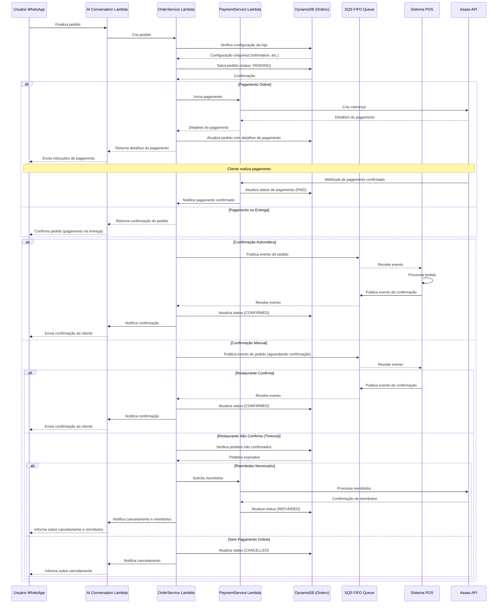
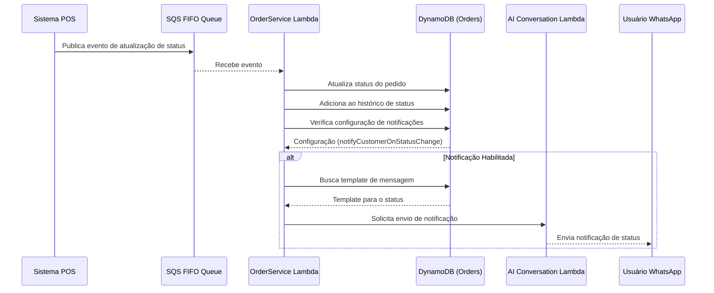
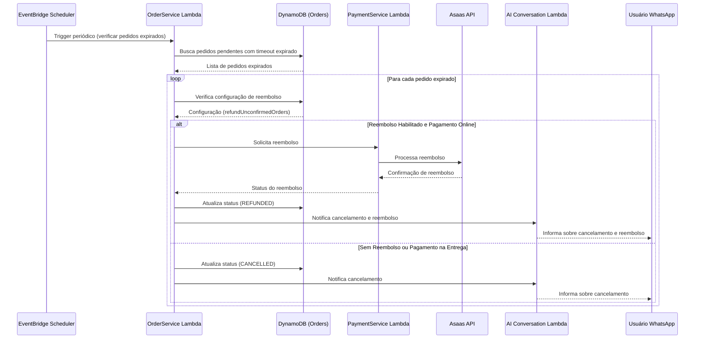
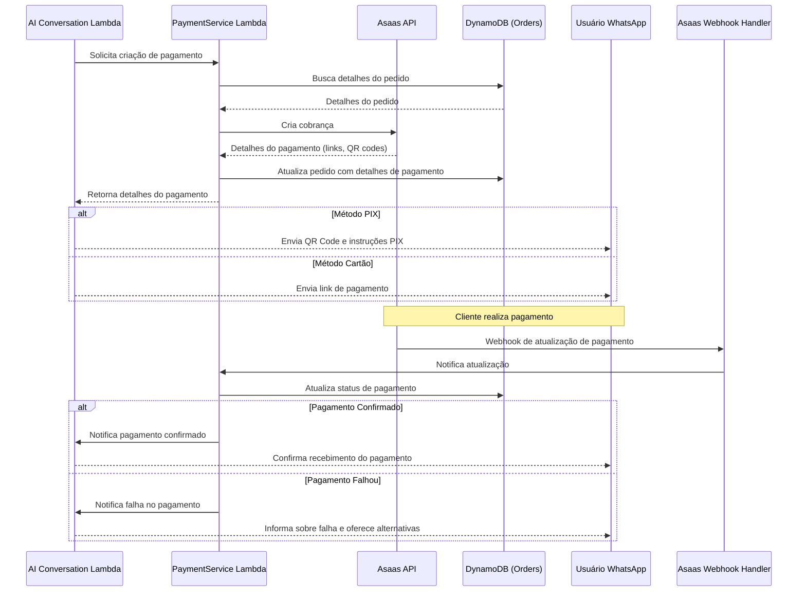
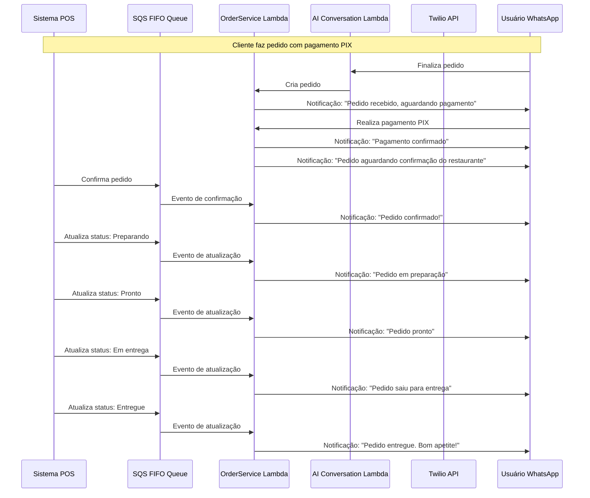
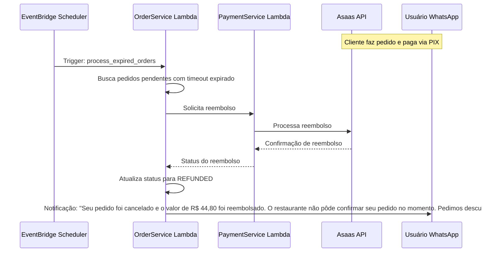

# Integração de Pagamento Online e Roteamento de Pedidos para Chatbot WhatsApp

## 1. Visão Geral

Este documento detalha a integração de pagamento online e o roteamento de pedidos do chatbot WhatsApp para o sistema POS Modern. O sistema deve processar pagamentos via Asaas, rotear pedidos para as filas específicas de cada restaurante, gerenciar confirmações de pedidos (automáticas ou manuais) e implementar um mecanismo de reembolso automático para pedidos não confirmados.

## 2. Modelo de Dados

### 2.1. Tabela DynamoDB - Configuração de Pedidos

**Tabela: `WhatsAppBotOrderConfig`**

| Atributo | Tipo | Descrição |
|----------|------|-----------|
| `clientId` | String | ID do cliente (restaurante) - Chave de Partição |
| `storeId` | String | ID da loja - Chave de Ordenação |
| `requiresConfirmation` | Boolean | Se pedidos requerem confirmação manual |
| `autoConfirmationTimeout` | Number | Tempo (minutos) para confirmação automática (0 = desabilitado) |
| `refundUnconfirmedOrders` | Boolean | Se deve reembolsar pedidos não confirmados |
| `refundTimeout` | Number | Tempo (minutos) para reembolso automático após não confirmação |
| `notifyCustomerOnStatusChange` | Boolean | Se deve notificar cliente em cada mudança de status |
| `notificationTemplates` | Map | Templates de mensagens para cada status |
| `acceptedPaymentMethods` | List | Métodos de pagamento aceitos (PIX, CREDIT, DEBIT, CASH) |
| `minimumOrderValue` | Number | Valor mínimo para pedidos |
| `operatingHoursCheck` | Boolean | Se deve verificar horário de funcionamento |
| `updatedAt` | String | Data da última atualização |

### 2.2. Tabela DynamoDB - Pedidos

**Tabela: `WhatsAppBotOrders`**

| Atributo | Tipo | Descrição |
|----------|------|-----------|
| `orderId` | String | ID único do pedido - Chave de Partição |
| `clientId` | String | ID do cliente (restaurante) - GSI |
| `storeId` | String | ID da loja - GSI |
| `customerId` | String | ID do cliente que fez o pedido - GSI |
| `phoneNumber` | String | Número de telefone do cliente - GSI |
| `status` | String | Status do pedido (PENDING, CONFIRMED, PREPARING, READY, DELIVERING, DELIVERED, CANCELLED, REFUNDED) |
| `items` | List | Lista de itens do pedido |
| `subtotal` | Number | Valor subtotal do pedido |
| `deliveryFee` | Number | Taxa de entrega |
| `discount` | Number | Valor de desconto |
| `total` | Number | Valor total do pedido |
| `paymentMethod` | String | Método de pagamento (PIX, CREDIT, DEBIT, CASH) |
| `paymentStatus` | String | Status do pagamento (PENDING, PAID, FAILED, REFUNDED) |
| `paymentId` | String | ID do pagamento no Asaas (se aplicável) |
| `paymentDetails` | Map | Detalhes do pagamento (links, QR codes, etc.) |
| `deliveryType` | String | Tipo de entrega (DELIVERY, PICKUP) |
| `deliveryAddress` | Map | Endereço de entrega (se aplicável) |
| `deliveryTime` | String | Horário estimado de entrega/retirada |
| `customerNotes` | String | Observações do cliente |
| `requiresConfirmation` | Boolean | Se o pedido requer confirmação manual |
| `confirmationTimeout` | String | Timestamp para timeout de confirmação |
| `refundTimeout` | String | Timestamp para timeout de reembolso |
| `statusHistory` | List | Histórico de mudanças de status |
| `createdAt` | String | Data de criação do pedido |
| `updatedAt` | String | Data da última atualização |
| `source` | String | Origem do pedido (WHATSAPP_BOT) |

**Estrutura de Item do Pedido:**

```json
{
  "itemId": "burger_cheese_bacon",
  "name": "Cheese Bacon",
  "quantity": 1,
  "unitPrice": 32.90,
  "totalPrice": 32.90,
  "customizations": {
    "adicionar": ["cebola caramelizada"],
    "remover": ["tomate"]
  },
  "notes": "Bem passado"
}
```

**Estrutura de Histórico de Status:**

```json
{
  "status": "CONFIRMED",
  "timestamp": "2025-05-24T15:30:45Z",
  "by": "RESTAURANT",
  "notes": "Pedido confirmado pelo restaurante"
}
```

### 2.3. Índices Secundários Globais (GSI)

1. **ClientStoreStatusIndex**:
   - Chave de Partição: `clientId`
   - Chave de Ordenação: `status`
   - Atributos projetados: Todos
   - Finalidade: Listar pedidos por cliente/restaurante e status

2. **PhoneNumberIndex**:
   - Chave de Partição: `phoneNumber`
   - Chave de Ordenação: `createdAt`
   - Atributos projetados: Todos
   - Finalidade: Buscar pedidos por número de telefone do cliente

3. **CustomerIdIndex**:
   - Chave de Partição: `customerId`
   - Chave de Ordenação: `createdAt`
   - Atributos projetados: Todos
   - Finalidade: Buscar pedidos por ID do cliente

4. **PaymentStatusIndex**:
   - Chave de Partição: `paymentStatus`
   - Chave de Ordenação: `createdAt`
   - Atributos projetados: Todos
   - Finalidade: Monitorar pedidos por status de pagamento

## 3. Fluxos de Integração

### 3.1. Fluxo de Criação de Pedido e Confirmação



### 3.2. Fluxo de Atualização de Status e Notificações



### 3.3. Fluxo de Reembolso Automático



### 3.4. Fluxo de Pagamento Online



## 4. Implementação do Serviço de Pedidos

### 4.1. Lambda OrderService

```python
import json
import boto3
import os
import uuid
from datetime import datetime, timedelta
from typing import Dict, Any, List, Optional

# Inicializar clientes AWS
dynamodb = boto3.resource('dynamodb')
sqs = boto3.client('sqs')
lambda_client = boto3.client('lambda')

# Tabelas DynamoDB
orders_table = dynamodb.Table(os.environ['ORDERS_TABLE'])
order_config_table = dynamodb.Table(os.environ['ORDER_CONFIG_TABLE'])

class OrderService:
    """Serviço para gerenciamento de pedidos."""
    
    async def create_order(self, 
                          client_id: str, 
                          store_id: str, 
                          items: List[Dict[str, Any]],
                          customer_info: Dict[str, Any],
                          delivery_info: Dict[str, Any],
                          payment_method: str) -> Dict[str, Any]:
        """
        Cria um novo pedido.
        
        Args:
            client_id: ID do cliente (restaurante)
            store_id: ID da loja
            items: Lista de itens do pedido
            customer_info: Informações do cliente
            delivery_info: Informações de entrega
            payment_method: Método de pagamento
            
        Returns:
            Dados do pedido criado
        """
        try:
            # Buscar configuração da loja
            config = await self._get_order_config(client_id, store_id)
            
            # Verificar se o método de pagamento é aceito
            accepted_methods = config.get('acceptedPaymentMethods', ['PIX', 'CREDIT', 'DEBIT', 'CASH'])
            if payment_method not in accepted_methods:
                raise ValueError(f"Payment method {payment_method} not accepted by this store")
            
            # Calcular valores
            subtotal = sum(item.get('totalPrice', 0) for item in items)
            delivery_fee = delivery_info.get('fee', 0)
            discount = 0  # Implementar lógica de desconto se necessário
            total = subtotal + delivery_fee - discount
            
            # Verificar valor mínimo do pedido
            minimum_value = config.get('minimumOrderValue', 0)
            if subtotal < minimum_value:
                raise ValueError(f"Order value below minimum: {subtotal} < {minimum_value}")
            
            # Gerar ID único para o pedido
            order_id = f"order_{uuid.uuid4().hex[:12]}"
            now = datetime.now()
            
            # Determinar se requer confirmação
            requires_confirmation = config.get('requiresConfirmation', False)
            
            # Calcular timeouts se necessário
            confirmation_timeout = None
            refund_timeout = None
            
            if requires_confirmation:
                auto_confirm_minutes = config.get('autoConfirmationTimeout', 0)
                if auto_confirm_minutes > 0:
                    confirmation_timeout = (now + timedelta(minutes=auto_confirm_minutes)).isoformat()
                
                if config.get('refundUnconfirmedOrders', False) and payment_method in ['PIX', 'CREDIT', 'DEBIT']:
                    refund_minutes = config.get('refundTimeout', 60)  # Default 1 hora
                    refund_timeout = (now + timedelta(minutes=refund_minutes)).isoformat()
            
            # Criar objeto do pedido
            order = {
                "orderId": order_id,
                "clientId": client_id,
                "storeId": store_id,
                "customerId": customer_info.get('customer_id'),
                "phoneNumber": customer_info.get('phone_number'),
                "status": "PENDING",
                "items": items,
                "subtotal": subtotal,
                "deliveryFee": delivery_fee,
                "discount": discount,
                "total": total,
                "paymentMethod": payment_method,
                "paymentStatus": "PENDING" if payment_method in ['PIX', 'CREDIT', 'DEBIT'] else "NOT_APPLICABLE",
                "paymentId": None,
                "paymentDetails": {},
                "deliveryType": delivery_info.get('type', 'DELIVERY'),
                "deliveryAddress": delivery_info.get('address', {}),
                "deliveryTime": None,
                "customerNotes": delivery_info.get('notes', ''),
                "requiresConfirmation": requires_confirmation,
                "confirmationTimeout": confirmation_timeout,
                "refundTimeout": refund_timeout,
                "statusHistory": [
                    {
                        "status": "PENDING",
                        "timestamp": now.isoformat(),
                        "by": "SYSTEM",
                        "notes": "Pedido criado"
                    }
                ],
                "createdAt": now.isoformat(),
                "updatedAt": now.isoformat(),
                "source": "WHATSAPP_BOT"
            }
            
            # Salvar no DynamoDB
            orders_table.put_item(Item=order)
            
            # Se for pagamento online, iniciar processo de pagamento
            if payment_method in ['PIX', 'CREDIT', 'DEBIT']:
                payment_details = await self._initiate_payment(
                    order_id=order_id,
                    client_id=client_id,
                    store_id=store_id,
                    total=total,
                    payment_method=payment_method,
                    customer_info=customer_info
                )
                
                if payment_details:
                    # Atualizar pedido com detalhes do pagamento
                    orders_table.update_item(
                        Key={'orderId': order_id},
                        UpdateExpression="SET paymentId = :pid, paymentDetails = :pdetails, updatedAt = :updated",
                        ExpressionAttributeValues={
                            ':pid': payment_details.get('payment_id'),
                            ':pdetails': payment_details,
                            ':updated': now.isoformat()
                        }
                    )
                    
                    order['paymentId'] = payment_details.get('payment_id')
                    order['paymentDetails'] = payment_details
            
            # Se não requer confirmação, enviar diretamente para o POS
            if not requires_confirmation:
                await self._send_order_to_pos(order)
            else:
                # Se requer confirmação, enviar com flag de aguardando confirmação
                await self._send_order_to_pos(order, awaiting_confirmation=True)
            
            return order
            
        except Exception as e:
            print(f"Error creating order: {e}")
            raise
    
    async def update_order_status(self, 
                                 order_id: str, 
                                 new_status: str,
                                 updated_by: str,
                                 notes: str = None) -> Dict[str, Any]:
        """
        Atualiza o status de um pedido.
        
        Args:
            order_id: ID do pedido
            new_status: Novo status
            updated_by: Quem atualizou (RESTAURANT, SYSTEM, CUSTOMER)
            notes: Observações sobre a atualização
            
        Returns:
            Dados atualizados do pedido
        """
        try:
            # Buscar pedido atual
            order = await self.get_order(order_id)
            if not order:
                raise ValueError(f"Order not found: {order_id}")
            
            # Verificar se é uma atualização válida
            current_status = order.get('status')
            if current_status == new_status:
                return order  # Nenhuma mudança necessária
            
            # Validar transição de status (implementar regras específicas se necessário)
            valid_transitions = self._get_valid_status_transitions(current_status)
            if new_status not in valid_transitions:
                raise ValueError(f"Invalid status transition: {current_status} -> {new_status}")
            
            now = datetime.now().isoformat()
            
            # Preparar histórico de status
            status_entry = {
                "status": new_status,
                "timestamp": now,
                "by": updated_by,
                "notes": notes or f"Status atualizado de {current_status} para {new_status}"
            }
            
            # Atualizar pedido
            status_history = order.get('statusHistory', [])
            status_history.append(status_entry)
            
            update_expression = "SET #status = :status, statusHistory = :history, updatedAt = :updated"
            expression_values = {
                ':status': new_status,
                ':history': status_history,
                ':updated': now
            }
            
            # Lógica específica para certos status
            if new_status == "CONFIRMED":
                # Se confirmado, limpar timeout de confirmação
                update_expression += ", confirmationTimeout = :null"
                expression_values[':null'] = None
            
            elif new_status == "CANCELLED":
                # Se cancelado e tinha pagamento online, verificar necessidade de reembolso
                payment_method = order.get('paymentMethod')
                payment_status = order.get('paymentStatus')
                
                if payment_method in ['PIX', 'CREDIT', 'DEBIT'] and payment_status == "PAID":
                    # Iniciar processo de reembolso
                    await self._process_refund(order_id)
            
            # Executar atualização
            response = orders_table.update_item(
                Key={'orderId': order_id},
                UpdateExpression=update_expression,
                ExpressionAttributeNames={'#status': 'status'},
                ExpressionAttributeValues=expression_values,
                ReturnValues="ALL_NEW"
            )
            
            updated_order = response.get('Attributes', {})
            
            # Verificar se deve notificar o cliente
            client_id = order.get('clientId')
            store_id = order.get('storeId')
            config = await self._get_order_config(client_id, store_id)
            
            if config.get('notifyCustomerOnStatusChange', True):
                await self._notify_customer_status_change(updated_order, new_status)
            
            return updated_order
            
        except Exception as e:
            print(f"Error updating order status: {e}")
            raise
    
    async def get_order(self, order_id: str) -> Optional[Dict[str, Any]]:
        """Busca um pedido pelo ID."""
        try:
            response = orders_table.get_item(Key={'orderId': order_id})
            return response.get('Item')
        except Exception as e:
            print(f"Error retrieving order: {e}")
            return None
    
    async def get_orders_by_customer(self, 
                                    customer_id: str, 
                                    limit: int = 10) -> List[Dict[str, Any]]:
        """Busca pedidos de um cliente."""
        try:
            response = orders_table.query(
                IndexName='CustomerIdIndex',
                KeyConditionExpression='customerId = :cid',
                ExpressionAttributeValues={':cid': customer_id},
                ScanIndexForward=False,  # Ordem decrescente por data
                Limit=limit
            )
            return response.get('Items', [])
        except Exception as e:
            print(f"Error retrieving orders by customer: {e}")
            return []
    
    async def get_orders_by_phone(self, 
                                 phone_number: str, 
                                 limit: int = 10) -> List[Dict[str, Any]]:
        """Busca pedidos por número de telefone."""
        try:
            response = orders_table.query(
                IndexName='PhoneNumberIndex',
                KeyConditionExpression='phoneNumber = :phone',
                ExpressionAttributeValues={':phone': phone_number},
                ScanIndexForward=False,  # Ordem decrescente por data
                Limit=limit
            )
            return response.get('Items', [])
        except Exception as e:
            print(f"Error retrieving orders by phone: {e}")
            return []
    
    async def get_store_orders(self, 
                              client_id: str, 
                              store_id: str,
                              status: str = None,
                              limit: int = 50) -> List[Dict[str, Any]]:
        """Busca pedidos de uma loja, opcionalmente filtrados por status."""
        try:
            if status:
                # Buscar por cliente/loja e status específico
                response = orders_table.query(
                    IndexName='ClientStoreStatusIndex',
                    KeyConditionExpression='clientId = :cid AND #status = :status',
                    ExpressionAttributeNames={'#status': 'status'},
                    ExpressionAttributeValues={
                        ':cid': client_id,
                        ':status': status,
                        ':sid': store_id
                    },
                    FilterExpression='storeId = :sid',
                    ScanIndexForward=False,
                    Limit=limit
                )
            else:
                # Buscar todos os pedidos da loja
                response = orders_table.query(
                    KeyConditionExpression='clientId = :cid',
                    ExpressionAttributeValues={
                        ':cid': client_id,
                        ':sid': store_id
                    },
                    FilterExpression='storeId = :sid',
                    ScanIndexForward=False,
                    Limit=limit
                )
            
            return response.get('Items', [])
        except Exception as e:
            print(f"Error retrieving store orders: {e}")
            return []
    
    async def process_expired_orders(self) -> Dict[str, int]:
        """
        Processa pedidos com timeout de confirmação expirado.
        
        Returns:
            Estatísticas de processamento
        """
        try:
            now = datetime.now().isoformat()
            
            # Buscar pedidos pendentes com timeout expirado
            response = orders_table.scan(
                FilterExpression='#status = :status AND confirmationTimeout < :now',
                ExpressionAttributeNames={'#status': 'status'},
                ExpressionAttributeValues={
                    ':status': 'PENDING',
                    ':now': now
                }
            )
            
            expired_orders = response.get('Items', [])
            stats = {
                'total_processed': len(expired_orders),
                'cancelled': 0,
                'refunded': 0,
                'errors': 0
            }
            
            for order in expired_orders:
                try:
                    order_id = order.get('orderId')
                    payment_method = order.get('paymentMethod')
                    payment_status = order.get('paymentStatus')
                    
                    # Verificar se precisa de reembolso
                    if payment_method in ['PIX', 'CREDIT', 'DEBIT'] and payment_status == 'PAID':
                        # Processar reembolso
                        refund_result = await self._process_refund(order_id)
                        if refund_result.get('success'):
                            stats['refunded'] += 1
                        else:
                            stats['errors'] += 1
                    else:
                        # Apenas cancelar
                        await self.update_order_status(
                            order_id=order_id,
                            new_status='CANCELLED',
                            updated_by='SYSTEM',
                            notes='Cancelado automaticamente por timeout de confirmação'
                        )
                        stats['cancelled'] += 1
                
                except Exception as e:
                    print(f"Error processing expired order {order.get('orderId')}: {e}")
                    stats['errors'] += 1
            
            return stats
            
        except Exception as e:
            print(f"Error processing expired orders: {e}")
            return {'total_processed': 0, 'cancelled': 0, 'refunded': 0, 'errors': 1}
    
    async def update_payment_status(self, 
                                   order_id: str, 
                                   payment_status: str,
                                   payment_details: Dict[str, Any] = None) -> Dict[str, Any]:
        """
        Atualiza o status de pagamento de um pedido.
        
        Args:
            order_id: ID do pedido
            payment_status: Novo status de pagamento
            payment_details: Detalhes adicionais do pagamento
            
        Returns:
            Dados atualizados do pedido
        """
        try:
            # Buscar pedido atual
            order = await self.get_order(order_id)
            if not order:
                raise ValueError(f"Order not found: {order_id}")
            
            now = datetime.now().isoformat()
            
            # Preparar atualização
            update_expression = "SET paymentStatus = :status, updatedAt = :updated"
            expression_values = {
                ':status': payment_status,
                ':updated': now
            }
            
            # Adicionar detalhes de pagamento se fornecidos
            if payment_details:
                update_expression += ", paymentDetails = :details"
                expression_values[':details'] = payment_details
            
            # Executar atualização
            response = orders_table.update_item(
                Key={'orderId': order_id},
                UpdateExpression=update_expression,
                ExpressionAttributeValues=expression_values,
                ReturnValues="ALL_NEW"
            )
            
            updated_order = response.get('Attributes', {})
            
            # Lógica específica para certos status de pagamento
            if payment_status == "PAID":
                # Se o pagamento foi confirmado e o pedido não requer confirmação,
                # atualizar status do pedido para CONFIRMED
                if not order.get('requiresConfirmation', False) and order.get('status') == "PENDING":
                    await self.update_order_status(
                        order_id=order_id,
                        new_status="CONFIRMED",
                        updated_by="SYSTEM",
                        notes="Confirmado automaticamente após pagamento"
                    )
                
                # Notificar cliente sobre pagamento confirmado
                await self._notify_customer_payment_confirmed(updated_order)
            
            elif payment_status == "FAILED":
                # Notificar cliente sobre falha no pagamento
                await self._notify_customer_payment_failed(updated_order)
            
            elif payment_status == "REFUNDED":
                # Se o pagamento foi reembolsado, atualizar status do pedido para REFUNDED
                if order.get('status') not in ["REFUNDED", "CANCELLED"]:
                    await self.update_order_status(
                        order_id=order_id,
                        new_status="REFUNDED",
                        updated_by="SYSTEM",
                        notes="Pedido reembolsado"
                    )
                
                # Notificar cliente sobre reembolso
                await self._notify_customer_payment_refunded(updated_order)
            
            return updated_order
            
        except Exception as e:
            print(f"Error updating payment status: {e}")
            raise
    
    async def _get_order_config(self, client_id: str, store_id: str) -> Dict[str, Any]:
        """Busca configuração de pedidos para uma loja."""
        try:
            response = order_config_table.get_item(
                Key={'clientId': client_id, 'storeId': store_id}
            )
            
            config = response.get('Item', {})
            
            # Se não encontrou configuração específica, usar padrões
            if not config:
                config = {
                    'clientId': client_id,
                    'storeId': store_id,
                    'requiresConfirmation': False,
                    'autoConfirmationTimeout': 0,
                    'refundUnconfirmedOrders': True,
                    'refundTimeout': 60,
                    'notifyCustomerOnStatusChange': True,
                    'acceptedPaymentMethods': ['PIX', 'CREDIT', 'DEBIT', 'CASH'],
                    'minimumOrderValue': 0,
                    'operatingHoursCheck': False
                }
            
            return config
            
        except Exception as e:
            print(f"Error retrieving order config: {e}")
            # Retornar configuração padrão em caso de erro
            return {
                'requiresConfirmation': False,
                'autoConfirmationTimeout': 0,
                'refundUnconfirmedOrders': True,
                'refundTimeout': 60,
                'notifyCustomerOnStatusChange': True,
                'acceptedPaymentMethods': ['PIX', 'CREDIT', 'DEBIT', 'CASH'],
                'minimumOrderValue': 0,
                'operatingHoursCheck': False
            }
    
    async def _initiate_payment(self, 
                               order_id: str,
                               client_id: str,
                               store_id: str,
                               total: float,
                               payment_method: str,
                               customer_info: Dict[str, Any]) -> Dict[str, Any]:
        """Inicia processo de pagamento via Asaas."""
        try:
            # Invocar Lambda do PaymentService
            response = lambda_client.invoke(
                FunctionName=os.environ['PAYMENT_SERVICE_LAMBDA_ARN'],
                InvocationType='RequestResponse',
                Payload=json.dumps({
                    'action': 'create_payment',
                    'params': {
                        'client_id': client_id,
                        'store_id': store_id,
                        'order_id': order_id,
                        'amount': total,
                        'payment_method': payment_method,
                        'customer_info': customer_info,
                        'description': f"Pedido #{order_id}"
                    }
                })
            )
            
            payload = json.loads(response['Payload'].read())
            body = json.loads(payload.get('body', '{}'))
            
            if payload.get('statusCode') == 200 and 'error' not in body:
                return body
            
            print(f"Error initiating payment: {body.get('error')}")
            return None
            
        except Exception as e:
            print(f"Error initiating payment: {e}")
            return None
    
    async def _process_refund(self, order_id: str) -> Dict[str, Any]:
        """Processa reembolso de um pedido."""
        try:
            # Buscar pedido
            order = await self.get_order(order_id)
            if not order:
                return {'success': False, 'error': f"Order not found: {order_id}"}
            
            payment_id = order.get('paymentId')
            if not payment_id:
                return {'success': False, 'error': "No payment ID found"}
            
            # Invocar Lambda do PaymentService
            response = lambda_client.invoke(
                FunctionName=os.environ['PAYMENT_SERVICE_LAMBDA_ARN'],
                InvocationType='RequestResponse',
                Payload=json.dumps({
                    'action': 'refund_payment',
                    'params': {
                        'client_id': order.get('clientId'),
                        'store_id': order.get('storeId'),
                        'order_id': order_id,
                        'payment_id': payment_id,
                        'reason': "Pedido não confirmado pelo restaurante"
                    }
                })
            )
            
            payload = json.loads(response['Payload'].read())
            body = json.loads(payload.get('body', '{}'))
            
            if payload.get('statusCode') == 200 and 'error' not in body:
                # Atualizar status do pedido
                await self.update_order_status(
                    order_id=order_id,
                    new_status="REFUNDED",
                    updated_by="SYSTEM",
                    notes="Reembolsado automaticamente por falta de confirmação"
                )
                
                # Atualizar status do pagamento
                await self.update_payment_status(
                    order_id=order_id,
                    payment_status="REFUNDED",
                    payment_details=body
                )
                
                return {'success': True, 'result': body}
            
            return {'success': False, 'error': body.get('error', "Unknown error")}
            
        except Exception as e:
            print(f"Error processing refund: {e}")
            return {'success': False, 'error': str(e)}
    
    async def _send_order_to_pos(self, 
                                order: Dict[str, Any], 
                                awaiting_confirmation: bool = False) -> bool:
        """Envia pedido para o sistema POS via SQS."""
        try:
            client_id = order.get('clientId')
            store_id = order.get('storeId')
            
            # Buscar URL da fila SQS da loja
            store_config_table = dynamodb.Table(os.environ['STORE_CONFIG_TABLE'])
            store_response = store_config_table.get_item(
                Key={'clientId': client_id, 'storeId': store_id}
            )
            
            store_config = store_response.get('Item', {})
            queue_url = store_config.get('sqsQueueUrl')
            
            if not queue_url:
                print(f"Cannot send order: no SQS queue URL for client {client_id}, store {store_id}")
                return False
            
            # Preparar evento
            event = {
                'type': 'REMOTE_ORDER_RECEIVED',
                'timestamp': datetime.now().isoformat(),
                'data': {
                    'order': order,
                    'awaiting_confirmation': awaiting_confirmation
                }
            }
            
            # Enviar para a fila SQS
            sqs.send_message(
                QueueUrl=queue_url,
                MessageBody=json.dumps(event),
                MessageGroupId=client_id,  # Para filas FIFO
                MessageDeduplicationId=f"order_{order.get('orderId')}_{datetime.now().timestamp()}"
            )
            
            return True
            
        except Exception as e:
            print(f"Error sending order to POS: {e}")
            return False
    
    async def _notify_customer_status_change(self, 
                                            order: Dict[str, Any], 
                                            status: str) -> bool:
        """Notifica cliente sobre mudança de status do pedido."""
        try:
            # Buscar configuração para obter template de mensagem
            client_id = order.get('clientId')
            store_id = order.get('storeId')
            config = await self._get_order_config(client_id, store_id)
            
            templates = config.get('notificationTemplates', {})
            template = templates.get(status, f"Seu pedido #{order.get('orderId')} está com status: {status}")
            
            # Preparar dados para substituição no template
            order_id = order.get('orderId')
            total = order.get('total', 0)
            delivery_time = order.get('deliveryTime', 'em breve')
            
            # Substituir placeholders no template
            message = template.replace('{order_id}', order_id)
            message = message.replace('{total}', f"R$ {total:.2f}")
            message = message.replace('{delivery_time}', delivery_time)
            
            # Invocar Lambda de AI Conversation para enviar mensagem
            phone_number = order.get('phoneNumber')
            if not phone_number:
                return False
            
            response = lambda_client.invoke(
                FunctionName=os.environ['AI_CONVERSATION_LAMBDA_ARN'],
                InvocationType='RequestResponse',
                Payload=json.dumps({
                    'action': 'send_notification',
                    'params': {
                        'phone_number': phone_number,
                        'message': message,
                        'client_id': client_id,
                        'store_id': store_id
                    }
                })
            )
            
            payload = json.loads(response['Payload'].read())
            return payload.get('statusCode') == 200
            
        except Exception as e:
            print(f"Error notifying customer: {e}")
            return False
    
    async def _notify_customer_payment_confirmed(self, order: Dict[str, Any]) -> bool:
        """Notifica cliente sobre confirmação de pagamento."""
        try:
            # Mensagem personalizada para confirmação de pagamento
            message = f"Seu pagamento para o pedido #{order.get('orderId')} foi confirmado! Obrigado."
            
            # Invocar Lambda de AI Conversation para enviar mensagem
            phone_number = order.get('phoneNumber')
            if not phone_number:
                return False
            
            response = lambda_client.invoke(
                FunctionName=os.environ['AI_CONVERSATION_LAMBDA_ARN'],
                InvocationType='RequestResponse',
                Payload=json.dumps({
                    'action': 'send_notification',
                    'params': {
                        'phone_number': phone_number,
                        'message': message,
                        'client_id': order.get('clientId'),
                        'store_id': order.get('storeId')
                    }
                })
            )
            
            payload = json.loads(response['Payload'].read())
            return payload.get('statusCode') == 200
            
        except Exception as e:
            print(f"Error notifying customer about payment: {e}")
            return False
    
    async def _notify_customer_payment_failed(self, order: Dict[str, Any]) -> bool:
        """Notifica cliente sobre falha no pagamento."""
        try:
            # Mensagem personalizada para falha de pagamento
            message = f"Houve um problema com seu pagamento para o pedido #{order.get('orderId')}. Por favor, tente novamente ou escolha outro método de pagamento."
            
            # Invocar Lambda de AI Conversation para enviar mensagem
            phone_number = order.get('phoneNumber')
            if not phone_number:
                return False
            
            response = lambda_client.invoke(
                FunctionName=os.environ['AI_CONVERSATION_LAMBDA_ARN'],
                InvocationType='RequestResponse',
                Payload=json.dumps({
                    'action': 'send_notification',
                    'params': {
                        'phone_number': phone_number,
                        'message': message,
                        'client_id': order.get('clientId'),
                        'store_id': order.get('storeId')
                    }
                })
            )
            
            payload = json.loads(response['Payload'].read())
            return payload.get('statusCode') == 200
            
        except Exception as e:
            print(f"Error notifying customer about payment failure: {e}")
            return False
    
    async def _notify_customer_payment_refunded(self, order: Dict[str, Any]) -> bool:
        """Notifica cliente sobre reembolso."""
        try:
            # Mensagem personalizada para reembolso
            message = f"Seu pedido #{order.get('orderId')} foi cancelado e o valor de R$ {order.get('total', 0):.2f} foi reembolsado. O restaurante não pôde confirmar seu pedido no momento. Pedimos desculpas pelo inconveniente."
            
            # Invocar Lambda de AI Conversation para enviar mensagem
            phone_number = order.get('phoneNumber')
            if not phone_number:
                return False
            
            response = lambda_client.invoke(
                FunctionName=os.environ['AI_CONVERSATION_LAMBDA_ARN'],
                InvocationType='RequestResponse',
                Payload=json.dumps({
                    'action': 'send_notification',
                    'params': {
                        'phone_number': phone_number,
                        'message': message,
                        'client_id': order.get('clientId'),
                        'store_id': order.get('storeId')
                    }
                })
            )
            
            payload = json.loads(response['Payload'].read())
            return payload.get('statusCode') == 200
            
        except Exception as e:
            print(f"Error notifying customer about refund: {e}")
            return False
    
    def _get_valid_status_transitions(self, current_status: str) -> List[str]:
        """Retorna transições de status válidas a partir do status atual."""
        transitions = {
            "PENDING": ["CONFIRMED", "CANCELLED", "REFUNDED"],
            "CONFIRMED": ["PREPARING", "CANCELLED", "REFUNDED"],
            "PREPARING": ["READY", "CANCELLED", "REFUNDED"],
            "READY": ["DELIVERING", "COMPLETED", "CANCELLED", "REFUNDED"],
            "DELIVERING": ["DELIVERED", "CANCELLED", "REFUNDED"],
            "DELIVERED": ["COMPLETED"],
            "COMPLETED": [],  # Status final
            "CANCELLED": ["REFUNDED"],  # Só pode ir para reembolsado
            "REFUNDED": []  # Status final
        }
        
        return transitions.get(current_status, [])


# Handler para o Lambda
async def lambda_handler(event, context):
    """Handler para o Lambda OrderService."""
    try:
        # Extrair ação e parâmetros
        action = event.get('action')
        params = event.get('params', {})
        
        # Inicializar serviço
        service = OrderService()
        
        # Executar ação apropriada
        if action == 'create_order':
            result = await service.create_order(
                client_id=params.get('client_id'),
                store_id=params.get('store_id'),
                items=params.get('items', []),
                customer_info=params.get('customer_info', {}),
                delivery_info=params.get('delivery_info', {}),
                payment_method=params.get('payment_method', 'CASH')
            )
        elif action == 'update_order_status':
            result = await service.update_order_status(
                order_id=params.get('order_id'),
                new_status=params.get('new_status'),
                updated_by=params.get('updated_by', 'SYSTEM'),
                notes=params.get('notes')
            )
        elif action == 'get_order':
            result = await service.get_order(
                order_id=params.get('order_id')
            )
        elif action == 'get_orders_by_customer':
            result = await service.get_orders_by_customer(
                customer_id=params.get('customer_id'),
                limit=params.get('limit', 10)
            )
        elif action == 'get_orders_by_phone':
            result = await service.get_orders_by_phone(
                phone_number=params.get('phone_number'),
                limit=params.get('limit', 10)
            )
        elif action == 'get_store_orders':
            result = await service.get_store_orders(
                client_id=params.get('client_id'),
                store_id=params.get('store_id'),
                status=params.get('status'),
                limit=params.get('limit', 50)
            )
        elif action == 'process_expired_orders':
            result = await service.process_expired_orders()
        elif action == 'update_payment_status':
            result = await service.update_payment_status(
                order_id=params.get('order_id'),
                payment_status=params.get('payment_status'),
                payment_details=params.get('payment_details')
            )
        else:
            return {
                'statusCode': 400,
                'body': json.dumps({'error': f"Unknown action: {action}"})
            }
        
        return {
            'statusCode': 200,
            'body': json.dumps(result, default=str) if result else json.dumps({'message': 'No data found'})
        }
        
    except Exception as e:
        print(f"Error in lambda_handler: {e}")
        return {
            'statusCode': 500,
            'body': json.dumps({'error': str(e)})
        }
```

### 4.2. Integração com o Lambda de Pagamento

```python
# Trecho do PaymentService para integração com Asaas

async def create_payment(self,
                        client_id: str,
                        store_id: str,
                        order_id: str,
                        amount: float,
                        payment_method: str,
                        customer_info: Dict[str, Any],
                        description: str) -> Dict[str, Any]:
    """
    Cria um novo pagamento via Asaas.
    
    Args:
        client_id: ID do cliente (restaurante)
        store_id: ID da loja
        order_id: ID do pedido
        amount: Valor do pagamento
        payment_method: Método de pagamento (PIX, CREDIT, DEBIT)
        customer_info: Informações do cliente
        description: Descrição do pagamento
        
    Returns:
        Detalhes do pagamento criado
    """
    try:
        # Buscar configuração do Asaas para o cliente
        asaas_config = await self._get_asaas_config(client_id)
        
        api_key = asaas_config.get('apiKey')
        sandbox = asaas_config.get('sandbox', True)
        
        if not api_key:
            raise ValueError(f"Asaas API key not configured for client: {client_id}")
        
        # Determinar URL base com base no ambiente
        base_url = "https://sandbox.asaas.com/api/v3" if sandbox else "https://www.asaas.com/api/v3"
        
        # Verificar se o cliente já existe no Asaas ou criar novo
        customer_id = await self._get_or_create_asaas_customer(
            api_key=api_key,
            base_url=base_url,
            name=customer_info.get('name', 'Cliente'),
            email=customer_info.get('email'),
            phone=customer_info.get('phone_number'),
            cpf=customer_info.get('cpf')
        )
        
        if not customer_id:
            raise ValueError("Failed to get or create Asaas customer")
        
        # Mapear método de pagamento para Asaas
        asaas_method = {
            'PIX': 'PIX',
            'CREDIT': 'CREDIT_CARD',
            'DEBIT': 'DEBIT_CARD'
        }.get(payment_method)
        
        if not asaas_method:
            raise ValueError(f"Unsupported payment method: {payment_method}")
        
        # Preparar dados do pagamento
        payment_data = {
            "customer": customer_id,
            "billingType": asaas_method,
            "value": amount,
            "dueDate": datetime.now().strftime("%Y-%m-%d"),
            "description": description,
            "externalReference": order_id
        }
        
        # Adicionar configurações específicas para PIX
        if asaas_method == 'PIX':
            payment_data["discount"] = {
                "value": 0,
                "dueDateLimitDays": 0
            }
            payment_data["fine"] = {
                "value": 0
            }
            payment_data["interest"] = {
                "value": 0
            }
        
        # Criar pagamento no Asaas
        async with aiohttp.ClientSession() as session:
            async with session.post(
                f"{base_url}/payments",
                headers={
                    "access_token": api_key,
                    "Content-Type": "application/json"
                },
                json=payment_data
            ) as response:
                if response.status != 200:
                    error_data = await response.json()
                    raise ValueError(f"Asaas API error: {error_data}")
                
                payment_response = await response.json()
        
        # Processar resposta
        payment_id = payment_response.get('id')
        
        # Para PIX, buscar QR code
        pix_info = {}
        if asaas_method == 'PIX':
            pix_info = await self._get_pix_info(api_key, base_url, payment_id)
        
        # Para cartão, gerar link de pagamento
        payment_url = None
        if asaas_method in ['CREDIT_CARD', 'DEBIT_CARD']:
            payment_url = await self._get_payment_link(api_key, base_url, payment_id)
        
        # Preparar resultado
        result = {
            "payment_id": payment_id,
            "status": payment_response.get('status'),
            "method": payment_method,
            "amount": amount,
            "due_date": payment_response.get('dueDate'),
            "description": description,
            "external_reference": order_id
        }
        
        if pix_info:
            result.update(pix_info)
        
        if payment_url:
            result["payment_url"] = payment_url
        
        # Salvar registro do pagamento no DynamoDB
        await self._save_payment_record(
            payment_id=payment_id,
            client_id=client_id,
            store_id=store_id,
            order_id=order_id,
            amount=amount,
            method=payment_method,
            status=payment_response.get('status'),
            details=result
        )
        
        return result
        
    except Exception as e:
        print(f"Error creating payment: {e}")
        raise

async def refund_payment(self,
                        client_id: str,
                        store_id: str,
                        order_id: str,
                        payment_id: str,
                        reason: str = None) -> Dict[str, Any]:
    """
    Processa reembolso de um pagamento.
    
    Args:
        client_id: ID do cliente (restaurante)
        store_id: ID da loja
        order_id: ID do pedido
        payment_id: ID do pagamento no Asaas
        reason: Motivo do reembolso
        
    Returns:
        Detalhes do reembolso
    """
    try:
        # Buscar configuração do Asaas para o cliente
        asaas_config = await self._get_asaas_config(client_id)
        
        api_key = asaas_config.get('apiKey')
        sandbox = asaas_config.get('sandbox', True)
        
        if not api_key:
            raise ValueError(f"Asaas API key not configured for client: {client_id}")
        
        # Determinar URL base com base no ambiente
        base_url = "https://sandbox.asaas.com/api/v3" if sandbox else "https://www.asaas.com/api/v3"
        
        # Buscar pagamento para verificar status
        async with aiohttp.ClientSession() as session:
            async with session.get(
                f"{base_url}/payments/{payment_id}",
                headers={"access_token": api_key}
            ) as response:
                if response.status != 200:
                    error_data = await response.json()
                    raise ValueError(f"Asaas API error: {error_data}")
                
                payment_data = await response.json()
        
        # Verificar se o pagamento pode ser reembolsado
        status = payment_data.get('status')
        if status != 'RECEIVED':
            raise ValueError(f"Payment cannot be refunded. Current status: {status}")
        
        # Processar reembolso
        refund_data = {
            "value": payment_data.get('value'),  # Reembolso total
            "description": reason or "Reembolso automático"
        }
        
        async with aiohttp.ClientSession() as session:
            async with session.post(
                f"{base_url}/payments/{payment_id}/refund",
                headers={
                    "access_token": api_key,
                    "Content-Type": "application/json"
                },
                json=refund_data
            ) as response:
                if response.status != 200:
                    error_data = await response.json()
                    raise ValueError(f"Asaas API error: {error_data}")
                
                refund_response = await response.json()
        
        # Atualizar registro do pagamento no DynamoDB
        await self._update_payment_record(
            payment_id=payment_id,
            status="REFUNDED",
            details={
                "refund_id": refund_response.get('id'),
                "refund_date": datetime.now().isoformat(),
                "refund_amount": refund_response.get('value'),
                "refund_reason": reason
            }
        )
        
        return {
            "success": True,
            "payment_id": payment_id,
            "refund_id": refund_response.get('id'),
            "amount": refund_response.get('value'),
            "status": "REFUNDED",
            "date": datetime.now().isoformat()
        }
        
    except Exception as e:
        print(f"Error refunding payment: {e}")
        raise

async def process_payment_webhook(self,
                                 webhook_data: Dict[str, Any]) -> Dict[str, Any]:
    """
    Processa webhook de pagamento do Asaas.
    
    Args:
        webhook_data: Dados do webhook
        
    Returns:
        Resultado do processamento
    """
    try:
        event = webhook_data.get('event')
        payment_id = webhook_data.get('payment', {}).get('id')
        
        if not event or not payment_id:
            raise ValueError("Invalid webhook data")
        
        # Buscar registro do pagamento no DynamoDB
        payment_record = await self._get_payment_record(payment_id)
        if not payment_record:
            raise ValueError(f"Payment record not found: {payment_id}")
        
        order_id = payment_record.get('orderId')
        client_id = payment_record.get('clientId')
        store_id = payment_record.get('storeId')
        
        # Mapear evento para status
        status_mapping = {
            'PAYMENT_CONFIRMED': 'PAID',
            'PAYMENT_RECEIVED': 'PAID',
            'PAYMENT_OVERDUE': 'FAILED',
            'PAYMENT_DELETED': 'CANCELLED',
            'PAYMENT_REFUNDED': 'REFUNDED',
            'PAYMENT_REFUND_FAILED': 'FAILED'
        }
        
        new_status = status_mapping.get(event)
        if not new_status:
            return {
                "success": True,
                "message": f"Ignored event: {event}"
            }
        
        # Atualizar registro do pagamento
        await self._update_payment_record(
            payment_id=payment_id,
            status=new_status,
            details=webhook_data
        )
        
        # Notificar serviço de pedidos
        if order_id:
            # Invocar Lambda do OrderService
            response = lambda_client.invoke(
                FunctionName=os.environ['ORDER_SERVICE_LAMBDA_ARN'],
                InvocationType='RequestResponse',
                Payload=json.dumps({
                    'action': 'update_payment_status',
                    'params': {
                        'order_id': order_id,
                        'payment_status': new_status,
                        'payment_details': webhook_data
                    }
                })
            )
            
            payload = json.loads(response['Payload'].read())
            if payload.get('statusCode') != 200:
                print(f"Error updating order payment status: {payload}")
        
        return {
            "success": True,
            "payment_id": payment_id,
            "order_id": order_id,
            "event": event,
            "new_status": new_status
        }
        
    except Exception as e:
        print(f"Error processing payment webhook: {e}")
        raise
```

### 4.3. Integração com o Lambda de Conversação

```python
# Trecho do AIConversationService para integração com OrderService

async def _execute_order_actions(self, 
                               action_type: str,
                               params: List[str],
                               client_id: str,
                               store_id: str,
                               context: Dict[str, Any]) -> Dict[str, Any]:
    """
    Executa ações relacionadas a pedidos.
    
    Args:
        action_type: Tipo de ação (CREATE_ORDER, CHECK_ORDER_STATUS, etc.)
        params: Parâmetros da ação
        client_id: ID do cliente (restaurante)
        store_id: ID da loja
        context: Contexto atual da conversa
        
    Returns:
        Resultado da ação
    """
    result = {
        "success": False,
        "result": None,
        "error": None
    }
    
    try:
        if action_type == 'CREATE_ORDER':
            # Criar pedido
            cart = context.get('cart', [])
            if not cart:
                result["error"] = "Empty cart"
                return result
            
            # Obter informações do cliente
            customer_info = context.get('customer_info', {})
            if not customer_info:
                result["error"] = "Missing customer information"
                return result
            
            # Obter informações de entrega
            delivery_type = context.get('delivery_type', 'DELIVERY')
            delivery_info = {
                'type': delivery_type,
                'address': context.get('delivery_address', {}),
                'notes': context.get('delivery_notes', ''),
                'fee': context.get('delivery_fee', 0)
            }
            
            # Obter método de pagamento
            payment_method = context.get('payment_method', 'CASH')
            
            # Invocar Lambda do OrderService
            lambda_client = boto3.client('lambda')
            response = lambda_client.invoke(
                FunctionName=os.environ['ORDER_SERVICE_LAMBDA_ARN'],
                InvocationType='RequestResponse',
                Payload=json.dumps({
                    'action': 'create_order',
                    'params': {
                        'client_id': client_id,
                        'store_id': store_id,
                        'items': cart,
                        'customer_info': customer_info,
                        'delivery_info': delivery_info,
                        'payment_method': payment_method
                    }
                })
            )
            
            payload = json.loads(response['Payload'].read())
            body = json.loads(payload.get('body', '{}'))
            
            if payload.get('statusCode') == 200 and 'error' not in body:
                result["success"] = True
                result["result"] = {
                    "order_id": body.get('orderId'),
                    "status": body.get('status'),
                    "payment_method": body.get('paymentMethod'),
                    "payment_status": body.get('paymentStatus'),
                    "payment_details": body.get('paymentDetails', {})
                }
            else:
                result["error"] = body.get('error', "Failed to create order")
            
        elif action_type == 'CHECK_ORDER_STATUS':
            # Verificar status de um pedido
            order_id = params[0] if len(params) > 0 else context.get('order_id')
            
            if not order_id:
                result["error"] = "Missing order ID"
                return result
            
            # Invocar Lambda do OrderService
            lambda_client = boto3.client('lambda')
            response = lambda_client.invoke(
                FunctionName=os.environ['ORDER_SERVICE_LAMBDA_ARN'],
                InvocationType='RequestResponse',
                Payload=json.dumps({
                    'action': 'get_order',
                    'params': {
                        'order_id': order_id
                    }
                })
            )
            
            payload = json.loads(response['Payload'].read())
            body = json.loads(payload.get('body', '{}'))
            
            if payload.get('statusCode') == 200 and 'error' not in body:
                result["success"] = True
                result["result"] = {
                    "order_id": body.get('orderId'),
                    "status": body.get('status'),
                    "payment_status": body.get('paymentStatus'),
                    "delivery_time": body.get('deliveryTime')
                }
            else:
                result["error"] = body.get('error', "Failed to check order status")
            
        elif action_type == 'GET_RECENT_ORDERS':
            # Buscar pedidos recentes do cliente
            phone_number = context.get('phone_number')
            
            if not phone_number:
                result["error"] = "Missing phone number"
                return result
            
            # Invocar Lambda do OrderService
            lambda_client = boto3.client('lambda')
            response = lambda_client.invoke(
                FunctionName=os.environ['ORDER_SERVICE_LAMBDA_ARN'],
                InvocationType='RequestResponse',
                Payload=json.dumps({
                    'action': 'get_orders_by_phone',
                    'params': {
                        'phone_number': phone_number,
                        'limit': 3
                    }
                })
            )
            
            payload = json.loads(response['Payload'].read())
            body = json.loads(payload.get('body', '{}'))
            
            if payload.get('statusCode') == 200 and isinstance(body, list):
                result["success"] = True
                result["result"] = {
                    "orders": [
                        {
                            "order_id": order.get('orderId'),
                            "date": order.get('createdAt'),
                            "status": order.get('status'),
                            "total": order.get('total'),
                            "items": [item.get('name') for item in order.get('items', [])]
                        }
                        for order in body
                    ]
                }
            else:
                result["error"] = "Failed to get recent orders"
        
    except Exception as e:
        print(f"Error executing order action {action_type}: {e}")
        result["error"] = str(e)
    
    return result
```

## 5. Configuração de Confirmação de Pedidos

### 5.1. Interface de Configuração

A configuração de confirmação de pedidos será gerenciada através da interface de administração do sistema, permitindo que cada restaurante defina suas preferências:

1. **Confirmação Manual vs. Automática**:
   - Opção para exigir confirmação manual de pedidos
   - Tempo limite para confirmação automática (0 = desabilitado)

2. **Política de Reembolso**:
   - Opção para reembolsar automaticamente pedidos não confirmados
   - Tempo limite para reembolso automático após não confirmação

3. **Notificações**:
   - Opção para notificar cliente em cada mudança de status
   - Templates de mensagens personalizáveis para cada status

### 5.2. Exemplo de Configuração JSON

```json
{
  "clientId": "client_123abc",
  "storeId": "store_456def",
  "requiresConfirmation": true,
  "autoConfirmationTimeout": 15,
  "refundUnconfirmedOrders": true,
  "refundTimeout": 30,
  "notifyCustomerOnStatusChange": true,
  "notificationTemplates": {
    "PENDING": "Seu pedido #{order_id} foi recebido e está aguardando confirmação do restaurante.",
    "CONFIRMED": "Seu pedido #{order_id} foi confirmado! Estamos preparando tudo com muito carinho.",
    "PREPARING": "Seu pedido #{order_id} está sendo preparado. Logo estará pronto!",
    "READY": "Seu pedido #{order_id} está pronto! Em breve sairá para entrega.",
    "DELIVERING": "Seu pedido #{order_id} saiu para entrega e chegará em aproximadamente {delivery_time}.",
    "DELIVERED": "Seu pedido #{order_id} foi entregue. Bom apetite!",
    "COMPLETED": "Seu pedido #{order_id} foi concluído. Obrigado pela preferência!",
    "CANCELLED": "Seu pedido #{order_id} foi cancelado.",
    "REFUNDED": "Seu pedido #{order_id} foi cancelado e o valor de {total} foi reembolsado."
  },
  "acceptedPaymentMethods": ["PIX", "CREDIT", "DEBIT", "CASH"],
  "minimumOrderValue": 20.00,
  "operatingHoursCheck": true,
  "updatedAt": "2025-05-24T15:30:45Z"
}
```

## 6. Fluxo de Notificações ao Cliente

### 6.1. Tipos de Notificações

1. **Notificações de Status de Pedido**:
   - Pedido recebido (PENDING)
   - Pedido confirmado (CONFIRMED)
   - Pedido em preparação (PREPARING)
   - Pedido pronto (READY)
   - Pedido em entrega (DELIVERING)
   - Pedido entregue (DELIVERED)
   - Pedido concluído (COMPLETED)
   - Pedido cancelado (CANCELLED)
   - Pedido reembolsado (REFUNDED)

2. **Notificações de Pagamento**:
   - Pagamento confirmado
   - Pagamento falhou
   - Pagamento reembolsado

### 6.2. Mecanismo de Entrega

As notificações são enviadas através do Lambda de Conversação AI, que utiliza o Twilio para enviar mensagens WhatsApp ao cliente. O fluxo é:

1. Evento de mudança de status é detectado
2. OrderService verifica configuração de notificações
3. Se habilitado, busca template de mensagem para o status
4. Substitui placeholders no template com dados do pedido
5. Invoca Lambda de Conversação AI para enviar mensagem
6. Mensagem é entregue ao cliente via Twilio

### 6.3. Exemplo de Fluxo de Notificações



## 7. Mecanismo de Reembolso Automático

### 7.1. Processo de Verificação

Um processo periódico (EventBridge Scheduler) executa a função `process_expired_orders` do OrderService a cada 5 minutos, que:

1. Busca pedidos com status PENDING e timeout de confirmação expirado
2. Para cada pedido expirado:
   - Verifica configuração de reembolso do restaurante
   - Se reembolso automático estiver habilitado e pagamento for online:
     - Inicia processo de reembolso via Asaas
     - Atualiza status do pedido para REFUNDED
     - Notifica cliente sobre cancelamento e reembolso
   - Caso contrário:
     - Atualiza status do pedido para CANCELLED
     - Notifica cliente sobre cancelamento

### 7.2. Configuração do EventBridge Scheduler

```yaml
Resources:
  ExpiredOrdersProcessorRule:
    Type: AWS::Events::Rule
    Properties:
      Name: process-expired-orders
      Description: "Process expired orders every 5 minutes"
      ScheduleExpression: "rate(5 minutes)"
      State: ENABLED
      Targets:
        - Arn: !GetAtt OrderServiceLambda.Arn
          Id: "OrderServiceLambda"
          Input: |
            {
              "action": "process_expired_orders",
              "params": {}
            }
```

### 7.3. Exemplo de Fluxo de Reembolso



## 8. Considerações de Implementação

### 8.1. Resiliência e Tratamento de Falhas

1. **Retentativas Automáticas**:
   - Configuração de retentativas para chamadas de API do Asaas
   - Dead-letter queue (DLQ) para mensagens SQS não processadas

2. **Transações Consistentes**:
   - Uso de transações condicionais do DynamoDB para atualizações atômicas
   - Idempotência em todas as operações de pagamento

3. **Monitoramento e Alertas**:
   - Métricas CloudWatch para falhas de pagamento e reembolso
   - Alertas para pedidos não processados ou pagamentos pendentes por longos períodos

### 8.2. Segurança

1. **Proteção de Dados**:
   - Criptografia em repouso para todas as tabelas DynamoDB
   - Criptografia em trânsito para todas as comunicações
   - Armazenamento seguro de chaves de API do Asaas no AWS Secrets Manager

2. **Controle de Acesso**:
   - Políticas IAM granulares para cada Lambda
   - Validação de assinatura para webhooks do Asaas

### 8.3. Escalabilidade

1. **Capacidade sob Demanda**:
   - DynamoDB configurado com capacidade sob demanda
   - Concorrência provisionada para Lambdas críticos

2. **Particionamento Eficiente**:
   - Estratégia de particionamento para evitar hot keys no DynamoDB
   - Múltiplas filas SQS para distribuir carga entre restaurantes

## 9. Próximos Passos

1. **Implementação dos Lambdas**:
   - Desenvolver OrderService e integração com PaymentService
   - Implementar processamento de webhooks do Asaas

2. **Configuração da Infraestrutura**:
   - Criar tabelas DynamoDB com índices apropriados
   - Configurar EventBridge Scheduler para processamento periódico

3. **Testes**:
   - Testar fluxos de confirmação manual e automática
   - Testar cenários de reembolso automático
   - Validar notificações em cada etapa do processo

4. **Documentação**:
   - Documentar API para integração com outros componentes
   - Criar guia de configuração para restaurantes
