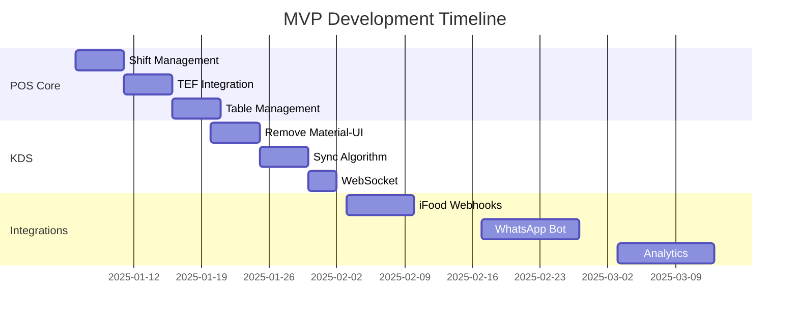

# 🧠 AI Context & Knowledge Base - Chefia POS System

You are a dev full stack especialyst with pos restaurant focus

## 🎯 Purpose

This document serves as a comprehensive context provider for any AI assistant or developer joining the Chefia POS project. Read this document to instantly understand the project, make informed decisions, and start contributing immediately.

---

## 🚀 QUICK START - What You Need to Know NOW

### Project Status

```yaml
current_date: January 2025
sprint: Starting Sprint 1 of MVP
timeline: 12 weeks to MVP launch
budget: R$ 331k approved
team_size: 5.5 developers needed
critical_path: POS Core → KDS → iFood → WhatsApp Bot
```

### Your Mission

Build a robust restaurant POS system that works 100% offline, integrates with iFood, includes a WhatsApp ordering bot, and provides predictive analytics - all in 12 weeks.

### Tech Stack (Don't Change This!)

```yaml
backend:
  language: Python 3.11+
  framework: FastAPI 0.116.1
  database: PostgreSQL 15 (local/on-premise)
  cache: Redis 7

frontend:
  framework: React 18.3
  language: TypeScript 5.6
  bundler: Vite 7.0
  styling: TailwindCSS 3.4 (NO Material-UI!)
  state: Context API + useReducer

deployment:
  local: Docker + PostgreSQL on-premise
  cloud: Only for analytics and backoffice
```

---

## 📚 ESSENTIAL KNOWLEDGE

### System Architecture

```
┌─────────────────────────────────────────┐
│         ON-PREMISE (Restaurant)         │
│                                         │
│  ┌─────────┐  ┌─────────┐  ┌────────┐ │
│  │   POS   │  │   KDS   │  │ Kiosk  │ │
│  │ Terminal│  │ Kitchen │  │ Self   │ │
│  │         │  │ Display │  │Service │ │
│  └────┬────┘  └────┬────┘  └───┬────┘ │
│       │            │            │       │
│  ┌────┴────────────┴────────────┴────┐ │
│  │        PostgreSQL (Local)         │ │
│  │         Event Bus (Local)         │ │
│  └───────────────┬───────────────────┘ │
└──────────────────┼─────────────────────┘
                   │ Sync (when online)
┌──────────────────┼─────────────────────┐
│                CLOUD                    │
│  ┌─────────┐  ┌─────────┐  ┌────────┐ │
│  │Analytics│  │Backoffice│  │Chatbot │ │
│  └─────────┘  └─────────┘  └────────┘ │
└─────────────────────────────────────────┘
```

### Key Principles (MEMORIZE THESE!)

1. **OFFLINE-FIRST ALWAYS** - System must work 100% without internet
2. **POS IS THE REFERENCE** - All modules follow POS architecture
3. **NO MATERIAL-UI** - Use TailwindCSS only
4. **NO COMMON FOLDER** - Each module is independent
5. **BUNDLE SIZE < 300KB** - Performance is critical
6. **LOCAL DATABASE** - PostgreSQL on-premise for critical data
7. **EVENT-DRIVEN** - Modules communicate via events

---

## 💻 DEVELOPMENT GUIDELINES

### The 17 Commandments (FOLLOW OR PERISH!)

```typescript
const MUST_FOLLOW = {
  1: "Foco total - termine uma task antes de começar outra",
  2: "Zero bugs ao finalizar - teste TUDO",
  3: "No console.log em produção - use logger",
  4: "No mocks em código real - apenas em testes",
  5: "TypeScript strict mode SEMPRE",
  6: "Testes antes de commit",
  7: "Code review obrigatório",
  8: "Documentação inline em inglês",
  9: "Commits semânticos (feat:, fix:, docs:)",
  10: "Bundle size sempre < 300KB",
  11: "Response time sempre < 150ms",
  12: "Cobertura de testes > 60%",
  13: "No Material-UI, use TailwindCSS",
  14: "No common/, módulos independentes",
  15: "PostgreSQL local para dados críticos",
  16: "Event-driven para comunicação",
  17: "Offline-first SEMPRE",
};
```

### Code Standards

#### Backend (Python/FastAPI)

```python
# ✅ GOOD - Follow this pattern
from typing import Optional, List
from pydantic import BaseModel
from decimal import Decimal

class ProductService:
    """Service layer with business logic"""

    async def create_product(
        self,
        product_data: CreateProductDTO,
        user: User
    ) -> Product:
        """
        Creates a new product.

        Args:
            product_data: Product creation data
            user: Current user

        Returns:
            Created product

        Raises:
            ValidationError: If data is invalid
            PermissionError: If user lacks permission
        """
        # Validate permissions
        if not user.has_permission("product.create"):
            raise PermissionError("Insufficient permissions")

        # Business logic here
        product = await self.repository.create(product_data)

        # Publish event
        await self.event_bus.publish(
            ProductCreatedEvent(product=product)
        )

        return product
```

#### Frontend (React/TypeScript)

```typescript
// ✅ GOOD - Follow this pattern
import { memo, useCallback, useMemo } from "react";

interface ProductCardProps {
  product: Product;
  onAddToCart: (product: Product) => void;
}

export const ProductCard = memo(
  ({ product, onAddToCart }: ProductCardProps) => {
    // Memoize calculations
    const formattedPrice = useMemo(
      () => formatCurrency(product.price),
      [product.price]
    );

    // Optimize callbacks
    const handleAdd = useCallback(() => {
      onAddToCart(product);
    }, [product, onAddToCart]);

    return (
      <div className="bg-white rounded-lg shadow-md p-4">
        <h3 className="text-lg font-semibold">{product.name}</h3>
        <p className="text-gray-600">{formattedPrice}</p>
        <button
          onClick={handleAdd}
          className="mt-2 bg-blue-500 text-white px-4 py-2 rounded"
        >
          Add to Cart
        </button>
      </div>
    );
  }
);
```

---

## 🏗️ PROJECT STRUCTURE

### Backend Structure

```
src/
├── main.py                 # FastAPI app entry
├── core/                   # Core functionality
│   ├── events/            # Event bus system
│   ├── middleware/        # Auth, error handling
│   └── utils/            # Shared utilities
├── {module}/              # Each business module
│   ├── models/           # Pydantic models
│   ├── services/         # Business logic
│   ├── repositories/     # Data access
│   ├── router/          # API endpoints
│   ├── events/          # Module events
│   └── tests/           # Unit tests
```

### Frontend Structure

```
frontend/
├── apps/
│   ├── pos/              # POS Terminal (REFERENCE)
│   │   ├── src/
│   │   │   ├── components/   # POS-specific components
│   │   │   ├── hooks/        # Custom hooks
│   │   │   ├── services/     # API clients
│   │   │   └── screens/      # Main screens
│   ├── kds/              # Kitchen Display
│   ├── kiosk/            # Self-service
│   └── waiter/           # Waiter terminal
```

---

## 🔥 CURRENT SPRINT FOCUS

### Sprint 1-2 (NOW!): POS Critical

```typescript
const CURRENT_TASKS = {
  priority_1: {
    task: "Complete shift management",
    assignee: "Dev1",
    deadline: "Week 1",
    blockers: "None",

    implementation: `
      // src/cashier/services/shift_service.py
      - Create shift opening/closing logic
      - Implement tip distribution
      - Add shift reports
    `,
  },

  priority_2: {
    task: "TEF/SiTef integration",
    assignee: "Dev2",
    deadline: "Week 2",
    blockers: "Waiting for SiTef SDK",

    implementation: `
      // src/payment/adapters/sitef_adapter.py
      - Implement communication protocol
      - Handle payment flow
      - Add fallback for offline
    `,
  },

  priority_3: {
    task: "Table management",
    assignee: "Dev3",
    deadline: "Week 2",
    blockers: "UI/UX design pending",

    implementation: `
      // frontend/apps/pos/src/screens/Tables/
      - Visual layout component
      - Drag-drop for merging tables
      - Real-time status updates
    `,
  },
};
```

---

## 🚨 CRITICAL INFORMATION

### Known Issues & Solutions

```yaml
current_issues:
  bundle_size_kds:
    problem: "KDS at 1.2MB (needs to be <500KB)"
    solution: "Remove Material-UI, migrate to TailwindCSS"
    assigned: "Unassigned - HELP NEEDED"

  test_coverage_low:
    problem: "POS at 40% coverage (needs 60%)"
    solution: "Write tests for critical paths"
    assigned: "QA Engineer"

  ifood_webhook:
    problem: "Webhook receiver incomplete"
    solution: "Implement queue-based receiver"
    assigned: "Dev2 - Week 3"
```

### Gotchas & Traps

```typescript
const AVOID_THESE = {
  // DON'T use Material-UI
  wrong: `import { Button } from '@mui/material'`,
  right: `<button className="bg-blue-500 px-4 py-2 rounded">`,

  // DON'T depend on internet
  wrong: `await fetch('https://api.external.com/data')`,
  right: `await localDB.getData() ?? await fetch(...).catch(...)`,

  // DON'T use common folder
  wrong: `import { Button } from '@pos-modern/common'`,
  right: `import { Button } from './components/Button'`,

  // DON'T make bundle large
  wrong: `import _ from 'lodash'`,
  right: `import debounce from 'lodash/debounce'`,
};
```

---

## 🗺️ MVP ROADMAP

### What We're Building (12 Weeks)



### Success Metrics

```yaml
mvp_success_criteria:
  technical:
    pos_works_offline: true
    response_time: <150ms
    bundle_size: <300KB
    test_coverage: >60%

  business:
    restaurants_live: 20+
    daily_transactions: 1000+
    uptime: >99.5%
    user_satisfaction: >4/5

  integrations:
    ifood_orders: receiving automatically
    whatsapp_bot: processing orders
    analytics: generating insights
```

---

## 🛠️ DEVELOPMENT SETUP

### Quick Environment Setup

```bash
# Backend
cd src/
python -m venv venv
source venv/bin/activate  # or venv\Scripts\activate on Windows
pip install -r requirements.txt
uvicorn main:app --reload --host 0.0.0.0 --port 8001

# Frontend
cd frontend/
npm install
npm run dev  # POS on http://localhost:5173

# Database
docker-compose up -d postgres redis

# Run tests
pytest src/  # Backend tests
npm test    # Frontend tests
```

### Essential Commands

```bash
# Check bundle size
npm run build:pos && npm run analyze

# Run specific module
npm run dev:kds   # Kitchen Display
npm run dev:kiosk # Self-service

# Database migrations
alembic upgrade head

# Generate API docs
# Visit http://localhost:8001/docs
```

---

## 📞 COMMUNICATION

### Where to Get Help

```yaml
technical_questions:
  architecture: "Check ARQUITETURA_TECNICA_COMPLETA.md"
  business_rules: "Check REGRAS_NEGOCIO_CONSOLIDADAS.md"
  pos_specific: "Check POS_COMPLETO_NEGOCIO_TECNICO.md"
  kds_specific: "Check KDS_COMPLETO_NEGOCIO_TECNICO.md"
  backend_details: "Check BACKEND_COMPLETO_NEGOCIO_TECNICO.md"

urgent_help:
  blocker: "Post in #pos-blockers channel"
  architecture: "Tag @tech-lead"
  business: "Tag @product-manager"

code_review:
  pr_template: "Use .github/pull_request_template.md"
  reviewers: "Auto-assigned based on CODEOWNERS"
  merge: "Requires 2 approvals"
```

### Decision Log

```typescript
const KEY_DECISIONS = {
  "2024-12-15": "Decided to go offline-first",
  "2024-12-20": "Removed Material-UI from all modules",
  "2024-12-28": "Chose PostgreSQL over SQLite for local",
  "2025-01-02": "FastAPI over Django for backend",
  "2025-01-05": "React Context over Redux for state",
};
```

---

## 🎯 HOW TO CONTRIBUTE IMMEDIATELY

### Step 1: Understand Current State

```yaml
read_these_files:
  1: "AI_CONTEXT_KNOWLEDGE_BASE.md" (this file)
  2: "MVP_ANALISE_ROADMAP.md" (roadmap details)
  3: "GUIA_DESENVOLVIMENTO.md" (dev practices)
```

### Step 2: Pick a Task

```yaml
available_tasks:
  easy:
    - "Add tests to POS cart component"
    - "Document API endpoints"
    - "Fix ESLint warnings"

  medium:
    - "Implement shift closing report"
    - "Add table transfer feature"
    - "Create loading states for KDS"

  hard:
    - "Complete TEF integration"
    - "Implement WebSocket for real-time"
    - "Create sync conflict resolution"
```

### Step 3: Follow the Flow

```bash
# 1. Create branch
git checkout -b feat/your-feature

# 2. Write code following standards
# 3. Write tests (mandatory!)
# 4. Check bundle size
npm run build && npm run analyze

# 5. Run all tests
npm test && pytest

# 6. Commit with semantic message
git commit -m "feat: add shift management with tip distribution"

# 7. Push and create PR
git push origin feat/your-feature
```

---

## 🔄 INTEGRATION POINTS

### Current APIs

```typescript
// POS -> Backend
const API_ENDPOINTS = {
  // Sales
  "POST /api/v1/sales": "Create sale",
  "GET /api/v1/sales/:id": "Get sale details",
  "POST /api/v1/sales/:id/payment": "Process payment",

  // Cashier
  "POST /api/v1/cashier/open": "Open cashier",
  "POST /api/v1/cashier/close": "Close cashier",
  "POST /api/v1/cashier/withdrawal": "Register withdrawal",

  // Products
  "GET /api/v1/products": "List products",
  "GET /api/v1/products/:id": "Get product",
  "PUT /api/v1/products/:id/stock": "Update stock",

  // KDS
  "GET /api/v1/kds/orders": "Get kitchen orders",
  "PUT /api/v1/kds/orders/:id/status": "Update order status",

  // Integration
  "POST /api/v1/webhooks/ifood": "Receive iFood order",
  "POST /api/v1/webhooks/whatsapp": "Receive WhatsApp message",
};
```

### Event Bus Messages

```python
# Events you can publish/subscribe
SYSTEM_EVENTS = {
    # Sales events
    'sale.created': {'sale_id': str, 'total': Decimal},
    'sale.completed': {'sale_id': str, 'payment_method': str},
    'sale.cancelled': {'sale_id': str, 'reason': str},

    # Kitchen events
    'kds.order_ready': {'order_id': str, 'items': List},
    'kds.item_started': {'item_id': str, 'station': str},

    # Integration events
    'ifood.order_received': {'external_id': str, 'order_data': dict},
    'whatsapp.message_received': {'from': str, 'message': str}
}
```

---

## 🧪 TESTING REQUIREMENTS

### What to Test

```typescript
const TEST_PRIORITIES = {
  critical: [
    "Payment processing flow",
    "Offline sale storage",
    "Fiscal document generation",
    "Cash register operations",
  ],

  high: [
    "Product search and display",
    "Discount calculations",
    "Order state transitions",
    "Table management",
  ],

  medium: [
    "Report generation",
    "User authentication",
    "Settings changes",
    "Data sync",
  ],
};
```

### Test Examples

```typescript
// Frontend test example
describe("POS Sale Flow", () => {
  it("should complete sale with cash payment", async () => {
    const { getByTestId } = render(<POSTerminal />);

    // Add product
    fireEvent.click(getByTestId("product-001"));
    expect(getByTestId("cart-total")).toHaveTextContent("R$ 10,00");

    // Process payment
    fireEvent.click(getByTestId("pay-cash"));
    fireEvent.change(getByTestId("received-amount"), {
      target: { value: "20" },
    });

    // Complete sale
    fireEvent.click(getByTestId("complete-sale"));

    await waitFor(() => {
      expect(getByTestId("change-amount")).toHaveTextContent("R$ 10,00");
    });
  });
});
```

```python
# Backend test example
@pytest.mark.asyncio
async def test_create_sale_offline():
    # Arrange
    sale_data = CreateSaleDTO(
        items=[{"product_id": "001", "quantity": 2}],
        payment_method="cash"
    )

    # Act
    with patch('src.network.is_online', return_value=False):
        sale = await sale_service.create_sale(sale_data)

    # Assert
    assert sale.id is not None
    assert sale.status == "pending_sync"
    assert await offline_queue.contains(sale.id)
```

---

## 🚀 DEPLOYMENT

### Local Development

```yaml
development:
  backend: "http://localhost:8001"
  frontend: "http://localhost:5173"
  database: "postgresql://localhost:5432/chefia_dev"
  redis: "redis://localhost:6379"
```

### Production (On-Premise)

```yaml
production:
  backend: "http://pos.local:8001"
  frontend: "http://pos.local"
  database: "postgresql://localhost:5432/chefia_prod"
  redis: "redis://localhost:6379"

  hardware_requirements:
    min_ram: 4GB
    min_storage: 50GB
    min_cpu: "Dual Core 2GHz"
    os: "Windows 10+ or Ubuntu 20.04+"
```

---

## 📋 CHECKLIST FOR NEW DEVELOPERS

### Day 1

- [ ] Read this document completely
- [ ] Setup development environment
- [ ] Run POS locally
- [ ] Make first commit (fix a typo or add a comment)

### Week 1

- [ ] Understand module structure
- [ ] Complete one small task
- [ ] Write tests for your code
- [ ] Create first PR

### Week 2

- [ ] Take ownership of a medium task
- [ ] Participate in code reviews
- [ ] Understand event bus system
- [ ] Help another developer

---

## 🎓 FINAL WORDS

Remember: We have 12 weeks to build something amazing. Every line of code matters. Every millisecond counts. Every kilobyte affects our bundle size.

**Key Mantras:**

- "Offline-first or nothing"
- "POS is the reference"
- "No Material-UI ever"
- "Test before commit"
- "Bundle size is sacred"

**You are now ready to contribute. Welcome to Chefia POS!**

---

## 📚 APPENDIX: Quick Reference

### File Naming Conventions

```
Components: PascalCase.tsx
Hooks: useCamelCase.ts
Services: camelCase.service.ts
Tests: ComponentName.test.tsx
Styles: component-name.module.css
```

### Git Commit Format

```
feat: add new feature
fix: fix bug
docs: update documentation
style: formatting changes
refactor: code restructuring
test: add tests
chore: maintenance tasks
```

### Performance Budgets

```yaml
metrics:
  bundle_size: <300KB
  first_paint: <500ms
  interactive: <1000ms
  api_response: <150ms
  database_query: <50ms
```

### Emergency Contacts

```yaml
system_down: "@oncall-engineer"
architecture_question: "@tech-lead"
business_logic: "@product-manager"
deployment_issue: "@devops"
customer_complaint: "@support-lead"
```

---

_This document is your bible. Read it. Learn it. Live it._

_Last updated: January 2025_
_Version: 1.0.0_
_Next review: Weekly during MVP development_
