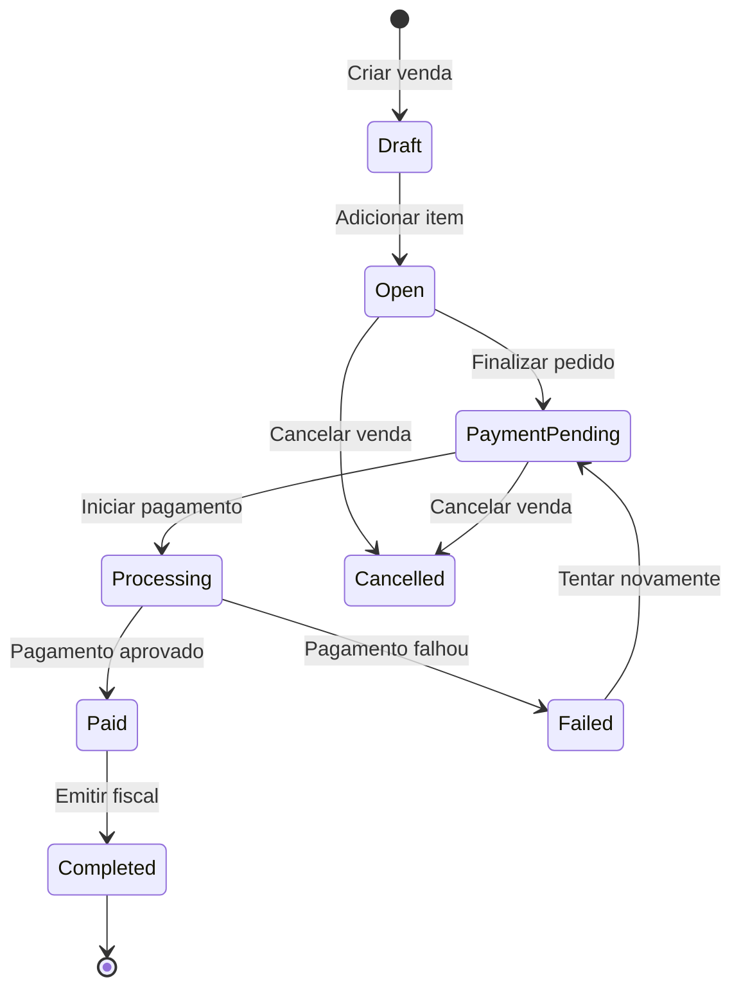
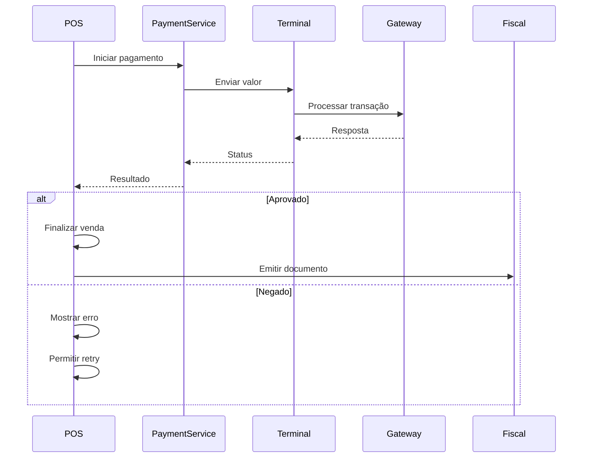

# Documentação Completa POS Terminal - Negócio + Técnico

## 📊 Visão Executiva

O módulo POS (Point of Sale) é o coração do sistema Chefia, responsável por todas as operações de frente de caixa em restaurantes. É o módulo mais evoluído da plataforma, servindo como referência arquitetural para os demais módulos.

### Números do POS

- **Bundle Size**: 250KB (otimizado)
- **Performance**: <100ms tempo de resposta
- **Uptime**: 99.9% (funciona offline)
- **Cobertura de Testes**: 40% (meta: 80%)
- **Maturidade**: ⭐⭐⭐⭐⭐ (5/5)

## 🎯 PARTE 1: REGRAS DE NEGÓCIO DO POS

## 1. Fluxo Principal de Venda

### 1.1 Estados de uma Venda



### 1.2 Regras de Negócio da Venda

#### Criação da Venda

- **Pré-requisitos**:
  - Dia operacional aberto
  - Caixa aberto
  - Operador autenticado
  - Terminal registrado

#### Durante a Venda

- Adicionar/remover produtos
- Aplicar descontos (com permissão)
- Aplicar taxa de serviço (10% padrão)
- Selecionar cliente (opcional)
- Adicionar observações

#### Finalização

- Venda mínima: R$ 0,01
- Métodos de pagamento múltiplos permitidos
- Troco calculado automaticamente
- Documento fiscal obrigatório (SAT/NFC-e)

### 1.3 Regras de Desconto

#### Tipos de Desconto

1. **Percentual**: 0-100% sobre item ou total
2. **Valor Fixo**: R$ X de desconto
3. **Promocional**: Vinculado a campanha
4. **Cortesia**: 100% desconto (requer autorização)

#### Limites e Permissões

```python
desconto_regras = {
    "CASHIER": {
        "max_percentual": 10,
        "max_valor": 50.00,
        "requer_motivo": False
    },
    "MANAGER": {
        "max_percentual": 50,
        "max_valor": 500.00,
        "requer_motivo": True
    },
    "ADMIN": {
        "max_percentual": 100,
        "max_valor": float('inf'),
        "requer_motivo": True
    }
}
```

## 2. Gestão de Caixa no POS

### 2.1 Ciclo de Vida do Caixa

```yaml
abertura:
  validações:
    - dia_operacional_aberto: true
    - operador_sem_caixa_aberto: true
    - terminal_sem_caixa_aberto: true
  dados_necessários:
    - valor_inicial: decimal (troco)
    - operador_id: string
    - terminal_id: string

operação:
  tipos_permitidos:
    - venda: aumenta_saldo
    - sangria: diminui_saldo
    - suprimento: aumenta_saldo
    - devolução: diminui_saldo

fechamento:
  validações:
    - vendas_finalizadas: true
    - valor_conferido: true
  relatório:
    - total_vendas_dinheiro
    - total_vendas_cartao
    - total_vendas_pix
    - diferença_caixa
    - tempo_operação
```

### 2.2 Regras de Sangria

- **Sangria Simples**: Até R$ 200 (operador)
- **Sangria Gerencial**: Acima R$ 200 (requer PIN gerente)
- **Sangria Emergencial**: Qualquer valor (requer 2 autorizações)

## 3. Gestão de Produtos no POS

### 3.1 Busca e Exibição

#### Prioridades de Busca

1. Código de barras (exato)
2. SKU (exato)
3. Nome (fuzzy search)
4. Tags (múltiplas)
5. Categoria

#### Cache de Produtos

```typescript
interface ProductCache {
  popular: Product[]; // Top 20 mais vendidos
  recent: Product[]; // Últimos 10 utilizados
  favorites: Product[]; // Marcados como favoritos
  quick: Product[]; // Acesso rápido (1-9)
}
```

### 3.2 Modificadores e Variações

#### Tipos de Modificadores

```typescript
enum ModifierType {
  REQUIRED = "required", // Obrigatório escolher
  OPTIONAL = "optional", // Opcional
  MULTIPLE = "multiple", // Múltipla escolha
  QUANTITY = "quantity", // Com quantidade
}

// Exemplo: Hambúrguer
const modifiers = {
  "Ponto da Carne": {
    type: ModifierType.REQUIRED,
    options: ["Mal Passado", "Ao Ponto", "Bem Passado"],
  },
  Adicionais: {
    type: ModifierType.MULTIPLE,
    options: [
      { name: "Bacon", price: 5.0 },
      { name: "Queijo Extra", price: 3.0 },
      { name: "Ovo", price: 2.5 },
    ],
  },
  Remover: {
    type: ModifierType.OPTIONAL,
    options: ["Sem Cebola", "Sem Tomate", "Sem Alface"],
  },
};
```

## 4. Integração com Pagamentos

### 4.1 Fluxo de Pagamento Integrado



### 4.2 Métodos de Pagamento Suportados

| Método   | Terminal | Online | Offline | Split |
| -------- | -------- | ------ | ------- | ----- |
| Dinheiro | ❌       | ❌     | ✅      | ❌    |
| Débito   | ✅       | ❌     | ❌      | ❌    |
| Crédito  | ✅       | ✅     | ❌      | ✅    |
| PIX      | ✅       | ✅     | ❌      | ✅    |
| Voucher  | ❌       | ✅     | ✅      | ❌    |

### 4.3 Regras de Split Payment

```python
class SplitPaymentRules:
    """Regras para divisão de pagamento"""

    MAX_SPLITS = 4  # Máximo de divisões
    MIN_VALUE_PER_SPLIT = 10.00  # Mínimo por pessoa

    def validate_split(self, total: Decimal, splits: int) -> bool:
        if splits > self.MAX_SPLITS:
            return False
        if (total / splits) < self.MIN_VALUE_PER_SPLIT:
            return False
        return True

    def calculate_splits(self, total: Decimal, splits: int) -> List[Decimal]:
        """Calcula valores iguais + taxa de serviço proporcional"""
        base_value = total / splits
        return [base_value for _ in range(splits)]
```

## 5. Documentos Fiscais

### 5.1 Regras de Emissão

#### Hierarquia de Documentos

1. **NFC-e**: Preferencial (quando disponível)
2. **SAT**: Fallback para São Paulo
3. **MFe**: Fallback para Ceará
4. **Não Fiscal**: Último recurso (apenas para testes)

#### Validações Obrigatórias

```typescript
interface FiscalValidation {
  // Dados da empresa
  cnpj: string; // 14 dígitos
  inscricaoEstadual: string;

  // Dados do cliente (se CPF na nota)
  cpf?: string; // 11 dígitos
  nome?: string;

  // Dados dos produtos
  ncm: string; // Código fiscal
  cfop: string; // Operação fiscal
  aliquota: number; // % imposto
}
```

### 5.2 Contingência Fiscal

```yaml
modo_contingencia:
  ativação:
    - timeout_sefaz: 30s
    - tentativas_falhas: 3
    - erro_comunicação: true

  operação:
    - armazenar_local: true
    - gerar_numero_contingencia: true
    - imprimir_duas_vias: true

  sincronização:
    - verificar_cada: 5min
    - enviar_pendentes: true
    - atualizar_status: true
```

## 🔧 PARTE 2: ARQUITETURA TÉCNICA DO POS

## 6. Stack Tecnológico

### 6.1 Frontend POS

```yaml
tecnologias:
  framework: React 18.3
  linguagem: TypeScript 5.6
  bundler: Vite 7.0
  estilização: TailwindCSS 3.4
  gerenciamento_estado: Context API + useReducer
  roteamento: React Router 6.27

otimizações:
  code_splitting: true
  lazy_loading: true
  tree_shaking: true
  minification: true
  compression: gzip + brotli

performance:
  bundle_size: 250KB
  first_paint: <500ms
  interactive: <1000ms
  largest_contentful_paint: <1500ms
```

### 6.2 Arquitetura de Componentes

```typescript
// Estrutura de componentes do POS
src/
├── components/           // Componentes específicos do POS
│   ├── Calculator/     // Calculadora de pagamento
│   ├── Cart/           // Carrinho de compras
│   ├── Keypad/         // Teclado numérico
│   ├── ProductGrid/    // Grade de produtos
│   ├── Receipt/        // Comprovante
│   └── Terminal/       // Interface do terminal
│
├── config/            // Configurações globais
|   ├── pos/           // Todos os terminais possíveis para o POS
│       ├── 1.json     // Configuração do terminal
|
├── hooks/              // Hooks customizados
│   ├── useCart.ts     // Gestão do carrinho
│   ├── useCashier.ts  // Gestão do caixa
│   ├── usePayment.ts  // Processamento pagamento
│   ├── useProducts.ts // Cache de produtos
│   └── useShortcuts.ts // Atalhos de teclado
│
├── services/           // Serviços e APIs
│   ├── api/           // Cliente HTTP
│   ├── fiscal/        // Integração fiscal
│   ├── payment/       // Gateway pagamento
│   ├── printer/       // Impressão
│   └── storage/       // Persistência local
│
└── screens/           // Telas principais
    ├── Sale/          // Tela de venda
    ├── Cashier/       // Gestão de caixa
    ├── Reports/       // Relatórios
    └── Settings/      // Configurações
```

### 6.3 Padrões de Código

```typescript
// Exemplo: Componente POS otimizado
import { memo, useCallback, useMemo } from "react";

interface POSCartProps {
  items: CartItem[];
  onUpdateQuantity: (id: string, qty: number) => void;
  onRemoveItem: (id: string) => void;
}

export const POSCart = memo(
  ({ items, onUpdateQuantity, onRemoveItem }: POSCartProps) => {
    // Cálculos memoizados
    const totals = useMemo(
      () => ({
        subtotal: items.reduce(
          (sum, item) => sum + item.price * item.quantity,
          0
        ),
        tax: items.reduce(
          (sum, item) => sum + item.price * item.quantity * item.taxRate,
          0
        ),
        total: items.reduce(
          (sum, item) => sum + item.price * item.quantity * (1 + item.taxRate),
          0
        ),
      }),
      [items]
    );

    // Callbacks otimizados
    const handleQuantityChange = useCallback(
      (id: string, qty: number) => {
        if (qty > 0) {
          onUpdateQuantity(id, qty);
        } else {
          onRemoveItem(id);
        }
      },
      [onUpdateQuantity, onRemoveItem]
    );

    return (
      <div className="pos-cart">
        {/* Virtual scrolling para listas grandes */}
        <VirtualList
          items={items}
          itemHeight={60}
          renderItem={(item) => (
            <CartItem
              key={item.id}
              item={item}
              onQuantityChange={handleQuantityChange}
            />
          )}
        />

        <CartTotals {...totals} />
      </div>
    );
  }
);
```

## 7. Gerenciamento de Estado

### 7.1 Estado Global do POS

```typescript
interface POSGlobalState {
  // Estado do terminal
  terminal: {
    id: string;
    status: "online" | "offline" | "syncing";
    config: TerminalConfig;
  };

  // Estado do operador
  operator: {
    id: string;
    name: string;
    role: UserRole;
    permissions: Permission[];
  };

  // Estado do caixa
  cashier: {
    id: string;
    status: "closed" | "open" | "closing";
    openingBalance: number;
    currentBalance: number;
    operations: CashierOperation[];
  };

  // Estado da venda atual
  currentSale: {
    id: string;
    status: SaleStatus;
    items: CartItem[];
    customer?: Customer;
    discounts: Discount[];
    payments: Payment[];
  };

  // Cache local
  cache: {
    products: Product[];
    customers: Customer[];
    lastReceipts: Receipt[];
  };
}
```

### 7.2 Reducer Pattern

```typescript
// Reducer para gestão de venda
function saleReducer(state: Sale, action: SaleAction): Sale {
  switch (action.type) {
    case "ADD_ITEM":
      return {
        ...state,
        items: [...state.items, action.payload],
        updatedAt: new Date(),
      };

    case "UPDATE_QUANTITY":
      return {
        ...state,
        items: state.items.map((item) =>
          item.id === action.payload.id
            ? { ...item, quantity: action.payload.quantity }
            : item
        ),
        updatedAt: new Date(),
      };

    case "APPLY_DISCOUNT":
      return {
        ...state,
        discount: action.payload,
        updatedAt: new Date(),
      };

    case "PROCESS_PAYMENT":
      return {
        ...state,
        status: "processing",
        payments: [...state.payments, action.payload],
      };

    default:
      return state;
  }
}
```

## 8. Comunicação e APIs

### 8.1 Cliente API Otimizado

```typescript
class POSApiClient {
  private baseURL: string;
  private timeout: number = 5000;
  private retries: number = 3;
  private cache: Map<string, CacheEntry>;

  constructor(config: ApiConfig) {
    this.baseURL = config.baseURL;
    this.cache = new Map();
  }

  async request<T>(options: RequestOptions): Promise<T> {
    // Verificar cache primeiro
    const cacheKey = this.getCacheKey(options);
    if (options.cache && this.cache.has(cacheKey)) {
      const cached = this.cache.get(cacheKey);
      if (!this.isExpired(cached)) {
        return cached.data as T;
      }
    }

    // Tentativa com retry automático
    let lastError: Error;
    for (let i = 0; i < this.retries; i++) {
      try {
        const response = await this.executeRequest<T>(options);

        // Cachear resposta se configurado
        if (options.cache) {
          this.cache.set(cacheKey, {
            data: response,
            timestamp: Date.now(),
            ttl: options.cacheTTL || 60000,
          });
        }

        return response;
      } catch (error) {
        lastError = error;

        // Delay exponencial entre tentativas
        if (i < this.retries - 1) {
          await this.delay(Math.pow(2, i) * 1000);
        }
      }
    }

    // Se offline, tentar cache expirado
    if (!navigator.onLine && this.cache.has(cacheKey)) {
      return this.cache.get(cacheKey).data as T;
    }

    throw lastError;
  }
}
```

### 8.2 WebSocket para Real-time

```typescript
class POSWebSocket {
  private ws: WebSocket;
  private reconnectAttempts: number = 0;
  private maxReconnectAttempts: number = 5;
  private handlers: Map<string, Function[]>;

  connect() {
    this.ws = new WebSocket("wss://pos.local/ws");

    this.ws.onopen = () => {
      console.log("WebSocket connected");
      this.reconnectAttempts = 0;
      this.subscribe("sale.update");
      this.subscribe("kitchen.status");
      this.subscribe("payment.result");
    };

    this.ws.onmessage = (event) => {
      const message = JSON.parse(event.data);
      this.dispatch(message.type, message.data);
    };

    this.ws.onclose = () => {
      this.handleReconnect();
    };
  }

  private handleReconnect() {
    if (this.reconnectAttempts < this.maxReconnectAttempts) {
      const delay = Math.min(1000 * Math.pow(2, this.reconnectAttempts), 30000);
      setTimeout(() => {
        this.reconnectAttempts++;
        this.connect();
      }, delay);
    }
  }

  send(type: string, data: any) {
    if (this.ws.readyState === WebSocket.OPEN) {
      this.ws.send(JSON.stringify({ type, data }));
    } else {
      // Enfileirar para enviar quando reconectar
      this.queueMessage({ type, data });
    }
  }
}
```

## 9. Armazenamento Local e Offline

### 9.1 Estratégia de Persistência

```typescript
class POSStorage {
  private db: IDBDatabase;
  private localStorage: Storage;

  async init() {
    // IndexedDB para dados estruturados
    this.db = await this.openDatabase("pos-db", 2);

    // Criar stores necessários
    await this.createStores([
      "sales", // Vendas offline
      "products", // Cache de produtos
      "customers", // Cache de clientes
      "receipts", // Últimos comprovantes
      "queue", // Fila de sincronização
    ]);
  }

  // Salvar venda com fallback
  async saveSale(sale: Sale): Promise<void> {
    try {
      // Tentar salvar no servidor
      await api.post("/sales", sale);
    } catch (error) {
      // Se falhar, salvar localmente
      await this.saveOffline("sales", sale);

      // Adicionar à fila de sync
      await this.addToSyncQueue({
        type: "sale",
        data: sale,
        timestamp: Date.now(),
      });
    }
  }

  // Sincronização automática
  async syncOfflineData() {
    const queue = await this.getSyncQueue();

    for (const item of queue) {
      try {
        await this.syncItem(item);
        await this.removeFromQueue(item.id);
      } catch (error) {
        console.error("Sync failed for item:", item.id);
      }
    }
  }
}
```

### 9.2 Cache Inteligente

```typescript
class SmartCache {
  private memory: LRUCache; // Cache em memória (rápido)
  private indexedDB: IDBDatabase; // Cache persistente
  private strategy: CacheStrategy;

  async get(key: string): Promise<any> {
    // 1. Verificar memória primeiro (mais rápido)
    if (this.memory.has(key)) {
      return this.memory.get(key);
    }

    // 2. Verificar IndexedDB
    const stored = await this.getFromDB(key);
    if (stored && !this.isExpired(stored)) {
      // Promover para memória
      this.memory.set(key, stored.value);
      return stored.value;
    }

    // 3. Buscar do servidor
    const fresh = await this.fetchFromServer(key);

    // 4. Atualizar todos os caches
    await this.updateCaches(key, fresh);

    return fresh;
  }

  private async updateCaches(key: string, value: any) {
    // Atualizar memória (LRU eviction automático)
    this.memory.set(key, value);

    // Atualizar IndexedDB com TTL
    await this.saveToDb(key, {
      value,
      timestamp: Date.now(),
      ttl: this.getTTL(key),
    });
  }
}
```

## 10. Hardware e Periféricos

### 10.1 Integração com Impressora

```typescript
class POSPrinter {
  private printers: Map<string, Printer>;
  private queue: PrintJob[];

  async print(receipt: Receipt, printerType: "fiscal" | "kitchen" | "both") {
    const job: PrintJob = {
      id: generateId(),
      data: receipt,
      type: printerType,
      timestamp: Date.now(),
    };

    try {
      if (printerType === "fiscal" || printerType === "both") {
        await this.printFiscal(receipt);
      }

      if (printerType === "kitchen" || printerType === "both") {
        await this.printKitchen(receipt);
      }
    } catch (error) {
      // Adicionar à fila para retry
      this.queue.push(job);

      // Tentar imprimir via backup (PDF/Email)
      await this.printBackup(receipt);

      throw new PrinterError("Failed to print", error);
    }
  }

  private async printFiscal(receipt: Receipt) {
    const printer = this.printers.get("fiscal");

    // Formatar para impressora fiscal
    const commands = this.formatESCPOS(receipt);

    // Enviar comandos
    await printer.send(commands);

    // Aguardar confirmação
    await printer.waitForAck();
  }

  private formatESCPOS(receipt: Receipt): Buffer {
    const encoder = new ESCPOSEncoder();

    return encoder
      .initialize()
      .align("center")
      .size(2, 2)
      .text(receipt.company.name)
      .size(1, 1)
      .text(receipt.company.cnpj)
      .feed(2)
      .align("left")
      .text(`Data: ${receipt.date}`)
      .text(`Operador: ${receipt.operator}`)
      .feed(1)
      .table(receipt.items)
      .feed(1)
      .align("right")
      .text(`Total: R$ ${receipt.total}`)
      .feed(3)
      .cut()
      .encode();
  }
}
```

### 10.2 Terminal de Pagamento

```typescript
class PaymentTerminal {
  private sitef: SiTEFClient;
  private status: TerminalStatus;

  async processPayment(
    amount: number,
    method: PaymentMethod
  ): Promise<PaymentResult> {
    // Verificar status do terminal
    if (!(await this.checkConnection())) {
      throw new TerminalError("Terminal desconectado");
    }

    // Configurar transação
    const transaction = {
      amount: Math.round(amount * 100), // Centavos
      method,
      installments: method === "CREDIT" ? await this.selectInstallments() : 1,
      merchantId: config.merchantId,
    };

    // Processar com timeout
    const result = await Promise.race([
      this.sitef.process(transaction),
      this.timeout(30000),
    ]);

    // Validar resposta
    if (result.approved) {
      return {
        status: "approved",
        authCode: result.authorizationCode,
        nsu: result.nsu,
        cardBrand: result.cardBrand,
        lastDigits: result.lastDigits,
      };
    } else {
      throw new PaymentError(result.message);
    }
  }
}
```

## 11. Segurança e Auditoria

### 11.1 Controle de Acesso

```typescript
class POSSecurity {
  // Autenticação por PIN rápido
  async authenticateQuick(pin: string): Promise<User> {
    const hashedPin = await this.hashPin(pin);
    const user = await this.validatePin(hashedPin);

    if (!user) {
      await this.logFailedAttempt(pin);
      throw new AuthError("PIN inválido");
    }

    // Verificar permissões
    if (!this.hasPermission(user, "POS_ACCESS")) {
      throw new AuthError("Sem permissão para POS");
    }

    // Criar sessão
    const session = await this.createSession(user);

    // Registrar login
    await this.audit("user.login", {
      userId: user.id,
      terminal: getTerminalId(),
      timestamp: Date.now(),
    });

    return user;
  }

  // Autorização para operações sensíveis
  async authorize(operation: string, params?: any): Promise<boolean> {
    const user = getCurrentUser();

    // Verificar permissão básica
    if (!this.hasPermission(user, operation)) {
      // Solicitar autorização gerencial
      const manager = await this.requestManagerAuth();

      if (!manager || !this.hasPermission(manager, operation)) {
        await this.audit("authorization.denied", {
          operation,
          user: user.id,
          manager: manager?.id,
        });
        return false;
      }
    }

    // Registrar autorização
    await this.audit("authorization.granted", {
      operation,
      user: user.id,
      params,
    });

    return true;
  }
}
```

### 11.2 Auditoria e Logs

```typescript
class POSAudit {
  private logger: Logger;
  private storage: AuditStorage;

  async log(event: AuditEvent) {
    const entry: AuditEntry = {
      id: generateId(),
      timestamp: Date.now(),
      event: event.type,
      user: event.userId,
      terminal: event.terminalId,
      data: event.data,
      ip: getClientIP(),
      signature: await this.sign(event),
    };

    // Salvar localmente (sempre)
    await this.storage.save(entry);

    // Enviar para servidor (se online)
    if (navigator.onLine) {
      await this.sendToServer(entry);
    }

    // Log críticos também em arquivo
    if (event.severity === "critical") {
      this.logger.critical(entry);
    }
  }

  // Eventos auditados
  auditEvents = {
    // Financeiros
    "sale.completed": "critical",
    "sale.cancelled": "high",
    "discount.applied": "medium",
    "refund.processed": "critical",

    // Caixa
    "cashier.opened": "high",
    "cashier.closed": "high",
    "cashier.withdrawal": "critical",

    // Segurança
    "user.login": "medium",
    "user.logout": "low",
    "permission.denied": "high",
    "auth.failed": "high",
  };
}
```

## 12. Testes e Qualidade

### 12.1 Estratégia de Testes

```typescript
// Teste de componente POS
describe("POSCart", () => {
  it("should calculate totals correctly", () => {
    const items = [
      { id: "1", name: "Pizza", price: 30.0, quantity: 2, taxRate: 0.1 },
      { id: "2", name: "Refrigerante", price: 5.0, quantity: 3, taxRate: 0.05 },
    ];

    const { getByTestId } = render(<POSCart items={items} />);

    expect(getByTestId("subtotal")).toHaveTextContent("75.00");
    expect(getByTestId("tax")).toHaveTextContent("6.75");
    expect(getByTestId("total")).toHaveTextContent("81.75");
  });

  it("should handle item removal", async () => {
    const onRemove = jest.fn();
    const items = [{ id: "1", name: "Pizza", price: 30.0, quantity: 1 }];

    const { getByTestId } = render(
      <POSCart items={items} onRemoveItem={onRemove} />
    );

    fireEvent.click(getByTestId("remove-1"));

    await waitFor(() => {
      expect(onRemove).toHaveBeenCalledWith("1");
    });
  });
});

// Teste de integração
describe("POS Sale Flow", () => {
  it("should complete a sale end-to-end", async () => {
    // 1. Abrir caixa
    await openCashier(100.0);

    // 2. Criar venda
    const sale = await createSale();

    // 3. Adicionar produtos
    await addProduct(sale.id, "PROD001", 2);
    await addProduct(sale.id, "PROD002", 1);

    // 4. Aplicar desconto
    await applyDiscount(sale.id, 10, "PERCENT");

    // 5. Processar pagamento
    const payment = await processPayment(sale.id, {
      method: "CASH",
      amount: 50.0,
      received: 100.0,
    });

    // 6. Verificar resultado
    expect(payment.change).toBe(50.0);
    expect(payment.status).toBe("completed");

    // 7. Verificar documento fiscal
    const fiscal = await getFiscalDocument(sale.id);
    expect(fiscal).toBeDefined();
    expect(fiscal.status).toBe("authorized");
  });
});
```

### 12.2 Monitoramento e Métricas

```typescript
class POSMetrics {
  // Métricas de performance
  async trackPerformance() {
    return {
      // Tempo de resposta
      responseTime: {
        p50: 45, // ms
        p95: 85, // ms
        p99: 120, // ms
      },

      // Taxa de erro
      errorRate: 0.001, // 0.1%

      // Disponibilidade
      uptime: 99.95, // %

      // Uso de recursos
      resources: {
        cpu: 15, // %
        memory: 120, // MB
        storage: 450, // MB
      },
    };
  }

  // Métricas de negócio
  async trackBusiness() {
    return {
      // Vendas
      sales: {
        total: 1250,
        average: 45.5,
        peak: 89, // vendas/hora
      },

      // Tempo médio
      timing: {
        saleTime: 120, // segundos
        paymentTime: 8, // segundos
        queueTime: 45, // segundos
      },

      // Taxa de conversão
      conversion: {
        started: 1500,
        completed: 1250,
        rate: 83.33, // %
      },
    };
  }
}
```

## 13. Deploy e Manutenção

### 13.1 Processo de Deploy

```yaml
deploy_pos:
  ambiente_local:
    - build: npm run build:pos
    - optimize: npm run optimize
    - test: npm run test:pos
    - package: electron-builder

  validações:
    - bundle_size: <300KB
    - performance_score: >95
    - test_coverage: >40%
    - no_console_logs: true
    - no_mocks_production: true

  instalação:
    - stop_pos: systemctl stop pos
    - backup: cp -r /opt/pos /opt/pos.backup
    - update: cp dist/* /opt/pos/
    - migrate: node migrate.js
    - start: systemctl start pos

  rollback:
    - automatic: true
    - conditions:
      - error_rate: >5%
      - response_time: >200ms
      - crash_loop: true
```

### 13.2 Manutenção e Suporte

```typescript
class POSMaintenance {
  // Diagnóstico automático
  async runDiagnostics(): Promise<DiagnosticReport> {
    const checks = {
      // Conectividade
      network: await this.checkNetwork(),
      api: await this.checkAPI(),
      database: await this.checkDatabase(),

      // Hardware
      printer: await this.checkPrinter(),
      terminal: await this.checkPaymentTerminal(),
      scanner: await this.checkScanner(),

      // Software
      version: await this.checkVersion(),
      config: await this.checkConfiguration(),
      permissions: await this.checkPermissions(),

      // Dados
      cache: await this.checkCache(),
      storage: await this.checkStorage(),
      sync: await this.checkSyncStatus(),
    };

    return {
      status: this.calculateOverallStatus(checks),
      checks,
      recommendations: this.generateRecommendations(checks),
      timestamp: Date.now(),
    };
  }

  // Auto-reparo
  async autoRepair(issues: Issue[]): Promise<RepairResult> {
    const results = [];

    for (const issue of issues) {
      switch (issue.type) {
        case "cache_corrupted":
          await this.clearCache();
          break;

        case "sync_stuck":
          await this.resetSyncQueue();
          break;

        case "printer_offline":
          await this.reconnectPrinter();
          break;

        case "high_memory":
          await this.optimizeMemory();
          break;
      }
    }

    return results;
  }
}
```

## 14. Roadmap e Evolução

### 14.1 Melhorias Planejadas

```yaml
curto_prazo_Q1_2025:
  - coverage: 40% → 60%
  - storybook: componentes documentados
  - acessibilidade: WCAG 2.1 AA
  - PWA: instalável e offline-first

médio_prazo_Q2_2025:
  - coverage: 60% → 80%
  - virtual_scrolling: listas grandes
  - websocket: atualizações real-time
  - ai_integration: previsão de demanda

longo_prazo_Q3_2025:
  - micro_frontends: módulos independentes
  - edge_computing: processamento local
  - blockchain: auditoria imutável
  - voice_commands: controle por voz
```

### 14.2 Métricas de Sucesso

```typescript
const successMetrics = {
  // Técnicas
  technical: {
    bundleSize: "<250KB",
    responseTime: "<100ms",
    testCoverage: ">80%",
    bugRate: "<0.1%",
    uptime: ">99.9%",
  },

  // Negócio
  business: {
    salesPerHour: ">50",
    averageTicket: ">R$45",
    conversionRate: ">85%",
    customerSatisfaction: ">4.5",
    operatorEfficiency: ">90%",
  },

  // Experiência
  experience: {
    onboardingTime: "<5min",
    trainingHours: "<2h",
    errorRecovery: "<30s",
    supportTickets: "<5/month",
  },
};
```

## Conclusão

O módulo POS do Chefia representa o estado da arte em sistemas de ponto de venda para restaurantes, combinando:

✅ **Performance excepcional** (250KB, <100ms)
✅ **Arquitetura robusta** (offline-first, event-driven)
✅ **Código otimizado** (React 18, TypeScript, sem Material UI)
✅ **Integração completa** (fiscal, pagamentos, delivery)
✅ **Segurança e auditoria** (logs completos, permissões granulares)

Este documento serve como referência completa para desenvolvimento, manutenção e evolução do módulo POS, garantindo que permaneça como o módulo mais avançado e eficiente do ecossistema Chefia.
