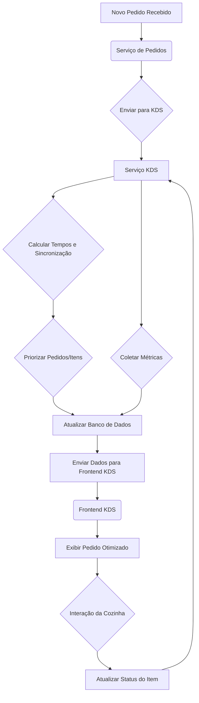

# Inteligência do KDS para Sincronização de Preparo e Eficiência na Cozinha

## 1. Visão Geral

Este documento descreve o design da funcionalidade de inteligência para o Kitchen Display System (KDS) do POS Modern. O objetivo é otimizar o fluxo de trabalho na cozinha, sincronizando o preparo de itens com diferentes tempos de produção para que fiquem prontos simultaneamente e melhorando a eficiência geral da cozinha, inspirado em sistemas como o Groomer utilizado na rede Madero.

## 2. Requisitos Funcionais

- **Cálculo de Tempo de Preparo**: O sistema deve ser capaz de estimar o tempo de preparo para cada item do menu.
- **Sincronização de Itens**: Para pedidos com múltiplos itens, o KDS deve indicar o momento ideal para iniciar o preparo de cada item, visando a finalização conjunta.
- **Priorização Inteligente**: O KDS deve priorizar pedidos e itens com base em fatores como tempo de espera do cliente, complexidade do item e capacidade da estação de trabalho.
- **Visualização Otimizada**: A interface do KDS deve apresentar os pedidos e itens de forma clara, destacando os próximos passos e os tempos estimados.
- **Configuração Flexível**: Permitir a configuração dos tempos de preparo por item e a definição das estações de trabalho na cozinha.
- **Monitoramento e Métricas**: Coletar dados sobre tempos de preparo reais para análise e otimização contínua.

## 3. Arquitetura

### 3.1. Componentes Envolvidos

- **Módulo de Produtos**: Armazena os tempos de preparo estimados para cada item.
- **Módulo de Pedidos**: Envia os pedidos para o KDS.
- **Serviço KDS (Backend)**: Recebe os pedidos, aplica a lógica de sincronização e priorização, e envia os dados para o frontend KDS.
- **Frontend KDS**: Exibe os pedidos e itens de forma otimizada, guiando a equipe da cozinha.
- **Banco de Dados (PostgreSQL)**: Armazena configurações, tempos de preparo e métricas.

### 3.2. Fluxo de Dados



### 3.3. Modelo de Dados (Adições)

- **Tabela `products`**: Adicionar campo `estimated_prep_time` (inteiro, em segundos).
- **Tabela `kds_stations`**: Armazenar informações sobre as estações de trabalho (ID, nome, tipo, capacidade).
- **Tabela `kds_item_status`**: Rastrear o status detalhado de cada item no KDS (ID do item do pedido, status [pendente, preparando, pronto], tempo_inicio_preparo_estimado, tempo_inicio_preparo_real, tempo_fim_preparo_real, id_estacao).
- **Tabela `kds_order_metrics`**: Armazenar métricas por pedido (ID do pedido, tempo_total_espera, tempo_total_preparo).

### 3.4. Lógica de Sincronização

1.  **Obter Tempos**: Para um novo pedido, obter o `estimated_prep_time` de cada item do Módulo de Produtos.
2.  **Identificar Item Mais Demorado**: Encontrar o item com o maior `estimated_prep_time` no pedido.
3.  **Calcular Tempo de Início**: Para cada item, calcular o `tempo_inicio_preparo_estimado` subtraindo seu `estimated_prep_time` do `estimated_prep_time` do item mais demorado. O item mais demorado terá `tempo_inicio_preparo_estimado = 0` (relativo ao momento em que o pedido entra no KDS).
4.  **Ajustar por Dependências**: (Opcional) Se houver dependências entre itens (ex: base da pizza precisa estar pronta antes de adicionar cobertura), ajustar os tempos de início.
5.  **Considerar Capacidade**: Levar em conta a capacidade das estações de trabalho ao agendar o início dos preparos.

### 3.5. Lógica de Priorização

- **FIFO (First-In, First-Out)**: Como base, os pedidos mais antigos têm prioridade.
- **Tempo de Espera**: Pedidos que excedem um limite de tempo de espera podem ter prioridade aumentada.
- **Complexidade**: Pedidos com muitos itens ou itens complexos podem ser tratados de forma diferente (ex: iniciar mais cedo).
- **Tipo de Pedido**: Pedidos para viagem ou delivery podem ter prioridades diferentes de pedidos para consumo no local.
- **Otimização de Estação**: Agrupar itens que podem ser preparados na mesma estação ou simultaneamente.

## 4. Interface do KDS (Frontend)

### 4.1. Visualização de Pedidos

- **Cards de Pedido**: Cada pedido é exibido como um card.
- **Informações do Card**: Número do pedido, tempo de espera atual, status geral.
- **Ordenação**: Cards ordenados por prioridade (calculada pelo backend).

### 4.2. Visualização de Itens dentro do Card

- **Lista de Itens**: Itens do pedido listados dentro do card.
- **Status do Item**: Indicação visual clara do status (Pendente, Preparando, Pronto).
- **Tempo de Início**: Exibir o momento ideal para iniciar o preparo (contagem regressiva ou horário).
- **Destaque**: Itens cujo preparo deve ser iniciado em breve são destacados.
- **Agrupamento por Estação**: (Opcional) Agrupar itens pela estação de trabalho designada.

### 4.3. Interação

- **Marcar Início**: Botão ou toque para marcar o início real do preparo de um item.
- **Marcar Conclusão**: Botão ou toque para marcar um item como pronto.
- **Avançar Pedido**: Botão para marcar o pedido inteiro como pronto.
- **Filtros**: Opção para filtrar por estação de trabalho.

### 4.4. Exemplo de Card de Pedido

```
+------------------------------------------+
| Pedido #123 | Tempo: 05:32 | Prioridade: Alta |
+------------------------------------------+
| Item                     | Status      | Iniciar Em |
|--------------------------|-------------|------------|
| [ ] X-Burger             | Pendente    | 00:30      | <- Destaque
| [ ] Batata Frita (M)     | Pendente    | 02:00      |
| [ ] Refrigerante         | Pronto      | N/A        |
+------------------------------------------+
| [ Marcar como Pronto ]                   |
+------------------------------------------+
```

## 5. Implementação

### 5.1. Backend (Serviço KDS)

- **Modificar `kds_service.py`**: Implementar a lógica de cálculo de tempo, sincronização e priorização.
- **Novos Endpoints**: Criar endpoints para:
    - Configuração de tempos de preparo (se não gerenciado pelo Módulo de Produtos).
    - Configuração de estações de trabalho.
    - Obtenção de métricas de desempenho.
- **Integração com Event Bus**: Escutar eventos de novos pedidos e publicar eventos de atualização de status de itens/pedidos.
- **Integração com Banco de Dados**: Salvar e recuperar configurações, status e métricas.

### 5.2. Frontend (KDS)

- **Modificar Componentes React**: Atualizar os componentes de exibição de pedidos e itens para incluir as novas informações (tempo de início, destaque, status detalhado).
- **Implementar Lógica de UI**: Adicionar a lógica para ordenação por prioridade, contagens regressivas, destaques visuais.
- **Adicionar Interações**: Implementar os botões e ações para marcar início/fim de preparo.
- **Chamadas de API**: Atualizar as chamadas para o backend KDS.

### 5.3. Módulo de Produtos

- **Adicionar Campo**: Incluir `estimated_prep_time` no modelo `Product`.
- **Interface de Admin**: Permitir que administradores configurem o tempo de preparo para cada produto.

## 6. Considerações Adicionais

- **Aprendizado de Máquina**: No futuro, pode-se usar machine learning para ajustar dinamicamente os tempos de preparo estimados com base nos dados reais coletados.
- **Alertas**: Implementar alertas visuais ou sonoros para itens que estão atrasados ou que precisam de atenção imediata.
- **Balanceamento de Carga**: Distribuir itens automaticamente entre estações de trabalho disponíveis com base na carga atual.

## 7. Conclusão

A implementação desta inteligência no KDS trará benefícios significativos para a eficiência da cozinha, reduzindo tempos de espera e garantindo que os pedidos sejam entregues de forma mais consistente e sincronizada. A abordagem modular permite uma implementação faseada e a configuração flexível garante adaptabilidade a diferentes tipos de cozinha e operações.
