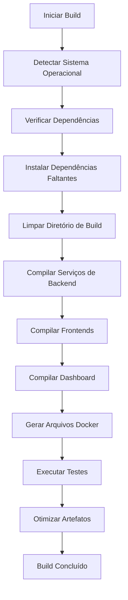
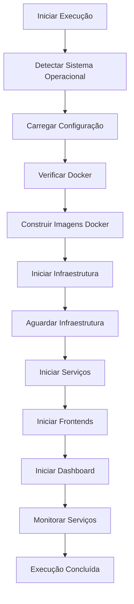
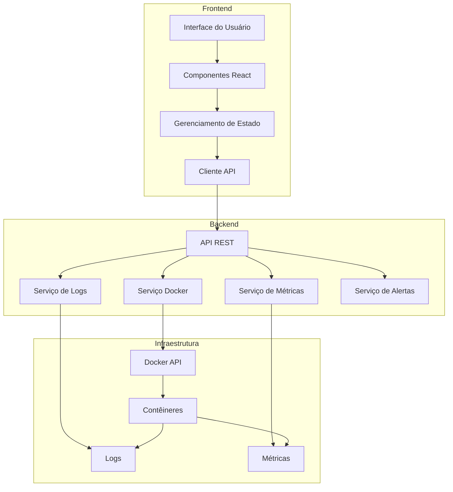

# Scripts de Build e Execução Unificados com Dashboard de Serviços

## 1. Visão Geral

Este documento detalha o design dos scripts unificados de build e execução, juntamente com o dashboard de serviços para o sistema POS Modern. Estes componentes são essenciais para simplificar o desenvolvimento, implantação e monitoramento do sistema, proporcionando uma experiência fluida para desenvolvedores e operadores em ambientes Linux e Windows.

## 2. Requisitos Funcionais

### 2.1. Scripts de Build

- Compilação de todos os módulos do sistema (frontend e backend)
- Suporte a diferentes ambientes (desenvolvimento, teste, produção)
- Verificação de dependências e instalação automática
- Execução de testes automatizados
- Geração de artefatos de build otimizados
- Suporte a builds incrementais para desenvolvimento
- **Compatibilidade cross-platform (Linux e Windows)**

### 2.2. Scripts de Execução

- Inicialização de todos os serviços necessários
- Configuração dinâmica baseada no ambiente
- Suporte a inicialização seletiva de módulos
- Monitoramento de logs e status
- Reinicialização automática em caso de falha
- Suporte a atualizações sem interrupção do serviço
- **Compatibilidade cross-platform (Linux e Windows)**

### 2.3. Dashboard de Serviços

- Visualização do status de todos os serviços
- Monitoramento de recursos (CPU, memória, disco)
- Visualização de logs em tempo real
- Controle de serviços (iniciar, parar, reiniciar)
- Alertas para problemas e anomalias
- Métricas de desempenho e utilização

## 3. Arquitetura

### 3.1. Estrutura de Diretórios

```
pos-modern/
├── scripts/
│   ├── linux/                  # Scripts para Linux
│   │   ├── build.sh            # Script principal de build para Linux
│   │   ├── run.sh              # Script principal de execução para Linux
│   │   └── lib/                # Bibliotecas compartilhadas para Linux
│   │       ├── common.sh       # Funções comuns
│   │       ├── docker.sh       # Funções relacionadas ao Docker
│   │       ├── build-utils.sh  # Utilitários de build
│   │       └── run-utils.sh    # Utilitários de execução
│   ├── windows/                # Scripts para Windows
│   │   ├── build.bat           # Script batch de build para Windows
│   │   ├── run.bat             # Script batch de execução para Windows
│   │   ├── build.ps1           # Script PowerShell de build para Windows
│   │   ├── run.ps1             # Script PowerShell de execução para Windows
│   │   └── lib/                # Bibliotecas compartilhadas para Windows
│   │       ├── common.ps1      # Funções comuns
│   │       ├── docker.ps1      # Funções relacionadas ao Docker
│   │       ├── build-utils.ps1 # Utilitários de build
│   │       └── run-utils.ps1   # Utilitários de execução
│   ├── build.cmd               # Script unificado de build (detecta SO e redireciona)
│   ├── run.cmd                 # Script unificado de execução (detecta SO e redireciona)
│   ├── config/                 # Configurações (compartilhadas entre plataformas)
│   │   ├── build.config.json   # Configuração de build
│   │   ├── run.config.json     # Configuração de execução
│   │   ├── dev.env             # Variáveis de ambiente para desenvolvimento
│   │   ├── test.env            # Variáveis de ambiente para teste
│   │   └── prod.env            # Variáveis de ambiente para produção
│   └── templates/              # Templates para geração de arquivos
│       ├── docker-compose.yml.template
│       └── nginx.conf.template
├── dashboard/                  # Dashboard de serviços
│   ├── backend/                # Backend do dashboard
│   │   ├── src/                # Código-fonte
│   │   ├── package.json        # Dependências
│   │   └── Dockerfile          # Configuração do contêiner
│   └── frontend/               # Frontend do dashboard
│       ├── src/                # Código-fonte
│       ├── package.json        # Dependências
│       └── Dockerfile          # Configuração do contêiner
└── build/                      # Diretório de saída do build
    ├── services/               # Serviços compilados
    ├── frontends/              # Frontends compilados
    ├── docker/                 # Arquivos Docker
    └── dashboard/              # Dashboard compilado
```

### 3.2. Fluxo de Build



### 3.3. Fluxo de Execução



### 3.4. Arquitetura do Dashboard



## 4. Implementação Cross-Platform

### 4.1. Scripts Unificados

#### 4.1.1. Script Unificado de Build (build.cmd)

```batch
@echo off
REM Script unificado de build que detecta o SO e redireciona para o script apropriado

REM Detectar sistema operacional
IF "%OS%"=="Windows_NT" (
    REM Windows
    echo Detectado Windows, redirecionando para script Windows...
    
    REM Verificar se PowerShell está disponível
    WHERE powershell >nul 2>nul
    IF %ERRORLEVEL% EQU 0 (
        REM Usar PowerShell
        powershell -ExecutionPolicy Bypass -File "%~dp0windows\build.ps1" %*
    ) ELSE (
        REM Usar Batch
        CALL "%~dp0windows\build.bat" %*
    )
) ELSE (
    REM Linux/Unix
    echo Detectado Linux/Unix, redirecionando para script Linux...
    bash "%~dp0linux/build.sh" %*
)
```

#### 4.1.2. Script Unificado de Execução (run.cmd)

```batch
@echo off
REM Script unificado de execução que detecta o SO e redireciona para o script apropriado

REM Detectar sistema operacional
IF "%OS%"=="Windows_NT" (
    REM Windows
    echo Detectado Windows, redirecionando para script Windows...
    
    REM Verificar se PowerShell está disponível
    WHERE powershell >nul 2>nul
    IF %ERRORLEVEL% EQU 0 (
        REM Usar PowerShell
        powershell -ExecutionPolicy Bypass -File "%~dp0windows\run.ps1" %*
    ) ELSE (
        REM Usar Batch
        CALL "%~dp0windows\run.bat" %*
    )
) ELSE (
    REM Linux/Unix
    echo Detectado Linux/Unix, redirecionando para script Linux...
    bash "%~dp0linux/run.sh" %*
)
```

### 4.2. Implementação para Linux

#### 4.2.1. Script de Build para Linux (linux/build.sh)

```bash
#!/bin/bash
# build.sh - Script principal de build para Linux

# Carregar bibliotecas
source "$(dirname "$0")/lib/common.sh"
source "$(dirname "$0")/lib/docker.sh"
source "$(dirname "$0")/lib/build-utils.sh"

# Configurações padrão
CONFIG_FILE="$(dirname "$0")/../config/build.config.json"
BUILD_ENV="dev"
VERBOSE=false
SKIP_TESTS=false
INCREMENTAL=false
MODULES=()

# Função para exibir ajuda
show_help() {
    echo "Uso: $0 [opções]"
    echo ""
    echo "Opções:"
    echo "  -h, --help                Exibe esta mensagem de ajuda"
    echo "  -c, --config ARQUIVO      Especifica o arquivo de configuração"
    echo "  -e, --env AMBIENTE        Define o ambiente (dev, test, prod)"
    echo "  -v, --verbose             Modo verboso"
    echo "  -s, --skip-tests          Pula a execução de testes"
    echo "  -i, --incremental         Build incremental (apenas alterações)"
    echo "  -m, --module MÓDULO       Compila apenas o módulo especificado"
    echo ""
    echo "Exemplos:"
    echo "  $0 --env prod             Compila para produção"
    echo "  $0 --module order-service Compila apenas o serviço de pedidos"
    echo "  $0 --incremental          Compila apenas os arquivos alterados"
}

# Processar argumentos
while [[ $# -gt 0 ]]; do
    case $1 in
        -h|--help)
            show_help
            exit 0
            ;;
        -c|--config)
            CONFIG_FILE="$2"
            shift 2
            ;;
        -e|--env)
            BUILD_ENV="$2"
            shift 2
            ;;
        -v|--verbose)
            VERBOSE=true
            shift
            ;;
        -s|--skip-tests)
            SKIP_TESTS=true
            shift
            ;;
        -i|--incremental)
            INCREMENTAL=true
            shift
            ;;
        -m|--module)
            MODULES+=("$2")
            shift 2
            ;;
        *)
            echo "Opção desconhecida: $1"
            show_help
            exit 1
            ;;
    esac
done

# Verificar se o arquivo de configuração existe
if [[ ! -f "$CONFIG_FILE" ]]; then
    echo "Erro: Arquivo de configuração não encontrado: $CONFIG_FILE"
    exit 1
fi

# Carregar configuração
log_info "Carregando configuração de build..."
CONFIG=$(cat "$CONFIG_FILE")
BUILD_DIR=$(echo "$CONFIG" | jq -r ".buildDir")
SOURCE_DIR=$(echo "$CONFIG" | jq -r ".sourceDir")
DOCKER_DIR=$(echo "$CONFIG" | jq -r ".dockerDir")

# Criar diretório de build se não existir
if [[ ! -d "$BUILD_DIR" ]]; then
    log_info "Criando diretório de build: $BUILD_DIR"
    mkdir -p "$BUILD_DIR"
fi

# Verificar dependências
log_info "Verificando dependências..."
check_dependencies

# Limpar diretório de build (se não for incremental)
if [[ "$INCREMENTAL" == "false" ]]; then
    log_info "Limpando diretório de build..."
    clean_build_dir "$BUILD_DIR"
fi

# Compilar serviços de backend
log_info "Compilando serviços de backend..."
if [[ ${#MODULES[@]} -eq 0 ]]; then
    # Compilar todos os serviços
    SERVICES=$(echo "$CONFIG" | jq -r ".services[]")
    for SERVICE in $SERVICES; do
        build_service "$SERVICE" "$SOURCE_DIR/services/$SERVICE" "$BUILD_DIR/services/$SERVICE" "$BUILD_ENV"
    done
else
    # Compilar apenas os módulos especificados
    for MODULE in "${MODULES[@]}"; do
        if [[ "$MODULE" == *-service ]]; then
            build_service "$MODULE" "$SOURCE_DIR/services/$MODULE" "$BUILD_DIR/services/$MODULE" "$BUILD_ENV"
        fi
    done
fi

# Compilar frontends
log_info "Compilando frontends..."
if [[ ${#MODULES[@]} -eq 0 ]]; then
    # Compilar todos os frontends
    FRONTENDS=$(echo "$CONFIG" | jq -r ".frontends[]")
    for FRONTEND in $FRONTENDS; do
        build_frontend "$FRONTEND" "$SOURCE_DIR/frontend/$FRONTEND" "$BUILD_DIR/frontends/$FRONTEND" "$BUILD_ENV"
    done
else
    # Compilar apenas os módulos especificados
    for MODULE in "${MODULES[@]}"; do
        if [[ "$MODULE" == *-frontend ]]; then
            FRONTEND=${MODULE%-frontend}
            build_frontend "$FRONTEND" "$SOURCE_DIR/frontend/$FRONTEND" "$BUILD_DIR/frontends/$FRONTEND" "$BUILD_ENV"
        fi
    done
fi

# Compilar dashboard
if [[ ${#MODULES[@]} -eq 0 || " ${MODULES[@]} " =~ " dashboard " ]]; then
    log_info "Compilando dashboard..."
    build_dashboard "$SOURCE_DIR/dashboard" "$BUILD_DIR/dashboard" "$BUILD_ENV"
fi

# Gerar arquivos Docker
log_info "Gerando arquivos Docker..."
generate_docker_files "$DOCKER_DIR" "$BUILD_DIR/docker" "$BUILD_ENV"

# Executar testes
if [[ "$SKIP_TESTS" == "false" ]]; then
    log_info "Executando testes..."
    run_tests "$BUILD_DIR" "$BUILD_ENV"
fi

# Otimizar artefatos
log_info "Otimizando artefatos..."
optimize_artifacts "$BUILD_DIR" "$BUILD_ENV"

log_success "Build concluído com sucesso!"
```

#### 4.2.2. Script de Execução para Linux (linux/run.sh)

```bash
#!/bin/bash
# run.sh - Script principal de execução para Linux

# Carregar bibliotecas
source "$(dirname "$0")/lib/common.sh"
source "$(dirname "$0")/lib/docker.sh"
source "$(dirname "$0")/lib/run-utils.sh"

# Configurações padrão
CONFIG_FILE="$(dirname "$0")/../config/run.config.json"
RUN_ENV="dev"
VERBOSE=false
DETACHED=false
MODULES=()
ACTION="start"

# Função para exibir ajuda
show_help() {
    echo "Uso: $0 [opções]"
    echo ""
    echo "Opções:"
    echo "  -h, --help                Exibe esta mensagem de ajuda"
    echo "  -c, --config ARQUIVO      Especifica o arquivo de configuração"
    echo "  -e, --env AMBIENTE        Define o ambiente (dev, test, prod)"
    echo "  -v, --verbose             Modo verboso"
    echo "  -d, --detached            Executa em segundo plano"
    echo "  -m, --module MÓDULO       Executa apenas o módulo especificado"
    echo "  --start                   Inicia os serviços (padrão)"
    echo "  --stop                    Para os serviços"
    echo "  --restart                 Reinicia os serviços"
    echo "  --status                  Exibe o status dos serviços"
    echo "  --logs                    Exibe os logs dos serviços"
    echo "  --dashboard               Abre o dashboard no navegador"
    echo ""
    echo "Exemplos:"
    echo "  $0 --env prod             Executa em ambiente de produção"
    echo "  $0 --module order-service Executa apenas o serviço de pedidos"
    echo "  $0 --stop                 Para todos os serviços"
    echo "  $0 --logs                 Exibe os logs de todos os serviços"
}

# Processar argumentos
while [[ $# -gt 0 ]]; do
    case $1 in
        -h|--help)
            show_help
            exit 0
            ;;
        -c|--config)
            CONFIG_FILE="$2"
            shift 2
            ;;
        -e|--env)
            RUN_ENV="$2"
            shift 2
            ;;
        -v|--verbose)
            VERBOSE=true
            shift
            ;;
        -d|--detached)
            DETACHED=true
            shift
            ;;
        -m|--module)
            MODULES+=("$2")
            shift 2
            ;;
        --start)
            ACTION="start"
            shift
            ;;
        --stop)
            ACTION="stop"
            shift
            ;;
        --restart)
            ACTION="restart"
            shift
            ;;
        --status)
            ACTION="status"
            shift
            ;;
        --logs)
            ACTION="logs"
            shift
            ;;
        --dashboard)
            ACTION="dashboard"
            shift
            ;;
        *)
            echo "Opção desconhecida: $1"
            show_help
            exit 1
            ;;
    esac
done

# Verificar se o arquivo de configuração existe
if [[ ! -f "$CONFIG_FILE" ]]; then
    echo "Erro: Arquivo de configuração não encontrado: $CONFIG_FILE"
    exit 1
fi

# Carregar configuração
log_info "Carregando configuração de execução..."
CONFIG=$(cat "$CONFIG_FILE")
BUILD_DIR=$(echo "$CONFIG" | jq -r ".buildDir")
DOCKER_COMPOSE_FILE="$BUILD_DIR/docker/docker-compose.yml"
ENV_FILE="$(dirname "$0")/../config/$RUN_ENV.env"

# Verificar se o diretório de build existe
if [[ ! -d "$BUILD_DIR" ]]; then
    echo "Erro: Diretório de build não encontrado: $BUILD_DIR"
    echo "Execute o script de build primeiro."
    exit 1
fi

# Verificar se o arquivo docker-compose existe
if [[ ! -f "$DOCKER_COMPOSE_FILE" ]]; then
    echo "Erro: Arquivo docker-compose não encontrado: $DOCKER_COMPOSE_FILE"
    echo "Execute o script de build primeiro."
    exit 1
fi

# Verificar se o arquivo de ambiente existe
if [[ ! -f "$ENV_FILE" ]]; then
    echo "Erro: Arquivo de ambiente não encontrado: $ENV_FILE"
    exit 1
fi

# Verificar Docker
log_info "Verificando Docker..."
check_docker

# Executar ação
case "$ACTION" in
    start)
        log_info "Iniciando serviços..."
        if [[ ${#MODULES[@]} -eq 0 ]]; then
            start_services "$DOCKER_COMPOSE_FILE" "$ENV_FILE" "$DETACHED"
        else
            for MODULE in "${MODULES[@]}"; do
                start_module "$DOCKER_COMPOSE_FILE" "$ENV_FILE" "$MODULE" "$DETACHED"
            done
        fi
        ;;
    stop)
        log_info "Parando serviços..."
        if [[ ${#MODULES[@]} -eq 0 ]]; then
            stop_services "$DOCKER_COMPOSE_FILE"
        else
            for MODULE in "${MODULES[@]}"; do
                stop_module "$DOCKER_COMPOSE_FILE" "$MODULE"
            done
        fi
        ;;
    restart)
        log_info "Reiniciando serviços..."
        if [[ ${#MODULES[@]} -eq 0 ]]; then
            restart_services "$DOCKER_COMPOSE_FILE" "$ENV_FILE"
        else
            for MODULE in "${MODULES[@]}"; do
                restart_module "$DOCKER_COMPOSE_FILE" "$ENV_FILE" "$MODULE"
            done
        fi
        ;;
    status)
        log_info "Status dos serviços:"
        show_status "$DOCKER_COMPOSE_FILE"
        ;;
    logs)
        log_info "Logs dos serviços:"
        if [[ ${#MODULES[@]} -eq 0 ]]; then
            show_logs "$DOCKER_COMPOSE_FILE"
        else
            for MODULE in "${MODULES[@]}"; do
                show_module_logs "$DOCKER_COMPOSE_FILE" "$MODULE"
            done
        fi
        ;;
    dashboard)
        log_info "Abrindo dashboard..."
        open_dashboard
        ;;
    *)
        echo "Ação desconhecida: $ACTION"
        show_help
        exit 1
        ;;
esac

log_success "Execução concluída com sucesso!"
```

### 4.3. Implementação para Windows

#### 4.3.1. Script de Build para Windows (PowerShell) (windows/build.ps1)

```powershell
# build.ps1 - Script principal de build para Windows (PowerShell)

# Importar módulos
. "$PSScriptRoot\lib\common.ps1"
. "$PSScriptRoot\lib\docker.ps1"
. "$PSScriptRoot\lib\build-utils.ps1"

# Configurações padrão
$CONFIG_FILE = "$PSScriptRoot\..\config\build.config.json"
$BUILD_ENV = "dev"
$VERBOSE = $false
$SKIP_TESTS = $false
$INCREMENTAL = $false
$MODULES = @()

# Função para exibir ajuda
function Show-Help {
    Write-Host "Uso: $($MyInvocation.MyCommand.Name) [opções]"
    Write-Host ""
    Write-Host "Opções:"
    Write-Host "  -Help                      Exibe esta mensagem de ajuda"
    Write-Host "  -Config ARQUIVO            Especifica o arquivo de configuração"
    Write-Host "  -Env AMBIENTE              Define o ambiente (dev, test, prod)"
    Write-Host "  -Verbose                   Modo verboso"
    Write-Host "  -SkipTests                 Pula a execução de testes"
    Write-Host "  -Incremental               Build incremental (apenas alterações)"
    Write-Host "  -Module MÓDULO             Compila apenas o módulo especificado"
    Write-Host ""
    Write-Host "Exemplos:"
    Write-Host "  $($MyInvocation.MyCommand.Name) -Env prod             Compila para produção"
    Write-Host "  $($MyInvocation.MyCommand.Name) -Module order-service Compila apenas o serviço de pedidos"
    Write-Host "  $($MyInvocation.MyCommand.Name) -Incremental          Compila apenas os arquivos alterados"
}

# Processar argumentos
for ($i = 0; $i -lt $args.Count; $i++) {
    switch ($args[$i]) {
        "-Help" {
            Show-Help
            exit 0
        }
        "-Config" {
            $CONFIG_FILE = $args[++$i]
        }
        "-Env" {
            $BUILD_ENV = $args[++$i]
        }
        "-Verbose" {
            $VERBOSE = $true
        }
        "-SkipTests" {
            $SKIP_TESTS = $true
        }
        "-Incremental" {
            $INCREMENTAL = $true
        }
        "-Module" {
            $MODULES += $args[++$i]
        }
        default {
            Write-Host "Opção desconhecida: $($args[$i])"
            Show-Help
            exit 1
        }
    }
}

# Verificar se o arquivo de configuração existe
if (-not (Test-Path $CONFIG_FILE)) {
    Write-Host "Erro: Arquivo de configuração não encontrado: $CONFIG_FILE"
    exit 1
}

# Carregar configuração
Log-Info "Carregando configuração de build..."
$CONFIG = Get-Content $CONFIG_FILE | ConvertFrom-Json
$BUILD_DIR = $CONFIG.buildDir
$SOURCE_DIR = $CONFIG.sourceDir
$DOCKER_DIR = $CONFIG.dockerDir

# Converter caminhos para formato Windows
$BUILD_DIR = $BUILD_DIR -replace "/", "\"
$SOURCE_DIR = $SOURCE_DIR -replace "/", "\"
$DOCKER_DIR = $DOCKER_DIR -replace "/", "\"

# Criar diretório de build se não existir
if (-not (Test-Path $BUILD_DIR)) {
    Log-Info "Criando diretório de build: $BUILD_DIR"
    New-Item -Path $BUILD_DIR -ItemType Directory -Force | Out-Null
}

# Verificar dependências
Log-Info "Verificando dependências..."
Check-Dependencies

# Limpar diretório de build (se não for incremental)
if (-not $INCREMENTAL) {
    Log-Info "Limpando diretório de build..."
    Clean-BuildDir $BUILD_DIR
}

# Compilar serviços de backend
Log-Info "Compilando serviços de backend..."
if ($MODULES.Count -eq 0) {
    # Compilar todos os serviços
    $SERVICES = $CONFIG.services
    foreach ($SERVICE in $SERVICES) {
        Build-Service $SERVICE "$SOURCE_DIR\services\$SERVICE" "$BUILD_DIR\services\$SERVICE" $BUILD_ENV
    }
} else {
    # Compilar apenas os módulos especificados
    foreach ($MODULE in $MODULES) {
        if ($MODULE -like "*-service") {
            Build-Service $MODULE "$SOURCE_DIR\services\$MODULE" "$BUILD_DIR\services\$MODULE" $BUILD_ENV
        }
    }
}

# Compilar frontends
Log-Info "Compilando frontends..."
if ($MODULES.Count -eq 0) {
    # Compilar todos os frontends
    $FRONTENDS = $CONFIG.frontends
    foreach ($FRONTEND in $FRONTENDS) {
        Build-Frontend $FRONTEND "$SOURCE_DIR\frontend\$FRONTEND" "$BUILD_DIR\frontends\$FRONTEND" $BUILD_ENV
    }
} else {
    # Compilar apenas os módulos especificados
    foreach ($MODULE in $MODULES) {
        if ($MODULE -like "*-frontend") {
            $FRONTEND = $MODULE -replace "-frontend$", ""
            Build-Frontend $FRONTEND "$SOURCE_DIR\frontend\$FRONTEND" "$BUILD_DIR\frontends\$FRONTEND" $BUILD_ENV
        }
    }
}

# Compilar dashboard
if ($MODULES.Count -eq 0 -or $MODULES -contains "dashboard") {
    Log-Info "Compilando dashboard..."
    Build-Dashboard "$SOURCE_DIR\dashboard" "$BUILD_DIR\dashboard" $BUILD_ENV
}

# Gerar arquivos Docker
Log-Info "Gerando arquivos Docker..."
Generate-DockerFiles $DOCKER_DIR "$BUILD_DIR\docker" $BUILD_ENV

# Executar testes
if (-not $SKIP_TESTS) {
    Log-Info "Executando testes..."
    Run-Tests $BUILD_DIR $BUILD_ENV
}

# Otimizar artefatos
Log-Info "Otimizando artefatos..."
Optimize-Artifacts $BUILD_DIR $BUILD_ENV

Log-Success "Build concluído com sucesso!"
```

#### 4.3.2. Script de Execução para Windows (PowerShell) (windows/run.ps1)

```powershell
# run.ps1 - Script principal de execução para Windows (PowerShell)

# Importar módulos
. "$PSScriptRoot\lib\common.ps1"
. "$PSScriptRoot\lib\docker.ps1"
. "$PSScriptRoot\lib\run-utils.ps1"

# Configurações padrão
$CONFIG_FILE = "$PSScriptRoot\..\config\run.config.json"
$RUN_ENV = "dev"
$VERBOSE = $false
$DETACHED = $false
$MODULES = @()
$ACTION = "start"

# Função para exibir ajuda
function Show-Help {
    Write-Host "Uso: $($MyInvocation.MyCommand.Name) [opções]"
    Write-Host ""
    Write-Host "Opções:"
    Write-Host "  -Help                      Exibe esta mensagem de ajuda"
    Write-Host "  -Config ARQUIVO            Especifica o arquivo de configuração"
    Write-Host "  -Env AMBIENTE              Define o ambiente (dev, test, prod)"
    Write-Host "  -Verbose                   Modo verboso"
    Write-Host "  -Detached                  Executa em segundo plano"
    Write-Host "  -Module MÓDULO             Executa apenas o módulo especificado"
    Write-Host "  -Start                     Inicia os serviços (padrão)"
    Write-Host "  -Stop                      Para os serviços"
    Write-Host "  -Restart                   Reinicia os serviços"
    Write-Host "  -Status                    Exibe o status dos serviços"
    Write-Host "  -Logs                      Exibe os logs dos serviços"
    Write-Host "  -Dashboard                 Abre o dashboard no navegador"
    Write-Host ""
    Write-Host "Exemplos:"
    Write-Host "  $($MyInvocation.MyCommand.Name) -Env prod             Executa em ambiente de produção"
    Write-Host "  $($MyInvocation.MyCommand.Name) -Module order-service Executa apenas o serviço de pedidos"
    Write-Host "  $($MyInvocation.MyCommand.Name) -Stop                 Para todos os serviços"
    Write-Host "  $($MyInvocation.MyCommand.Name) -Logs                 Exibe os logs de todos os serviços"
}

# Processar argumentos
for ($i = 0; $i -lt $args.Count; $i++) {
    switch ($args[$i]) {
        "-Help" {
            Show-Help
            exit 0
        }
        "-Config" {
            $CONFIG_FILE = $args[++$i]
        }
        "-Env" {
            $RUN_ENV = $args[++$i]
        }
        "-Verbose" {
            $VERBOSE = $true
        }
        "-Detached" {
            $DETACHED = $true
        }
        "-Module" {
            $MODULES += $args[++$i]
        }
        "-Start" {
            $ACTION = "start"
        }
        "-Stop" {
            $ACTION = "stop"
        }
        "-Restart" {
            $ACTION = "restart"
        }
        "-Status" {
            $ACTION = "status"
        }
        "-Logs" {
            $ACTION = "logs"
        }
        "-Dashboard" {
            $ACTION = "dashboard"
        }
        default {
            Write-Host "Opção desconhecida: $($args[$i])"
            Show-Help
            exit 1
        }
    }
}

# Verificar se o arquivo de configuração existe
if (-not (Test-Path $CONFIG_FILE)) {
    Write-Host "Erro: Arquivo de configuração não encontrado: $CONFIG_FILE"
    exit 1
}

# Carregar configuração
Log-Info "Carregando configuração de execução..."
$CONFIG = Get-Content $CONFIG_FILE | ConvertFrom-Json
$BUILD_DIR = $CONFIG.buildDir
$DOCKER_COMPOSE_FILE = "$BUILD_DIR\docker\docker-compose.yml"
$ENV_FILE = "$PSScriptRoot\..\config\$RUN_ENV.env"

# Converter caminhos para formato Windows
$BUILD_DIR = $BUILD_DIR -replace "/", "\"
$DOCKER_COMPOSE_FILE = $DOCKER_COMPOSE_FILE -replace "/", "\"
$ENV_FILE = $ENV_FILE -replace "/", "\"

# Verificar se o diretório de build existe
if (-not (Test-Path $BUILD_DIR)) {
    Write-Host "Erro: Diretório de build não encontrado: $BUILD_DIR"
    Write-Host "Execute o script de build primeiro."
    exit 1
}

# Verificar se o arquivo docker-compose existe
if (-not (Test-Path $DOCKER_COMPOSE_FILE)) {
    Write-Host "Erro: Arquivo docker-compose não encontrado: $DOCKER_COMPOSE_FILE"
    Write-Host "Execute o script de build primeiro."
    exit 1
}

# Verificar se o arquivo de ambiente existe
if (-not (Test-Path $ENV_FILE)) {
    Write-Host "Erro: Arquivo de ambiente não encontrado: $ENV_FILE"
    exit 1
}

# Verificar Docker
Log-Info "Verificando Docker..."
Check-Docker

# Executar ação
switch ($ACTION) {
    "start" {
        Log-Info "Iniciando serviços..."
        if ($MODULES.Count -eq 0) {
            Start-Services $DOCKER_COMPOSE_FILE $ENV_FILE $DETACHED
        } else {
            foreach ($MODULE in $MODULES) {
                Start-Module $DOCKER_COMPOSE_FILE $ENV_FILE $MODULE $DETACHED
            }
        }
    }
    "stop" {
        Log-Info "Parando serviços..."
        if ($MODULES.Count -eq 0) {
            Stop-Services $DOCKER_COMPOSE_FILE
        } else {
            foreach ($MODULE in $MODULES) {
                Stop-Module $DOCKER_COMPOSE_FILE $MODULE
            }
        }
    }
    "restart" {
        Log-Info "Reiniciando serviços..."
        if ($MODULES.Count -eq 0) {
            Restart-Services $DOCKER_COMPOSE_FILE $ENV_FILE
        } else {
            foreach ($MODULE in $MODULES) {
                Restart-Module $DOCKER_COMPOSE_FILE $ENV_FILE $MODULE
            }
        }
    }
    "status" {
        Log-Info "Status dos serviços:"
        Show-Status $DOCKER_COMPOSE_FILE
    }
    "logs" {
        Log-Info "Logs dos serviços:"
        if ($MODULES.Count -eq 0) {
            Show-Logs $DOCKER_COMPOSE_FILE
        } else {
            foreach ($MODULE in $MODULES) {
                Show-ModuleLogs $DOCKER_COMPOSE_FILE $MODULE
            }
        }
    }
    "dashboard" {
        Log-Info "Abrindo dashboard..."
        Open-Dashboard
    }
    default {
        Write-Host "Ação desconhecida: $ACTION"
        Show-Help
        exit 1
    }
}

Log-Success "Execução concluída com sucesso!"
```

#### 4.3.3. Script de Build para Windows (Batch) (windows/build.bat)

```batch
@echo off
REM build.bat - Script principal de build para Windows (Batch)

setlocal enabledelayedexpansion

REM Configurações padrão
set "CONFIG_FILE=%~dp0..\config\build.config.json"
set "BUILD_ENV=dev"
set "VERBOSE=false"
set "SKIP_TESTS=false"
set "INCREMENTAL=false"
set "MODULES="

REM Função para exibir ajuda
:show_help
    echo Uso: %~nx0 [opções]
    echo.
    echo Opções:
    echo   /h, /help                 Exibe esta mensagem de ajuda
    echo   /c, /config ARQUIVO       Especifica o arquivo de configuração
    echo   /e, /env AMBIENTE         Define o ambiente (dev, test, prod)
    echo   /v, /verbose              Modo verboso
    echo   /s, /skip-tests           Pula a execução de testes
    echo   /i, /incremental          Build incremental (apenas alterações)
    echo   /m, /module MÓDULO        Compila apenas o módulo especificado
    echo.
    echo Exemplos:
    echo   %~nx0 /env prod             Compila para produção
    echo   %~nx0 /module order-service Compila apenas o serviço de pedidos
    echo   %~nx0 /incremental          Compila apenas os arquivos alterados
    exit /b 0

REM Processar argumentos
:parse_args
    if "%~1"=="" goto :end_parse_args
    
    if /i "%~1"=="/h" (
        call :show_help
        exit /b 0
    ) else if /i "%~1"=="/help" (
        call :show_help
        exit /b 0
    ) else if /i "%~1"=="/c" (
        set "CONFIG_FILE=%~2"
        shift
    ) else if /i "%~1"=="/config" (
        set "CONFIG_FILE=%~2"
        shift
    ) else if /i "%~1"=="/e" (
        set "BUILD_ENV=%~2"
        shift
    ) else if /i "%~1"=="/env" (
        set "BUILD_ENV=%~2"
        shift
    ) else if /i "%~1"=="/v" (
        set "VERBOSE=true"
    ) else if /i "%~1"=="/verbose" (
        set "VERBOSE=true"
    ) else if /i "%~1"=="/s" (
        set "SKIP_TESTS=true"
    ) else if /i "%~1"=="/skip-tests" (
        set "SKIP_TESTS=true"
    ) else if /i "%~1"=="/i" (
        set "INCREMENTAL=true"
    ) else if /i "%~1"=="/incremental" (
        set "INCREMENTAL=true"
    ) else if /i "%~1"=="/m" (
        set "MODULES=!MODULES! %~2"
        shift
    ) else if /i "%~1"=="/module" (
        set "MODULES=!MODULES! %~2"
        shift
    ) else (
        echo Opção desconhecida: %~1
        call :show_help
        exit /b 1
    )
    
    shift
    goto :parse_args
:end_parse_args

REM Verificar se o arquivo de configuração existe
if not exist "%CONFIG_FILE%" (
    echo Erro: Arquivo de configuração não encontrado: %CONFIG_FILE%
    exit /b 1
)

REM Carregar configuração
echo [INFO] Carregando configuração de build...
for /f "tokens=* usebackq" %%a in (`type "%CONFIG_FILE%" ^| jq -r ".buildDir"`) do (
    set "BUILD_DIR=%%a"
)
for /f "tokens=* usebackq" %%a in (`type "%CONFIG_FILE%" ^| jq -r ".sourceDir"`) do (
    set "SOURCE_DIR=%%a"
)
for /f "tokens=* usebackq" %%a in (`type "%CONFIG_FILE%" ^| jq -r ".dockerDir"`) do (
    set "DOCKER_DIR=%%a"
)

REM Converter caminhos para formato Windows
set "BUILD_DIR=%BUILD_DIR:/=\%"
set "SOURCE_DIR=%SOURCE_DIR:/=\%"
set "DOCKER_DIR=%DOCKER_DIR:/=\%"

REM Criar diretório de build se não existir
if not exist "%BUILD_DIR%" (
    echo [INFO] Criando diretório de build: %BUILD_DIR%
    mkdir "%BUILD_DIR%"
)

REM Verificar dependências
echo [INFO] Verificando dependências...
call "%~dp0lib\build-utils.bat" check_dependencies

REM Limpar diretório de build (se não for incremental)
if "%INCREMENTAL%"=="false" (
    echo [INFO] Limpando diretório de build...
    call "%~dp0lib\build-utils.bat" clean_build_dir "%BUILD_DIR%"
)

REM Compilar serviços de backend
echo [INFO] Compilando serviços de backend...
if "%MODULES%"=="" (
    REM Compilar todos os serviços
    for /f "tokens=* usebackq" %%a in (`type "%CONFIG_FILE%" ^| jq -r ".services[]"`) do (
        call "%~dp0lib\build-utils.bat" build_service "%%a" "%SOURCE_DIR%\services\%%a" "%BUILD_DIR%\services\%%a" "%BUILD_ENV%"
    )
) else (
    REM Compilar apenas os módulos especificados
    for %%m in (%MODULES%) do (
        echo %%m | findstr /C:"-service" >nul
        if not errorlevel 1 (
            call "%~dp0lib\build-utils.bat" build_service "%%m" "%SOURCE_DIR%\services\%%m" "%BUILD_DIR%\services\%%m" "%BUILD_ENV%"
        )
    )
)

REM Compilar frontends
echo [INFO] Compilando frontends...
if "%MODULES%"=="" (
    REM Compilar todos os frontends
    for /f "tokens=* usebackq" %%a in (`type "%CONFIG_FILE%" ^| jq -r ".frontends[]"`) do (
        call "%~dp0lib\build-utils.bat" build_frontend "%%a" "%SOURCE_DIR%\frontend\%%a" "%BUILD_DIR%\frontends\%%a" "%BUILD_ENV%"
    )
) else (
    REM Compilar apenas os módulos especificados
    for %%m in (%MODULES%) do (
        echo %%m | findstr /C:"-frontend" >nul
        if not errorlevel 1 (
            for /f "tokens=1 delims=-" %%f in ("%%m") do (
                call "%~dp0lib\build-utils.bat" build_frontend "%%f" "%SOURCE_DIR%\frontend\%%f" "%BUILD_DIR%\frontends\%%f" "%BUILD_ENV%"
            )
        )
    )
)

REM Compilar dashboard
if "%MODULES%"=="" (
    echo [INFO] Compilando dashboard...
    call "%~dp0lib\build-utils.bat" build_dashboard "%SOURCE_DIR%\dashboard" "%BUILD_DIR%\dashboard" "%BUILD_ENV%"
) else (
    echo %MODULES% | findstr /C:"dashboard" >nul
    if not errorlevel 1 (
        echo [INFO] Compilando dashboard...
        call "%~dp0lib\build-utils.bat" build_dashboard "%SOURCE_DIR%\dashboard" "%BUILD_DIR%\dashboard" "%BUILD_ENV%"
    )
)

REM Gerar arquivos Docker
echo [INFO] Gerando arquivos Docker...
call "%~dp0lib\build-utils.bat" generate_docker_files "%DOCKER_DIR%" "%BUILD_DIR%\docker" "%BUILD_ENV%"

REM Executar testes
if "%SKIP_TESTS%"=="false" (
    echo [INFO] Executando testes...
    call "%~dp0lib\build-utils.bat" run_tests "%BUILD_DIR%" "%BUILD_ENV%"
)

REM Otimizar artefatos
echo [INFO] Otimizando artefatos...
call "%~dp0lib\build-utils.bat" optimize_artifacts "%BUILD_DIR%" "%BUILD_ENV%"

echo [SUCCESS] Build concluído com sucesso!
exit /b 0
```

#### 4.3.4. Script de Execução para Windows (Batch) (windows/run.bat)

```batch
@echo off
REM run.bat - Script principal de execução para Windows (Batch)

setlocal enabledelayedexpansion

REM Configurações padrão
set "CONFIG_FILE=%~dp0..\config\run.config.json"
set "RUN_ENV=dev"
set "VERBOSE=false"
set "DETACHED=false"
set "MODULES="
set "ACTION=start"

REM Função para exibir ajuda
:show_help
    echo Uso: %~nx0 [opções]
    echo.
    echo Opções:
    echo   /h, /help                 Exibe esta mensagem de ajuda
    echo   /c, /config ARQUIVO       Especifica o arquivo de configuração
    echo   /e, /env AMBIENTE         Define o ambiente (dev, test, prod)
    echo   /v, /verbose              Modo verboso
    echo   /d, /detached             Executa em segundo plano
    echo   /m, /module MÓDULO        Executa apenas o módulo especificado
    echo   /start                    Inicia os serviços (padrão)
    echo   /stop                     Para os serviços
    echo   /restart                  Reinicia os serviços
    echo   /status                   Exibe o status dos serviços
    echo   /logs                     Exibe os logs dos serviços
    echo   /dashboard                Abre o dashboard no navegador
    echo.
    echo Exemplos:
    echo   %~nx0 /env prod             Executa em ambiente de produção
    echo   %~nx0 /module order-service Executa apenas o serviço de pedidos
    echo   %~nx0 /stop                 Para todos os serviços
    echo   %~nx0 /logs                 Exibe os logs de todos os serviços
    exit /b 0

REM Processar argumentos
:parse_args
    if "%~1"=="" goto :end_parse_args
    
    if /i "%~1"=="/h" (
        call :show_help
        exit /b 0
    ) else if /i "%~1"=="/help" (
        call :show_help
        exit /b 0
    ) else if /i "%~1"=="/c" (
        set "CONFIG_FILE=%~2"
        shift
    ) else if /i "%~1"=="/config" (
        set "CONFIG_FILE=%~2"
        shift
    ) else if /i "%~1"=="/e" (
        set "RUN_ENV=%~2"
        shift
    ) else if /i "%~1"=="/env" (
        set "RUN_ENV=%~2"
        shift
    ) else if /i "%~1"=="/v" (
        set "VERBOSE=true"
    ) else if /i "%~1"=="/verbose" (
        set "VERBOSE=true"
    ) else if /i "%~1"=="/d" (
        set "DETACHED=true"
    ) else if /i "%~1"=="/detached" (
        set "DETACHED=true"
    ) else if /i "%~1"=="/m" (
        set "MODULES=!MODULES! %~2"
        shift
    ) else if /i "%~1"=="/module" (
        set "MODULES=!MODULES! %~2"
        shift
    ) else if /i "%~1"=="/start" (
        set "ACTION=start"
    ) else if /i "%~1"=="/stop" (
        set "ACTION=stop"
    ) else if /i "%~1"=="/restart" (
        set "ACTION=restart"
    ) else if /i "%~1"=="/status" (
        set "ACTION=status"
    ) else if /i "%~1"=="/logs" (
        set "ACTION=logs"
    ) else if /i "%~1"=="/dashboard" (
        set "ACTION=dashboard"
    ) else (
        echo Opção desconhecida: %~1
        call :show_help
        exit /b 1
    )
    
    shift
    goto :parse_args
:end_parse_args

REM Verificar se o arquivo de configuração existe
if not exist "%CONFIG_FILE%" (
    echo Erro: Arquivo de configuração não encontrado: %CONFIG_FILE%
    exit /b 1
)

REM Carregar configuração
echo [INFO] Carregando configuração de execução...
for /f "tokens=* usebackq" %%a in (`type "%CONFIG_FILE%" ^| jq -r ".buildDir"`) do (
    set "BUILD_DIR=%%a"
)

REM Converter caminhos para formato Windows
set "BUILD_DIR=%BUILD_DIR:/=\%"
set "DOCKER_COMPOSE_FILE=%BUILD_DIR%\docker\docker-compose.yml"
set "ENV_FILE=%~dp0..\config\%RUN_ENV%.env"

REM Verificar se o diretório de build existe
if not exist "%BUILD_DIR%" (
    echo Erro: Diretório de build não encontrado: %BUILD_DIR%
    echo Execute o script de build primeiro.
    exit /b 1
)

REM Verificar se o arquivo docker-compose existe
if not exist "%DOCKER_COMPOSE_FILE%" (
    echo Erro: Arquivo docker-compose não encontrado: %DOCKER_COMPOSE_FILE%
    echo Execute o script de build primeiro.
    exit /b 1
)

REM Verificar se o arquivo de ambiente existe
if not exist "%ENV_FILE%" (
    echo Erro: Arquivo de ambiente não encontrado: %ENV_FILE%
    exit /b 1
)

REM Verificar Docker
echo [INFO] Verificando Docker...
call "%~dp0lib\run-utils.bat" check_docker

REM Executar ação
if "%ACTION%"=="start" (
    echo [INFO] Iniciando serviços...
    if "%MODULES%"=="" (
        call "%~dp0lib\run-utils.bat" start_services "%DOCKER_COMPOSE_FILE%" "%ENV_FILE%" "%DETACHED%"
    ) else (
        for %%m in (%MODULES%) do (
            call "%~dp0lib\run-utils.bat" start_module "%DOCKER_COMPOSE_FILE%" "%ENV_FILE%" "%%m" "%DETACHED%"
        )
    )
) else if "%ACTION%"=="stop" (
    echo [INFO] Parando serviços...
    if "%MODULES%"=="" (
        call "%~dp0lib\run-utils.bat" stop_services "%DOCKER_COMPOSE_FILE%"
    ) else (
        for %%m in (%MODULES%) do (
            call "%~dp0lib\run-utils.bat" stop_module "%DOCKER_COMPOSE_FILE%" "%%m"
        )
    )
) else if "%ACTION%"=="restart" (
    echo [INFO] Reiniciando serviços...
    if "%MODULES%"=="" (
        call "%~dp0lib\run-utils.bat" restart_services "%DOCKER_COMPOSE_FILE%" "%ENV_FILE%"
    ) else (
        for %%m in (%MODULES%) do (
            call "%~dp0lib\run-utils.bat" restart_module "%DOCKER_COMPOSE_FILE%" "%ENV_FILE%" "%%m"
        )
    )
) else if "%ACTION%"=="status" (
    echo [INFO] Status dos serviços:
    call "%~dp0lib\run-utils.bat" show_status "%DOCKER_COMPOSE_FILE%"
) else if "%ACTION%"=="logs" (
    echo [INFO] Logs dos serviços:
    if "%MODULES%"=="" (
        call "%~dp0lib\run-utils.bat" show_logs "%DOCKER_COMPOSE_FILE%"
    ) else (
        for %%m in (%MODULES%) do (
            call "%~dp0lib\run-utils.bat" show_module_logs "%DOCKER_COMPOSE_FILE%" "%%m"
        )
    )
) else if "%ACTION%"=="dashboard" (
    echo [INFO] Abrindo dashboard...
    call "%~dp0lib\run-utils.bat" open_dashboard
) else (
    echo Ação desconhecida: %ACTION%
    call :show_help
    exit /b 1
)

echo [SUCCESS] Execução concluída com sucesso!
exit /b 0
```

### 4.4. Bibliotecas Compartilhadas

#### 4.4.1. Funções Comuns para PowerShell (windows/lib/common.ps1)

```powershell
# common.ps1 - Funções comuns para PowerShell

# Função para log de informação
function Log-Info {
    param (
        [string]$Message
    )
    
    Write-Host "[INFO] $Message" -ForegroundColor Cyan
}

# Função para log de sucesso
function Log-Success {
    param (
        [string]$Message
    )
    
    Write-Host "[SUCCESS] $Message" -ForegroundColor Green
}

# Função para log de aviso
function Log-Warning {
    param (
        [string]$Message
    )
    
    Write-Host "[WARNING] $Message" -ForegroundColor Yellow
}

# Função para log de erro
function Log-Error {
    param (
        [string]$Message
    )
    
    Write-Host "[ERROR] $Message" -ForegroundColor Red
}

# Função para verificar se um comando existe
function Test-Command {
    param (
        [string]$Command
    )
    
    $null = Get-Command $Command -ErrorAction SilentlyContinue
    return $?
}

# Função para converter caminhos Unix para Windows
function Convert-Path {
    param (
        [string]$Path
    )
    
    return $Path -replace "/", "\"
}

# Função para converter caminhos Windows para Unix
function Convert-PathToUnix {
    param (
        [string]$Path
    )
    
    return $Path -replace "\\", "/"
}

# Função para abrir URL no navegador padrão
function Open-Url {
    param (
        [string]$Url
    )
    
    Start-Process $Url
}

# Exportar funções
Export-ModuleMember -Function Log-Info, Log-Success, Log-Warning, Log-Error, Test-Command, Convert-Path, Convert-PathToUnix, Open-Url
```

#### 4.4.2. Funções Docker para PowerShell (windows/lib/docker.ps1)

```powershell
# docker.ps1 - Funções relacionadas ao Docker para PowerShell

# Importar módulos
. "$PSScriptRoot\common.ps1"

# Função para verificar se o Docker está instalado e em execução
function Check-Docker {
    # Verificar se o Docker está instalado
    if (-not (Test-Command "docker")) {
        Log-Error "Docker não está instalado. Por favor, instale o Docker Desktop para Windows."
        exit 1
    }
    
    # Verificar se o Docker está em execução
    try {
        $null = docker info 2>&1
        if ($LASTEXITCODE -ne 0) {
            Log-Error "Docker não está em execução. Por favor, inicie o Docker Desktop."
            exit 1
        }
    } catch {
        Log-Error "Docker não está em execução. Por favor, inicie o Docker Desktop."
        exit 1
    }
    
    # Verificar se o Docker Compose está instalado
    if (-not (Test-Command "docker-compose")) {
        Log-Warning "Docker Compose não está instalado como comando separado. Usando 'docker compose' em vez disso."
    }
    
    Log-Success "Docker está instalado e em execução."
}

# Função para executar comando Docker Compose
function Invoke-DockerCompose {
    param (
        [string]$ComposeFile,
        [string]$Command,
        [string[]]$Args
    )
    
    # Verificar se o Docker Compose está instalado como comando separado
    if (Test-Command "docker-compose") {
        $composeCmd = "docker-compose"
    } else {
        $composeCmd = "docker compose"
    }
    
    # Construir comando
    $fullCommand = "$composeCmd -f `"$ComposeFile`" $Command $($Args -join ' ')"
    
    # Executar comando
    Log-Info "Executando: $fullCommand"
    Invoke-Expression $fullCommand
    
    # Verificar resultado
    if ($LASTEXITCODE -ne 0) {
        Log-Error "Falha ao executar comando Docker Compose: $fullCommand"
        return $false
    }
    
    return $true
}

# Função para construir imagem Docker
function Build-DockerImage {
    param (
        [string]$Dockerfile,
        [string]$Tag,
        [hashtable]$BuildArgs = @{}
    )
    
    # Construir argumentos
    $buildArgsStr = ""
    foreach ($key in $BuildArgs.Keys) {
        $buildArgsStr += " --build-arg $key=`"$($BuildArgs[$key])`""
    }
    
    # Construir comando
    $command = "docker build -f `"$Dockerfile`" -t `"$Tag`"$buildArgsStr ."
    
    # Executar comando
    Log-Info "Construindo imagem Docker: $Tag"
    Invoke-Expression $command
    
    # Verificar resultado
    if ($LASTEXITCODE -ne 0) {
        Log-Error "Falha ao construir imagem Docker: $Tag"
        return $false
    }
    
    Log-Success "Imagem Docker construída com sucesso: $Tag"
    return $true
}

# Exportar funções
Export-ModuleMember -Function Check-Docker, Invoke-DockerCompose, Build-DockerImage
```

## 5. Considerações de Implementação

### 5.1. Compatibilidade Cross-Platform

- **Detecção de Sistema Operacional**: Os scripts unificados detectam automaticamente o sistema operacional e redirecionam para os scripts específicos da plataforma.
- **Caminhos de Arquivo**: Os scripts convertem automaticamente os caminhos entre os formatos Windows (barras invertidas) e Unix (barras normais).
- **Comandos Específicos da Plataforma**: As bibliotecas de utilidades fornecem funções específicas para cada plataforma, garantindo comportamento consistente.
- **Docker Desktop para Windows**: Os scripts verificam a instalação e execução do Docker Desktop para Windows, que é diferente do Docker para Linux.

### 5.2. Configuração Compartilhada

- **Arquivos de Configuração JSON**: Os arquivos de configuração são compartilhados entre as plataformas, usando um formato neutro (JSON).
- **Variáveis de Ambiente**: As variáveis de ambiente são definidas em arquivos `.env` que são compatíveis com ambas as plataformas.
- **Templates**: Os templates para geração de arquivos são compartilhados entre as plataformas, com conversão de caminhos quando necessário.

### 5.3. Dependências

#### 5.3.1. Linux

- Bash (4.0+)
- jq
- Docker
- Docker Compose
- Node.js (para frontend)
- Python (para backend)

#### 5.3.2. Windows

- PowerShell (5.1+) ou CMD
- jq (instalado e no PATH)
- Docker Desktop para Windows
- Node.js (para frontend)
- Python (para backend)

## 6. Testes

### 6.1. Testes de Compatibilidade

- Testar scripts em diferentes versões do Windows (10, 11, Server)
- Testar scripts em diferentes distribuições Linux (Ubuntu, CentOS, Debian)
- Verificar comportamento em ambientes com diferentes configurações de Docker

### 6.2. Testes de Funcionalidade

- Verificar se todos os comandos e opções funcionam corretamente em ambas as plataformas
- Testar cenários de erro e recuperação
- Verificar se os logs e mensagens são consistentes entre plataformas

### 6.3. Testes de Integração

- Verificar se os scripts interagem corretamente com o Docker e Docker Compose
- Testar a integração com o dashboard de serviços
- Verificar se os serviços são iniciados e parados corretamente em ambas as plataformas

## 7. Conclusão

O design dos scripts de build e execução unificados com dashboard de serviços para o sistema POS Modern foi atualizado para suportar completamente ambientes Windows e Linux. A arquitetura modular e a detecção automática do sistema operacional garantem uma experiência consistente para desenvolvedores e operadores em ambas as plataformas.

Os scripts fornecem uma interface unificada para compilação, execução e monitoramento do sistema, simplificando o desenvolvimento e a implantação. O dashboard de serviços oferece uma visão abrangente do estado do sistema, permitindo o monitoramento e controle eficientes.

A implementação cross-platform garante que o sistema POS Modern possa ser facilmente implantado em uma variedade de ambientes, desde estações de trabalho de desenvolvimento até servidores de produção, independentemente do sistema operacional utilizado.
