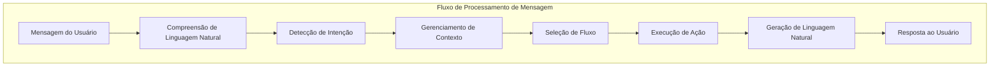
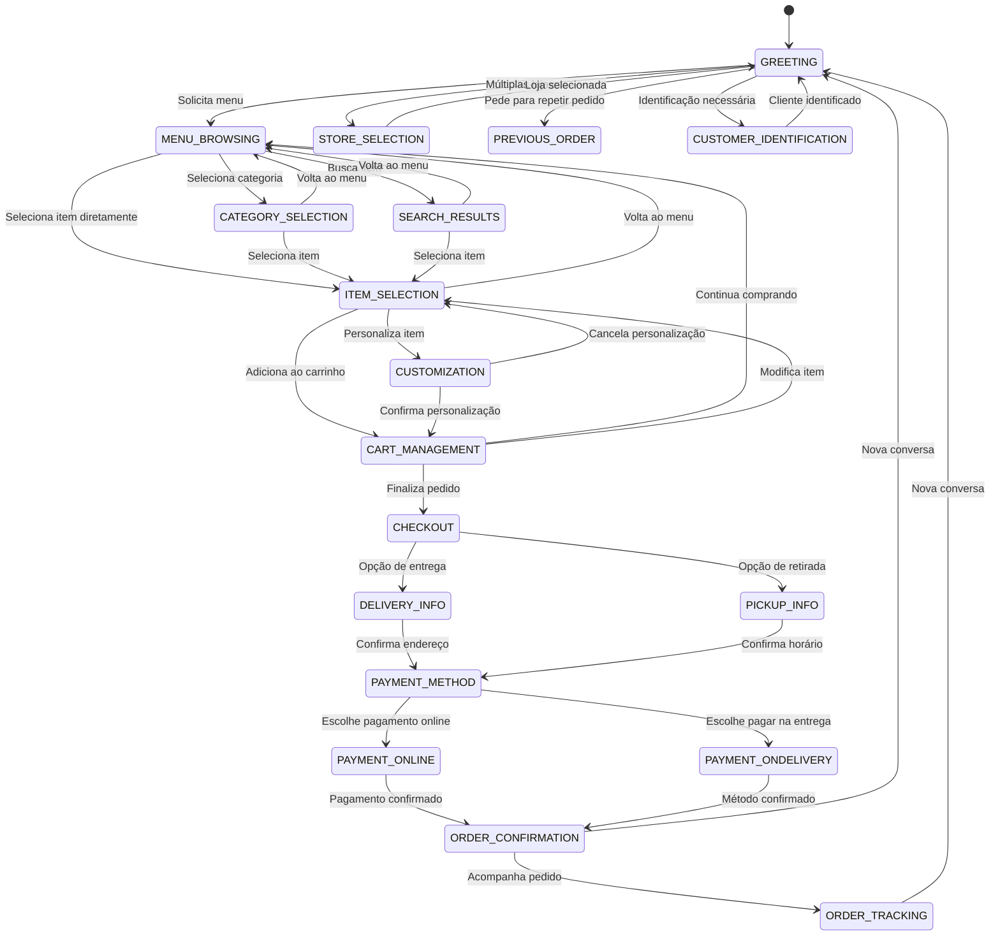

# Fluxos de Conversação com IA para Chatbot WhatsApp

## 1. Visão Geral

Este documento detalha o design dos fluxos de conversação com IA para o chatbot WhatsApp, focando especificamente na interação com o menu e no gerenciamento de pedidos. O sistema utiliza o Amazon Bedrock para processamento de linguagem natural e geração de respostas contextuais.

## 2. Arquitetura da Conversação

### 2.1. Componentes Principais



1. **Compreensão de Linguagem Natural (NLU)**: Utiliza Amazon Bedrock para interpretar a mensagem do usuário.
2. **Detecção de Intenção**: Identifica a intenção do usuário (ex: ver_menu, adicionar_item, remover_item).
3. **Gerenciamento de Contexto**: Mantém o estado da conversa e o contexto atual.
4. **Seleção de Fluxo**: Determina qual fluxo de conversação seguir com base na intenção e contexto.
5. **Execução de Ação**: Realiza ações específicas (consultar menu, adicionar item ao pedido, etc.).
6. **Geração de Linguagem Natural (NLG)**: Gera resposta contextual e natural usando Amazon Bedrock.
7. **Resposta ao Usuário**: Formata e envia a resposta para o usuário via Twilio.

### 2.2. Estados da Conversação



## 3. Prompts para Amazon Bedrock

### 3.1. Estrutura do Prompt Base

```
<system>
Você é um assistente virtual de pedidos para o restaurante {restaurant_name}. Seu objetivo é ajudar os clientes a fazerem pedidos de forma eficiente e amigável.

Informações do restaurante:
- Nome: {restaurant_name}
- Endereço: {restaurant_address}
- Horário de funcionamento: {operating_hours}
- Métodos de pagamento aceitos: {payment_methods}
- Opções de entrega: {delivery_options}

Estado atual da conversa: {conversation_state}
Itens no carrinho: {cart_items}
Total atual: {cart_total}

Histórico recente da conversa:
{conversation_history}
</system>

<user>
{user_message}
</user>
```

### 3.2. Exemplos de Prompts Específicos

#### Prompt para Navegação de Menu

```
<system>
Você é um assistente virtual de pedidos para o restaurante {restaurant_name}. Seu objetivo é ajudar os clientes a navegarem pelo menu e fazerem pedidos.

Menu disponível:
{menu_categories_and_items}

Estado atual da conversa: MENU_BROWSING
Itens no carrinho: {cart_items}
Total atual: {cart_total}

Instruções específicas:
1. Apresente as categorias do menu de forma clara e organizada
2. Se o usuário perguntar sobre um item específico, forneça detalhes (descrição, preço, opções)
3. Sugira itens populares ou promoções quando apropriado
4. Ofereça ajuda para navegar entre categorias
5. Mantenha um tom amigável e prestativo

Histórico recente da conversa:
{conversation_history}
</system>

<user>
{user_message}
</user>
```

#### Prompt para Personalização de Item

```
<system>
Você é um assistente virtual de pedidos para o restaurante {restaurant_name}. Seu objetivo é ajudar os clientes a personalizarem seus itens.

Item selecionado: {selected_item}
Preço base: {base_price}
Opções de personalização disponíveis:
{customization_options}

Estado atual da conversa: CUSTOMIZATION
Itens no carrinho: {cart_items}
Total atual: {cart_total}

Instruções específicas:
1. Guie o cliente pelas opções de personalização disponíveis
2. Confirme cada escolha antes de prosseguir
3. Mantenha o cliente informado sobre alterações no preço
4. Ofereça sugestões populares de personalização
5. Pergunte se o cliente deseja adicionar o item ao carrinho quando a personalização estiver completa

Histórico recente da conversa:
{conversation_history}
</system>

<user>
{user_message}
</user>
```

#### Prompt para Gerenciamento de Carrinho

```
<system>
Você é um assistente virtual de pedidos para o restaurante {restaurant_name}. Seu objetivo é ajudar os clientes a gerenciarem seu carrinho de compras.

Itens no carrinho:
{detailed_cart_items}
Subtotal: {subtotal}
Taxa de entrega: {delivery_fee}
Total: {total}

Estado atual da conversa: CART_MANAGEMENT
Métodos de pagamento disponíveis: {payment_methods}

Instruções específicas:
1. Apresente claramente os itens no carrinho com quantidades e preços
2. Ajude o cliente a adicionar, remover ou modificar itens
3. Ofereça opções para continuar comprando ou finalizar o pedido
4. Informe sobre promoções aplicáveis ou itens complementares
5. Mantenha o cliente informado sobre o valor total

Histórico recente da conversa:
{conversation_history}
</system>

<user>
{user_message}
</user>
```

## 4. Fluxos de Conversação Detalhados

### 4.1. Fluxo de Boas-Vindas e Identificação

1. **Recebimento da Primeira Mensagem**:
   - Sistema identifica se é um novo usuário ou cliente recorrente
   - Para novos usuários, apresenta mensagem de boas-vindas personalizada do restaurante
   - Para clientes recorrentes, saúda pelo nome e oferece opções rápidas (último pedido, menu)

2. **Seleção de Loja** (se aplicável):
   - Se o cliente estiver contatando um restaurante com múltiplas lojas, apresenta opções
   - Permite seleção por número, nome ou localização
   - Confirma a seleção e atualiza o contexto

3. **Identificação do Cliente**:
   - Se necessário, solicita informações básicas (nome)
   - Para pedidos com entrega, solicita endereço quando necessário
   - Armazena informações para uso futuro

### 4.2. Fluxo de Navegação do Menu

1. **Apresentação do Menu**:
   - Exibe categorias principais do menu
   - Oferece opções de filtro (vegetariano, sem glúten, etc.)
   - Destaca promoções ou itens especiais do dia

2. **Navegação por Categoria**:
   - Quando uma categoria é selecionada, exibe itens com descrições breves e preços
   - Permite navegação entre categorias
   - Oferece opção de voltar ao menu principal

3. **Busca de Itens**:
   - Permite busca por nome ou ingredientes
   - Exibe resultados relevantes
   - Sugere alternativas se a busca não retornar resultados exatos

4. **Detalhes do Item**:
   - Quando um item é selecionado, exibe descrição completa, preço e opções
   - Oferece opções para personalizar ou adicionar ao carrinho
   - Sugere complementos ou acompanhamentos

### 4.3. Fluxo de Personalização de Item

1. **Opções de Personalização**:
   - Apresenta opções disponíveis para o item (tamanho, ingredientes, etc.)
   - Guia o cliente passo a passo pelas escolhas
   - Atualiza o preço conforme as seleções

2. **Adições e Remoções**:
   - Permite adicionar ou remover ingredientes
   - Oferece opções extras com preços
   - Confirma cada alteração

3. **Confirmação**:
   - Resume todas as personalizações escolhidas
   - Mostra o preço final do item
   - Solicita confirmação antes de adicionar ao carrinho

### 4.4. Fluxo de Gerenciamento de Carrinho

1. **Visualização do Carrinho**:
   - Exibe todos os itens no carrinho com detalhes e preços
   - Mostra subtotal, taxas e total
   - Oferece opções para modificar, remover ou adicionar itens

2. **Modificação de Itens**:
   - Permite alterar quantidade
   - Permite modificar personalizações
   - Atualiza o total automaticamente

3. **Opções de Continuidade**:
   - Oferece opção de continuar comprando
   - Oferece opção de finalizar pedido
   - Sugere itens complementares (bebidas, sobremesas)

### 4.5. Fluxo de Checkout

1. **Opções de Entrega**:
   - Oferece escolha entre entrega ou retirada
   - Para entrega, confirma ou solicita endereço
   - Para retirada, informa horários disponíveis

2. **Método de Pagamento**:
   - Apresenta opções disponíveis (PIX, cartão via Asaas, pagamento na entrega)
   - Explica o processo para cada método
   - Confirma a escolha

3. **Processamento de Pagamento Online** (se aplicável):
   - Inicia processo de pagamento via Asaas
   - Fornece instruções claras (QR code PIX, link para pagamento com cartão)
   - Monitora status e confirma quando concluído

4. **Confirmação do Pedido**:
   - Resume o pedido completo
   - Fornece número de rastreamento
   - Informa tempo estimado de entrega/retirada
   - Agradece e oferece assistência adicional

## 5. Implementação Técnica

### 5.1. Lambda de Conversação com IA

```python
import json
import boto3
import os
import uuid
from datetime import datetime
from typing import Dict, Any, List, Optional

# Inicializar clientes AWS
bedrock = boto3.client('bedrock-runtime')
dynamodb = boto3.resource('dynamodb')

# Tabelas DynamoDB
conversation_state_table = dynamodb.Table(os.environ['CONVERSATION_STATE_TABLE'])
client_config_table = dynamodb.Table(os.environ['CLIENT_CONFIG_TABLE'])
store_config_table = dynamodb.Table(os.environ['STORE_CONFIG_TABLE'])

# Serviços auxiliares
menu_service = MenuService()
order_service = OrderService()
customer_service = CustomerService()

class AIConversationService:
    def __init__(self):
        self.model_id = os.environ.get('BEDROCK_MODEL_ID', 'anthropic.claude-3-sonnet-20240229-v1:0')
    
    async def process_message(self, 
                             phone_number: str, 
                             message: str, 
                             client_id: str, 
                             store_id: str, 
                             session_id: str) -> Dict[str, Any]:
        """
        Processa uma mensagem do usuário e gera uma resposta usando IA.
        
        Args:
            phone_number: Número de telefone do usuário
            message: Mensagem do usuário
            client_id: ID do cliente (restaurante)
            store_id: ID da loja
            session_id: ID da sessão de conversa
            
        Returns:
            Dicionário com a resposta e ações a serem executadas
        """
        # Recuperar estado da conversa
        conversation_state = await self._get_conversation_state(session_id)
        
        # Recuperar configurações do cliente/loja
        client_config = await self._get_client_config(client_id)
        store_config = await self._get_store_config(client_id, store_id)
        
        # Determinar o estado atual e contexto
        current_state = conversation_state.get('state', 'GREETING')
        context = conversation_state.get('context', {})
        
        # Construir o histórico de mensagens
        message_history = conversation_state.get('messageHistory', [])
        
        # Executar ações específicas com base no estado
        additional_context = {}
        
        if current_state == 'MENU_BROWSING':
            # Buscar dados do menu
            menu_data = await menu_service.get_menu(client_id, store_id)
            additional_context['menu_categories_and_items'] = self._format_menu_data(menu_data)
            
        elif current_state == 'ITEM_SELECTION':
            # Buscar detalhes do item selecionado
            item_id = context.get('selected_item_id')
            if item_id:
                item_details = await menu_service.get_item_details(client_id, store_id, item_id)
                additional_context['selected_item'] = self._format_item_details(item_details)
                
        elif current_state == 'CUSTOMIZATION':
            # Buscar opções de personalização
            item_id = context.get('selected_item_id')
            if item_id:
                customization_options = await menu_service.get_customization_options(client_id, store_id, item_id)
                additional_context['customization_options'] = self._format_customization_options(customization_options)
                
        elif current_state == 'CART_MANAGEMENT':
            # Buscar detalhes do carrinho
            cart = context.get('cart', [])
            additional_context['detailed_cart_items'] = self._format_cart_items(cart)
            additional_context['subtotal'] = self._calculate_subtotal(cart)
            additional_context['delivery_fee'] = store_config.get('deliveryConfig', {}).get('fee', 0)
            additional_context['total'] = additional_context['subtotal'] + additional_context['delivery_fee']
        
        # Construir o prompt para o modelo
        prompt = self._build_prompt(
            message=message,
            client_config=client_config,
            store_config=store_config,
            conversation_state=current_state,
            context=context,
            message_history=message_history,
            additional_context=additional_context
        )
        
        # Chamar o modelo Bedrock
        response = await self._call_bedrock_model(prompt)
        
        # Analisar a resposta para extrair ações
        parsed_response = self._parse_model_response(response)
        
        # Atualizar o estado da conversa
        new_state = parsed_response.get('new_state', current_state)
        new_context = {**context, **parsed_response.get('context_updates', {})}
        
        # Adicionar mensagens ao histórico
        message_history.append({"role": "user", "content": message})
        message_history.append({"role": "assistant", "content": parsed_response['response_text']})
        
        # Limitar o histórico às últimas 10 mensagens
        if len(message_history) > 10:
            message_history = message_history[-10:]
        
        # Salvar o estado atualizado
        await self._update_conversation_state(
            session_id=session_id,
            state=new_state,
            context=new_context,
            message_history=message_history
        )
        
        # Executar ações identificadas
        action_results = await self._execute_actions(
            actions=parsed_response.get('actions', []),
            client_id=client_id,
            store_id=store_id,
            context=new_context
        )
        
        # Construir resposta final
        result = {
            "response_text": parsed_response['response_text'],
            "state": new_state,
            "actions_performed": action_results
        }
        
        return result
    
    async def _get_conversation_state(self, session_id: str) -> Dict[str, Any]:
        """Recupera o estado atual da conversa do DynamoDB."""
        try:
            response = conversation_state_table.get_item(Key={'sessionId': session_id})
            return response.get('Item', {'state': 'GREETING', 'context': {}, 'messageHistory': []})
        except Exception as e:
            print(f"Error retrieving conversation state: {e}")
            return {'state': 'GREETING', 'context': {}, 'messageHistory': []}
    
    async def _update_conversation_state(self, 
                                        session_id: str, 
                                        state: str, 
                                        context: Dict[str, Any],
                                        message_history: List[Dict[str, str]]) -> None:
        """Atualiza o estado da conversa no DynamoDB."""
        try:
            now = datetime.now().timestamp()
            ttl = now + (24 * 60 * 60)  # 24 horas de TTL
            
            conversation_state_table.update_item(
                Key={'sessionId': session_id},
                UpdateExpression="SET #state = :state, #context = :context, #history = :history, #timestamp = :timestamp, #ttl = :ttl, #updated = :updated",
                ExpressionAttributeNames={
                    '#state': 'state',
                    '#context': 'context',
                    '#history': 'messageHistory',
                    '#timestamp': 'lastMessageTimestamp',
                    '#ttl': 'ttl',
                    '#updated': 'updatedAt'
                },
                ExpressionAttributeValues={
                    ':state': state,
                    ':context': context,
                    ':history': message_history,
                    ':timestamp': now,
                    ':ttl': ttl,
                    ':updated': datetime.now().isoformat()
                }
            )
        except Exception as e:
            print(f"Error updating conversation state: {e}")
    
    async def _get_client_config(self, client_id: str) -> Dict[str, Any]:
        """Recupera a configuração do cliente do DynamoDB."""
        try:
            response = client_config_table.get_item(Key={'clientId': client_id})
            return response.get('Item', {})
        except Exception as e:
            print(f"Error retrieving client config: {e}")
            return {}
    
    async def _get_store_config(self, client_id: str, store_id: str) -> Dict[str, Any]:
        """Recupera a configuração da loja do DynamoDB."""
        try:
            response = store_config_table.get_item(
                Key={'clientId': client_id, 'storeId': store_id}
            )
            return response.get('Item', {})
        except Exception as e:
            print(f"Error retrieving store config: {e}")
            return {}
    
    def _build_prompt(self, 
                     message: str, 
                     client_config: Dict[str, Any],
                     store_config: Dict[str, Any],
                     conversation_state: str,
                     context: Dict[str, Any],
                     message_history: List[Dict[str, str]],
                     additional_context: Dict[str, Any]) -> str:
        """Constrói o prompt para o modelo de IA."""
        # Usar template personalizado do cliente, se disponível
        template = client_config.get('aiPromptTemplate', DEFAULT_PROMPT_TEMPLATE)
        
        # Formatar histórico de conversa
        formatted_history = "\n".join([
            f"{msg['role'].upper()}: {msg['content']}"
            for msg in message_history[-6:]  # Últimas 6 mensagens
        ])
        
        # Preparar dados do restaurante
        restaurant_name = client_config.get('name', 'Restaurante')
        restaurant_address = store_config.get('address', {})
        formatted_address = f"{restaurant_address.get('street', '')}, {restaurant_address.get('number', '')}, {restaurant_address.get('city', '')}"
        
        operating_hours = self._format_operating_hours(store_config.get('operatingHours', {}))
        payment_methods = ", ".join(store_config.get('paymentMethods', ['PIX', 'CREDIT', 'DEBIT']))
        delivery_options = "Entrega e Retirada" if store_config.get('deliveryConfig', {}).get('enabled', True) else "Apenas Retirada"
        
        # Formatar itens do carrinho
        cart_items = context.get('cart', [])
        formatted_cart = self._format_cart_summary(cart_items)
        cart_total = sum(item.get('price', 0) * item.get('quantity', 1) for item in cart_items)
        
        # Substituir placeholders no template
        prompt = template.replace('{restaurant_name}', restaurant_name)
        prompt = prompt.replace('{restaurant_address}', formatted_address)
        prompt = prompt.replace('{operating_hours}', operating_hours)
        prompt = prompt.replace('{payment_methods}', payment_methods)
        prompt = prompt.replace('{delivery_options}', delivery_options)
        prompt = prompt.replace('{conversation_state}', conversation_state)
        prompt = prompt.replace('{cart_items}', formatted_cart)
        prompt = prompt.replace('{cart_total}', f"R$ {cart_total:.2f}")
        prompt = prompt.replace('{conversation_history}', formatted_history)
        prompt = prompt.replace('{user_message}', message)
        
        # Adicionar contextos específicos do estado
        for key, value in additional_context.items():
            prompt = prompt.replace(f'{{{key}}}', value)
        
        return prompt
    
    async def _call_bedrock_model(self, prompt: str) -> str:
        """Chama o modelo Bedrock para gerar uma resposta."""
        try:
            request_body = {
                "anthropic_version": "bedrock-2023-05-31",
                "max_tokens": 1000,
                "messages": [
                    {
                        "role": "user",
                        "content": [
                            {
                                "type": "text",
                                "text": prompt
                            }
                        ]
                    }
                ],
                "temperature": 0.7,
                "top_p": 0.9,
            }
            
            response = bedrock.invoke_model(
                modelId=self.model_id,
                body=json.dumps(request_body)
            )
            
            response_body = json.loads(response['body'].read())
            return response_body['content'][0]['text']
            
        except Exception as e:
            print(f"Error calling Bedrock model: {e}")
            return "Desculpe, estou tendo dificuldades para processar sua solicitação no momento. Poderia tentar novamente?"
    
    def _parse_model_response(self, response: str) -> Dict[str, Any]:
        """
        Analisa a resposta do modelo para extrair texto, ações e atualizações de estado.
        
        O modelo pode incluir tags especiais no formato:
        [STATE:NOVO_ESTADO]
        [ACTION:TIPO_ACAO:PARAMETROS]
        [CONTEXT:CHAVE:VALOR]
        """
        result = {
            "response_text": response,
            "new_state": None,
            "actions": [],
            "context_updates": {}
        }
        
        # Extrair comandos especiais
        import re
        
        # Extrair mudança de estado
        state_match = re.search(r'\[STATE:([A-Z_]+)\]', response)
        if state_match:
            result["new_state"] = state_match.group(1)
            result["response_text"] = result["response_text"].replace(state_match.group(0), '')
        
        # Extrair ações
        action_matches = re.finditer(r'\[ACTION:([A-Z_]+)(?::([^\]]+))?\]', response)
        for match in action_matches:
            action_type = match.group(1)
            action_params = match.group(2).split(':') if match.group(2) else []
            result["actions"].append({
                "type": action_type,
                "params": action_params
            })
            result["response_text"] = result["response_text"].replace(match.group(0), '')
        
        # Extrair atualizações de contexto
        context_matches = re.finditer(r'\[CONTEXT:([A-Za-z0-9_]+):([^\]]+)\]', response)
        for match in context_matches:
            key = match.group(1)
            value = match.group(2)
            
            # Tentar converter para tipos apropriados
            try:
                # Tentar como número
                if '.' in value:
                    value = float(value)
                else:
                    value = int(value)
            except ValueError:
                # Manter como string se não for número
                pass
                
            result["context_updates"][key] = value
            result["response_text"] = result["response_text"].replace(match.group(0), '')
        
        # Limpar espaços extras
        result["response_text"] = result["response_text"].strip()
        
        return result
    
    async def _execute_actions(self, 
                              actions: List[Dict[str, Any]], 
                              client_id: str, 
                              store_id: str,
                              context: Dict[str, Any]) -> List[Dict[str, Any]]:
        """Executa ações identificadas na resposta do modelo."""
        results = []
        
        for action in actions:
            action_type = action.get('type')
            params = action.get('params', [])
            
            result = {
                "type": action_type,
                "success": False,
                "result": None
            }
            
            try:
                if action_type == 'ADD_TO_CART':
                    # Adicionar item ao carrinho
                    item_id = params[0] if len(params) > 0 else context.get('selected_item_id')
                    quantity = int(params[1]) if len(params) > 1 else 1
                    
                    if item_id:
                        item_details = await menu_service.get_item_details(client_id, store_id, item_id)
                        customizations = context.get('current_customizations', {})
                        
                        cart_item = {
                            "item_id": item_id,
                            "name": item_details.get('name', 'Item'),
                            "price": item_details.get('price', 0),
                            "quantity": quantity,
                            "customizations": customizations
                        }
                        
                        result["success"] = True
                        result["result"] = cart_item
                
                elif action_type == 'REMOVE_FROM_CART':
                    # Remover item do carrinho
                    index = int(params[0]) if len(params) > 0 else -1
                    
                    if index >= 0:
                        result["success"] = True
                        result["result"] = {"index": index}
                
                elif action_type == 'UPDATE_QUANTITY':
                    # Atualizar quantidade de um item
                    index = int(params[0]) if len(params) > 0 else -1
                    quantity = int(params[1]) if len(params) > 1 else 1
                    
                    if index >= 0:
                        result["success"] = True
                        result["result"] = {"index": index, "quantity": quantity}
                
                elif action_type == 'CREATE_ORDER':
                    # Criar pedido
                    cart = context.get('cart', [])
                    delivery_info = context.get('delivery_info', {})
                    payment_method = context.get('payment_method', 'PAYMENT_ONDELIVERY')
                    
                    if cart:
                        order_id = await order_service.create_order(
                            client_id=client_id,
                            store_id=store_id,
                            items=cart,
                            customer_info=context.get('customer_info', {}),
                            delivery_info=delivery_info,
                            payment_method=payment_method
                        )
                        
                        result["success"] = True
                        result["result"] = {"order_id": order_id}
                
                elif action_type == 'INITIATE_PAYMENT':
                    # Iniciar pagamento
                    order_id = params[0] if len(params) > 0 else context.get('order_id')
                    payment_method = params[1] if len(params) > 1 else context.get('payment_method', 'PIX')
                    
                    if order_id:
                        payment_info = await payment_service.initiate_payment(
                            client_id=client_id,
                            store_id=store_id,
                            order_id=order_id,
                            method=payment_method,
                            customer_info=context.get('customer_info', {})
                        )
                        
                        result["success"] = True
                        result["result"] = payment_info
            
            except Exception as e:
                print(f"Error executing action {action_type}: {e}")
                result["error"] = str(e)
            
            results.append(result)
        
        return results
    
    # Métodos auxiliares de formatação
    
    def _format_menu_data(self, menu_data: Dict[str, Any]) -> str:
        """Formata dados do menu para inclusão no prompt."""
        formatted = "CATEGORIAS DO MENU:\n"
        
        for category in menu_data.get('categories', []):
            category_name = category.get('name', 'Categoria')
            formatted += f"- {category_name}\n"
            
            for item in category.get('items', []):
                item_name = item.get('name', 'Item')
                item_price = item.get('price', 0)
                formatted += f"  * {item_name} - R$ {item_price:.2f}\n"
                
                if item.get('description'):
                    formatted += f"    {item.get('description')}\n"
        
        return formatted
    
    def _format_item_details(self, item_details: Dict[str, Any]) -> str:
        """Formata detalhes de um item para inclusão no prompt."""
        name = item_details.get('name', 'Item')
        price = item_details.get('price', 0)
        description = item_details.get('description', '')
        
        formatted = f"DETALHES DO ITEM:\n"
        formatted += f"Nome: {name}\n"
        formatted += f"Preço: R$ {price:.2f}\n"
        
        if description:
            formatted += f"Descrição: {description}\n"
        
        if 'ingredients' in item_details:
            ingredients = ", ".join(item_details['ingredients'])
            formatted += f"Ingredientes: {ingredients}\n"
        
        return formatted
    
    def _format_customization_options(self, options: Dict[str, Any]) -> str:
        """Formata opções de personalização para inclusão no prompt."""
        formatted = "OPÇÕES DE PERSONALIZAÇÃO:\n"
        
        for category, items in options.items():
            formatted += f"- {category}:\n"
            
            for item in items:
                name = item.get('name', 'Opção')
                price = item.get('additional_price', 0)
                
                if price > 0:
                    formatted += f"  * {name} (+R$ {price:.2f})\n"
                else:
                    formatted += f"  * {name}\n"
        
        return formatted
    
    def _format_cart_items(self, cart: List[Dict[str, Any]]) -> str:
        """Formata itens do carrinho para inclusão no prompt."""
        if not cart:
            return "O carrinho está vazio."
        
        formatted = "ITENS NO CARRINHO:\n"
        
        for i, item in enumerate(cart):
            name = item.get('name', 'Item')
            price = item.get('price', 0)
            quantity = item.get('quantity', 1)
            total = price * quantity
            
            formatted += f"{i+1}. {name} x{quantity} - R$ {total:.2f}\n"
            
            # Adicionar customizações, se houver
            customizations = item.get('customizations', {})
            if customizations:
                formatted += "   Personalização:\n"
                for category, selections in customizations.items():
                    if isinstance(selections, list):
                        for selection in selections:
                            formatted += f"   - {category}: {selection}\n"
                    else:
                        formatted += f"   - {category}: {selections}\n"
        
        return formatted
    
    def _format_cart_summary(self, cart: List[Dict[str, Any]]) -> str:
        """Formata um resumo do carrinho para inclusão no prompt."""
        if not cart:
            return "Nenhum item no carrinho"
        
        items = []
        for item in cart:
            name = item.get('name', 'Item')
            quantity = item.get('quantity', 1)
            items.append(f"{name} x{quantity}")
        
        return ", ".join(items)
    
    def _calculate_subtotal(self, cart: List[Dict[str, Any]]) -> float:
        """Calcula o subtotal do carrinho."""
        return sum(item.get('price', 0) * item.get('quantity', 1) for item in cart)
    
    def _format_operating_hours(self, hours: Dict[str, Any]) -> str:
        """Formata horários de funcionamento para inclusão no prompt."""
        days = {
            'monday': 'Segunda',
            'tuesday': 'Terça',
            'wednesday': 'Quarta',
            'thursday': 'Quinta',
            'friday': 'Sexta',
            'saturday': 'Sábado',
            'sunday': 'Domingo'
        }
        
        formatted = []
        for day, day_pt in days.items():
            if day in hours:
                open_time = hours[day].get('open', '00:00')
                close_time = hours[day].get('close', '00:00')
                formatted.append(f"{day_pt}: {open_time} - {close_time}")
            else:
                formatted.append(f"{day_pt}: Fechado")
        
        return "\n".join(formatted)


# Template padrão de prompt
DEFAULT_PROMPT_TEMPLATE = """
<system>
Você é um assistente virtual de pedidos para o restaurante {restaurant_name}. Seu objetivo é ajudar os clientes a fazerem pedidos de forma eficiente e amigável.

Informações do restaurante:
- Nome: {restaurant_name}
- Endereço: {restaurant_address}
- Horário de funcionamento: {operating_hours}
- Métodos de pagamento aceitos: {payment_methods}
- Opções de entrega: {delivery_options}

Estado atual da conversa: {conversation_state}
Itens no carrinho: {cart_items}
Total atual: {cart_total}

Instruções específicas:
1. Seja amigável, prestativo e eficiente
2. Guie o cliente pelo processo de pedido de forma natural
3. Faça perguntas claras quando precisar de informações específicas
4. Ofereça sugestões relevantes quando apropriado
5. Confirme detalhes importantes antes de prosseguir
6. Use comandos especiais entre colchetes para ações específicas:
   - [STATE:NOVO_ESTADO] para mudar o estado da conversa
   - [ACTION:TIPO_ACAO:PARAM1:PARAM2] para executar ações
   - [CONTEXT:CHAVE:VALOR] para atualizar o contexto

Estados possíveis:
- GREETING: Saudação inicial
- MENU_BROWSING: Navegando pelo menu
- CATEGORY_SELECTION: Selecionando categoria
- ITEM_SELECTION: Selecionando item
- CUSTOMIZATION: Personalizando item
- CART_MANAGEMENT: Gerenciando carrinho
- CHECKOUT: Finalizando pedido
- PAYMENT_METHOD: Escolhendo método de pagamento
- ORDER_CONFIRMATION: Confirmando pedido

Ações possíveis:
- ADD_TO_CART:item_id:quantidade
- REMOVE_FROM_CART:índice
- UPDATE_QUANTITY:índice:quantidade
- CREATE_ORDER
- INITIATE_PAYMENT:order_id:método

Histórico recente da conversa:
{conversation_history}
</system>

<user>
{user_message}
</user>
"""
```

### 5.2. Integração com Serviços Auxiliares

```python
class MenuService:
    """Serviço para interação com dados de menu."""
    
    async def get_menu(self, client_id: str, store_id: str) -> Dict[str, Any]:
        """
        Recupera o menu completo para um cliente/loja específico.
        
        Esta implementação pode ser adaptada para buscar dados de diferentes fontes:
        - DynamoDB local
        - API do sistema POS via API Gateway
        - SQS Request-Response
        """
        try:
            # Exemplo: buscar de DynamoDB
            menu_table = dynamodb.Table(os.environ['MENU_TABLE'])
            response = menu_table.get_item(
                Key={'clientId': client_id, 'storeId': store_id}
            )
            return response.get('Item', {}).get('menu', {'categories': []})
            
            # Alternativa: API do POS
            # async with aiohttp.ClientSession() as session:
            #     async with session.get(f"{POS_API_URL}/menu?clientId={client_id}&storeId={store_id}") as response:
            #         if response.status == 200:
            #             return await response.json()
            #         return {'categories': []}
            
        except Exception as e:
            print(f"Error retrieving menu: {e}")
            return {'categories': []}
    
    async def get_item_details(self, client_id: str, store_id: str, item_id: str) -> Dict[str, Any]:
        """Recupera detalhes de um item específico."""
        try:
            # Exemplo: buscar de DynamoDB
            items_table = dynamodb.Table(os.environ['MENU_ITEMS_TABLE'])
            response = items_table.get_item(
                Key={'clientId': client_id, 'itemId': item_id}
            )
            return response.get('Item', {})
            
        except Exception as e:
            print(f"Error retrieving item details: {e}")
            return {}
    
    async def get_customization_options(self, client_id: str, store_id: str, item_id: str) -> Dict[str, Any]:
        """Recupera opções de personalização para um item."""
        try:
            # Exemplo: buscar de DynamoDB
            customization_table = dynamodb.Table(os.environ['CUSTOMIZATION_OPTIONS_TABLE'])
            response = customization_table.get_item(
                Key={'clientId': client_id, 'itemId': item_id}
            )
            return response.get('Item', {}).get('options', {})
            
        except Exception as e:
            print(f"Error retrieving customization options: {e}")
            return {}


class OrderService:
    """Serviço para gerenciamento de pedidos."""
    
    async def create_order(self, 
                          client_id: str, 
                          store_id: str, 
                          items: List[Dict[str, Any]],
                          customer_info: Dict[str, Any],
                          delivery_info: Dict[str, Any],
                          payment_method: str) -> str:
        """
        Cria um novo pedido e o envia para a fila SQS da loja.
        
        Returns:
            ID do pedido criado
        """
        try:
            # Gerar ID único para o pedido
            order_id = f"order_{uuid.uuid4().hex[:12]}"
            
            # Construir objeto de pedido
            order = {
                "order_id": order_id,
                "client_id": client_id,
                "store_id": store_id,
                "items": items,
                "customer_info": customer_info,
                "delivery_info": delivery_info,
                "payment_method": payment_method,
                "status": "PENDING",
                "created_at": datetime.now().isoformat(),
                "source": "WHATSAPP_BOT"
            }
            
            # Salvar pedido no DynamoDB
            orders_table = dynamodb.Table(os.environ['ORDERS_TABLE'])
            orders_table.put_item(Item=order)
            
            # Buscar URL da fila SQS da loja
            store_config_table = dynamodb.Table(os.environ['STORE_CONFIG_TABLE'])
            store_response = store_config_table.get_item(
                Key={'clientId': client_id, 'storeId': store_id}
            )
            
            queue_url = store_response.get('Item', {}).get('sqsQueueUrl')
            
            if queue_url:
                # Enviar para a fila SQS
                sqs = boto3.client('sqs')
                sqs.send_message(
                    QueueUrl=queue_url,
                    MessageBody=json.dumps(order),
                    MessageGroupId=client_id,  # Para filas FIFO
                    MessageDeduplicationId=order_id  # Para filas FIFO
                )
            
            return order_id
            
        except Exception as e:
            print(f"Error creating order: {e}")
            raise


class CustomerService:
    """Serviço para gerenciamento de clientes."""
    
    async def get_customer(self, phone_number: str) -> Optional[Dict[str, Any]]:
        """Busca um cliente pelo número de telefone."""
        try:
            customers_table = dynamodb.Table(os.environ['CUSTOMERS_TABLE'])
            response = customers_table.query(
                IndexName='PhoneNumberIndex',
                KeyConditionExpression='phoneNumber = :phone',
                ExpressionAttributeValues={':phone': phone_number}
            )
            
            items = response.get('Items', [])
            if items:
                return items[0]
            return None
            
        except Exception as e:
            print(f"Error retrieving customer: {e}")
            return None
    
    async def create_customer(self, 
                             client_id: str,
                             phone_number: str, 
                             name: str, 
                             email: Optional[str] = None,
                             address: Optional[Dict[str, Any]] = None) -> str:
        """Cria um novo cliente."""
        try:
            customer_id = f"cust_{uuid.uuid4().hex[:12]}"
            
            customer = {
                "customer_id": customer_id,
                "client_id": client_id,
                "phone_number": phone_number,
                "name": name,
                "email": email,
                "address": address or {},
                "created_at": datetime.now().isoformat(),
                "source": "WHATSAPP_BOT"
            }
            
            customers_table = dynamodb.Table(os.environ['CUSTOMERS_TABLE'])
            customers_table.put_item(Item=customer)
            
            return customer_id
            
        except Exception as e:
            print(f"Error creating customer: {e}")
            raise


class PaymentService:
    """Serviço para processamento de pagamentos."""
    
    async def initiate_payment(self,
                              client_id: str,
                              store_id: str,
                              order_id: str,
                              method: str,
                              customer_info: Dict[str, Any]) -> Dict[str, Any]:
        """
        Inicia um processo de pagamento para um pedido.
        
        Args:
            client_id: ID do cliente
            store_id: ID da loja
            order_id: ID do pedido
            method: Método de pagamento (PIX, CREDIT, DEBIT)
            customer_info: Informações do cliente
            
        Returns:
            Informações de pagamento (QR code, link, etc.)
        """
        try:
            # Buscar detalhes do pedido
            orders_table = dynamodb.Table(os.environ['ORDERS_TABLE'])
            order_response = orders_table.get_item(Key={'order_id': order_id})
            order = order_response.get('Item', {})
            
            if not order:
                raise ValueError(f"Order not found: {order_id}")
            
            # Calcular valor total
            items = order.get('items', [])
            total = sum(item.get('price', 0) * item.get('quantity', 1) for item in items)
            
            # Buscar configuração do Asaas
            client_config_table = dynamodb.Table(os.environ['CLIENT_CONFIG_TABLE'])
            client_response = client_config_table.get_item(Key={'clientId': client_id})
            client_config = client_response.get('Item', {})
            
            asaas_api_key = client_config.get('asaasApiKey')
            asaas_sandbox = client_config.get('asaasSandbox', True)
            
            if not asaas_api_key:
                raise ValueError(f"Asaas API key not configured for client: {client_id}")
            
            # Preparar dados para o Asaas
            payment_data = {
                "order_id": order_id,
                "method": method,
                "amount": total,
                "notification_type": "EMAIL",
                "customer_email": customer_info.get('email', ''),
                "customer_name": customer_info.get('name', ''),
                "description": f"Pedido #{order_id}",
                "external_reference": order_id
            }
            
            # Chamar API do Asaas (via Lambda do Payment Service)
            lambda_client = boto3.client('lambda')
            response = lambda_client.invoke(
                FunctionName=os.environ['PAYMENT_LAMBDA_ARN'],
                InvocationType='RequestResponse',
                Payload=json.dumps({
                    'action': 'create_payment',
                    'client_id': client_id,
                    'store_id': store_id,
                    'payment_data': payment_data,
                    'asaas_api_key': asaas_api_key,
                    'asaas_sandbox': asaas_sandbox
                })
            )
            
            payload = json.loads(response['Payload'].read())
            
            if 'error' in payload:
                raise ValueError(payload['error'])
            
            # Atualizar status do pedido
            orders_table.update_item(
                Key={'order_id': order_id},
                UpdateExpression="SET payment_status = :status, payment_id = :payment_id, updated_at = :updated",
                ExpressionAttributeValues={
                    ':status': 'PENDING',
                    ':payment_id': payload.get('id'),
                    ':updated': datetime.now().isoformat()
                }
            )
            
            # Formatar resposta
            result = {
                "payment_id": payload.get('id'),
                "status": payload.get('status'),
                "method": method
            }
            
            if method == 'PIX':
                result["pix_key"] = payload.get('pix_key')
                result["pix_qrcode"] = payload.get('pix_qrcode')
                result["pix_qrcode_image"] = payload.get('pix_qrcode_image')
                result["pix_expiration_date"] = payload.get('pix_expiration_date')
            else:
                result["payment_url"] = payload.get('payment_url')
            
            return result
            
        except Exception as e:
            print(f"Error initiating payment: {e}")
            raise
```

## 6. Exemplos de Fluxos de Conversa

### 6.1. Exemplo de Pedido Completo

**Usuário**: Olá, quero fazer um pedido

**Chatbot**: Olá! Bem-vindo ao Restaurante Sabor Brasileiro. Como posso ajudar com seu pedido hoje? Temos várias opções deliciosas no nosso cardápio. Gostaria de ver o menu completo ou está procurando algo específico?
[STATE:GREETING]

**Usuário**: Quero ver o cardápio

**Chatbot**: Claro! Aqui está nosso cardápio:

**CATEGORIAS:**
1. 🍔 Hambúrgueres
2. 🍕 Pizzas
3. 🥗 Saladas
4. 🍝 Massas
5. 🥤 Bebidas
6. 🍰 Sobremesas

Qual categoria você gostaria de explorar?
[STATE:MENU_BROWSING]

**Usuário**: Quero ver os hambúrgueres

**Chatbot**: Ótima escolha! Aqui estão nossos hambúrgueres:

**HAMBÚRGUERES:**
1. 🍔 Clássico - R$ 25,90
   Pão, hambúrguer 180g, queijo, alface, tomate e maionese da casa

2. 🍔 Cheese Bacon - R$ 29,90
   Pão, hambúrguer 180g, queijo cheddar, bacon crocante, alface, tomate e maionese da casa

3. 🍔 Vegetariano - R$ 27,90
   Pão, hambúrguer de grão de bico, queijo, alface, tomate, cebola roxa e molho especial

4. 🍔 Duplo - R$ 34,90
   Pão, dois hambúrgueres de 180g, queijo duplo, bacon, alface, tomate e maionese da casa

Qual hambúrguer você gostaria de pedir?
[STATE:CATEGORY_SELECTION]

**Usuário**: Quero o Cheese Bacon

**Chatbot**: Excelente escolha! Você selecionou o **Cheese Bacon** por R$ 29,90.

Gostaria de personalizar seu hambúrguer?
- Adicionar ingredientes extras
- Remover algum ingrediente
- Ponto da carne (ao ponto, bem passado, mal passado)

Ou prefere adicionar ao carrinho do jeito que está?
[STATE:ITEM_SELECTION]
[CONTEXT:selected_item_id:burger_cheese_bacon]

**Usuário**: Quero adicionar cebola caramelizada e sem tomate

**Chatbot**: Entendido! Vou personalizar seu Cheese Bacon:
- ✅ Adicionar cebola caramelizada (+R$ 3,00)
- ❌ Remover tomate

O valor do seu Cheese Bacon personalizado ficou em R$ 32,90.

Gostaria de adicionar este hambúrguer ao seu pedido?
[STATE:CUSTOMIZATION]
[CONTEXT:current_customizations:{"adicionar":["cebola caramelizada"],"remover":["tomate"]}]

**Usuário**: Sim, pode adicionar

**Chatbot**: Ótimo! Adicionei o Cheese Bacon personalizado ao seu carrinho.
[ACTION:ADD_TO_CART:burger_cheese_bacon:1]
[STATE:CART_MANAGEMENT]

Seu pedido atual:
- 1x Cheese Bacon (cebola caramelizada, sem tomate) - R$ 32,90

Subtotal: R$ 32,90

Gostaria de adicionar mais algum item ao seu pedido ou prefere finalizar?
1. Continuar comprando
2. Adicionar bebida
3. Adicionar sobremesa
4. Finalizar pedido

**Usuário**: Quero adicionar uma Coca-Cola

**Chatbot**: Claro! Aqui estão nossas opções de bebidas:

**BEBIDAS:**
1. 🥤 Coca-Cola 350ml - R$ 6,90
2. 🥤 Coca-Cola Zero 350ml - R$ 6,90
3. 🥤 Guaraná 350ml - R$ 6,50
4. 🥤 Água Mineral 500ml - R$ 4,50
5. 🥤 Suco Natural 300ml - R$ 9,90 (Laranja, Limão ou Abacaxi)

Qual bebida você gostaria de adicionar?
[STATE:MENU_BROWSING]

**Usuário**: Coca-Cola normal

**Chatbot**: Adicionei 1x Coca-Cola 350ml (R$ 6,90) ao seu carrinho.
[ACTION:ADD_TO_CART:drink_coca_cola:1]
[STATE:CART_MANAGEMENT]

Seu pedido atual:
- 1x Cheese Bacon (cebola caramelizada, sem tomate) - R$ 32,90
- 1x Coca-Cola 350ml - R$ 6,90

Subtotal: R$ 39,80

Gostaria de adicionar mais algum item ou prefere finalizar seu pedido?
1. Continuar comprando
2. Adicionar sobremesa
3. Finalizar pedido

**Usuário**: Finalizar pedido

**Chatbot**: Ótimo! Vamos finalizar seu pedido.

Resumo do pedido:
- 1x Cheese Bacon (cebola caramelizada, sem tomate) - R$ 32,90
- 1x Coca-Cola 350ml - R$ 6,90

Subtotal: R$ 39,80
Taxa de entrega: R$ 5,00
Total: R$ 44,80

Como você prefere receber seu pedido?
1. Entrega
2. Retirada no local
[STATE:CHECKOUT]

**Usuário**: Entrega

**Chatbot**: Perfeito! Para entrega, preciso confirmar seu endereço.

Você já realizou pedidos conosco antes. Este é o endereço que temos cadastrado:
Rua das Flores, 123, Apto 45 - Jardim Primavera

Este endereço está correto?
1. Sim, usar este endereço
2. Não, quero cadastrar um novo endereço
[STATE:DELIVERY_INFO]
[CONTEXT:delivery_address:{"street":"Rua das Flores","number":"123","complement":"Apto 45","neighborhood":"Jardim Primavera"}]

**Usuário**: Sim, está correto

**Chatbot**: Endereço confirmado! Agora, como você prefere pagar?

Métodos de pagamento disponíveis:
1. PIX (pagamento online)
2. Cartão de crédito (pagamento online)
3. Cartão de débito (pagamento online)
4. Dinheiro (pagamento na entrega)
5. Cartão (pagamento na entrega)
[STATE:PAYMENT_METHOD]
[CONTEXT:delivery_address_confirmed:true]

**Usuário**: PIX

**Chatbot**: Você escolheu pagar com PIX. Vou gerar um código PIX para você.
[ACTION:CREATE_ORDER]
[CONTEXT:payment_method:PIX]
[STATE:PAYMENT_ONLINE]

Pedido criado com sucesso! Número do pedido: #12345

Aqui está seu QR Code PIX:
[Imagem do QR Code]

Ou se preferir, copie a chave PIX:
00020126580014br.gov.bcb.pix0136a629532e-7693-4846-b028-f142a1415f6f5204000053039865802BR5925RESTAURANTE SABOR BRASILEI6009SAO PAULO62070503***63041D3D

Valor: R$ 44,80
Validade: 30 minutos

Assim que recebermos a confirmação do pagamento, seu pedido será preparado e enviado para entrega.
[ACTION:INITIATE_PAYMENT:12345:PIX]

**Usuário**: Paguei

**Chatbot**: Obrigado! Estou verificando seu pagamento...

Pagamento confirmado com sucesso! 🎉

Seu pedido #12345 foi recebido e está sendo preparado. O tempo estimado de entrega é de 30-45 minutos.

Você receberá atualizações sobre o status do seu pedido. Obrigado por escolher o Restaurante Sabor Brasileiro!
[STATE:ORDER_CONFIRMATION]

### 6.2. Exemplo de Fluxo de Erro e Recuperação

**Usuário**: Quero pedir uma pizza

**Chatbot**: Claro! Vamos ver nossas opções de pizza. Aqui está nosso cardápio de pizzas:

**PIZZAS:**
1. 🍕 Margherita - R$ 39,90 (Molho de tomate, muçarela, tomate e manjericão)
2. 🍕 Calabresa - R$ 42,90 (Molho de tomate, muçarela e calabresa)
3. 🍕 Frango com Catupiry - R$ 45,90 (Molho de tomate, muçarela, frango desfiado e catupiry)
4. 🍕 Portuguesa - R$ 47,90 (Molho de tomate, muçarela, presunto, ovos, cebola, ervilha e azeitona)
5. 🍕 Quatro Queijos - R$ 49,90 (Molho de tomate, muçarela, provolone, gorgonzola e parmesão)

Qual pizza você gostaria de pedir?
[STATE:CATEGORY_SELECTION]

**Usuário**: Quero uma pizza de pepperoni

**Chatbot**: Peço desculpas, mas não temos a pizza de pepperoni no nosso cardápio atual. Posso sugerir algumas alternativas:

1. 🍕 Calabresa - R$ 42,90 (Molho de tomate, muçarela e calabresa) - Esta é a mais similar ao pepperoni
2. 🍕 Portuguesa - R$ 47,90 (Molho de tomate, muçarela, presunto, ovos, cebola, ervilha e azeitona)
3. 🍕 Quatro Queijos - R$ 49,90 (Molho de tomate, muçarela, provolone, gorgonzola e parmesão)

Ou gostaria de ver outras categorias do nosso menu?
[STATE:CATEGORY_SELECTION]

**Usuário**: Então vou querer a calabresa

**Chatbot**: Ótima escolha! Você selecionou a **Pizza Calabresa** por R$ 42,90.

Gostaria de personalizar sua pizza?
- Borda recheada com catupiry (+R$ 5,00)
- Borda recheada com cheddar (+R$ 5,00)
- Adicionar ingredientes extras
- Remover algum ingrediente

Ou prefere adicionar ao carrinho do jeito que está?
[STATE:ITEM_SELECTION]
[CONTEXT:selected_item_id:pizza_calabresa]

## 7. Considerações de Implementação

### 7.1. Gerenciamento de Contexto

O gerenciamento de contexto é crucial para manter conversas naturais e fluidas. O sistema armazena:

1. **Estado da Conversa**: Indica em qual etapa do fluxo o usuário está (GREETING, MENU_BROWSING, etc.)
2. **Contexto Específico**: Armazena informações relevantes para o estado atual (itens selecionados, personalizações, etc.)
3. **Histórico de Mensagens**: Mantém um histórico limitado para fornecer contexto ao modelo de IA

### 7.2. Tratamento de Ambiguidades

O sistema deve lidar com ambiguidades comuns em conversas naturais:

1. **Referências Implícitas**: "Quero esse" ou "Adicione mais um" sem especificar o item
2. **Correções**: "Não, eu quis dizer..." ou "Na verdade, prefiro..."
3. **Múltiplas Intenções**: "Quero um hambúrguer e também uma Coca" em uma única mensagem

### 7.3. Personalização por Cliente/Loja

Cada cliente (restaurante) pode ter:

1. **Prompts Personalizados**: Templates específicos para o modelo de IA
2. **Fluxos Customizados**: Etapas adicionais ou modificadas no processo de pedido
3. **Mensagens de Marca**: Saudações, confirmações e despedidas alinhadas com a identidade da marca

### 7.4. Tratamento de Erros

O sistema implementa estratégias robustas para lidar com erros:

1. **Fallbacks Gracioso**: Quando o modelo não entende a intenção, oferece opções claras
2. **Recuperação de Contexto**: Capacidade de retomar a conversa após interrupções
3. **Limites de Tentativas**: Após múltiplas falhas, oferece contato humano ou alternativas

## 8. Próximos Passos

1. **Implementação do Lambda de Conversação**: Desenvolver o código completo do serviço de IA
2. **Integração com Bedrock**: Configurar e otimizar a interação com o modelo de IA
3. **Testes de Fluxos**: Validar os fluxos de conversa com cenários reais
4. **Otimização de Prompts**: Refinar os prompts para melhorar a qualidade das respostas
5. **Implementação de Serviços Auxiliares**: Desenvolver os serviços de menu, pedido, cliente e pagamento
