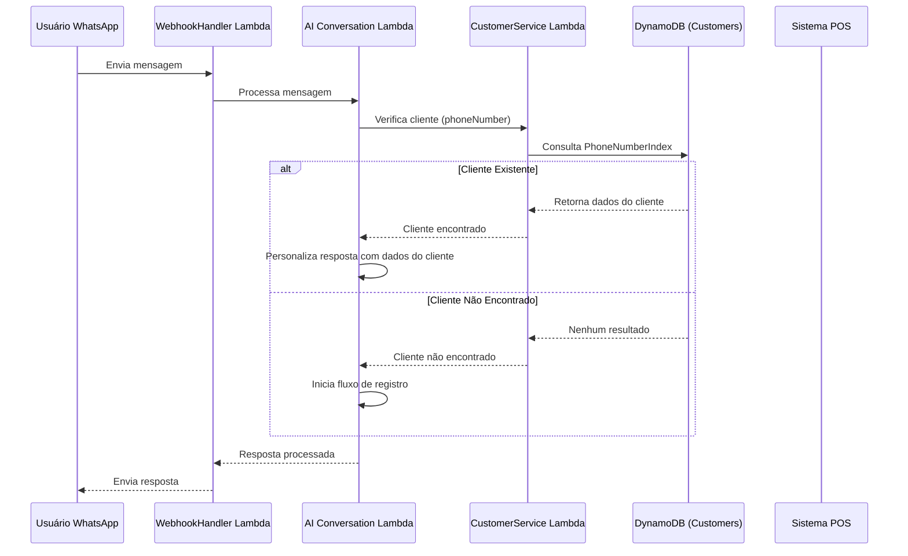
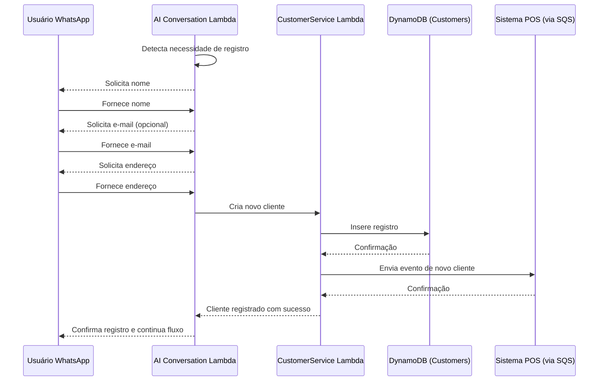
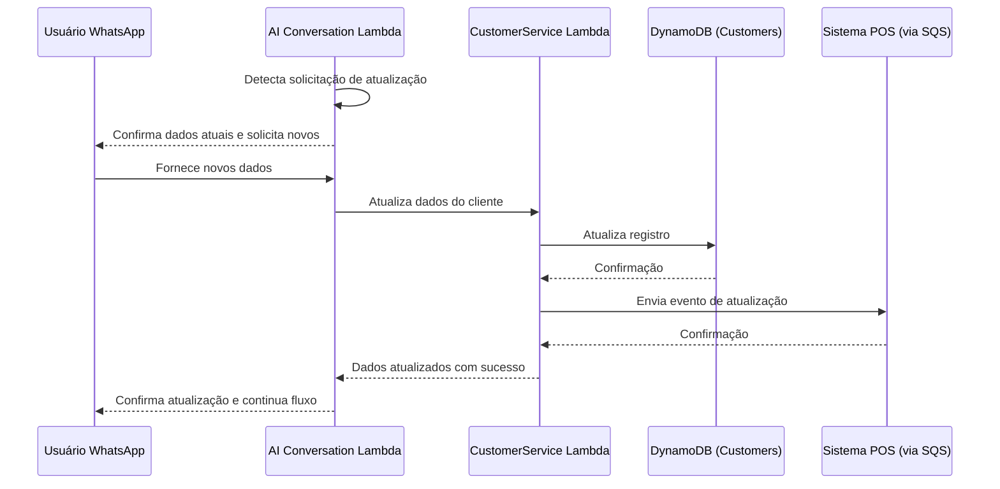
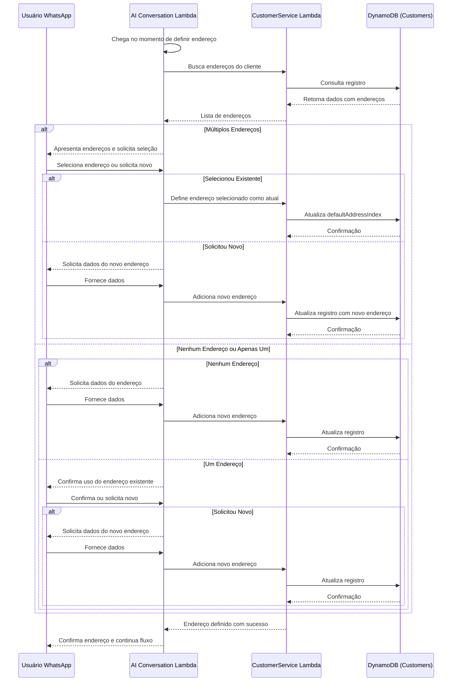

# Integração de Dados de Cliente para Chatbot WhatsApp

## 1. Visão Geral

Este documento detalha a integração de dados de cliente para o chatbot WhatsApp, focando nos processos de consulta e registro de clientes. O sistema deve ser capaz de identificar clientes existentes, recuperar seus dados e preferências, ou registrar novos clientes de forma fluida durante a interação.

## 2. Modelo de Dados de Cliente

### 2.1. Tabela DynamoDB - Clientes

**Tabela: `WhatsAppBotCustomers`**

| Atributo | Tipo | Descrição |
|----------|------|-----------|
| `customerId` | String | Identificador único do cliente - Chave de Partição |
| `clientId` | String | ID do cliente (restaurante) ao qual o cliente pertence |
| `phoneNumber` | String | Número de telefone do cliente (formato E.164) - GSI |
| `name` | String | Nome completo do cliente |
| `email` | String | Endereço de e-mail do cliente (opcional) |
| `addresses` | List | Lista de endereços cadastrados |
| `defaultAddressIndex` | Number | Índice do endereço padrão na lista de endereços |
| `preferences` | Map | Preferências do cliente (alergias, favoritos, etc.) |
| `orderHistory` | List | Resumo dos últimos pedidos (limitado a 5) |
| `lastOrderId` | String | ID do último pedido realizado |
| `lastOrderDate` | String | Data do último pedido |
| `totalOrders` | Number | Número total de pedidos realizados |
| `loyaltyPoints` | Number | Pontos de fidelidade acumulados |
| `tags` | List | Tags para segmentação (ex: "vegetariano", "cliente_vip") |
| `createdAt` | String | Data de criação do registro |
| `updatedAt` | String | Data da última atualização |
| `source` | String | Origem do cadastro ("WHATSAPP_BOT", "POS", etc.) |

**Estrutura de Endereço:**

```json
{
  "addressId": "addr_123abc",
  "label": "Casa",
  "street": "Rua das Flores",
  "number": "123",
  "complement": "Apto 45",
  "neighborhood": "Jardim Primavera",
  "city": "São Paulo",
  "state": "SP",
  "postalCode": "01234-567",
  "reference": "Próximo ao mercado",
  "latitude": -23.5505,
  "longitude": -46.6333,
  "isDefault": true
}
```

### 2.2. Índices Secundários Globais (GSI)

1. **PhoneNumberIndex**:
   - Chave de Partição: `phoneNumber`
   - Atributos projetados: Todos
   - Finalidade: Buscar clientes por número de telefone

2. **ClientIdIndex**:
   - Chave de Partição: `clientId`
   - Chave de Ordenação: `updatedAt`
   - Atributos projetados: Todos
   - Finalidade: Listar clientes por cliente (restaurante), ordenados por data de atualização

3. **EmailIndex**:
   - Chave de Partição: `email`
   - Atributos projetados: Todos
   - Finalidade: Buscar clientes por e-mail

## 3. Fluxos de Integração de Cliente

### 3.1. Fluxo de Identificação de Cliente



### 3.2. Fluxo de Registro de Novo Cliente



### 3.3. Fluxo de Atualização de Dados



### 3.4. Fluxo de Seleção/Adição de Endereço



## 4. Implementação do Serviço de Cliente

### 4.1. Lambda CustomerService

```python
import json
import boto3
import os
import uuid
from datetime import datetime
from typing import Dict, Any, List, Optional

# Inicializar clientes AWS
dynamodb = boto3.resource('dynamodb')
sqs = boto3.client('sqs')

# Tabela DynamoDB
customers_table = dynamodb.Table(os.environ['CUSTOMERS_TABLE'])

class CustomerService:
    """Serviço para gerenciamento de clientes."""
    
    async def get_customer_by_phone(self, phone_number: str, client_id: str = None) -> Optional[Dict[str, Any]]:
        """
        Busca um cliente pelo número de telefone.
        
        Args:
            phone_number: Número de telefone no formato E.164
            client_id: ID do cliente (restaurante) para filtrar (opcional)
            
        Returns:
            Dados do cliente ou None se não encontrado
        """
        try:
            # Consultar pelo índice de número de telefone
            response = customers_table.query(
                IndexName='PhoneNumberIndex',
                KeyConditionExpression='phoneNumber = :phone',
                ExpressionAttributeValues={':phone': phone_number}
            )
            
            items = response.get('Items', [])
            
            if not items:
                return None
            
            # Se client_id for fornecido, filtrar pelo cliente específico
            if client_id:
                filtered_items = [item for item in items if item.get('clientId') == client_id]
                if filtered_items:
                    return filtered_items[0]
                    
                # Se não encontrou para este cliente específico, mas encontrou para outros
                # Retorna o primeiro encontrado (pode ser usado para migração de cliente)
                if items:
                    return items[0]
                    
                return None
            
            # Se não especificou client_id, retorna o primeiro encontrado
            return items[0]
            
        except Exception as e:
            print(f"Error retrieving customer by phone: {e}")
            return None
    
    async def get_customer_by_id(self, customer_id: str) -> Optional[Dict[str, Any]]:
        """Busca um cliente pelo ID."""
        try:
            response = customers_table.get_item(Key={'customerId': customer_id})
            return response.get('Item')
        except Exception as e:
            print(f"Error retrieving customer by ID: {e}")
            return None
    
    async def create_customer(self, 
                             client_id: str,
                             phone_number: str, 
                             name: str, 
                             email: Optional[str] = None,
                             address: Optional[Dict[str, Any]] = None,
                             preferences: Optional[Dict[str, Any]] = None,
                             source: str = "WHATSAPP_BOT") -> Dict[str, Any]:
        """
        Cria um novo cliente.
        
        Args:
            client_id: ID do cliente (restaurante)
            phone_number: Número de telefone no formato E.164
            name: Nome completo do cliente
            email: E-mail do cliente (opcional)
            address: Endereço principal (opcional)
            preferences: Preferências do cliente (opcional)
            source: Origem do cadastro
            
        Returns:
            Dados do cliente criado
        """
        try:
            # Verificar se já existe um cliente com este telefone
            existing_customer = await self.get_customer_by_phone(phone_number, client_id)
            if existing_customer:
                # Se já existe para este cliente, retorna erro
                if existing_customer.get('clientId') == client_id:
                    raise ValueError(f"Customer with phone {phone_number} already exists for client {client_id}")
                
                # Se existe para outro cliente, podemos criar um novo (ou migrar, dependendo da regra de negócio)
                print(f"Customer with phone {phone_number} exists for another client, creating new record")
            
            # Gerar ID único para o cliente
            customer_id = f"cust_{uuid.uuid4().hex[:12]}"
            now = datetime.now().isoformat()
            
            # Preparar endereço, se fornecido
            addresses = []
            if address:
                address_id = f"addr_{uuid.uuid4().hex[:8]}"
                address['addressId'] = address_id
                address['isDefault'] = True
                addresses.append(address)
            
            # Criar objeto do cliente
            customer = {
                "customerId": customer_id,
                "clientId": client_id,
                "phoneNumber": phone_number,
                "name": name,
                "email": email if email else "",
                "addresses": addresses,
                "defaultAddressIndex": 0 if addresses else None,
                "preferences": preferences or {},
                "orderHistory": [],
                "lastOrderId": None,
                "lastOrderDate": None,
                "totalOrders": 0,
                "loyaltyPoints": 0,
                "tags": [],
                "createdAt": now,
                "updatedAt": now,
                "source": source
            }
            
            # Salvar no DynamoDB
            customers_table.put_item(Item=customer)
            
            # Enviar evento para o sistema POS
            await self._send_customer_event(customer, "CUSTOMER_CREATED")
            
            return customer
            
        except Exception as e:
            print(f"Error creating customer: {e}")
            raise
    
    async def update_customer(self, 
                             customer_id: str, 
                             updates: Dict[str, Any]) -> Dict[str, Any]:
        """
        Atualiza dados de um cliente existente.
        
        Args:
            customer_id: ID do cliente
            updates: Dicionário com os campos a serem atualizados
            
        Returns:
            Dados atualizados do cliente
        """
        try:
            # Buscar cliente atual
            current_customer = await self.get_customer_by_id(customer_id)
            if not current_customer:
                raise ValueError(f"Customer not found: {customer_id}")
            
            # Preparar expressão de atualização
            update_expression = "SET updatedAt = :updated"
            expression_values = {
                ":updated": datetime.now().isoformat()
            }
            
            # Adicionar cada campo a ser atualizado
            for key, value in updates.items():
                if key not in ['customerId', 'clientId', 'createdAt']:  # Campos que não podem ser atualizados
                    update_expression += f", #{key} = :{key}"
                    expression_values[f":{key}"] = value
            
            # Preparar nomes de atributos
            expression_names = {f"#{key}": key for key in updates.keys() if key not in ['customerId', 'clientId', 'createdAt']}
            
            # Executar atualização
            response = customers_table.update_item(
                Key={'customerId': customer_id},
                UpdateExpression=update_expression,
                ExpressionAttributeValues=expression_values,
                ExpressionAttributeNames=expression_names,
                ReturnValues="ALL_NEW"
            )
            
            updated_customer = response.get('Attributes', {})
            
            # Enviar evento para o sistema POS
            await self._send_customer_event(updated_customer, "CUSTOMER_UPDATED")
            
            return updated_customer
            
        except Exception as e:
            print(f"Error updating customer: {e}")
            raise
    
    async def add_address(self, 
                         customer_id: str, 
                         address: Dict[str, Any],
                         set_as_default: bool = True) -> Dict[str, Any]:
        """
        Adiciona um novo endereço para um cliente.
        
        Args:
            customer_id: ID do cliente
            address: Dados do endereço
            set_as_default: Se o novo endereço deve ser definido como padrão
            
        Returns:
            Dados atualizados do cliente
        """
        try:
            # Buscar cliente atual
            current_customer = await self.get_customer_by_id(customer_id)
            if not current_customer:
                raise ValueError(f"Customer not found: {customer_id}")
            
            # Preparar novo endereço
            address_id = f"addr_{uuid.uuid4().hex[:8]}"
            address['addressId'] = address_id
            address['isDefault'] = set_as_default
            
            # Obter lista atual de endereços
            current_addresses = current_customer.get('addresses', [])
            
            # Se o novo endereço for padrão, remover flag de outros endereços
            if set_as_default:
                for addr in current_addresses:
                    addr['isDefault'] = False
            
            # Adicionar novo endereço
            current_addresses.append(address)
            
            # Determinar índice padrão
            default_index = None
            for i, addr in enumerate(current_addresses):
                if addr.get('isDefault'):
                    default_index = i
                    break
            
            # Se nenhum endereço for padrão, definir o primeiro como padrão
            if default_index is None and current_addresses:
                current_addresses[0]['isDefault'] = True
                default_index = 0
            
            # Atualizar cliente
            updates = {
                'addresses': current_addresses,
                'defaultAddressIndex': default_index
            }
            
            return await self.update_customer(customer_id, updates)
            
        except Exception as e:
            print(f"Error adding address: {e}")
            raise
    
    async def update_address(self, 
                            customer_id: str, 
                            address_id: str,
                            updates: Dict[str, Any],
                            set_as_default: bool = False) -> Dict[str, Any]:
        """
        Atualiza um endereço existente.
        
        Args:
            customer_id: ID do cliente
            address_id: ID do endereço
            updates: Campos a serem atualizados
            set_as_default: Se o endereço deve ser definido como padrão
            
        Returns:
            Dados atualizados do cliente
        """
        try:
            # Buscar cliente atual
            current_customer = await self.get_customer_by_id(customer_id)
            if not current_customer:
                raise ValueError(f"Customer not found: {customer_id}")
            
            # Obter lista atual de endereços
            current_addresses = current_customer.get('addresses', [])
            
            # Encontrar o endereço a ser atualizado
            address_index = None
            for i, addr in enumerate(current_addresses):
                if addr.get('addressId') == address_id:
                    address_index = i
                    break
            
            if address_index is None:
                raise ValueError(f"Address not found: {address_id}")
            
            # Atualizar campos do endereço
            for key, value in updates.items():
                if key not in ['addressId']:  # Não permitir alterar o ID
                    current_addresses[address_index][key] = value
            
            # Se definir como padrão, atualizar outros endereços
            if set_as_default:
                for i, addr in enumerate(current_addresses):
                    addr['isDefault'] = (i == address_index)
                
                default_index = address_index
            else:
                # Determinar índice padrão
                default_index = None
                for i, addr in enumerate(current_addresses):
                    if addr.get('isDefault'):
                        default_index = i
                        break
                
                # Se nenhum endereço for padrão, definir o primeiro como padrão
                if default_index is None and current_addresses:
                    current_addresses[0]['isDefault'] = True
                    default_index = 0
            
            # Atualizar cliente
            updates = {
                'addresses': current_addresses,
                'defaultAddressIndex': default_index
            }
            
            return await self.update_customer(customer_id, updates)
            
        except Exception as e:
            print(f"Error updating address: {e}")
            raise
    
    async def remove_address(self, 
                            customer_id: str, 
                            address_id: str) -> Dict[str, Any]:
        """
        Remove um endereço existente.
        
        Args:
            customer_id: ID do cliente
            address_id: ID do endereço
            
        Returns:
            Dados atualizados do cliente
        """
        try:
            # Buscar cliente atual
            current_customer = await self.get_customer_by_id(customer_id)
            if not current_customer:
                raise ValueError(f"Customer not found: {customer_id}")
            
            # Obter lista atual de endereços
            current_addresses = current_customer.get('addresses', [])
            
            # Encontrar o endereço a ser removido
            address_index = None
            for i, addr in enumerate(current_addresses):
                if addr.get('addressId') == address_id:
                    address_index = i
                    break
            
            if address_index is None:
                raise ValueError(f"Address not found: {address_id}")
            
            # Verificar se é o endereço padrão
            is_default = current_addresses[address_index].get('isDefault', False)
            
            # Remover o endereço
            current_addresses.pop(address_index)
            
            # Se era o endereço padrão e ainda há outros endereços, definir o primeiro como padrão
            default_index = None
            if is_default and current_addresses:
                current_addresses[0]['isDefault'] = True
                default_index = 0
            elif current_addresses:
                # Determinar novo índice padrão
                for i, addr in enumerate(current_addresses):
                    if addr.get('isDefault'):
                        default_index = i
                        break
            
            # Atualizar cliente
            updates = {
                'addresses': current_addresses,
                'defaultAddressIndex': default_index
            }
            
            return await self.update_customer(customer_id, updates)
            
        except Exception as e:
            print(f"Error removing address: {e}")
            raise
    
    async def update_order_history(self, 
                                  customer_id: str, 
                                  order_id: str,
                                  order_summary: Dict[str, Any]) -> Dict[str, Any]:
        """
        Atualiza o histórico de pedidos de um cliente.
        
        Args:
            customer_id: ID do cliente
            order_id: ID do pedido
            order_summary: Resumo do pedido
            
        Returns:
            Dados atualizados do cliente
        """
        try:
            # Buscar cliente atual
            current_customer = await self.get_customer_by_id(customer_id)
            if not current_customer:
                raise ValueError(f"Customer not found: {customer_id}")
            
            # Obter histórico atual
            order_history = current_customer.get('orderHistory', [])
            
            # Adicionar novo pedido ao início
            order_summary['orderId'] = order_id
            order_summary['orderDate'] = datetime.now().isoformat()
            
            order_history.insert(0, order_summary)
            
            # Limitar a 5 pedidos no histórico
            if len(order_history) > 5:
                order_history = order_history[:5]
            
            # Atualizar cliente
            updates = {
                'orderHistory': order_history,
                'lastOrderId': order_id,
                'lastOrderDate': order_summary['orderDate'],
                'totalOrders': current_customer.get('totalOrders', 0) + 1
            }
            
            return await self.update_customer(customer_id, updates)
            
        except Exception as e:
            print(f"Error updating order history: {e}")
            raise
    
    async def update_loyalty_points(self, 
                                   customer_id: str, 
                                   points_to_add: int,
                                   reason: str) -> Dict[str, Any]:
        """
        Atualiza os pontos de fidelidade de um cliente.
        
        Args:
            customer_id: ID do cliente
            points_to_add: Pontos a adicionar (ou subtrair, se negativo)
            reason: Motivo da atualização
            
        Returns:
            Dados atualizados do cliente
        """
        try:
            # Buscar cliente atual
            current_customer = await self.get_customer_by_id(customer_id)
            if not current_customer:
                raise ValueError(f"Customer not found: {customer_id}")
            
            # Calcular novos pontos
            current_points = current_customer.get('loyaltyPoints', 0)
            new_points = max(0, current_points + points_to_add)  # Não permitir pontos negativos
            
            # Atualizar cliente
            updates = {
                'loyaltyPoints': new_points
            }
            
            updated_customer = await self.update_customer(customer_id, updates)
            
            # Enviar evento para o sistema POS
            await self._send_customer_event(
                {
                    'customerId': customer_id,
                    'clientId': current_customer.get('clientId'),
                    'loyaltyPoints': new_points,
                    'pointsAdded': points_to_add,
                    'reason': reason
                }, 
                "CUSTOMER_LOYALTY_UPDATED"
            )
            
            return updated_customer
            
        except Exception as e:
            print(f"Error updating loyalty points: {e}")
            raise
    
    async def _send_customer_event(self, customer_data: Dict[str, Any], event_type: str) -> None:
        """
        Envia um evento de cliente para o sistema POS via SQS.
        
        Args:
            customer_data: Dados do cliente
            event_type: Tipo de evento
        """
        try:
            # Buscar URL da fila SQS para o cliente
            client_id = customer_data.get('clientId')
            if not client_id:
                print("Cannot send customer event: missing clientId")
                return
            
            # Buscar configuração da loja
            store_config_table = dynamodb.Table(os.environ['STORE_CONFIG_TABLE'])
            
            # Assumindo que estamos usando a primeira loja do cliente
            # Em um cenário real, precisaríamos determinar a loja correta
            store_response = store_config_table.query(
                KeyConditionExpression='clientId = :clientId',
                ExpressionAttributeValues={':clientId': client_id},
                Limit=1
            )
            
            stores = store_response.get('Items', [])
            if not stores:
                print(f"Cannot send customer event: no stores found for client {client_id}")
                return
            
            queue_url = stores[0].get('sqsQueueUrl')
            if not queue_url:
                print(f"Cannot send customer event: no SQS queue URL for client {client_id}")
                return
            
            # Preparar evento
            event = {
                'type': event_type,
                'timestamp': datetime.now().isoformat(),
                'data': customer_data
            }
            
            # Enviar para a fila SQS
            sqs.send_message(
                QueueUrl=queue_url,
                MessageBody=json.dumps(event),
                MessageGroupId=client_id,  # Para filas FIFO
                MessageDeduplicationId=f"{event_type}_{customer_data.get('customerId')}_{datetime.now().timestamp()}"
            )
            
        except Exception as e:
            print(f"Error sending customer event: {e}")


# Handler para o Lambda
async def lambda_handler(event, context):
    """Handler para o Lambda CustomerService."""
    try:
        # Extrair ação e parâmetros
        action = event.get('action')
        params = event.get('params', {})
        
        # Inicializar serviço
        service = CustomerService()
        
        # Executar ação apropriada
        if action == 'get_customer_by_phone':
            result = await service.get_customer_by_phone(
                phone_number=params.get('phone_number'),
                client_id=params.get('client_id')
            )
        elif action == 'get_customer_by_id':
            result = await service.get_customer_by_id(
                customer_id=params.get('customer_id')
            )
        elif action == 'create_customer':
            result = await service.create_customer(
                client_id=params.get('client_id'),
                phone_number=params.get('phone_number'),
                name=params.get('name'),
                email=params.get('email'),
                address=params.get('address'),
                preferences=params.get('preferences'),
                source=params.get('source', 'WHATSAPP_BOT')
            )
        elif action == 'update_customer':
            result = await service.update_customer(
                customer_id=params.get('customer_id'),
                updates=params.get('updates', {})
            )
        elif action == 'add_address':
            result = await service.add_address(
                customer_id=params.get('customer_id'),
                address=params.get('address', {}),
                set_as_default=params.get('set_as_default', True)
            )
        elif action == 'update_address':
            result = await service.update_address(
                customer_id=params.get('customer_id'),
                address_id=params.get('address_id'),
                updates=params.get('updates', {}),
                set_as_default=params.get('set_as_default', False)
            )
        elif action == 'remove_address':
            result = await service.remove_address(
                customer_id=params.get('customer_id'),
                address_id=params.get('address_id')
            )
        elif action == 'update_order_history':
            result = await service.update_order_history(
                customer_id=params.get('customer_id'),
                order_id=params.get('order_id'),
                order_summary=params.get('order_summary', {})
            )
        elif action == 'update_loyalty_points':
            result = await service.update_loyalty_points(
                customer_id=params.get('customer_id'),
                points_to_add=params.get('points_to_add', 0),
                reason=params.get('reason', '')
            )
        else:
            return {
                'statusCode': 400,
                'body': json.dumps({'error': f"Unknown action: {action}"})
            }
        
        return {
            'statusCode': 200,
            'body': json.dumps(result, default=str) if result else json.dumps({'message': 'No data found'})
        }
        
    except Exception as e:
        print(f"Error in lambda_handler: {e}")
        return {
            'statusCode': 500,
            'body': json.dumps({'error': str(e)})
        }
```

### 4.2. Integração com o Lambda de Conversação

```python
# Trecho do AIConversationService para integração com CustomerService

async def process_message(self, 
                         phone_number: str, 
                         message: str, 
                         client_id: str, 
                         store_id: str, 
                         session_id: str) -> Dict[str, Any]:
    """
    Processa uma mensagem do usuário e gera uma resposta usando IA.
    """
    # ... código existente ...
    
    # Verificar se o cliente está identificado no contexto
    customer_info = context.get('customer_info')
    
    # Se não tiver informações do cliente, tentar buscar
    if not customer_info:
        customer = await self._get_or_identify_customer(phone_number, client_id, context)
        if customer:
            # Atualizar contexto com informações do cliente
            context['customer_info'] = {
                'customer_id': customer.get('customerId'),
                'name': customer.get('name'),
                'email': customer.get('email'),
                'addresses': customer.get('addresses', []),
                'default_address_index': customer.get('defaultAddressIndex'),
                'loyalty_points': customer.get('loyaltyPoints', 0),
                'total_orders': customer.get('totalOrders', 0)
            }
            
            # Adicionar informações ao contexto adicional para o prompt
            additional_context['customer_name'] = customer.get('name')
            if customer.get('lastOrderId'):
                additional_context['has_previous_orders'] = True
                additional_context['last_order_date'] = customer.get('lastOrderDate')
            
            # Se estiver no estado GREETING, personalizar com nome
            if current_state == 'GREETING':
                additional_context['greeting_type'] = 'returning_customer'
    
    # ... resto do código existente ...

async def _get_or_identify_customer(self, 
                                   phone_number: str, 
                                   client_id: str,
                                   context: Dict[str, Any]) -> Optional[Dict[str, Any]]:
    """
    Busca um cliente existente ou inicia o processo de identificação.
    
    Args:
        phone_number: Número de telefone do usuário
        client_id: ID do cliente (restaurante)
        context: Contexto atual da conversa
        
    Returns:
        Dados do cliente ou None se não identificado
    """
    try:
        # Invocar Lambda do CustomerService
        lambda_client = boto3.client('lambda')
        response = lambda_client.invoke(
            FunctionName=os.environ['CUSTOMER_SERVICE_LAMBDA_ARN'],
            InvocationType='RequestResponse',
            Payload=json.dumps({
                'action': 'get_customer_by_phone',
                'params': {
                    'phone_number': phone_number,
                    'client_id': client_id
                }
            })
        )
        
        payload = json.loads(response['Payload'].read())
        body = json.loads(payload.get('body', '{}'))
        
        if payload.get('statusCode') == 200 and 'error' not in body:
            # Cliente encontrado
            return body
        
        # Cliente não encontrado, marcar contexto para iniciar registro
        context['needs_registration'] = True
        return None
        
    except Exception as e:
        print(f"Error getting customer: {e}")
        return None

async def _register_new_customer(self,
                               phone_number: str,
                               client_id: str,
                               name: str,
                               email: Optional[str] = None,
                               address: Optional[Dict[str, Any]] = None) -> Optional[Dict[str, Any]]:
    """
    Registra um novo cliente.
    
    Args:
        phone_number: Número de telefone do usuário
        client_id: ID do cliente (restaurante)
        name: Nome do cliente
        email: E-mail do cliente (opcional)
        address: Endereço do cliente (opcional)
        
    Returns:
        Dados do cliente criado ou None se falhou
    """
    try:
        # Invocar Lambda do CustomerService
        lambda_client = boto3.client('lambda')
        response = lambda_client.invoke(
            FunctionName=os.environ['CUSTOMER_SERVICE_LAMBDA_ARN'],
            InvocationType='RequestResponse',
            Payload=json.dumps({
                'action': 'create_customer',
                'params': {
                    'client_id': client_id,
                    'phone_number': phone_number,
                    'name': name,
                    'email': email,
                    'address': address,
                    'source': 'WHATSAPP_BOT'
                }
            })
        )
        
        payload = json.loads(response['Payload'].read())
        body = json.loads(payload.get('body', '{}'))
        
        if payload.get('statusCode') == 200 and 'error' not in body:
            # Cliente criado com sucesso
            return body
        
        print(f"Error creating customer: {body.get('error')}")
        return None
        
    except Exception as e:
        print(f"Error registering customer: {e}")
        return None

# Método para processar ações relacionadas a clientes
async def _execute_customer_actions(self, 
                                  action_type: str,
                                  params: List[str],
                                  client_id: str,
                                  context: Dict[str, Any]) -> Dict[str, Any]:
    """
    Executa ações relacionadas a clientes.
    
    Args:
        action_type: Tipo de ação (REGISTER_CUSTOMER, UPDATE_CUSTOMER, etc.)
        params: Parâmetros da ação
        client_id: ID do cliente (restaurante)
        context: Contexto atual da conversa
        
    Returns:
        Resultado da ação
    """
    result = {
        "success": False,
        "result": None,
        "error": None
    }
    
    try:
        if action_type == 'REGISTER_CUSTOMER':
            # Registrar novo cliente
            name = params[0] if len(params) > 0 else context.get('customer_name')
            email = params[1] if len(params) > 1 else context.get('customer_email')
            phone = context.get('phone_number')
            
            if not name or not phone:
                result["error"] = "Missing required customer information"
                return result
            
            # Extrair endereço do contexto, se disponível
            address = None
            if context.get('delivery_address'):
                address = context.get('delivery_address')
            
            customer = await self._register_new_customer(
                phone_number=phone,
                client_id=client_id,
                name=name,
                email=email,
                address=address
            )
            
            if customer:
                result["success"] = True
                result["result"] = {
                    "customer_id": customer.get('customerId'),
                    "name": customer.get('name')
                }
            else:
                result["error"] = "Failed to register customer"
            
        elif action_type == 'ADD_ADDRESS':
            # Adicionar novo endereço
            customer_id = context.get('customer_info', {}).get('customer_id')
            if not customer_id:
                result["error"] = "Customer not identified"
                return result
            
            # Extrair endereço do contexto
            address = context.get('new_address')
            if not address:
                result["error"] = "Missing address information"
                return result
            
            # Invocar Lambda do CustomerService
            lambda_client = boto3.client('lambda')
            response = lambda_client.invoke(
                FunctionName=os.environ['CUSTOMER_SERVICE_LAMBDA_ARN'],
                InvocationType='RequestResponse',
                Payload=json.dumps({
                    'action': 'add_address',
                    'params': {
                        'customer_id': customer_id,
                        'address': address,
                        'set_as_default': True
                    }
                })
            )
            
            payload = json.loads(response['Payload'].read())
            body = json.loads(payload.get('body', '{}'))
            
            if payload.get('statusCode') == 200 and 'error' not in body:
                result["success"] = True
                result["result"] = {
                    "address_id": address.get('addressId'),
                    "address": f"{address.get('street')}, {address.get('number')}"
                }
            else:
                result["error"] = body.get('error', "Failed to add address")
            
        elif action_type == 'UPDATE_CUSTOMER':
            # Atualizar dados do cliente
            customer_id = context.get('customer_info', {}).get('customer_id')
            if not customer_id:
                result["error"] = "Customer not identified"
                return result
            
            # Extrair atualizações do contexto
            updates = {}
            if context.get('update_name'):
                updates['name'] = context.get('update_name')
            if context.get('update_email'):
                updates['email'] = context.get('update_email')
            
            if not updates:
                result["error"] = "No updates specified"
                return result
            
            # Invocar Lambda do CustomerService
            lambda_client = boto3.client('lambda')
            response = lambda_client.invoke(
                FunctionName=os.environ['CUSTOMER_SERVICE_LAMBDA_ARN'],
                InvocationType='RequestResponse',
                Payload=json.dumps({
                    'action': 'update_customer',
                    'params': {
                        'customer_id': customer_id,
                        'updates': updates
                    }
                })
            )
            
            payload = json.loads(response['Payload'].read())
            body = json.loads(payload.get('body', '{}'))
            
            if payload.get('statusCode') == 200 and 'error' not in body:
                result["success"] = True
                result["result"] = {
                    "updated_fields": list(updates.keys())
                }
            else:
                result["error"] = body.get('error', "Failed to update customer")
        
    except Exception as e:
        print(f"Error executing customer action {action_type}: {e}")
        result["error"] = str(e)
    
    return result
```

## 5. Fluxos de Conversa para Identificação e Registro

### 5.1. Fluxo de Boas-Vindas e Identificação

```
<system>
Você é um assistente virtual de pedidos para o restaurante {restaurant_name}. Seu objetivo é ajudar os clientes a fazerem pedidos de forma eficiente e amigável.

Informações do restaurante:
- Nome: {restaurant_name}
- Endereço: {restaurant_address}
- Horário de funcionamento: {operating_hours}

Estado atual da conversa: GREETING
{customer_name ? "Cliente identificado: " + customer_name : "Cliente não identificado"}
{has_previous_orders ? "Cliente já realizou pedidos anteriormente. Último pedido em: " + last_order_date : ""}

Instruções específicas:
1. Se o cliente já estiver identificado (nome disponível), cumprimente-o pelo nome
2. Se o cliente tiver pedidos anteriores, mencione isso e ofereça a opção de repetir o último pedido
3. Se o cliente não estiver identificado, seja amigável mas solicite o nome para continuar
4. Apresente as opções principais (ver menu, fazer pedido, etc.)
5. Mantenha um tom amigável e prestativo

Histórico recente da conversa:
{conversation_history}
</system>

<user>
{user_message}
</user>
```

### 5.2. Exemplo de Fluxo de Identificação de Cliente Novo

**Usuário**: Olá, quero fazer um pedido

**Chatbot**: Olá! Bem-vindo ao Restaurante Sabor Brasileiro. Para começarmos seu pedido, gostaria de saber seu nome, por favor?
[STATE:CUSTOMER_IDENTIFICATION]

**Usuário**: Meu nome é João Silva

**Chatbot**: Obrigado, João! É um prazer atendê-lo. Para entregas, precisamos do seu endereço. Poderia informar seu endereço completo (rua, número, complemento, bairro)?
[CONTEXT:customer_name:João Silva]
[STATE:CUSTOMER_IDENTIFICATION]

**Usuário**: Rua das Flores, 123, Apto 45, Jardim Primavera

**Chatbot**: Perfeito, João! Registrei seu endereço: Rua das Flores, 123, Apto 45, Jardim Primavera.

Gostaria de informar seu e-mail para receber atualizações sobre seu pedido? (Opcional)
[CONTEXT:new_address:{"street":"Rua das Flores","number":"123","complement":"Apto 45","neighborhood":"Jardim Primavera"}]
[STATE:CUSTOMER_IDENTIFICATION]

**Usuário**: joao.silva@email.com

**Chatbot**: Obrigado, João! Seu cadastro foi realizado com sucesso.
[CONTEXT:customer_email:joao.silva@email.com]
[ACTION:REGISTER_CUSTOMER:João Silva:joao.silva@email.com]
[STATE:GREETING]

Agora, como posso ajudá-lo hoje?
1. Ver o cardápio
2. Fazer um pedido
3. Ver promoções do dia
4. Informações sobre entrega

**Usuário**: Quero ver o cardápio

### 5.3. Exemplo de Fluxo de Cliente Recorrente

**Usuário**: Oi

**Chatbot**: Olá, João! Que bom ver você novamente! Seu último pedido foi em 15/05/2025.

Como posso ajudá-lo hoje?
1. Ver o cardápio
2. Repetir seu último pedido (Cheese Bacon + Coca-Cola)
3. Ver promoções do dia
4. Fazer um novo pedido
[STATE:GREETING]

**Usuário**: Quero repetir meu último pedido

**Chatbot**: Ótima escolha, João! Vou preparar seu pedido igual ao anterior:
- 1x Cheese Bacon (cebola caramelizada, sem tomate) - R$ 32,90
- 1x Coca-Cola 350ml - R$ 6,90

Subtotal: R$ 39,80
Taxa de entrega: R$ 5,00
Total: R$ 44,80

Gostaria de confirmar este pedido?
1. Sim, confirmar pedido
2. Não, quero modificar
[STATE:CART_MANAGEMENT]
[CONTEXT:cart:[{"item_id":"burger_cheese_bacon","name":"Cheese Bacon","price":32.90,"quantity":1,"customizations":{"adicionar":["cebola caramelizada"],"remover":["tomate"]}},{"item_id":"drink_coca_cola","name":"Coca-Cola 350ml","price":6.90,"quantity":1}]]

## 6. Considerações de Implementação

### 6.1. Privacidade e Segurança de Dados

1. **Minimização de Dados**: Coletar apenas informações necessárias para o funcionamento do serviço
2. **Criptografia**: Todos os dados pessoais são armazenados criptografados em repouso
3. **Acesso Controlado**: Políticas IAM estritas para acesso aos dados de clientes
4. **Retenção de Dados**: Política clara de retenção e exclusão de dados
5. **Conformidade com LGPD**: Implementação de mecanismos para atender às exigências da Lei Geral de Proteção de Dados

### 6.2. Integração com Sistema POS

1. **Sincronização Bidirecional**: Alterações no chatbot são propagadas para o POS e vice-versa
2. **Eventos Assíncronos**: Uso de SQS para comunicação assíncrona e resiliente
3. **Resolução de Conflitos**: Estratégia para lidar com atualizações concorrentes
4. **Fallback Offline**: Capacidade de operar com dados em cache quando a conexão com o POS não está disponível

### 6.3. Experiência do Usuário

1. **Fluxo Natural**: Solicitação de informações de forma conversacional e contextual
2. **Progressivo**: Coleta de informações distribuída ao longo da conversa, não tudo de uma vez
3. **Opcional vs. Obrigatório**: Clareza sobre quais informações são obrigatórias e quais são opcionais
4. **Confirmação**: Sempre confirmar informações importantes antes de prosseguir
5. **Edição Fácil**: Permitir que o usuário corrija informações facilmente

## 7. Próximos Passos

1. **Implementação do Lambda CustomerService**: Desenvolver o código completo do serviço
2. **Integração com AIConversationService**: Implementar os métodos de integração
3. **Testes de Fluxos**: Validar os fluxos de identificação e registro com cenários reais
4. **Otimização de Prompts**: Refinar os prompts para melhorar a experiência de identificação
5. **Documentação de API**: Documentar a API do CustomerService para uso por outros componentes
